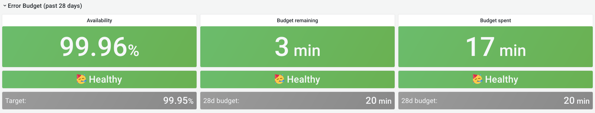
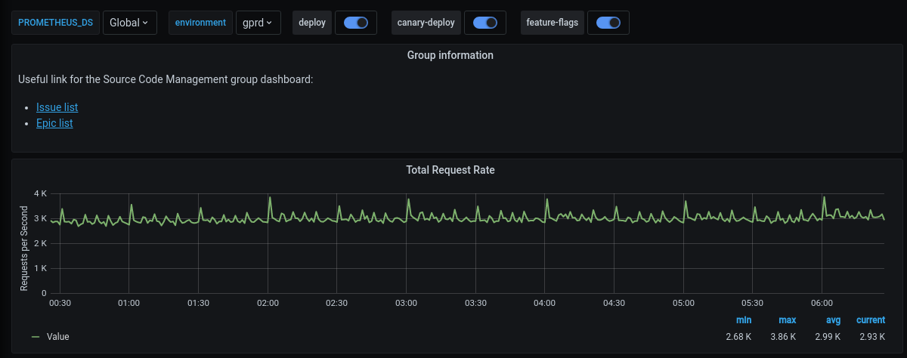

The stage group dashboard is generated dashboard that contains metrics
for common components used by most stage groups. The dashboard is
fully customizable and owned by the stage groups.

This page explains what is on these dashboards, how to use their
contents, and how they can be customized.

## Dashboard contents

### Error budget panels



The top panels display the [error budget](../_index.md#error-budget).
These panels always show the 28 days before the end time selected in the
[time range controls](_index.md#time-range-controls). This data doesn't
follow the selected range. It does respect the filters for environment
and stage.

### Metrics panels


Although most of the metrics displayed in the panels are self-explanatory in their title and nearby
description, note the following:

- The events are counted, measured, accumulated, collected, and stored as
  [time series](https://prometheus.io/docs/concepts/data_model/). The data is calculated using
  statistical methods to produce metrics. It means that metrics are approximately correct and
  meaningful over a time period. They help you get an overview of the stage of a system over time.
  They are not meant to give you precise numbers of a discrete event.

  If you need a higher level of accuracy, use another monitoring tool, such as
  [logs](https://handbook.gitlab.com/handbook/engineering/monitoring/#logs).
  Read the following examples for more explanations.
- All the rate metrics' units are `requests per second`. The default aggregate time frame is 1 minute.

  For example, a panel shows the requests per second number at `2020-12-25 00:42:00` to be `34.13`.
  It means at the minute 42 (from `2020-12-25 00:42:00` to `2020-12-25 00:42:59` ), there are
  approximately `34.13 * 60 = ~ 2047` requests processed by the web servers.
- You might encounter some gotchas related to decimal fraction and rounding up frequently, especially
  in low-traffic cases. For example, the error rate of `RepositoryUpdateMirrorWorker` at
  `2020-12-25 02:04:00` is `0.07`, equivalent to `4.2` jobs per minute. The raw result is
  `0.06666666667`, equivalent to 4 jobs per minute.
- All the rate metrics are more accurate when the data is big enough. The default floating-point
  precision is 2. In some extremely low panels, you can see `0.00`, even though there is still some
  real traffic.

To inspect the raw data of the panel for further calculation, select **Inspect** from the dropdown list of a panel.
Queries, raw data, and panel JSON structure are available.
Read more at [Grafana panel inspection](https://grafana.com/docs/grafana/latest/panels-visualizations/query-transform-data/).

All the dashboards are powered by [Grafana](https://grafana.com/), a frontend for displaying metrics.
Grafana consumes the data returned from queries to backend Prometheus data source, then presents it
with visualizations. The stage group dashboards are built to serve the most common use cases with a
limited set of filters and pre-built queries. Grafana provides a way to explore and visualize the
metrics data with [Grafana Explore](https://grafana.com/docs/grafana/latest/explore/). This requires
some knowledge of the [Prometheus PromQL query language](https://prometheus.io/docs/prometheus/latest/querying/basics/).

## Example: Debugging with dashboards

Example debugging workflow:

1. A team member in the Code Review group has merged an MR which got deployed to production.
1. To verify the deployment, you can check the
   [Code Review group's dashboard](https://dashboards.gitlab.net/d/stage-groups-code_review/stage-groups-group-dashboard-create-code-review?orgId=1).
1. Sidekiq Error Rate panel shows an elevated error rate, specifically `UpdateMergeRequestsWorker`.

  

1. If you select **Kibana: Kibana Sidekiq failed request logs** in the **Extra links** section, you can filter for `UpdateMergeRequestsWorker` and read through the logs.

  

1. With [Sentry](https://sentry.gitlab.net/gitlab/gitlabcom/) you can find the exception where you
   can filter by transaction type and `correlation_id` from Kibana's result item.

  

1. A precise exception, including a stack trace, job arguments, and other information should now appear.

Happy debugging!

## Customizing the dashboard

All Grafana dashboards at GitLab are generated from the [Jsonnet files](https://github.com/grafana/grafonnet-lib)
stored in [the runbooks project](https://gitlab.com/gitlab-com/runbooks/-/tree/master/dashboards).
Particularly, the stage group dashboards definitions are stored in
[`/dashboards/stage-groups`](https://gitlab.com/gitlab-com/runbooks/-/tree/master/dashboards/stage-groups).

By convention, each group has a corresponding Jsonnet file. The dashboards are synced with GitLab
[stage group data](https://gitlab.com/gitlab-com/www-gitlab-com/-/raw/master/data/stages.yml) every
month.

Expansion and customization are one of the key principles used when we designed this system.
To customize your group's dashboard, edit the corresponding file and follow the
[Runbook workflow](https://gitlab.com/gitlab-com/runbooks/-/tree/master/dashboards#dashboard-source).
The dashboard is updated after the MR is merged.

Looking at an autogenerated file, for example,
[`product_planning.dashboard.jsonnet`](https://gitlab.com/gitlab-com/runbooks/-/blob/master/dashboards/stage-groups/product_planning.dashboard.jsonnet):

```jsonnet
// This file is autogenerated using scripts/update_stage_groups_dashboards.rb
// Please feel free to customize this file.
local stageGroupDashboards = import './stage-group-dashboards.libsonnet';

stageGroupDashboards.dashboard('product_planning')
.stageGroupDashboardTrailer()
```

We provide basic customization to filter out the components essential to your group's activities.
By default, only the `web`, `api`, and `sidekiq` components are available in the dashboard, while
`git` is hidden. See [how to enable available components and optional graphs](#optional-graphs).

You can also append further information or custom metrics to a dashboard. The following example
adds some links and a total request rate to the top of the page:

```jsonnet
local stageGroupDashboards = import './stage-group-dashboards.libsonnet';
local grafana = import 'github.com/grafana/grafonnet-lib/grafonnet/grafana.libsonnet';
local basic = import 'grafana/basic.libsonnet';

stageGroupDashboards.dashboard('source_code')
.addPanel(
  grafana.text.new(
    title='Group information',
    mode='markdown',
    content=|||
      Useful link for the Source Code Management group dashboard:
      - [Issue list](https://gitlab.com/groups/gitlab-org/-/issues?scope=all&state=opened&label_name%5B%5D=repository)
      - [Epic list](https://gitlab.com/groups/gitlab-org/-/epics?label_name[]=repository)
    |||,
  ),
  gridPos={ x: 0, y: 0, w: 24, h: 4 }
)
.addPanel(
  basic.timeseries(
    title='Total Request Rate',
    yAxisLabel='Requests per Second',
    decimals=2,
    query=|||
      sum (
        rate(gitlab_transaction_duration_seconds_count{
          env='$environment',
          environment='$environment',
          feature_category=~'source_code_management',
        }[$__interval])
      )
    |||
  ),
  gridPos={ x: 0, y: 0, w: 24, h: 7 }
)
.stageGroupDashboardTrailer()
```



<i class="fa fa-youtube-play youtube" aria-hidden="true"></i>
If you want to see the workflow in action, we've recorded a pairing session on customizing a dashboard,
available on [GitLab Unfiltered](https://youtu.be/shEd_eiUjdI).

For deeper customization and more complicated metrics, see the
[Grafonnet lib](https://github.com/grafana/grafonnet-lib) project and the
[GitLab Prometheus Metrics](../../../administration/monitoring/prometheus/gitlab_metrics.md)
documentation.

### Optional graphs

Some graphs aren't relevant for all groups, so they aren't added to
the dashboard by default. They can be added by customizing the
dashboard.

By default, only the `web`, `api`, and `sidekiq` metrics are
shown. If you wish to see the metrics from the `git` fleet (or any
other component that might be added in the future), you can configure it as follows:

```jsonnet
stageGroupDashboards
.dashboard('source_code', components=stageGroupDashboards.supportedComponents)
.stageGroupDashboardTrailer()
```

If your group is interested in Sidekiq job durations and their
thresholds, you can add these graphs by calling the `.addSidekiqJobDurationByUrgency` function:

```jsonnet
stageGroupDashboards
.dashboard('access')
.addSidekiqJobDurationByUrgency()
.stageGroupDashboardTrailer()
```
