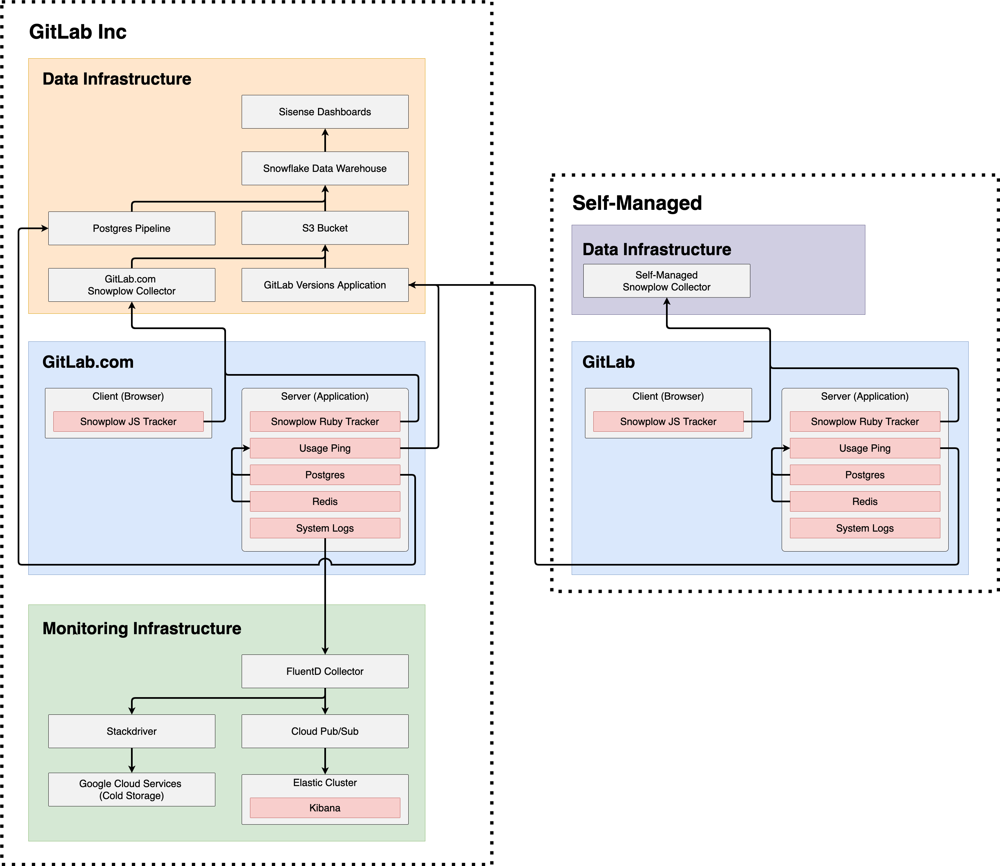

# Telemetry Guide

At GitLab, we collect telemetry for the purpose of helping us build a better GitLab. Data about how GitLab is used is collected to better understand what parts of GitLab needs improvement and what features to build next. Telemetry also helps our team better understand the reasons why people use GitLab and with this knowledge we are able to make better product decisions.

We also encourage users to enable tracking, and we embrace full transparency with our tracking approach so it can be easily understood and trusted. By enabling tracking, users can:

- Contribute back to the wider community.
- Help GitLab improve on the product.

This documentation consists of three guides providing an overview of Telemetry at GitLab.

Telemetry Guide:

  1. [Our tracking tools](#our-tracking-tools)
  1. [What data can be tracked](#what-data-can-be-tracked)
  1. [Telemetry systems overview](#telemetry-systems-overview)

[Usage Ping Guide](usage_ping.md)

  1. [What is Usage Ping](usage_ping.md#what-is-usage-ping)
  1. [Usage Ping payload](usage_ping.md#usage-ping-payload)
  1. [Disable Usage Ping](usage_ping.md#disable-usage-ping)
  1. [Usage Ping request flow](usage_ping.md#usage-ping-request-flow)
  1. [How Usage Ping works](usage_ping.md#how-usage-ping-works)
  1. [Implementing Usage Ping](usage_ping.md#implementing-usage-ping)
  1. [Developing and testing Usage Ping](usage_ping.md#developing-and-testing-usage-ping)

[Snowplow Guide](snowplow.md)

1. [What is Snowplow](snowplow.md#what-is-snowplow)
1. [Snowplow schema](snowplow.md#snowplow-schema)
1. [Enabling Snowplow](snowplow.md#enabling-snowplow)
1. [Snowplow request flow](snowplow.md#snowplow-request-flow)
1. [Implementing Snowplow JS (Frontend) tracking](snowplow.md#implementing-snowplow-js-frontend-tracking)
1. [Implementing Snowplow Ruby (Backend) tracking](snowplow.md#implementing-snowplow-ruby-backend-tracking)
1. [Developing and testing Snowplow](snowplow.md#developing-and-testing-snowplow)

More useful links:

- [Telemetry Direction](https://about.gitlab.com/direction/telemetry/)
- [Data Analysis Process](https://about.gitlab.com/handbook/business-ops/data-team/#-data-analysis-process)
- [Data for Product Managers](https://about.gitlab.com/handbook/business-ops/data-team/data-for-product-managers/)
- [Data Infrastructure](https://about.gitlab.com/handbook/business-ops/data-team/data-infrastructure/)

## Our tracking tools

We use several different technologies to gather product usage data.

### Snowplow JS (Frontend)

Snowplow is an enterprise-grade marketing and product analytics platform which helps track the way users engage with our website and application. [Snowplow JS](https://github.com/snowplow/snowplow/wiki/javascript-tracker) is a frontend tracker for client-side events.

### Snowplow Ruby (Backend)

Snowplow is an enterprise-grade marketing and product analytics platform which helps track the way users engage with our website and application. [Snowplow Ruby](https://github.com/snowplow/snowplow/wiki/ruby-tracker) is a backend tracker for server-side events.

### Usage Ping

Usage Ping is a method for GitLab Inc to collect usage data on a GitLab instance. Usage Ping is primarily composed of row counts for different tables in the instance’s database. By comparing these counts month over month (or week over week), we can get a rough sense for how an instance is using the different features within the product. This high-level data is used to help our product, support, and sales teams.

For more details, read the [Usage Ping](usage_ping.md) guide.

### Database import

Database imports are full imports of data into GitLab's data warehouse. For GitLab.com, the PostgreSQL database is loaded into Snowflake data warehouse every 6 hours. For more details, see the [data team handbook](https://about.gitlab.com/handbook/business-ops/data-team/#extract-and-load).

### Log system

System logs are the application logs generated from running the GitLab Rails application. For more details, see the [log system](../../administration/logs.md) and [logging infrastructure](https://gitlab.com/gitlab-com/runbooks/tree/master/logging/doc#logging-infrastructure-overview).

## What data can be tracked

Our different tracking tools allows us to track different types of events. The event types and examples of what data can be tracked are outlined below.

| Event Type          | Snowplow JS (Frontend) | Snowplow Ruby (Backend) | Usage Ping          | Database import     | Log system          |
|---------------------|------------------------|-------------------------|---------------------|---------------------|---------------------|
| Database counts     | **{dotted-circle}**    | **{dotted-circle}**     | **{check-circle}**  | **{check-circle}**  | **{dotted-circle}** |
| Pageview events     | **{check-circle}**     | **{check-circle}**      | **{dotted-circle}** | **{dotted-circle}** | **{dotted-circle}** |
| UI events           | **{check-circle}**     | **{dotted-circle}**     | **{dotted-circle}** | **{dotted-circle}** | **{dotted-circle}** |
| CRUD and API events | **{dotted-circle}**    | **{check-circle}**      | **{dotted-circle}** | **{dotted-circle}** | **{dotted-circle}** |
| Event funnels       | **{check-circle}**     | **{check-circle}**      | **{dotted-circle}** | **{dotted-circle}** | **{dotted-circle}** |
| PostgreSQL Data     | **{dotted-circle}**    | **{dotted-circle}**     | **{dotted-circle}** | **{check-circle}**  | **{dotted-circle}** |
| Logs                | **{dotted-circle}**    | **{dotted-circle}**     | **{dotted-circle}** | **{dotted-circle}** | **{check-circle}**  |
| External services   | **{dotted-circle}**    | **{dotted-circle}**     | **{dotted-circle}** | **{dotted-circle}** | **{dotted-circle}** |

### Database counts

- Number of Projects created by unique users
- Number of users logged in the past 28 day

Database counts are row counts for different tables in an instance’s database. These are SQL count queries which have been filtered, grouped, or aggregated which provide high level usage data. The full list of available tables can be found in [structure.sql](https://gitlab.com/gitlab-org/gitlab/-/blob/master/db/structure.sql).

### Pageview events

- Number of sessions that visited the /dashboard/groups page

### UI Events

- Number of sessions that clicked on a button or link
- Number of sessions that closed a modal

UI events are any interface-driven actions from the browser including click data.

### CRUD or API events

- Number of Git pushes
- Number of GraphQL queries
- Number of requests to a Rails action or controller

These are backend events that include the creation, read, update, deletion of records, and other events that might be triggered from layers other than those available in the interface.

### Event funnels

- Number of sessions that performed action A, B, then C
- Conversion rate from step A to B

### PostgreSQL data

These are raw database records which can be explored using business intelligence tools like Sisense. The full list of available tables can be found in [structure.sql](https://gitlab.com/gitlab-org/gitlab/-/blob/master/db/structure.sql).

### Logs

These are raw logs such as the [Production logs](../../administration/logs.md#production_jsonlog), [API logs](../../administration/logs.md#api_jsonlog), or [Sidekiq logs](../../administration/logs.md#sidekiqlog). See the [overview of Logging Infrastructure](https://gitlab.com/gitlab-com/runbooks/tree/master/logging/doc#logging-infrastructure-overview) for more details.

### External services

These are external services a GitLab instance interacts with such as an [external storage provider](../../administration/static_objects_external_storage.md) or an [external container registry](../../administration/packages/container_registry.md#use-an-external-container-registry-with-gitlab-as-an-auth-endpoint). These services must be able to send data back into a GitLab instance for data to be tracked.

## Telemetry systems overview

The systems overview is a simplified diagram showing the interactions between GitLab Inc and self-managed instances.

[Source file](https://app.diagrams.net/#G13DVpN-XnhWGz9tqReIj8pp1UE4ehk_EC)

### GitLab Inc

For Telemetry purposes, GitLab Inc has three major components:

1. [Data Infrastructure](https://about.gitlab.com/handbook/business-ops/data-team/data-infrastructure/): This contains everything managed by our data team including Sisense Dashboards for visualization, Snowflake for Data Warehousing, incoming data sources such as PostgreSQL Pipeline and S3 Bucket, and lastly our data collectors [GitLab.com's Snowplow Collector](https://about.gitlab.com/handbook/engineering/infrastructure/library/snowplow/) and GitLab's Versions Application.
1. GitLab.com: This is the production GitLab application which is made up of a Client and Server. On the Client or browser side, a Snowplow JS Tracker (Frontend) is used to track client-side events. On the Server or application side, a Snowplow Ruby Tracker (Backend) is used to track server-side events. The server also contains Usage Ping which leverages a PostgreSQL database and a Redis in-memory data store to report on usage data. Lastly, the server also contains System Logs which are generated from running the GitLab application.
1. [Monitoring infrastructure](https://about.gitlab.com/handbook/engineering/monitoring/): This is the infrastructure used to ensure GitLab.com is operating smoothly. System Logs are sent from GitLab.com to our monitoring infrastructure and collected by a FluentD collector. From FluentD, logs are either sent to long term Google Cloud Services cold storage via Stackdriver, or, they are sent to our Elastic Cluster via Cloud Pub/Sub which can be explored in real-time using Kibana.

### Self-managed

For Telemetry purposes, self-managed instances have two major components:

1. Data infrastructure: Having a data infrastructure setup is optional on self-managed instances. If you'd like to collect Snowplow tracking events for your self-managed instance, you can setup your own self-managed Snowplow collector and configure your Snowplow events to point to your own collector.
1. GitLab: A self-managed GitLab instance contains all of the same components as GitLab.com mentioned above.

### Differences between GitLab Inc and Self-managed

As shown by the orange lines, on GitLab.com Snowplow JS, Snowplow Ruby, Usage Ping, and PostgreSQL database imports all flow into GitLab Inc's data infrastructure. However, on self-managed, only Usage Ping flows into GitLab Inc's data infrastructure.

As shown by the green lines, on GitLab.com system logs flow into GitLab Inc's monitoring infrastructure. On self-managed, there are no logs sent to GitLab Inc's monitoring infrastructure.

The differences between GitLab.com and self-managed are summarized below:

| Environment  | Snowplow JS (Frontend) | Snowplow Ruby (Backend) | Usage Ping         | Database import     | Logs system         |
|--------------|------------------------|-------------------------|--------------------|---------------------|---------------------|
| GitLab.com   | **{check-circle}**     | **{check-circle}**      | **{check-circle}** | **{check-circle}**  | **{check-circle}**  |
| Self-Managed | **{dotted-circle}**(1) | **{dotted-circle}**(1)  | **{check-circle}** | **{dotted-circle}** | **{dotted-circle}** |

Note (1): Snowplow JS and Snowplow Ruby are available on self-managed, however, the Snowplow Collector endpoint is set to a self-managed Snowplow Collector which GitLab Inc does not have access to.
