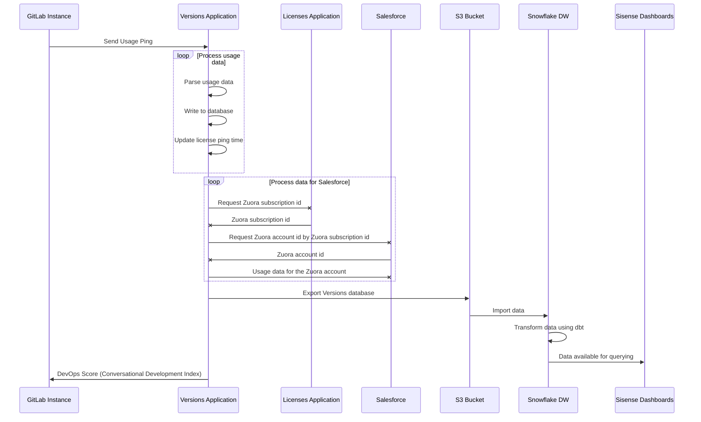

# Usage Ping Guide

> - Introduced in GitLab Enterprise Edition 8.10.
> - More statistics were added in GitLab Enterprise Edition 8.12.
> - Moved to GitLab Core in 9.1.
> - More statistics were added in GitLab Ultimate 11.2.

This guide describes Usage Ping's purpose and how it's implemented.

For more information about Telemetry, see:

- [Telemetry Guide](index.md)
- [Snowplow Guide](snowplow.md)

More useful links:

- [Telemetry Direction](https://about.gitlab.com/direction/telemetry/)
- [Data Analysis Process](https://about.gitlab.com/handbook/business-ops/data-team/#-data-analysis-process)
- [Data for Product Managers](https://about.gitlab.com/handbook/business-ops/data-team/data-for-product-managers/)
- [Data Infrastructure](https://about.gitlab.com/handbook/business-ops/data-team/data-infrastructure/)

## What is Usage Ping?

- GitLab sends a weekly payload containing usage data to GitLab Inc. Usage Ping provides high-level data to help our product, support, and sales teams. It does not send any project names, usernames, or any other specific data. The information from the usage ping is not anonymous, it is linked to the hostname of the instance. Sending usage ping is optional, and any instance can disable analytics.
- The usage data is primarily composed of row counts for different tables in the instance’s database. By comparing these counts month over month (or week over week), we can get a rough sense for how an instance is using the different features within the product.
- Usage ping is important to GitLab as we use it to calculate our Stage Monthly Active Users (SMAU) which helps us measure the success of our stages and features.
- Once usage ping is enabled, GitLab will gather data from the other instances and will be able to show usage statistics of your instance to your users.

### Why should we enable Usage Ping?

- The main purpose of Usage Ping is to build a better GitLab. Data about how GitLab is used is collected to better understand feature/stage adoption and usage, which helps us understand how GitLab is adding value and helps our team better understand the reasons why people use GitLab and with this knowledge we're able to make better product decisions.
- As a benefit of having the usage ping active, GitLab lets you analyze the users’ activities over time of your GitLab installation.
- As a benefit of having the usage ping active, GitLab provides you with The DevOps Score,which gives you an overview of your entire instance’s adoption of Concurrent DevOps from planning to monitoring.
- You will get better, more proactive support. (assuming that our TAMs and support organization used the data to deliver more value)
- You will get insight and advice into how to get the most value out of your investment in GitLab. Wouldn't you want to know that a number of features or values are not being adopted in your organization?
- You get a report that illustrates how you compare against other similar organizations (anonymized), with specific advice and recommendations on how to improve your DevOps processes.
- Usage Ping is enabled by default. To disable it, see [Disable Usage Ping](#disable-usage-ping).

### Limitations

- Usage Ping does not track frontend events things like page views, link clicks, or user sessions, and only focuses on aggregated backend events.
- Because of these limitations we recommend instrumenting your products with Snowplow for more detailed analytics on GitLab.com and use Usage Ping to track aggregated backend events on self-managed.

## Usage Ping payload

You can view the exact JSON payload sent to GitLab Inc. in the administration panel. To view the payload:

1. Navigate to **Admin Area > Settings > Metrics and profiling**.
1. Expand the **Usage statistics** section.
1. Click the **Preview payload** button.

For an example payload, see [Example Usage Ping payload](#example-usage-ping-payload).

## Disable Usage Ping

To disable Usage Ping in the GitLab UI, go to the **Settings** page of your administration panel and uncheck the **Usage Ping** checkbox.

To disable Usage Ping and prevent it from being configured in the future through the administration panel, Omnibus installs can set the following in [`gitlab.rb`](https://docs.gitlab.com/omnibus/settings/configuration.html#configuration-options):

```ruby
gitlab_rails['usage_ping_enabled'] = false
```

Source installations can set the following in `gitlab.yml`:

```yaml
production: &base
  # ...
  gitlab:
    # ...
    usage_ping_enabled: false
```

## Usage Ping request flow

The following example shows a basic request/response flow between a GitLab instance, the Versions Application, the License Application, Salesforce, GitLab's S3 Bucket, GitLab's Snowflake Data Warehouse, and Sisense:



## How Usage Ping works

1. The Usage Ping [cron job](https://gitlab.com/gitlab-org/gitlab/-/blob/master/app/workers/gitlab_usage_ping_worker.rb#L30) is set in Sidekiq to run weekly.
1. When the cron job runs, it calls [GitLab::UsageData.to_json](https://gitlab.com/gitlab-org/gitlab/-/blob/master/app/services/submit_usage_ping_service.rb#L22).
1. GitLab::UsageData.to_json [cascades down](https://gitlab.com/gitlab-org/gitlab/-/blob/master/lib/gitlab/usage_data.rb#L22) to ~400+ other counter method calls.
1. The response of all methods calls are [merged together](https://gitlab.com/gitlab-org/gitlab/-/blob/master/lib/gitlab/usage_data.rb#L14) into a single JSON payload in GitLab::UsageData.to_json.
1. The JSON payload is then [posted to the Versions application]( https://gitlab.com/gitlab-org/gitlab/-/blob/master/app/services/submit_usage_ping_service.rb#L20).

## Implementing Usage Ping

Usage Ping consists of four types of counters which are all found in `usage_data.rb`:

- **Ordinary Batch Counters:** Simple count of a given ActiveRecord_Relation
- **Distinct Batch Counters:** Distinct count of a given ActiveRecord_Relation on given column
- **Alternative Counters:** Used for settings and configurations
- **Redis Counters:** Used for in-memory counts. This method is being deprecated due to data inaccuracies and will be replaced with a persistent method.

NOTE: **Note:**
Only use the provided counter methods. Each counter method contains a built in fail safe to isolate each counter to avoid breaking the entire Usage Ping.

### Why batch counting

For large tables, PostgreSQL can take a long time to count rows due to MVCC [(Multi-version Concurrency Control)](https://en.wikipedia.org/wiki/Multiversion_concurrency_control). Batch counting is a counting method where a single large query is broken into multiple smaller queries. For example, instead of a single query querying 1,000,000 records, with batch counting, you can execute 100 queries of 10,000 records each. Batch counting is useful for avoiding database timeouts as each batch query is significantly shorter than one single long running query.

For GitLab.com, there are extremely large tables with 15 second query timeouts, so we use batch counting to avoid encountering timeouts. Here are the sizes of some GitLab.com tables:

| Table | Row counts in millions |
| ------ | ------ |
| merge_request_diff_commits | 2280 |
| ci_build_trace_sections | 1764 |
| merge_request_diff_files | 1082 |
| events | 514 |

There are two batch counting methods provided, `Ordinary Batch Counters` and `Distinct Batch Counters`. Batch counting requires indexes on columns to calculate max, min, and range queries. In some cases, a specialized index may need to be added on the columns involved in a counter.

### Ordinary Batch Counters

Handles `ActiveRecord::StatementInvalid` error

Simple count of a given ActiveRecord_Relation

Method: `count(relation, column = nil, batch: true, start: nil, finish: nil)`

Arguments:

- `relation` the ActiveRecord_Relation to perform the count
- `column` the column to perform the count on, by default is the primary key
- `batch`: default `true` in order to use batch counting
- `start`: custom start of the batch counting in order to avoid complex min calculations
- `end`: custom end of the batch counting in order to avoid complex min calculations

Examples:

```ruby
count(User.active)
count(::Clusters::Cluster.aws_installed.enabled, :cluster_id)
count(::Clusters::Cluster.aws_installed.enabled, :cluster_id, start: ::Clusters::Cluster.minimum(:id), finish: ::Clusters::Cluster.maximum(:id))
```

### Distinct Batch Counters

Handles `ActiveRecord::StatementInvalid` error

Distinct count of a given ActiveRecord_Relation on given column

Method: `distinct_count(relation, column = nil, batch: true, start: nil, finish: nil)`

Arguments:

- `relation` the ActiveRecord_Relation to perform the count
- `column` the column to perform the distinct count, by default is the primary key
- `batch`: default `true` in order to use batch counting
- `start`: custom start of the batch counting in order to avoid complex min calculations
- `end`: custom end of the batch counting in order to avoid complex min calculations

Examples:

```ruby
distinct_count(::Project, :creator_id)
distinct_count(::Note.with_suggestions.where(time_period), :author_id, start: ::User.minimum(:id), finish: ::User.maximum(:id))
distinct_count(::Clusters::Applications::CertManager.where(time_period).available.joins(:cluster), 'clusters.user_id')
```

### Redis Counters

Handles `::Redis::CommandError` and `Gitlab::UsageDataCounters::BaseCounter::UnknownEvent`
returns -1 when a block is sent or hash with all values -1 when a `counter(Gitlab::UsageDataCounters)` is sent
different behavior due to 2 different implementations of Redis counter

Method: `redis_usage_data(counter, &block)`

Arguments:

- `counter`: a counter from `Gitlab::UsageDataCounters`, that has `fallback_totals` method implemented
- or a `block`: wich is evaluated

Example of usage:

```ruby
redis_usage_data(Gitlab::UsageDataCounters::WikiPageCounter)
redis_usage_data { ::Gitlab::UsageCounters::PodLogs.usage_totals[:total] }
```

Note that Redis counters are in the [process of being deprecated](https://gitlab.com/gitlab-org/gitlab/-/issues/216330) and you should instead try to use Snowplow events instead. We're in the process of building [self-managed event tracking](https://gitlab.com/gitlab-org/telemetry/-/issues/373) and once this is available, we will convert all Redis counters into Snowplow events.

### Alternative Counters

Handles `StandardError` and fallbacks into -1 this way not all measures fail if we encounter one exception.
Mainly used for settings and configurations.

Method: `alt_usage_data(value = nil, fallback: -1, &block)`

Arguments:

- `value`: a simple static value in which case the value is simply returned.
- or a `block`: which is evaluated
- `fallback: -1`: the common value used for any metrics that are failing.

Example of usage:

```ruby
alt_usage_data { Gitlab::VERSION }
alt_usage_data { Gitlab::CurrentSettings.uuid }
alt_usage_data(999)
```

## Developing and testing Usage Ping

### 1. Use your Rails console to manually test counters

```ruby
# count
Gitlab::UsageData.count(User.active)
Gitlab::UsageData.count(::Clusters::Cluster.aws_installed.enabled, :cluster_id)

# count distinct
Gitlab::UsageData.distinct_count(::Project, :creator_id)
Gitlab::UsageData.distinct_count(::Note.with_suggestions.where(time_period), :author_id, start: ::User.minimum(:id), finish: ::User.maximum(:id))
```

### 2. Generate the SQL query

Your Rails console will return the generated SQL queries.

Example:

```ruby
 pry(main)> Gitlab::UsageData.count(User.active)
   (0.4ms)  SELECT "features"."key" FROM "features"
   (0.7ms)  SELECT MIN("users"."id") FROM "users" WHERE ("users"."state" IN ('active')) AND (ghost IS NOT TRUE) AND ("users"."user_type" IS NULL OR "users"."user_type" NOT IN (2, 1, 3))
   (0.6ms)  SELECT MAX("users"."id") FROM "users" WHERE ("users"."state" IN ('active')) AND (ghost IS NOT TRUE) AND ("users"."user_type" IS NULL OR "users"."user_type" NOT IN (2, 1, 3))
   (0.5ms)  SELECT COUNT("users"."id") FROM "users" WHERE ("users"."state" IN ('active')) AND (ghost IS NOT TRUE) AND ("users"."user_type" IS NULL OR "users"."user_type" NOT IN (2, 1, 3)) AND "users"."id" BETWEEN 0 AND 99999
```

### 3. Optimize queries with #database-lab

Paste the SQL query into `#database-lab` to see how the query performs at scale.

- `#database-lab` is a Slack channel which uses a production-sized environment to test your queries.
- GitLab.com’s production database has a 15 second timeout.
- For each query we require an execution time of under 1 second due to cold caches which can 10x this time.
- Add a specialized index on columns involved to reduce the execution time.

In order to have an understanding of the query's execution we add in the MR description the following information:

- For counters that have a `time_period` test we add information for both cases:
  - `time_period = {}` for all time periods
  - `time_period = { created_at: 28.days.ago..Time.current }` for last 28 days period
- Execution plan and query time before and after optimization
- Query generated for the index and time
- Migration output for up and down execution

We also use `#database-lab` and [explain.depesz.com](https://explain.depesz.com/). For more details, see the [database review guide](../database_review.md#preparation-when-adding-or-modifying-queries).

Examples of query optimization work:

- [Example 1](https://gitlab.com/gitlab-org/gitlab/-/merge_requests/26445)
- [Example 2](https://gitlab.com/gitlab-org/gitlab/-/merge_requests/26871)

### 4. Ask for a Telemetry Review

On GitLab.com, we have DangerBot setup to monitor Telemetry related files and DangerBot will recommend a Telemetry review. Mention `@gitlab-org/growth/telemetry/engineers` in your MR for a review.

## Example Usage Ping payload

The following is example content of the Usage Ping payload.

```json
{
  "uuid": "0000000-0000-0000-0000-000000000000",
  "hostname": "example.com",
  "version": "12.10.0-pre",
  "installation_type": "omnibus-gitlab",
  "active_user_count": 999,
  "recorded_at": "2020-04-17T07:43:54.162+00:00",
  "edition": "EEU",
  "license_md5": "00000000000000000000000000000000",
  "license_id": null,
  "historical_max_users": 999,
  "licensee": {
    "Name": "ABC, Inc.",
    "Email": "email@example.com",
    "Company": "ABC, Inc."
  },
  "license_user_count": 999,
  "license_starts_at": "2020-01-01",
  "license_expires_at": "2021-01-01",
  "license_plan": "ultimate",
  "license_add_ons": {
  },
  "license_trial": false,
  "counts": {
    "assignee_lists": 999,
    "boards": 999,
    "ci_builds": 999,
    ...
  },
  "container_registry_enabled": true,
  "dependency_proxy_enabled": false,
  "gitlab_shared_runners_enabled": true,
  "gravatar_enabled": true,
  "influxdb_metrics_enabled": true,
  "ldap_enabled": false,
  "mattermost_enabled": false,
  "omniauth_enabled": true,
  "prometheus_metrics_enabled": false,
  "reply_by_email_enabled": "incoming+%{key}@incoming.gitlab.com",
  "signup_enabled": true,
  "web_ide_clientside_preview_enabled": true,
  "ingress_modsecurity_enabled": true,
  "projects_with_expiration_policy_disabled": 999,
  "projects_with_expiration_policy_enabled": 999,
  ...
  "elasticsearch_enabled": true,
  "license_trial_ends_on": null,
  "geo_enabled": false,
  "git": {
    "version": {
      "major": 2,
      "minor": 26,
      "patch": 1
    }
  },
  "gitaly": {
    "version": "12.10.0-rc1-93-g40980d40",
    "servers": 56,
    "filesystems": [
      "EXT_2_3_4"
    ]
  },
  "gitlab_pages": {
    "enabled": true,
    "version": "1.17.0"
  },
  "database": {
    "adapter": "postgresql",
    "version": "9.6.15"
  },
  "app_server": {
    "type": "console"
  },
  "avg_cycle_analytics": {
    "issue": {
      "average": 999,
      "sd": 999,
      "missing": 999
    },
    "plan": {
      "average": null,
      "sd": 999,
      "missing": 999
    },
    "code": {
      "average": null,
      "sd": 999,
      "missing": 999
    },
    "test": {
      "average": null,
      "sd": 999,
      "missing": 999
    },
    "review": {
      "average": null,
      "sd": 999,
      "missing": 999
    },
    "staging": {
      "average": null,
      "sd": 999,
      "missing": 999
    },
    "production": {
      "average": null,
      "sd": 999,
      "missing": 999
    },
    "total": 999
  },
  "usage_activity_by_stage": {
    "configure": {
      "project_clusters_enabled": 999,
      ...
    },
    "create": {
      "merge_requests": 999,
      ...
    },
    "manage": {
      "events": 999,
      ...
    },
    "monitor": {
      "clusters": 999,
      ...
    },
    "package": {
      "projects_with_packages": 999
    },
    "plan": {
      "issues": 999,
      ...
    },
    "release": {
      "deployments": 999,
      ...
    },
    "secure": {
      "user_container_scanning_jobs": 999,
      ...
    },
    "verify": {
      "ci_builds": 999,
      ...
    }
  },
  "usage_activity_by_stage_monthly": {
    "configure": {
      "project_clusters_enabled": 999,
      ...
    },
    "create": {
      "merge_requests": 999,
      ...
    },
    "manage": {
      "events": 999,
      ...
    },
    "monitor": {
      "clusters": 999,
      ...
    },
    "package": {
      "projects_with_packages": 999
    },
    "plan": {
      "issues": 999,
      ...
    },
    "release": {
      "deployments": 999,
      ...
    },
    "secure": {
      "user_container_scanning_jobs": 999,
      ...
    },
    "verify": {
      "ci_builds": 999,
      ...
    }
  }
}
```
