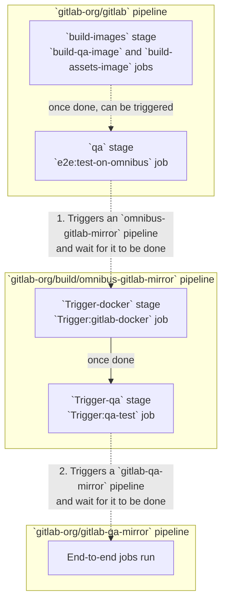

## What is end-to-end testing?

End-to-end (e2e) testing is a strategy used to check whether your application works as expected across the entire software stack and architecture, including integration of all micro-services and components that are supposed to work together.

## How do we test GitLab?

We use [Omnibus GitLab](https://gitlab.com/gitlab-org/omnibus-gitlab) to build GitLab packages and then we test these packages using the [GitLab QA orchestrator](https://gitlab.com/gitlab-org/gitlab-qa) tool to run the end-to-end tests located in the `qa` directory.

Additionally, we use the [GitLab Development Kit](https://gitlab.com/gitlab-org/gitlab-development-kit) (GDK) as a test environment that can be deployed quickly for faster test feedback.

### Testing nightly builds

We run scheduled pipelines each night to test nightly builds created by Omnibus. You can find these pipelines at <https://gitlab.com/gitlab-org/gitlab/-/pipeline_schedules> (requires the Developer role). Results are reported in the `#e2e-run-master` Slack channel.

### Testing staging

We run scheduled pipelines each night to test staging. You can find these pipelines at <https://gitlab.com/gitlab-org/quality/staging/pipelines> (requires the Developer role). Results are reported in the `#e2e-run-staging` Slack channel.

### Testing code in merge requests

#### Using the test-on-omnibus job

It is possible to run end-to-end tests for a merge request by triggering the `e2e:test-on-omnibus` manual action in the `qa` stage (not available for forks).

**This runs end-to-end tests against a custom EE (with an Ultimate license) Docker image built from your merge request's changes.**

Manual action that starts end-to-end tests is also available in [`gitlab-org/omnibus-gitlab` merge requests](https://docs.gitlab.com/omnibus/build/team_member_docs.html#i-have-an-mr-in-the-omnibus-gitlab-project-and-want-a-package-or-docker-image-to-test-it).

##### How does it work?

Currently, we are using _multi-project pipeline_-like approach to run end-to-end pipelines against Omnibus GitLab.



1. In the [`gitlab-org/gitlab` pipeline](https://gitlab.com/gitlab-org/gitlab):
   1. Developer triggers the `e2e:test-on-omnibus` manual action (available once the `build-qa-image` and
      `build-assets-image` jobs are done), that can be found in GitLab merge
      requests. This starts a e2e test child pipeline.
   1. E2E child pipeline triggers a downstream pipeline in
      [`gitlab-org/build/omnibus-gitlab-mirror`](https://gitlab.com/gitlab-org/build/omnibus-gitlab-mirror)
      and polls for the resulting status. We call this a _status attribution_.

1. In the [`gitlab-org/build/omnibus-gitlab-mirror` pipeline](https://gitlab.com/gitlab-org/build/omnibus-gitlab-mirror):
   1. Docker image is being built and pushed to its container registry.
   1. Once Docker images are built and pushed jobs in `test` stage are started

1. In the `Test` stage:
   1. Container for the Docker image stored in the [`gitlab-org/build/omnibus-gitlab-mirror`](https://gitlab.com/gitlab-org/build/omnibus-gitlab-mirror) registry is spun-up.
   1. End-to-end tests are run with the `gitlab-qa` executable, which spin up a container for the end-to-end image from the [`gitlab-org/gitlab`](https://gitlab.com/gitlab-org/gitlab) registry.

NOTE:
You may have noticed that we use `gitlab-org/build/omnibus-gitlab-mirror` instead of
`gitlab-org/omnibus-gitlab`. This is due to technical limitations in the GitLab permission model: the ability to run a pipeline
against a protected branch is controlled by the ability to push/merge to this branch.
This means that for developers to be able to trigger a pipeline for the default branch in
`gitlab-org/omnibus-gitlab`, they would need to have the Maintainer role for this project.
For security reasons and implications, we couldn't open up the default branch to all the Developers.
Hence we created this mirror where Developers and Maintainers are allowed to push/merge to the default branch.
This problem was discovered in <https://gitlab.com/gitlab-org/gitlab-qa/-/issues/63#note_107175160> and the "mirror"
work-around was suggested in <https://gitlab.com/gitlab-org/omnibus-gitlab/-/issues/4717>.
A feature proposal to segregate access control regarding running pipelines from ability to push/merge was also created at <https://gitlab.com/gitlab-org/gitlab/-/issues/24585>.

For more technical details on CI/CD setup and documentation on adding new test jobs to `e2e:test-on-omnibus` pipeline, see [`e2e:test-on-omnibus` setup documentation](test_pipelines.md).

#### Using the `test-on-gdk` job

The `e2e:test-on-gdk` job is run automatically in most merge requests, which triggers a [child-pipeline](../../../ci/pipelines/downstream_pipelines.md#parent-child-pipelines) that builds and installs a GDK instance from your merge request's changes, and then executes end-to-end tests against that GDK instance.

##### How does it work?

In the [`gitlab-org/gitlab` pipeline](https://gitlab.com/gitlab-org/gitlab):

1. The [`build-gdk-image` job](https://gitlab.com/gitlab-org/gitlab/-/blob/07504c34b28ac656537cd60810992aa15e9e91b8/.gitlab/ci/build-images.gitlab-ci.yml#L32) uses the code from the merge request to build a Docker image for a GDK instance.
1. The `e2e:test-on-gdk` trigger job creates a child pipeline that executes the end-to-end tests against GDK instances launched from the image built in the previous job.

For more details, see the [documentation for the `e2e:test-on-gdk` pipeline](test_pipelines.md#e2etest-on-gdk).

#### With merged results pipelines

In a merged results pipeline, the pipeline runs on a new ref that contains the merge result of the source and target branch.

The end-to-end tests on a merged results pipeline would use the new ref instead of the head of the merge request source branch.

```mermaid
graph LR

A["x1y1z1 - master HEAD"]
B["d1e1f1 - merged results (CI_COMMIT_SHA)"]

A --> B

B --> C["Merged results pipeline"]
C --> D["E2E tests"]
 ```

##### Running custom tests

The [existing scenarios](https://gitlab.com/gitlab-org/gitlab-qa/blob/master/docs/what_tests_can_be_run.md)
that run in the downstream `gitlab-qa-mirror` pipeline include many tests, but there are times when you might want to run a
test or a group of tests that are different than the groups in any of the existing scenarios.

For example, when we [dequarantine](https://handbook.gitlab.com/handbook/engineering/infrastructure/test-platform/debugging-qa-test-failures/#dequarantining-tests) a flaky test we first want to make sure that it's no longer flaky. We can do that by running `_ee:quarantine` manual job. When selecting the name (not the play icon) of manual job, you are prompted to enter variables. You can use any of [the variables that can be used with `gitlab-qa`](https://gitlab.com/gitlab-org/gitlab-qa/blob/master/docs/what_tests_can_be_run.md#supported-gitlab-environment-variables) as well as these:

| Variable        | Description                                                                                                                                                                                                                 |
| --------------- | --------------------------------------------------------------------------------------------------------------------------------------------------------------------------------------------------------------------------- |
| `QA_SCENARIO`   | The scenario to run (default `Test::Instance::Image`)                                                                                                                                                                       |
| `QA_TESTS`      | The tests to run (no default, which means run all the tests in the scenario). Use file paths as you would when running tests by using RSpec, for example, `qa/specs/features/ee/browser_ui` would include all the `EE` UI tests. |
| `QA_RSPEC_TAGS` | The RSpec tags to add (default `--tag quarantine`)                                                                                                                                                                          |

For now,
[manual jobs with custom variables don't use the same variable when retried](https://gitlab.com/gitlab-org/gitlab/-/issues/31367),
so if you want to run the same tests multiple times,
specify the same variables in each `custom-parallel` job (up to as
many of the 10 available jobs that you want to run).

#### Selective test execution

In order to limit amount of tests executed in a merge request, dynamic selection of which tests to execute is present. Algorithm of which tests to run is based on changed files and merge request labels. Following criteria determine which tests will run:

1. Changes in `qa` framework code would execute the full suite
1. Changes in particular `_spec.rb` file in `qa` folder would execute only that particular test. In this case knapsack will not be used to run jobs in parallel.

##### Selective test execution based on code path mappings

- `coverband` [gem](https://github.com/danmayer/coverband) is used in a non-standard way for E2E selective test execution in `backend` MRs.
- `coverband` is enabled in the GitLab application only when `COVERBAND_ENABLED` [ENV variable is set](https://gitlab.com/gitlab-org/gitlab/-/blob/master/config/initializers/coverband.rb#L4). This is set only in the scheduled `e2e:test-on-gdk` pipeline on `master` and not in MR pipelines.
- Source code paths are mapped [before each E2E example starts](https://gitlab.com/gitlab-org/gitlab/-/blob/master/qa/qa/support/formatters/coverband_formatter.rb#L44) and after [each E2E example finishes](https://gitlab.com/gitlab-org/gitlab/-/blob/master/qa/qa/support/formatters/coverband_formatter.rb#L62) by using [internal API](https://gitlab.com/gitlab-org/gitlab/-/blob/master/lib/api/internal/coverage.rb).
- Full consolidated mapping is uploaded to GCS in [code-path-mappings bucket](https://console.cloud.google.com/storage/browser/code-path-mappings)
- This mapping is used for selecting tests in `backend` MRs.

Mapping based selective test execution is currently in use for `test-on-gdk` pipeline. For more information, see
[epic 47](https://gitlab.com/groups/gitlab-org/quality/quality-engineering/-/epics/47).

#### Overriding selective test execution

To override selective test execution and trigger the full suite, label `pipeline:run-all-e2e` should be added to particular merge request.

#### Skipping end-to-end tests

In some cases, it may not be necessary to run the end-to-end test suite.

Examples could include:

- ~"Stuff that should Just Work"
- Small refactors
- A small requested change during review, that doesn't warrant running the entire suite a second time

Skip running end-to-end tests by applying the `pipeline:skip-e2e` label to the merge request.

WARNING:
There is a risk in skipping end-to-end tests. Use caution and discretion when applying this label. The end-to-end test suite is the last line of defense before changes are merged into the default branch. Skipping these tests increases the risk of introducing regressions into the codebase.

## Test pipeline tools and configuration

### Test parallelization

Our CI setup uses the [`knapsack`](https://github.com/KnapsackPro/knapsack) gem to enable test parallelization. Knapsack reports are automatically generated and stored in the `knapsack-reports` GCS bucket within the `gitlab-qa-resources` project. The [`KnapsackReport`](https://gitlab.com/gitlab-org/gitlab/-/blob/master/qa/qa/support/knapsack_report.rb) helper manages the report generation and upload process.

### Test metrics

To enhance test health visibility, a custom setup exports the pipeline's test execution results to an [InfluxDB](https://influxdb.quality.gitlab.net/) instance, with results visualized on [Grafana](https://dashboards.quality.gitlab.net/) dashboards.

### Test reports

#### Allure report

For additional test results visibility, tests that run on pipelines generate and host [Allure](https://github.com/allure-framework/allure2) test reports.

The `QA` framework is using the [Allure RSpec](https://github.com/allure-framework/allure-ruby/blob/master/allure-rspec/README.md) gem to generate source files for the `Allure` test report. An additional job in the pipeline:

- Fetches these source files from all test jobs.
- Generates and uploads the report to the `S3` bucket `gitlab-qa-allure-report` located in `AWS` group project `eng-quality-ops-ci-cd-shared-infra`.

A common CI template for report uploading is stored in [`allure-report.yml`](https://gitlab.com/gitlab-org/quality/pipeline-common/-/blob/master/ci/allure-report.yml).

##### Merge requests

When these tests are executed in the scope of merge requests, the `Allure` report is uploaded to the `GCS` bucket and a bot comment is added linking to their respective reports.

##### Scheduled pipelines

Scheduled pipelines for these tests contain a `generate-allure-report` job under the `Report` stage. They also output a link to the current test report. Each type of scheduled pipeline generates a static link for the latest test report according to its stage. You can find a list of this in the [GitLab handbook](https://handbook.gitlab.com/handbook/engineering/infrastructure/test-platform/pipeline-monitoring/#allure-report).

### Provisioning

Provisioning of all components is performed by the [`engineering-productivity-infrastructure`](https://gitlab.com/gitlab-org/quality/engineering-productivity-infrastructure) project.

### Exporting metrics in CI

Use these environment variables to configure metrics export:

| Variable                 | Required | Information                                                                                                                                                         |
| ------------------------ | -------- | ------------------------------------------------------------------------------------------------------------------------------------------------------------------- |
| `QA_INFLUXDB_URL`        | `true`   | Should be set to `https://influxdb.quality.gitlab.net`. No default value.                                                                                           |
| `QA_INFLUXDB_TOKEN`      | `true`   | InfluxDB write token that can be found under `Influxdb auth tokens` document in `Gitlab-QA` `1Password` vault. No default value.                                    |
| `QA_RUN_TYPE`            | `false`  | Arbitrary name for test execution, like `e2e:test-on-omnibus`. Automatically inferred from the project name for live environment test executions. No default value. |
| `QA_EXPORT_TEST_METRICS` | `false`  | Flag to enable or disable metrics export to InfluxDB. Defaults to `false`.                                                                                          |
| `QA_SAVE_TEST_METRICS`   | `false`  | Flag to enable or disable saving metrics as JSON file. Defaults to `false`.                                                                                         |

## How do you run the tests?

If you are not [testing code in a merge request](#testing-code-in-merge-requests), there are two main options for running the tests. If you want to run the existing tests against a live GitLab instance or against a pre-built Docker image, use the [GitLab QA orchestrator](https://gitlab.com/gitlab-org/gitlab-qa/tree/master/README.md). See also [examples of the test scenarios you can run by using the orchestrator](https://gitlab.com/gitlab-org/gitlab-qa/blob/master/docs/what_tests_can_be_run.md#examples).

On the other hand, if you would like to run against a local development GitLab environment, you can use the [GitLab Development Kit (GDK)](https://gitlab.com/gitlab-org/gitlab-development-kit/). Refer to the instructions in the [QA README](https://gitlab.com/gitlab-org/gitlab/-/tree/master/qa/README.md#how-can-i-use-it) and the section below.

### Running tests that require special setup

Learn how to perform [tests that require special setup or consideration to run on your local environment](running_tests/running_tests_that_require_special_setup.md).

## How do you write tests?

Before you write new tests, review the [GitLab QA architecture](https://gitlab.com/gitlab-org/gitlab-qa/blob/master/docs/architecture.md).

After you've decided where to put [test environment orchestration scenarios](https://gitlab.com/gitlab-org/gitlab-qa/tree/master/lib/gitlab/qa/scenario) and [instance-level scenarios](https://gitlab.com/gitlab-org/gitlab-foss/tree/master/qa/qa/specs/features), take a look at the [GitLab QA README](https://gitlab.com/gitlab-org/gitlab/-/tree/master/qa/README.md), the [GitLab QA orchestrator README](https://gitlab.com/gitlab-org/gitlab-qa/tree/master/README.md), and [the already existing instance-level scenarios](https://gitlab.com/gitlab-org/gitlab-foss/tree/master/qa/qa/specs/features).

### Consider **not** writing an end-to-end test

We should follow these best practices for end-to-end tests:

- Do not write an end-to-end test if a lower-level feature test exists. End-to-end tests require more work and resources.
- Troubleshooting for end-to-end tests can be more complex as connections to the application under test are not known.

## Continued reading

### Getting started with E2E testing

- [Beginner's Guide](beginners_guide/_index.md): An introductory guide to help new contributors get started with E2E testing
  - [Flows](beginners_guide/flows.md): Overview of `Flows` used to capture reusable sequences of actions in tests
  - [Page objects](beginners_guide/page_objects.md): Explanation of page objects and their role in test design
  - [Resources](beginners_guide/resources.md): Overview of `Resources` class that used for creating test data

### Best practices

- [Best practices when writing end-to-end tests](best_practices/_index.md): Guidelines for efficient and reliable E2E testing
  - [Dynamic element validation](best_practices/dynamic_element_validation.md): Techniques for handling dynamic elements in tests
  - [Execution context selection](best_practices/execution_context_selection.md): Tips for choosing the right execution context for tests to run on
  - [Testing with feature flags](best_practices/feature_flags.md): Managing feature flags during tests
  - [RSpec metadata for end-to-end tests](best_practices/rspec_metadata_tests.md): Using metadata to organize and categorize tests
  - [Test users](best_practices/users.md): Guidelines for creating and managing test users
  - [Waits](best_practices/waits.md): Best practices for using waits to handle asynchronous elements
- [Style guide for writing end-to-end tests](style_guide.md): Standards and conventions to ensure consistency in E2E tests

### Testing infrastructure

- [Test pipelines](test_pipelines.md): Overview of the pipeline setup for E2E tests, including parallelization and CI configuration
- [Test infrastructure for cloud integrations](test_infrastructure.md): Describes cloud-specific setups

### Running and troubleshooting tests

- [Running tests](running_tests/_index.md): Instructions for executing tests
  - [Running tests that require special setup](running_tests/running_tests_that_require_special_setup.md): Specific setup requirements for certain tests
- [Troubleshooting](troubleshooting.md): Common issues encountered during E2E testing and solutions

### Miscellaneous

- [Test Platform Sub-Department handbook](https://handbook.gitlab.com/handbook/engineering/infrastructure/test-platform/): Topics related to our vision, monitoring practices, failure triage processes, etc
- [`gitlab-qa`](https://gitlab.com/gitlab-org/gitlab-qa/-/tree/master/docs): For information regarding the use of the GitLab QA orchestrator
- [`customers-gitlab-com`](https://gitlab.com/gitlab-org/customers-gitlab-com/-/tree/main/qa/doc) (internal only): For guides that are specific to the CustomersDot platform

## Where can you ask for help?

You can ask question in the `#test-platform` channel on Slack (GitLab internal) or you can find an issue you would like to work on in [the `gitlab` issue tracker](https://gitlab.com/gitlab-org/gitlab/-/issues?label_name%5B%5D=QA&label_name%5B%5D=test).
