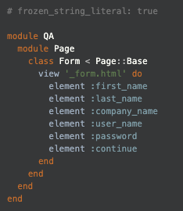
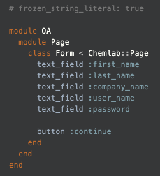

# Migration Guide Capybara → Chemlab

Given the view:

*_form.html*

```html
<form id="my-form">
    <label for="first-name">First name</label>    
    <input type="text" name="first-name" data-qa-selector="first_name" />

    <label for="last-name">Last name</label>
    <input type="text" name="last-name" data-qa-selector="last_name" />

    <label for="company-name">Company name</label>
    <input type="text" name="company-name" data-qa-selector="company_name" />

    <label for="user-name">User name</label>
    <input type="text" name="user-name" data-qa-selector="user_name" />

    <label for="password">Password</label>
    <input type="password" name="password" data-qa-selector="password" />
    
    <input type="submit" value="Continue" data-qa-selector="continue"/>
</form>
```

| Capybara | Chemlab |
| ------ | ----- |
|  |  |

<!--
```ruby
# frozen_string_literal: true

module QA
  module Page
    class Form < Page::Base
      view '_form.html' do
        element :first_name
        element :last_name
        element :company_name
        element :user_name
        element :password
        element :continue
      end
    end
  end
end
```
```ruby
# frozen_string_literal: true

module QA
  module Page
    class Form < Chemlab::Page
      text_field :first_name
      text_field :last_name
      text_field :company_name
      text_field :user_name
      text_field :password

      button :continue
    end
  end
end
```
-->

## Key Differences

### Page Library Design vs Page Object Design

Page Objects as implemented in the existing framework require you to define methods to perform actions on elements. (Usually one-liners)

```ruby
def set_first_name(first_name)
  fill_element(:first_name, first_name)
end

def click_continue
  click_element(:continue)
end

it 'sets first name and clicks continue' do
  Page::Form.perform do |form|
    form.set_first_name('First Name')
    form.click_continue
  end
end
```

Page Libraries make this more efficient by providing methods based on the page's elements, making extra methods unnecessary.

```ruby
it 'sets first name and clicks continue' do
  Page::Form.perform do |form|
    form.first_name = 'First Name'  # sets the first_name
    form.continue  # clicks Continue
  end
end
```

Consider if we needed to validate the text of the `First name` field using Capybara. We'd need to add a one-liner to fetch the text:

```ruby
def get_first_name
  find_element(:first_name).text
end

Page::Form.perform do |form|
  form.set_first_name('First Name')
  expect(form.get_first_name).to eq('First Name')
  form.click_continue
end
```

Instead, because the page library automatically creates methods from page elements, we can fetch the text by calling `first_name` without writing code to define the method ourselves:

```ruby
Page::Form.perform do |form|
  form.first_name = 'First Name'
  expect(form.first_name).to eq('First Name')
  form.continue
end
```

### Element Naming Convention

Since the element type is preserved within the Page Library, there is no need to specify a `_field` or `_button` suffix to the data-qa-selector.

```html
<!-- Before -->
<input type="text" name="first-name" data-qa-selector="first_name_field" />
<input type="submit" name="continue" value="Continue" data-qa-selector="continue_button" />

<!-- After -->
<input type="text" name="first-name" data-qa-selector="first_name" />
<input type="submit" name="continue" value="Continue" data-qa-selector="continue" />
```

This makes it much easier for Developers to write tests and contributes to testability since we can write the Page Library while we look at the UI.
