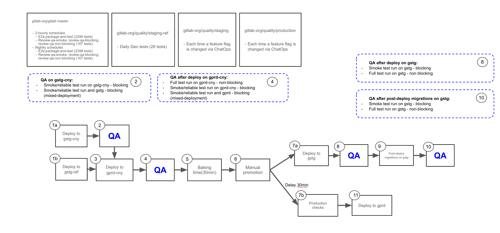
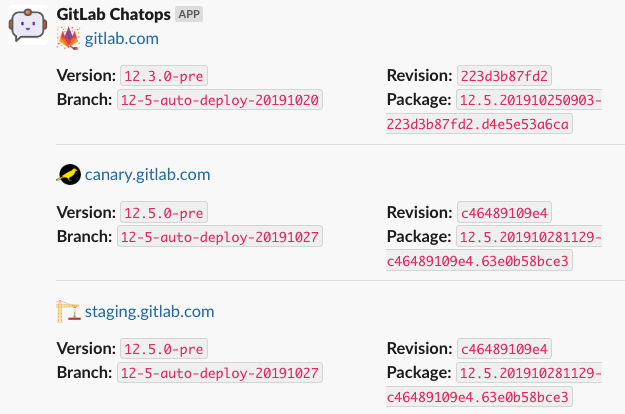

## Overview

This page outlines steps for investigating [end-to-end test](_index.md) failures, deployments, and troubleshooting various GitLab environments. It provides information on how to handle failures, identifying the problematic commit, the logging tools, and ways to reproduce the failure.

## Special considerations for investigating specific environments

### Staging-Canary

`Staging-Canary` is unique when it comes to its blocking `smoke` tests that are triggered by the `deployer` pipeline. `Staging-Canary` executes `smoke` tests for both `Staging-Canary` AND `Staging` environments. This special configuration is designed to help catch issues that occur when incompatibilities arise between the shared and non-shared components of the environments.

`Staging-Canary` and `Staging` both share the same database backend, for example. Should a migration or change to either of the non-shared components during a deployment create an issue, running these tests together helps expose this situation. When the `deployer` pipeline triggers these test runs, they are reported serially in the `#qa_staging` Slack channel and they appear as different runs.

Note when viewing a deployment failure from the `#announcements` Slack channel, you will have to click into the pipeline and look at the `Downstream` results to understand if the deployment failure arose from a failure in `Staging-Canary` or if the failure occurred in `Staging`.

Visit the [announcement issue](https://gitlab.com/gitlab-com/gl-infra/delivery/-/issues/2280) for more context
and to view an uncompressed version of the following image:



Note the diagram has been updated as part of increasing rollback availability by removing the [blocking nature of post-deployment migrations](https://gitlab.com/groups/gitlab-com/gl-infra/-/epics/585).

### Staging Ref

[Staging Ref](https://handbook.gitlab.com/handbook/engineering/infrastructure/environments/staging-ref/) is a Sandbox environment used for pre-production testing of the latest Staging Canary code. It is a shared
environment with wide access permissions and as a result of engineers testing their code, the environment may become unstable and may need to be rebuilt.

The full or smoke E2E test suite can be triggered on an as-needed basis from the `staging-ref` project's [pipeline schedules](https://ops.gitlab.net/gitlab-org/quality/staging-ref/-/pipeline_schedules).

Staging Ref deployment runs parallel to Staging Canary deployment. These two environments share the same GitLab version, if a failure happens
on Staging Ref but not on Staging Canary, it may indicate that the failure is environment specific. See [QA pipeline debugging guide](https://gitlab.com/gitlab-org/quality/gitlab-environment-toolkit-configs/staging-ref/-/blob/main/doc/qa_failure_debug.md) for more information on how to investigate E2E test failures.

### Preprod

[Preprod](https://handbook.gitlab.com/handbook/engineering/infrastructure/environments/#pre) is used to perform validation of release candidates. Every month around the [release date](https://handbook.gitlab.com/handbook/engineering/releases/), and the few days before, it is essential that there are no unexpected failures in the pipeline that will delay the release. There is a pipeline scheduled to run prior to deployment of the release candidate, to give us a chance to identify and resolve any issues with tests or the test environment. This scheduled pipeline should be given equal priority with `Production` and `Staging` pipelines because of the potential impact failures can have on a release.

Tests pipelines are also triggered by the [Kubernetes Workload configuration project](https://gitlab.com/gitlab-com/gl-infra/k8s-workloads/gitlab-com) to ensure that any configuration changes are valid.

### Nightly

[Omnibus nightly builds](https://dev.gitlab.org/gitlab/omnibus-gitlab/-/pipeline_schedules) are paused at the start of a security release and enabled again once the release is complete.
This can cause the nightly tests to either run against an outdated package or fail during the `ce:sanity-version` and `ee:sanity-version` jobs when mirroring is down.

The `#quality` Slack channel should receive two notifications:

1. An announcement from the release team when the security release has started.
1. A notification from GitLab ChatOps when the security release has been published.

For other ways to check if there is an ongoing security release, you can visit the `#releases` Slack channel's `Next Security Release` bookmark, or [search the GitLab project's issues by the `~"upcoming security release"` label](https://gitlab.com/gitlab-org/gitlab/-/issues/?sort=created_date&state=opened&label_name%5B%5D=upcoming%20security%20release&first_page_size=20).

Please note that a security release issue can sometimes be created before a release is in progress.
If you have any questions on the status, you can also reach out to the `@release-managers` in Slack.

### `master` pipelines

GitLab `master` has three QA pipelines generated from scheduled pipeline against the default branch:

- [`test-on-omnibus`](_index.md#using-the-test-on-omnibus-job) runs the `full` suite of end-to-end tests against an omnibus Docker image built from `master`
- [`test-on-gdk`](_index.md#selective-test-execution-based-on-code-path-mappings) runs the full suite of end-to-end tests as part of the `gdk-instance` job against a GDK instance from a Docker image built from `master`

If jobs in `test-on-omnibus` failed due to a GitLab Docker image issue, reach out to the [Distribution team](https://handbook.gitlab.com/handbook/engineering/infrastructure-platforms/gitlab-delivery/distribution/) to see if it's a known problem with the build.

If failures occur only in `test-on-gdk` jobs, it's possible to stop those jobs from being added to new pipelines while the cause is being fixed. See the [runbook](https://gitlab.com/gitlab-org/quality/runbooks/-/tree/97483eafd3db198437faccc40a946fc260c0736a/test_on_gdk#disable-the-e2etest-on-gdk-pipeline) for details.

Note that any failure in `master` QA pipeline will be deployed to Staging, so catching a failure earlier in the pipeline allows us to
find what changes caused it and act on resolving the failure more quickly.

## Verifying current environment version

### Determine the version, revision, branch and package deployed in GitLab environments

To find out the version, revision, branch and package deployed in GitLab.com, staging and canary environments,
run this in the #chat-ops-test Slack channel:

```shell
/chatops run auto_deploy status
```



You will [need access to the https://ops.gitlab.net/gitlab-com/chatops](../../chatops_on_gitlabcom.md#requesting-access) project to run `/chatops` commands.
Ask to be added to this project in the #development Slack channel.

### Determine if a change has been deployed to an environment using revision SHA

If you have a revision SHA that is deployed on an environment, you can find out if a change has made it to that environment.
For example, if the revision SHA deployed on an environment is `c46489109e4` and you want to find out if a change in
`restrict_by_ip_address_spec.rb` has made it there, you can use:

```shell
git show c46489109e4:qa/qa/specs/features/ee/browser_ui/1_manage/group/restrict_by_ip_address_spec.rb
```

You can determine the revision SHA deployed on a GitLab instance by either navigating to <https://www.example.com/help>,
by calling the `https://www.example.com/api/v4/version` API or by running `/chatops run auto_deploy status` in a Slack
channel such as #chat-ops-test.

You can also determine if your commit has been deployed on a GitLab environment using [ChatOps](../../../ci/chatops/_index.md).
For example, if your commit ref is `347e530c5b3dec60c0ce2870bc79ca4c8273604d` you can run this command in a Slack
channel such as #chat-ops-test:

```shell
/chatops run auto_deploy status 347e530c5b3dec60c0ce2870bc79ca4c8273604d
```

### Determine the commit SHA of a nightly image

The commit SHA for a nightly pipeline can be determined in the following ways:

#### By visiting the /help page or calling the `/api/v4/version` API

Run the nightly Docker image

```shell
docker run \
    --hostname localhost \
    --publish 443:443 --publish 80:80 --publish 22:22 \
gitlab/gitlab-ee:nightly
```

The commit SHA can be determined by visiting the <http://localhost/help> page after sign-in
or by calling the [`/api/v4/version` API](../../../api/version.md) where it is displayed as a value of the `revision` attribute.

#### By inspecting the pipeline that created the nightly image

Nightly images are created by scheduled pipelines here: <https://dev.gitlab.org/gitlab/omnibus-gitlab/pipeline_schedules>

You can look at the last pipeline by clicking the pipeline number for CE nightly or EE nightly under
the "Last pipeline" column.

In the pipeline view click a job under the "GitLab_com:package" column. The SHAs for GitLab Components
are listed towards the end of the logs. The GitLab commit SHA is displayed as a value of `gitlab-rails`.

### Checking Docker images

Sometimes tests may fail due to an outdated Docker image. To check if that's the case, follow the instructions below to see if specific merged code is available in a Docker image.

#### Checking test code (QA image)

If you suspect that certain test is failing due to the `gitlab/gitlab-{ce|ee}-qa` image being outdated, follow these steps:

1. Locally, run `docker run -it --entrypoint /bin/sh gitlab/gitlab-ce-qa:latest` to check for GitLab QA CE code, or `docker run -it --entrypoint /bin/sh gitlab/gitlab-ee-qa:latest` to check for GitLab QA EE code
1. Then, navigate to the `qa` directory (`cd /home/qa/qa`)
1. Finally, use `cat` to see if the code you're looking for is available in certain file (e.g., `cat page/project/issue/show.rb`)

> **Note** if you need to check in another tag (e.g., `nightly`), change it in one of the scripts of step 1 above.

#### Checking application code

1. Locally, run `docker run -it --entrypoint /bin/sh gitlab/gitlab-ce:latest` to check for GitLab CE code, or `docker run -it --entrypoint /bin/sh gitlab/gitlab-ee:latest` to check for GitLab EE code
1. Then, navigate to the `gitlab-rails` directory (`cd /opt/gitlab/embedded/service/gitlab-rails/`)
1. Finally, use `cat` to see if the code you're looking for is available or not in a certain file (e.g., `cat public/assets/issues_analytics/components/issues_analytics-9c3887211ed5aa599c9eea63836486d04605f5dfdd76c49f9b05cc24b103f78a.vue`.)

> **Note** if you want to check another tag (e.g., `nightly`) change it in one of the scripts of step 1 above.

#### Checking application version has the specific MR

1. Find the version which GitLab application is running on. In the failing job logs, search for `docker pull dev.gitlab.org:5005/gitlab/omnibus-gitlab/gitlab-ee-qa` and use the version specified after `gitlab-ee-qa:`.
   - For nightly, the approach above won't work. There are two ways for finding the commit version of nightly:
      - Run the [nightly image on local](#run-the-test-against-a-gitlab-docker-container), sign-in as admin and navigate to `/help` page or call the `/api/v4/version` API.
      - Search for the commit in the [omnibus-GitLab pipeline](https://dev.gitlab.org/gitlab/omnibus-gitlab/-/pipelines) that built the last nightly. Jobs that build nightly have `bundle exec rake docker:push:nightly` command in the `Docker-branch` job of the `Package-and-image` stage. Once you find the latest pipeline, search for `gitlab-rails` under `build-component_shas` in any job under the `Gitlab_com:package` stage. For example, in [this `Ubuntu-16.04-branch` job](https://dev.gitlab.org/gitlab/omnibus-gitlab/-/jobs/9610785#L3373), the commit SHA for `gitlab-rails` is `32e76bc4fb02a615c2bf5a00a8fceaee7812a6bd`.
1. Open commits list for the specific version:
   - If version format is like a commit SHA, for example `gitlab-ee-qa:13.10-4b373026c98`, navigate to `https://gitlab.com/gitlab-org/gitlab/-/commits/<commit_SHA>` page, in our example the commit SHA is `4b373026c98`.
      - If version format is like a tag, for example `13.10.0-rc20210223090520-ee`, navigate to `https://gitlab.com/gitlab-org/gitlab/-/commits/v<tag>` page, in our example the tag is `13.10.0-rc20210223090520-ee`.
      - If page above returns 404 error, check if the version exists in [GitLab Security repo](https://gitlab.com/gitlab-org/security/gitlab) in case there is a security release.
1. Check if the MR that you were searching for is in this version.
   - Note the branch name of the MR.
   - Search the commits from Step 2 by the branch name.
      - If the commit is found, the MR is in this version. For [example](https://gitlab.com/gitlab-org/gitlab/-/commits/v13.10.0-rc20210223090520-ee?utf8=%E2%9C%93&search=add-share-with-group-to-modal).
      - If no results, the MR is not in this version. For [example](https://gitlab.com/gitlab-org/gitlab/-/commits/v13.10.0-rc20210223090520-ee?utf8=%E2%9C%93&search=qa-shl-add-requries-admin).

## Test failure logs

The following can help with your investigation:

| Log or artifact                                                                                                                                                                                                                                                                                                                                | Notes                                                                                                                                                                                                                                                                                                                                                                                                                                                                                                                                                                                                                                                                          |
|------------------------------------------------------------------------------------------------------------------------------------------------------------------------------------------------------------------------------------------------------------------------------------------------------------------------------------------------|--------------------------------------------------------------------------------------------------------------------------------------------------------------------------------------------------------------------------------------------------------------------------------------------------------------------------------------------------------------------------------------------------------------------------------------------------------------------------------------------------------------------------------------------------------------------------------------------------------------------------------------------------------------------------------|
| [Stack trace](../../../ci/quick_start/_index.md#view-the-status-of-your-pipeline-and-jobs)                                                                                                                                                                                                                                                     | Shown in the job's log; the starting point for investigating the test failure                                                                                                                                                                                                                                                                                                                                                                                                                                                                                                                                                                                                  |
| [Screenshots and HTML captures](../../../ci/jobs/job_artifacts.md#browse-the-contents-of-the-artifacts-archive)                                                                                                                                                                                                                                | Available for download in the job's artifact for up to 1 week after the job run                                                                                                                                                                                                                                                                                                                                                                                                                                                                                                                                                                                                |
| [QA Logs](../../../ci/jobs/job_artifacts.md#browse-the-contents-of-the-artifacts-archive)                                                                                                                                                                                                                                                      | Included in the job's artifacts; valuable for determining the steps taken by the tests before failing                                                                                                                                                                                                                                                                                                                                                                                                                                                                                                                                                                          |
| [System Logs](../../../administration/logs/_index.md) (GitLab-rails, Sidekiq, etc.)                                                                                                                                                                                                                                                            | Included in the job's artifacts for containerized test runs, such as master and nightly. These are useful for investigating errors originating from the GitLab application itself. <br/><br />  A summary of the system logs related to a test failure can also be found in the description of QA failure issues generated from master and nightly runs containing a correlation ID.                                                                                                                                                                                                                                                                                           |
| Sentry logs ([Staging](https://new-sentry.gitlab.net/organizations/gitlab/issues/?environment=gstg), [Staging Ref](https://new-sentry.gitlab.net/organizations/gitlab/projects/staging-ref), [Preprod](https://new-sentry.gitlab.net/organizations/gitlab/issues/?environment=pre), [Production](https://sentry.gitlab.net/gitlab/gitlabcom/)) | If staging, preprod or production tests fail due to a server error, there should be a record in [Sentry](https://handbook.gitlab.com/handbook/support/workflows/sentry/). For example, you can search for all unresolved staging errors linked to the `gitlab-qa` user with the query [`is:unresolved user:"username:gitlab-qa"`](https://new-sentry.gitlab.net/organizations/gitlab/issues/?environment=gstg&query=is%3Aunresolved+user%3Ausername%3Agitlab-qa). However, note that some actions aren't linked to the `gitlab-qa` user, so they might only appear in the [full unresolved list](https://new-sentry.gitlab.net/organizations/gitlab/issues/?environment=gstg). |
| Kibana logs ([Staging and Preprod](https://nonprod-log.gitlab.net/app/kibana#/discover), [Production](https://log.gprd.gitlab.net/app/kibana#/discover))                                                                                                                                                                                       | Various system logs from live environments are sent to [Kibana](https://handbook.gitlab.com/handbook/support/workflows/kibana/), including Rails, Postgres, Sidekiq, and Gitaly logs. <br><br>**Note**: Staging and Preprod logs both use the same URL, but the search index pattern will be different. Staging indices contain `gstg` while Preprod contains `pre`. For example, to search within the Staging Rails index, you would change the index pattern dropdown value to `pubsub-rails-inf-gstg*`. More information on how to do this can be found [in the parameters section of the Using Kibana page](https://handbook.gitlab.com/handbook/support/workflows/kibana/#parameters).                                  |

### Kibana and Sentry Logs

When a request fails in an E2E test that results in an error from the server, the job logs will print a link with the relevant correlation ID to logs in Sentry and Kibana for environments where these are available.

For Kibana, there will be two links available. One directs to a singular search against the Rails index in Kibana Discover, and another directs to the QA Correlation Dashboard, which contain panels of search results from multiple GitLab components.

### Kibana Correlation Dashboards

We have QA Correlation Dashboards in Kibana to help organize logs from various GitLab components (e.g., Rails, Gitaly, Postgres, etc.) that are related to a given correlation ID, all in one place.

- [QA Correlation Dashboard - Staging](https://nonprod-log.gitlab.net/app/dashboards#/view/b74dc030-6f56-11ed-9af2-6131f0ee4ce6?_g=(filters%3A!()%2Cquery%3A(language%3Akuery%2Cquery%3A'')%2CrefreshInterval%3A(pause%3A!t%2Cvalue%3A0)%2Ctime%3A(from%3Anow-1d%2Cto%3Anow)))
- [QA Correlation Dashboard - Preprod](https://nonprod-log.gitlab.net/app/dashboards#/view/15596340-7570-11ed-9af2-6131f0ee4ce6?_g=(filters%3A!()%2CrefreshInterval%3A(pause%3A!t%2Cvalue%3A0)%2Ctime%3A(from%3Anow-1d%2Cto%3Anow)))
- [QA Correlation Dashboard - Prod](https://log.gprd.gitlab.net/app/dashboards#/view/5e6d3440-7597-11ed-9f43-e3784d7fe3ca?_g=(filters%3A!()%2CrefreshInterval%3A(pause%3A!t%2Cvalue%3A0)%2Ctime%3A(from%3Anow-15m%2Cto%3Anow)))

In addition to the dashboard link being automatically generated in E2E test failure logs, you can access these dashboards and use them manually as well. Just replace the correlation ID in the `json.correlation_id` filter with the ID you are interested in and set the appropriate date and time range.

This is similar to the Support team's [Correlation Dashboard](https://handbook.gitlab.com/handbook/support/workflows/kibana/#correlation-dashboard), but can be customized to fit the Quality team's needs.

## Reproducing test failure

### Running tests against GDK running in FIPS mode

GDK can be used in FIPS mode if we wish to debug issues that may be related to FIPS.

Restart GDK using the `FIPS_MODE` variable:

`FIPS_MODE=1 gdk restart`

Tests can then be ran with the `FIPS` variable set:

`FIPS=1 bundle exec bin/qa Test::Instance::All https://gdk.test:3000/ ./qa/specs/features/browser_ui/2_plan/issue/create_issue_spec.rb`

### Run the test against your GDK

You can run the test (or perform the test steps manually) against your local GitLab instance to see if the failure is reproducible. For example:

``` shell
WEBDRIVER_HEADLESS=false bundle exec bin/qa Test::Instance::All http://localhost:3000 qa/specs/features/browser_ui/9_tenant_scale/project/create_project_spec.rb
```

Orchestrated tests are excluded by default. To run them, use `-- --tag orchestrated` before your file name. For example:

``` shell
WEBDRIVER_HEADLESS=false bundle exec bin/qa Test::Instance::All http://localhost:3000 -- --tag orchestrated qa/specs/features/browser_ui/9_tenant_scale/project/create_project_spec.rb
```

### Run the test against a GitLab Docker container

You can also use the same Docker image as the one used in the failing job to run GitLab in a container on your local.
In the logs of the failing job, search for `gitlab-ee` or `gitlab-ce` and use its tag to start the container locally.

Once you have the image tag, [spin up GitLab instance locally](https://gitlab.com/gitlab-org/quality/runbooks/-/blob/main/running_gitlab_locally/index.md)

**Special Considerations**

Note that to be able to pull the Docker image from `registry.gitlab.com` you need to [authenticate with the Container Registry](../../../user/packages/container_registry/authenticate_with_container_registry.md).

To run Nightly images change `registry.gitlab.com/gitlab-org/build/omnibus-gitlab-mirror/gitlab-ee:<tag>` from one of the Docker commands above to `gitlab/gitlab-ee:nightly` or `gitlab/gitlab-ce:nightly`.

**Running the Test**

You can now run the test against this Docker instance. E.g.:

``` shell
WEBDRIVER_HEADLESS=false bundle exec bin/qa Test::Instance::All http://localhost qa/specs/features/browser_ui/9_tenant_scale/project/create_project_spec.rb
```

### Run the tests against CustomersDot staging environment

To run CustomersDot E2E tests locally against staging environment, you will need to clone [CustomersDot](https://gitlab.com/gitlab-org/customers-gitlab-com) project, switch to `qa` directory, and then run

``` shell
STAGING=1 CP_ADMIN_TOKEN=<TOKEN> GL_ADMIN_TOKEN=<TOKEN> bundle exec rspec spec/ui/purchase/purchase_plan_spec.rb
```

**Note** - Token value can be found in GitLab-QA Vault. For details on running tests locally with more options, please refer to [CustomersDot README doc](https://gitlab.com/gitlab-org/customers-gitlab-com/-/blob/staging/README.md)

### Tips for running tests locally

- Use the environment variable `QA_LOG_LEVEL=debug` to enable additional logging output that includes page actions and Git commands.
- Additional information about running tests locally can be found in the [GitLab-qa documentation](https://gitlab.com/gitlab-org/gitlab-qa/-/blob/master/docs/what_tests_can_be_run.md) and in the [instructions for running tests that require special setup](running_tests/running_tests_that_require_special_setup.md#jenkins-tests).
- To determine if the test is [flaky](../unhealthy_tests.md#flaky-tests), check the logs or run the test a few times. If it passes at least once but fails otherwise, it's flaky.

## Identifying commit that introduced a failure

- While triaging failures we often may want to find which specific commit was the one that introduced the failure. While we may sometimes be able to identify this by reviewing the recent commit history, in other cases this may be more obscure. To quickly identify where the failure was introduced [Git bisect](https://git-scm.com/docs/git-bisect) can be quite useful.
- A demo on using Git bisect can be found in [Training Videos](#training-videos).

## Investigating orchestrated test failure

### Verify the reconfigure logs for the GitLab container in the pipeline artefacts

Each orchestrated job has a log file attached as artifacts called

- `<container_name>-reconfigure-logs.txt` - if the container runs successfully on 1st attempt, or
- `<container_name>-retry-<retry_attempt>-reconfigure-logs.txt` - if the test has tried multiple times to spin up the GitLab container due to failure.

If you see any errors in this log file, the issue would be related to `gitlab-ctl reconfigure` command.
Get in touch with the distribution team on `#g_distribution` channel.

### Investigating update-major or update-minor tests locally and common failures

Failures in `update-major` or `update-minor` might indicate that GitLab upgrade fails. Such failures could be caused by migration issues or other changes. To ensure customers won't face such issue during upgrade, investigate the error as priority, especially near the release date.

Follow the document  [Investigating update-major or update-minor tests locally and common failures](https://gitlab.com/gitlab-org/quality/runbooks/-/blob/main/debug_orchestrated_test_locally/running_update-major_and_update-minor_locally.md).

## Test Licenses

Please see the [Test Licenses runbook](https://gitlab-org.gitlab.io/quality/runbooks/test_licenses/) for more information on the licenses in use by E2E test pipelines.

## Training videos

- [Quality Engineering: Failure Triage - Using Git bisect to identify commit that introduced a failure](https://www.youtube.com/watch?v=ZvrOF5Bx2Bo)

## Additional references

You can find some [general tips for troubleshooting problems with GitLab end-to-end tests in the development documentation](troubleshooting.md).
