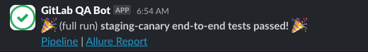
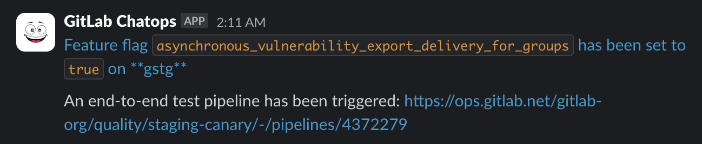
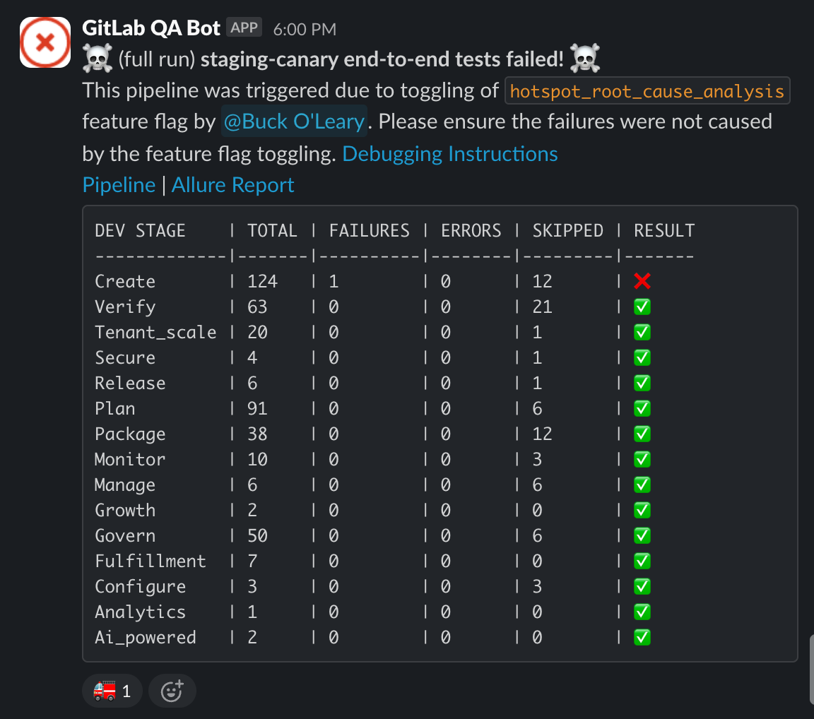
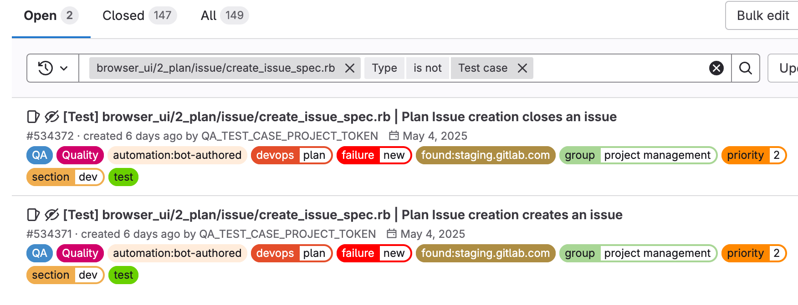

## Feature Flag E2E (end-to-end) Testing

### Workflow of E2E runs on Staging and Production

#### Scheduled Runs

We run scheduled E2E tests on both staging and production environments every 4 hours. These tests help ensure that recent deployments haven't introduced regressions.

We can monitor test results in the following Slack channels:

- [#e2e-run-staging](https://gitlab.enterprise.slack.com/archives/CBS3YKMGD)
- [#e2e-run-production](https://gitlab.enterprise.slack.com/archives/CCNNKFP8B)

### E2E Flow When Changing a Feature Flag With a Merge Request

#### When changes include a feature flag definition file

When a feature flag definition file has been added or changed in a merge request, 2 pipelines are triggered in the downstream `E2E GDK` job:

- `gdk-instance` has the feature flag set to the default value in the feature flag definition file.
- `gdk-instance-ff-inverse` has the feature flag set to the opposite of the default value.
- The job `e2e:test-on-omnibus-ee` needs to be triggered manually to ensure orchestrated tests also pass.

##### When the MR is approved (but not yet merged)

- The `pipeline:tier-3` label is automatically added.
- E2E tests run through downstream pipelines that are named `e2e:test-on-cng` and `e2e:test-on-gdk`.
- If any of these E2E jobs fail, they block the pipeline from moving forward. Test results are posted as a comment by the E2E bot on the merge request, review them carefully before proceeding.

##### When the MR is merged

Once the MR is merged and the commit has been picked for auto-deploy to environments such as staging-canary, staging, production-canary, and production:

- If a feature flag default is changed in an MR, no ChatOps message is posted in the `#e2e-run-staging` or `#e2e-run-production` channels. ChatOps messages only appear when toggling a flag using the [/chatops commands](https://handbook.gitlab.com/handbook/support/workflows/chatops/).
- Head to `#e2e-run-staging` and `#e2e-run-production` and wait for the next scheduled `full run` to complete. A passing run confirms the deployment is safe. If it fails, investigate before continuing further rollouts.



#### When changes do not include a feature flag definition file

If work has been done behind the feature flag but the definition file has not been changed, open a draft MR with the original changes and also edit the definition file to trigger `gdk-instance` and `gdk-instance-ff-inverse` and manually run `e2e:test-on-omnibus-ee` as well to ensure the changes in the original MR do not break any E2E tests.

### Feature flag value changes on staging or production

If a feature flag value is changed on staging or production through a ChatOps command, a `GitLab ChatOps` message is sent in Slack to the corresponding E2E run channel, either [#e2e-run-staging](https://gitlab.enterprise.slack.com/archives/CBS3YKMGD) or [#e2e-run-production](https://gitlab.enterprise.slack.com/archives/CCNNKFP8B).



Once the pipeline completes, a followup message with the results is sent to the same Slack channel. If the pipeline failed, it includes a link to the debugging instructions below.



 Note that if the message has a 🚒 emoji, it has already been reviewed by a pipeline triage DRI and deemed to be a known failure unrelated to the feature flag changes. If it has a 💥 emoji, this indicates a new failure which could be related to the feature flag changes.

### Debugging test failures from a feature flag toggle pipeline

To view the individual test errors, click the `Pipeline` link and view the failing job directly (must be logged into `ops.gitlab.net`), or click the `Allure Report` and open the failing test. There you can see the stacktrace and any available artifacts including screenshots.

#### Determine if the failures are known

1. Check the previous full runs in the [#e2e-run-staging](https://gitlab.enterprise.slack.com/archives/CBS3YKMGD) or [#e2e-run-production](https://gitlab.enterprise.slack.com/archives/CCNNKFP8B) Slack channels that were triggered before your feature flag toggle. If the same tests failed with the same error messages, it's likely the failures aren't related to your toggle.

1. In case the test hasn't failed recently but is flaky, search for a failure issue for the test:

   - From the issues list in the [Test Failure Issues](https://gitlab.com/gitlab-org/quality/test-failure-issues/-/issues)
     project, search the path of the test, for example `browser_ui/2_plan/issue/create_issue_spec.rb`,
     and exclude test case issue types.

   

   - Look for an issue with the correct test title. There can be multiple tests in the same spec file.
   - Open all issues that match the title and look for one that has the same error as the one in the failing feature flag pipeline.
   - If there is a failure issue with a matching error, check that the first failure under the `Reports` section is a pipeline created BEFORE the feature flag value was changed as the failure issue may be from the feature flag pipeline itself. If the first failure was before the changes, it was probably not caused by the feature flag toggle.

1. Rerun the failing job. If the test still fails, try to debug locally with [Running E2E tests against GDK](#running-e2e-tests-against-gdk) or against staging with [Running E2E tests against staging](#running-e2e-tests-against-staging)

#### Running E2E tests against GDK

If not already done, follow the instructions to [install GDK](https://gitlab-org.gitlab.io/gitlab-development-kit/) as your local GitLab development environment.

After GDK is up and running, change the feature flag value in the rails console if needed.

To enable a feature flag:

``` shell
bundle exec rails console
Feature.enable(:feature_flag_name)
```

To disable a feature flag:

``` shell
bundle exec rails console
Feature.disable(:feature_flag_name)
```

Visit the GDK URL and ensure that the feature flag has changed to the correct state.

To run an EE test, a license needs to be set with

``` shell
export QA_EE_LICENSE=$(cat /path/to/gitlab_license)
```

From the `gitlab/qa` directory run:

``` shell
WEBDRIVER_HEADLESS=false \ # Optional, to see the tests running
QA_LOG_LEVEL=DEBUG \ # Optional, to see more detailed logging
QA_GITLAB_URL="http://{GDK IP ADDRESS}:{GDK PORT}" \ # Needed if GDK url is not the default http://localhost:3000
bundle exec rspec qa/specs/features/<path/to/spec.rb>
```

#### Running E2E tests against staging

The `GITLAB_QA_USER_AGENT` environment variable is needed to bypass captcha. The value can be found in GSM. The tests may also need `GITLAB_ADMIN_USERNAME`, and `GITLAB_ADMIN_PASSWORD` if the tests require admin access.

From the `gitlab/qa` directory run:

``` shell
GITLAB_QA_USER_AGENT=<GSM> \
GITLAB_USERNAME="gitlab-qa" \
GITLAB_PASSWORD=<GSM> \
bundle exec bin/qa Test::Instance::All https://staging.gitlab.com -- qa/specs/features/<path/to/spec.rb>
```

### Additional links

- [E2E tests against GDK](running_tests/_index.md)
- [E2E troubleshooting](troubleshooting.md)
- [What E2E tests can be run](https://gitlab.com/gitlab-org/gitlab-qa/-/blob/master/docs/what_tests_can_be_run.md)
