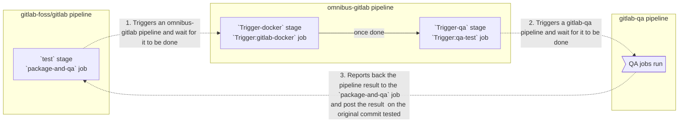

# End-to-end Testing

## What is end-to-end testing?

End-to-end testing is a strategy used to check whether your application works
as expected across the entire software stack and architecture, including
integration of all micro-services and components that are supposed to work
together.

## How do we test GitLab?

We use [Omnibus GitLab][omnibus-gitlab] to build GitLab packages and then we
test these packages using the [GitLab QA orchestrator][gitlab-qa] tool, which is
a black-box testing framework for the API and the UI.

### Testing nightly builds

We run scheduled pipelines each night to test nightly builds created by Omnibus.
You can find these nightly pipelines at `https://gitlab.com/gitlab-org/quality/nightly/pipelines`
(need Developer access permissions). Results are reported in the `#qa-nightly` Slack channel.

### Testing staging

We run scheduled pipelines each night to test staging.
You can find these nightly pipelines at `https://gitlab.com/gitlab-org/quality/staging/pipelines`
(need Developer access permissions). Results are reported in the `#qa-staging` Slack channel.

### Testing code in merge requests

#### Using the `package-and-qa` job

It is possible to run end-to-end tests for a merge request, eventually being run in
a pipeline in the [`gitlab-qa`](https://gitlab.com/gitlab-org/gitlab-qa/) project,
by triggering the `package-and-qa` manual action in the `test` stage (not
available for forks).

**This runs end-to-end tests against a custom CE and EE (with an Ultimate license)
Omnibus package built from your merge request's changes.**

Manual action that starts end-to-end tests is also available in merge requests
in [Omnibus GitLab][omnibus-gitlab].

Below you can read more about how to use it and how does it work.

#### How does it work?

Currently, we are using _multi-project pipeline_-like approach to run QA
pipelines.

1. Developer triggers a manual action, that can be found in CE / EE merge
   requests. This starts a chain of pipelines in multiple projects.

1. The script being executed triggers a pipeline in [Omnibus GitLab][omnibus-gitlab]
   and waits for the resulting status. We call this a _status attribution_.

1. GitLab packages are being built in the [Omnibus GitLab][omnibus-gitlab]
   pipeline. Packages are then pushed to its Container Registry.

1. When packages are ready, and available in the registry, a final step in the
   [Omnibus GitLab][omnibus-gitlab] pipeline, triggers a new
   GitLab QA pipeline (those with access can view them at `https://gitlab.com/gitlab-org/gitlab-qa/pipelines`). It also waits for a resulting status.

1. GitLab QA pulls images from the registry, spins-up containers and runs tests
   against a test environment that has been just orchestrated by the `gitlab-qa`
   tool.

1. The result of the GitLab QA pipeline is being
   propagated upstream, through Omnibus, back to the CE / EE merge request.

#### Using the `review-qa-all` jobs

On every pipeline during the `test` stage, the `review-qa-smoke` job is
automatically started: it runs the QA smoke suite against the
[Review App][review-apps].

You can also manually start the `review-qa-all`: it runs the full QA suite
against the [Review App][review-apps].

**This runs end-to-end tests against a Review App based on [the official GitLab
Helm chart][helm-chart], itself deployed with custom
[Cloud Native components][cng] built from your merge request's changes.**

See [Review Apps][review-apps] for more details about Review Apps.

[helm-chart]: https://gitlab.com/gitlab-org/charts/gitlab/
[cng]: https://gitlab.com/gitlab-org/build/CNG

## How do I run the tests?

There are two main options for running the tests. If you simply want to run the
existing tests against a live GitLab instance or against a pre-built docker image
you can use the [GitLab QA orchestrator][gitlab-qa-readme]. See also [examples
of the test scenarios you can run via the orchestrator](https://gitlab.com/gitlab-org/gitlab-qa/blob/master/docs/what_tests_can_be_run.md#examples).

On the other hand, if you would like to run against a local development GitLab
environment, you can use the [GitLab Development Kit (GDK)](https://gitlab.com/gitlab-org/gitlab-development-kit/).
Please refer to the instructions in the [QA README](https://gitlab.com/gitlab-org/gitlab/tree/master/qa/README.md#how-can-i-use-it)
and the section below.

## How do I write tests?

In order to write new tests, you first need to learn more about GitLab QA
architecture. See the [documentation about it][gitlab-qa-architecture].

Once you decided where to put [test environment orchestration scenarios] and
[instance-level scenarios], take a look at the [GitLab QA README][instance-qa-readme],
the [GitLab QA orchestrator README][gitlab-qa-readme], and [the already existing
instance-level scenarios][instance-level scenarios].

Continued reading:

- [Quick Start Guide](quick_start_guide.md)
- [Style Guide](style_guide.md)
- [Best Practices](best_practices.md)
- [Testing with feature flags](feature_flags.md)
- [Flows](flows.md)

## Where can I ask for help?

You can ask question in the `#quality` channel on Slack (GitLab internal) or
you can find an issue you would like to work on in
[the `gitlab` issue tracker][gitlab-issues], or
[the `gitlab-qa` issue tracker][gitlab-qa-issues].

[omnibus-gitlab]: https://gitlab.com/gitlab-org/omnibus-gitlab
[gitlab-qa]: https://gitlab.com/gitlab-org/gitlab-qa
[gitlab-qa-readme]: https://gitlab.com/gitlab-org/gitlab-qa/tree/master/README.md
[review-apps]: ../review_apps.md
[gitlab-qa-architecture]: https://gitlab.com/gitlab-org/gitlab-qa/blob/master/docs/architecture.md
[gitlab-qa-issues]: https://gitlab.com/gitlab-org/gitlab-qa/issues?label_name%5B%5D=new+scenario
[gitlab-issues]: https://gitlab.com/gitlab-org/gitlab/issues?label_name[]=QA&label_name[]=test
[test environment orchestration scenarios]: https://gitlab.com/gitlab-org/gitlab-qa/tree/master/lib/gitlab/qa/scenario
[instance-level scenarios]: https://gitlab.com/gitlab-org/gitlab-foss/tree/master/qa/qa/specs/features
[Page objects documentation]: https://gitlab.com/gitlab-org/gitlab/tree/master/qa/qa/page/README.md
[instance-qa-readme]: https://gitlab.com/gitlab-org/gitlab/tree/master/qa/README.md
[instance-qa-examples]: https://gitlab.com/gitlab-org/gitlab-foss/tree/master/qa/qa
