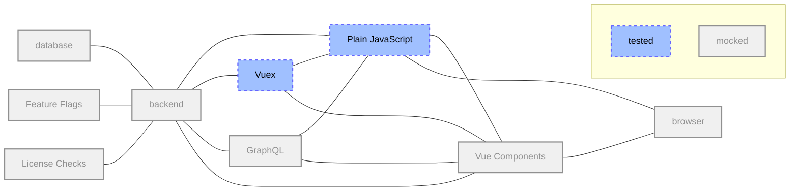
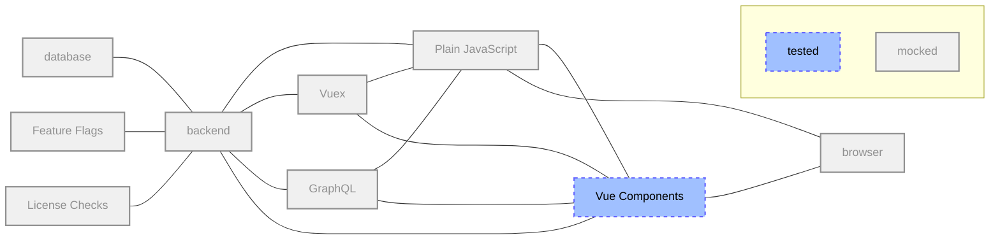
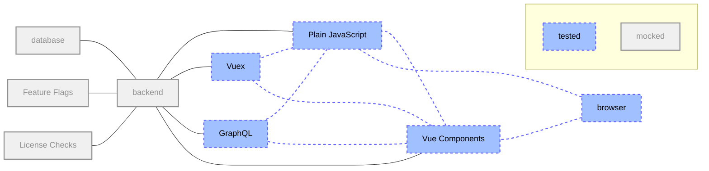
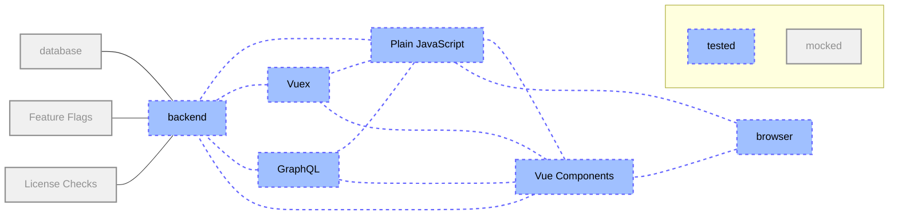

# Frontend testing standards and style guidelines

There are two types of test suites you'll encounter while developing frontend code
at GitLab. We use Karma and Jasmine for JavaScript unit and integration testing,
and RSpec feature tests with Capybara for e2e (end-to-end) integration testing.

Unit and feature tests need to be written for all new features.
Most of the time, you should use [RSpec] for your feature tests.

Regression tests should be written for bug fixes to prevent them from recurring
in the future.

See the [Testing Standards and Style Guidelines](index.md) page for more
information on general testing practices at GitLab.

## Jest

We have started to migrate frontend tests to the [Jest](https://jestjs.io) testing framework (see also the corresponding
[epic](https://gitlab.com/groups/gitlab-org/-/epics/895)).

Jest tests can be found in `/spec/frontend` and `/ee/spec/frontend` in EE.

### When should I use Jest over Karma?

If you need to update an existing Karma test file (found in `spec/javascripts`), you do not
need to migrate the whole spec to Jest. Simply updating the Karma spec to test your change
is fine. It is probably more appropriate to migrate to Jest in a separate merge request.

If you create a new test file, it needs to be created in Jest. This will
help support our migration and we think you'll love using Jest.

As always, please use discretion. Jest solves a lot of issues we experienced in Karma and
provides a better developer experience, however there are potentially unexpected issues
which could arise (especially with testing against browser specific features).

### Differences to Karma

- Jest runs in a Node.js environment, not in a browser. Support for running Jest tests in a browser [is planned](https://gitlab.com/gitlab-org/gitlab-foss/issues/58205).
- Because Jest runs in a Node.js environment, it uses [jsdom](https://github.com/jsdom/jsdom) by default. See also its [limitations](#limitations-of-jsdom) below.
- Jest does not have access to Webpack loaders or aliases.
  The aliases used by Jest are defined in its [own config](https://gitlab.com/gitlab-org/gitlab/blob/master/jest.config.js).
- All calls to `setTimeout` and `setInterval` are mocked away. See also [Jest Timer Mocks](https://jestjs.io/docs/en/timer-mocks).
- `rewire` is not required because Jest supports mocking modules. See also [Manual Mocks](https://jestjs.io/docs/en/manual-mocks).
- No [context object](https://jasmine.github.io/tutorials/your_first_suite#section-The_%3Ccode%3Ethis%3C/code%3E_keyword) is passed to tests in Jest.
  This means sharing `this.something` between `beforeEach()` and `it()` for example does not work.
  Instead you should declare shared variables in the context that they are needed (via `const` / `let`).
- The following will cause tests to fail in Jest:
  - Unmocked requests.
  - Unhandled Promise rejections.
  - Calls to `console.warn`, including warnings from libraries like Vue.

### Limitations of jsdom

As mentioned [above](#differences-to-karma), Jest uses jsdom instead of a browser for running tests.
This comes with a number of limitations, namely:

- [No scrolling support](https://github.com/jsdom/jsdom/blob/15.1.1/lib/jsdom/browser/Window.js#L623-L625)
- [No element sizes or positions](https://github.com/jsdom/jsdom/blob/15.1.1/lib/jsdom/living/nodes/Element-impl.js#L334-L371)
- [No layout engine](https://github.com/jsdom/jsdom/issues/1322) in general

See also the issue for [support running Jest tests in browsers](https://gitlab.com/gitlab-org/gitlab-foss/issues/58205).

### Debugging Jest tests

Running `yarn jest-debug` will run Jest in debug mode, allowing you to debug/inspect as described in the [Jest docs](https://jestjs.io/docs/en/troubleshooting#tests-are-failing-and-you-don-t-know-why).

### Timeout error

The default timeout for Jest is set in
[`/spec/frontend/test_setup.js`](https://gitlab.com/gitlab-org/gitlab/blob/master/spec/frontend/test_setup.js).

If your test exceeds that time, it will fail.

If you cannot improve the performance of the tests, you can increase the timeout
for a specific test using
[`setTestTimeout`](https://gitlab.com/gitlab-org/gitlab/blob/master/spec/frontend/helpers/timeout.js).

```javascript
import { setTestTimeout } from 'helpers/timeout';

describe('Component', () => {
  it('does something amazing', () => {
    setTestTimeout(500);
    // ...
  });
});
```

Remember that the performance of each test depends on the environment.

### Manual module mocks

Jest supports [manual module mocks](https://jestjs.io/docs/en/manual-mocks) by placing a mock in a `__mocks__/` directory next to the source module. **Don't do this.** We want to keep all of our test-related code in one place (the `spec/` folder), and the logic that Jest uses to apply mocks from `__mocks__/` is rather inconsistent.

Instead, our test runner detects manual mocks from `spec/frontend/mocks/`. Any mock placed here is automatically picked up and injected whenever you import its source module.

- Files in `spec/frontend/mocks/ce` will mock the corresponding CE module from `app/assets/javascripts`, mirroring the source module's path.
  - Example: `spec/frontend/mocks/ce/lib/utils/axios_utils` will mock the module `~/lib/utils/axios_utils`.
- Files in `spec/frontend/mocks/node` will mock NPM packages of the same name or path.
- We don't support mocking EE modules yet.

If a mock is found for which a source module doesn't exist, the test suite will fail. 'Virtual' mocks, or mocks that don't have a 1-to-1 association with a source module, are not supported yet.

#### Writing a mock

Create a JS module in the appropriate place in `spec/frontend/mocks/`. That's it. It will automatically mock its source package in all tests.

Make sure that your mock's export has the same format as the mocked module. So, if you're mocking a CommonJS module, you'll need to use `module.exports` instead of the ES6 `export`.

It might be useful for a mock to expose a property that indicates if the mock was loaded. This way, tests can assert the presence of a mock without calling any logic and causing side-effects. The `~/lib/utils/axios_utils` module mock has such a property, `isMock`, that is `true` in the mock and undefined in the original class. Jest's mock functions also have a `mock` property that you can test.

#### Bypassing mocks

If you ever need to import the original module in your tests, use [`jest.requireActual()`](https://jestjs.io/docs/en/jest-object#jestrequireactualmodulename) (or `jest.requireActual().default` for the default export). The `jest.mock()` and `jest.unmock()` won't have an effect on modules that have a manual mock, because mocks are imported and cached before any tests are run.

#### Keep mocks light

Global mocks introduce magic and can affect how modules are imported in your tests. Try to keep them as light as possible and dependency-free. A global mock should be useful for any unit test. For example, the `axios_utils` and `jquery` module mocks throw an error when an HTTP request is attempted, since this is useful behaviour in &gt;99% of tests.

When in doubt, construct mocks in your test file using [`jest.mock()`](https://jestjs.io/docs/en/jest-object#jestmockmodulename-factory-options), [`jest.spyOn()`](https://jestjs.io/docs/en/jest-object#jestspyonobject-methodname), etc.

### Data-driven tests

Similar to [RSpec's parameterized tests](best_practices.md#table-based--parameterized-tests),
Jest supports data-driven tests for:

- Individual tests using [`test.each`](https://jestjs.io/docs/en/api#testeachtable-name-fn-timeout) (aliased to `it.each`).
- Groups of tests using [`describe.each`](https://jestjs.io/docs/en/api#describeeachtable-name-fn-timeout).

These can be useful for reducing repetition within tests. Each option can take an array of
data values or a tagged template literal.

For example:

```javascript
// function to test
const icon = status => status ? 'pipeline-passed' : 'pipeline-failed'
const message = status => status ? 'pipeline-passed' : 'pipeline-failed'

// test with array block
it.each([
    [false, 'pipeline-failed'],
    [true, 'pipeline-passed']
])('icon with %s will return %s',
 (status, icon) => {
    expect(renderPipeline(status)).toEqual(icon)
 }
);

// test suite with tagged template literal block
describe.each`
    status   | icon                 | message
    ${false} | ${'pipeline-failed'} | ${'Pipeline failed - boo-urns'}
    ${true}  | ${'pipeline-passed'} | ${'Pipeline succeeded - win!'}
`('pipeline component', ({ status, icon, message }) => {
    it(`returns icon ${icon} with status ${status}`, () => {
        expect(icon(status)).toEqual(message)
    })

    it(`returns message ${message} with status ${status}`, () => {
        expect(message(status)).toEqual(message)
    })
});
```

## Karma test suite

GitLab uses the [Karma][karma] test runner with [Jasmine] as its test
framework for our JavaScript unit and integration tests.

JavaScript tests live in `spec/javascripts/`, matching the folder structure
of `app/assets/javascripts/`: `app/assets/javascripts/behaviors/autosize.js`
has a corresponding `spec/javascripts/behaviors/autosize_spec.js` file.

Keep in mind that in a CI environment, these tests are run in a headless
browser and you will not have access to certain APIs, such as
[`Notification`](https://developer.mozilla.org/en-US/docs/Web/API/notification),
which will have to be stubbed.

### Best practices

#### Naming unit tests

When writing describe test blocks to test specific functions/methods,
please use the method name as the describe block name.

```javascript
// Good
describe('methodName', () => {
  it('passes', () => {
    expect(true).toEqual(true);
  });
});

// Bad
describe('#methodName', () => {
  it('passes', () => {
    expect(true).toEqual(true);
  });
});

// Bad
describe('.methodName', () => {
  it('passes', () => {
    expect(true).toEqual(true);
  });
});
```

#### Testing promises

When testing Promises you should always make sure that the test is asynchronous and rejections are handled.
Your Promise chain should therefore end with a call of the `done` callback and `done.fail` in case an error occurred.

```javascript
// Good
it('tests a promise', done => {
  promise
    .then(data => {
      expect(data).toBe(asExpected);
    })
    .then(done)
    .catch(done.fail);
});

// Good
it('tests a promise rejection', done => {
  promise
    .then(done.fail)
    .catch(error => {
      expect(error).toBe(expectedError);
    })
    .then(done)
    .catch(done.fail);
});

// Bad (missing done callback)
it('tests a promise', () => {
  promise.then(data => {
    expect(data).toBe(asExpected);
  });
});

// Bad (missing catch)
it('tests a promise', done => {
  promise
    .then(data => {
      expect(data).toBe(asExpected);
    })
    .then(done);
});

// Bad (use done.fail in asynchronous tests)
it('tests a promise', done => {
  promise
    .then(data => {
      expect(data).toBe(asExpected);
    })
    .then(done)
    .catch(fail);
});

// Bad (missing catch)
it('tests a promise rejection', done => {
  promise
    .catch(error => {
      expect(error).toBe(expectedError);
    })
    .then(done);
});
```

#### Stubbing and Mocking

Jasmine provides useful helpers `spyOn`, `spyOnProperty`, `jasmine.createSpy`,
and `jasmine.createSpyObject` to facilitate replacing methods with dummy
placeholders, and recalling when they are called and the arguments that are
passed to them. These tools should be used liberally, to test for expected
behavior, to mock responses, and to block unwanted side effects (such as a
method that would generate a network request or alter `window.location`). The
documentation for these methods can be found in the [Jasmine introduction page](https://jasmine.github.io/2.0/introduction.html#section-Spies).

Sometimes you may need to spy on a method that is directly imported by another
module. GitLab has a custom `spyOnDependency` method which utilizes
[babel-plugin-rewire](https://github.com/speedskater/babel-plugin-rewire) to
achieve this. It can be used like so:

```javascript
// my_module.js
import { visitUrl } from '~/lib/utils/url_utility';

export default function doSomething() {
  visitUrl('/foo/bar');
}
```

```javascript
// my_module_spec.js
import doSomething from '~/my_module';

describe('my_module', () => {
  it('does something', () => {
    const visitUrl = spyOnDependency(doSomething, 'visitUrl');

    doSomething();
    expect(visitUrl).toHaveBeenCalledWith('/foo/bar');
  });
});
```

Unlike `spyOn`, `spyOnDependency` expects its first parameter to be the default
export of a module who's import you want to stub, rather than an object which
contains a method you wish to stub (if the module does not have a default
export, one is be generated by the babel plugin). The second parameter is the
name of the import you wish to change. The result of the function is a Spy
object which can be treated like any other Jasmine spy object.

Further documentation on the babel rewire pluign API can be found on
[its repository Readme doc](https://github.com/speedskater/babel-plugin-rewire#babel-plugin-rewire).

#### Waiting in tests

Sometimes a test needs to wait for something to happen in the application before it continues.
Avoid using [`setTimeout`](https://developer.mozilla.org/en-US/docs/Web/API/WindowOrWorkerGlobalScope/setTimeout)
because it makes the reason for waiting unclear and if passed a time larger than zero it will slow down our test suite.
Instead use one of the following approaches.

##### Promises and Ajax calls

Register handler functions to wait for the `Promise` to be resolved.

```javascript
const askTheServer = () => {
  return axios
    .get('/endpoint')
    .then(response => {
      // do something
    })
    .catch(error => {
      // do something else
    });
};
```

**in Jest:**

```javascript
it('waits for an Ajax call', () => {
  return askTheServer().then(() => {
    expect(something).toBe('done');
  });
});
```

**in Karma:**

```javascript
it('waits for an Ajax call', done => {
  askTheServer()
    .then(() => {
      expect(something).toBe('done');
    })
    .then(done)
    .catch(done.fail);
});
```

If you are not able to register handlers to the `Promise`, for example because it is executed in a synchronous Vue life cycle hook, please take a look at the [waitFor](#wait-until-axios-requests-finish) helpers or you can flush all pending `Promise`s:

**in Jest:**

```javascript
it('waits for an Ajax call', () => {
  synchronousFunction();
  jest.runAllTicks();

  expect(something).toBe('done');
});
```

**in Karma:**

You are out of luck. The following only works sometimes and may lead to flaky failures:

```javascript
it('waits for an Ajax call', done => {
  synchronousFunction();

  // create a new Promise and hope that it resolves after the rest
  Promise.resolve()
    .then(() => {
      expect(something).toBe('done');
    })
    .then(done)
    .catch(done.fail);
});
```

##### Vue rendering

To wait until a Vue component is re-rendered, use either of the equivalent
[`Vue.nextTick()`](https://vuejs.org/v2/api/#Vue-nextTick) or `vm.$nextTick()`.

**in Jest:**

```javascript
it('renders something', () => {
  wrapper.setProps({ value: 'new value' });

  return wrapper.vm.$nextTick().then(() => {
    expect(wrapper.text()).toBe('new value');
  });
});
```

**in Karma:**

```javascript
it('renders something', done => {
  wrapper.setProps({ value: 'new value' });

  wrapper.vm
    .$nextTick()
    .then(() => {
      expect(wrapper.text()).toBe('new value');
    })
    .then(done)
    .catch(done.fail);
});
```

##### `setTimeout()` / `setInterval()` in application

If the application itself is waiting for some time, mock await the waiting. In Jest this is already
[done by default](https://gitlab.com/gitlab-org/gitlab/blob/a2128edfee799e49a8732bfa235e2c5e14949c68/jest.config.js#L47)
(see also [Jest Timer Mocks](https://jestjs.io/docs/en/timer-mocks)). In Karma you can use the
[Jasmine mock clock](https://jasmine.github.io/api/2.9/Clock.html).

```javascript
const doSomethingLater = () => {
  setTimeout(() => {
    // do something
  }, 4000);
};
```

**in Jest:**

```javascript
it('does something', () => {
  doSomethingLater();
  jest.runAllTimers();

  expect(something).toBe('done');
});
```

**in Karma:**

```javascript
it('does something', () => {
  jasmine.clock().install();

  doSomethingLater();
  jasmine.clock().tick(4000);

  expect(something).toBe('done');
  jasmine.clock().uninstall();
});
```

##### Events

If the application triggers an event that you need to wait for in your test, register an event handler which contains
the assertions:

```javascript
it('waits for an event', done => {
  eventHub.$once('someEvent', eventHandler);

  someFunction();

  function eventHandler() {
    expect(something).toBe('done');
    done();
  }
});
```

In Jest you can also use a `Promise` for this:

```javascript
it('waits for an event', () => {
  const eventTriggered = new Promise(resolve => eventHub.$once('someEvent', resolve));

  someFunction();

  return eventTriggered.then(() => {
    expect(something).toBe('done');
  });
});
```

#### Ensuring that tests are isolated

Tests are normally architected in a pattern which requires a recurring setup and breakdown of the component under test. This is done by making use of the `beforeEach` and `afterEach` hooks.

Example

```javascript
  let wrapper;

  beforeEach(() => {
    wrapper = mount(Component);
  });

  afterEach(() => {
    wrapper.destroy();
  });
```

When looking at this initially you'd suspect that the component is setup before each test and then broken down afterwards, providing isolation between tests.

This is however not entirely true as the `destroy` method does not remove everything which has been mutated on the `wrapper` object. For functional components, destroy only removes the rendered DOM elements from the document.

In order to ensure that a clean wrapper object and DOM are being used in each test, the breakdown of the component should rather be performed as follows:

```javascript
  afterEach(() => {
    wrapper.destroy();
    wrapper = null;
  });
```

See also the [Vue Test Utils documention on `destroy`](https://vue-test-utils.vuejs.org/api/wrapper/#destroy).

#### Migrating flaky Karma tests to Jest

Some of our Karma tests are flaky because they access the properties of a shared scope.
This also means that they are not easily parallelized.

Migrating flaky Karma tests to Jest will help significantly as each test is executed
in an isolated scope, improving performance and predictability.

### Vue.js unit tests

See this [section][vue-test].

### Running frontend tests

For running the frontend tests, you need the following commands:

- `rake frontend:fixtures` (re-)generates [fixtures](#frontend-test-fixtures).
- `yarn test` executes the tests.

As long as the fixtures don't change, `yarn test` is sufficient (and saves you some time).

### Live testing and focused testing

While developing locally, it may be helpful to keep Karma running so that you
can get instant feedback on as you write tests and modify code. To do this
you can start Karma with `yarn run karma-start`. It will compile the JavaScript
assets and run a server at `http://localhost:9876/` where it will automatically
run the tests on any browser which connects to it. You can enter that url on
multiple browsers at once to have it run the tests on each in parallel.

While Karma is running, any changes you make will instantly trigger a recompile
and retest of the entire test suite, so you can see instantly if you've broken
a test with your changes. You can use [Jasmine focused][jasmine-focus] or
excluded tests (with `fdescribe` or `xdescribe`) to get Karma to run only the
tests you want while you're working on a specific feature, but make sure to
remove these directives when you commit your code.

It is also possible to only run Karma on specific folders or files by filtering
the run tests via the argument `--filter-spec` or short `-f`:

```bash
# Run all files
yarn karma-start
# Run specific spec files
yarn karma-start --filter-spec profile/account/components/update_username_spec.js
# Run specific spec folder
yarn karma-start --filter-spec profile/account/components/
# Run all specs which path contain vue_shared or vie
yarn karma-start -f vue_shared -f vue_mr_widget
```

You can also use glob syntax to match files. Remember to put quotes around the
glob otherwise your shell may split it into multiple arguments:

```bash
# Run all specs named `file_spec` within the IDE subdirectory
yarn karma -f 'spec/javascripts/ide/**/file_spec.js'
```

## Frontend test fixtures

Code that is added to HAML templates (in `app/views/`) or makes Ajax requests to the backend has tests that require HTML or JSON from the backend.
Fixtures for these tests are located at:

- `spec/frontend/fixtures/`, for running tests in CE.
- `ee/spec/frontend/fixtures/`, for running tests in EE.

Fixture files in:

- The Karma test suite are served by [jasmine-jquery](https://github.com/velesin/jasmine-jquery).
- Jest use `spec/frontend/helpers/fixtures.js`.

The following are examples of tests that work for both Karma and Jest:

```javascript
it('makes a request', () => {
  const responseBody = getJSONFixture('some/fixture.json'); // loads spec/frontend/fixtures/some/fixture.json
  axiosMock.onGet(endpoint).reply(200, responseBody);

  myButton.click();

  // ...
});

it('uses some HTML element', () => {
  loadFixtures('some/page.html'); // loads spec/frontend/fixtures/some/page.html and adds it to the DOM

  const element = document.getElementById('#my-id');

  // ...
});
```

HTML and JSON fixtures are generated from backend views and controllers using RSpec (see `spec/frontend/fixtures/*.rb`).

For each fixture, the content of the `response` variable is stored in the output file.
This variable gets automagically set if the test is marked as `type: :request` or `type: :controller`.
Fixtures are regenerated using the `bin/rake frontend:fixtures` command but you can also generate them individually,
for example `bin/rspec spec/frontend/fixtures/merge_requests.rb`.
When creating a new fixture, it often makes sense to take a look at the corresponding tests for the endpoint in `(ee/)spec/controllers/` or `(ee/)spec/requests/`.

## Gotchas

### RSpec errors due to JavaScript

By default RSpec unit tests will not run JavaScript in the headless browser
and will simply rely on inspecting the HTML generated by rails.

If an integration test depends on JavaScript to run correctly, you need to make
sure the spec is configured to enable JavaScript when the tests are run. If you
don't do this you'll see vague error messages from the spec runner.

To enable a JavaScript driver in an `rspec` test, add `:js` to the
individual spec or the context block containing multiple specs that need
JavaScript enabled:

```ruby
# For one spec
it 'presents information about abuse report', :js do
  # assertions...
end

describe "Admin::AbuseReports", :js do
  it 'presents information about abuse report' do
    # assertions...
  end
  it 'shows buttons for adding to abuse report' do
    # assertions...
  end
end
```

[jasmine-focus]: https://jasmine.github.io/2.5/focused_specs.html
[karma]: http://karma-runner.github.io/
[vue-test]: ../fe_guide/vue.md#testing-vue-components
[rspec]: https://github.com/rspec/rspec-rails#feature-specs
[jasmine]: https://jasmine.github.io/

## Overview of Frontend Testing Levels

Tests relevant for frontend development can be found at the following places:

- `spec/javascripts/` which are run by Karma (command: `yarn karma`) and contain
  - [frontend unit tests](#frontend-unit-tests)
  - [frontend component tests](#frontend-component-tests)
  - [frontend integration tests](#frontend-integration-tests)
- `spec/frontend/` which are run by Jest (command: `yarn jest`) and contain
  - [frontend unit tests](#frontend-unit-tests)
  - [frontend component tests](#frontend-component-tests)
  - [frontend integration tests](#frontend-integration-tests)
- `spec/features/` which are run by RSpec and contain
  - [feature tests](#feature-tests)

All tests in `spec/javascripts/` will eventually be migrated to `spec/frontend/` (see also [#52483](https://gitlab.com/gitlab-org/gitlab-foss/issues/52483)).

In addition, there used to be feature tests in `features/`, run by Spinach.
These were removed from the codebase in May 2018 ([#23036](https://gitlab.com/gitlab-org/gitlab-foss/issues/23036)).

See also [Notes on testing Vue components](../fe_guide/vue.html#testing-vue-components).

### Frontend unit tests

Unit tests are on the lowest abstraction level and typically test functionality that is not directly perceivable by a user.



#### When to use unit tests

<details>
  <summary>exported functions and classes</summary>
  Anything that is exported can be reused at various places in a way you have no control over.
  Therefore it is necessary to document the expected behavior of the public interface with tests.
</details>

<details>
  <summary>Vuex actions</summary>
  Any Vuex action needs to work in a consistent way independent of the component it is triggered from.
</details>

<details>
  <summary>Vuex mutations</summary>
  For complex Vuex mutations it helps to identify the source of a problem by separating the tests from other parts of the Vuex store.
</details>

#### When *not* to use unit tests

<details>
  <summary>non-exported functions or classes</summary>
  Anything that is not exported from a module can be considered private or an implementation detail and doesn't need to be tested.
</details>

<details>
  <summary>constants</summary>
  Testing the value of a constant would mean to copy it.
  This results in extra effort without additional confidence that the value is correct.
</details>

<details>
  <summary>Vue components</summary>
  Computed properties, methods, and lifecycle hooks can be considered an implementation detail of components and don't need to be tested.
  They are implicitly covered by component tests.
  The <a href="https://vue-test-utils.vuejs.org/guides/#getting-started">official Vue guidelines</a> suggest the same.
</details>

#### What to mock in unit tests

<details>
  <summary>state of the class under test</summary>
  Modifying the state of the class under test directly rather than using methods of the class avoids side-effects in test setup.
</details>

<details>
  <summary>other exported classes</summary>
  Every class needs to be tested in isolation to prevent test scenarios from growing exponentially.
</details>

<details>
  <summary>single DOM elements if passed as parameters</summary>
  For tests that only operate on single DOM elements rather than a whole page, creating these elements is cheaper than loading a whole HTML fixture.
</details>

<details>
  <summary>all server requests</summary>
  When running frontend unit tests, the backend may not be reachable.
  Therefore all outgoing requests need to be mocked.
</details>

<details>
  <summary>asynchronous background operations</summary>
  Background operations cannot be stopped or waited on, so they will continue running in the following tests and cause side effects.
</details>

#### What *not* to mock in unit tests

<details>
  <summary>non-exported functions or classes</summary>
  Everything that is not exported can be considered private to the module and will be implicitly tested via the exported classes / functions.
</details>

<details>
  <summary>methods of the class under test</summary>
  By mocking methods of the class under test, the mocks will be tested and not the real methods.
</details>

<details>
  <summary>utility functions (pure functions, or those that only modify parameters)</summary>
  If a function has no side effects because it has no state, it is safe to not mock it in tests.
</details>

<details>
  <summary>full HTML pages</summary>
  Loading the HTML of a full page slows down tests, so it should be avoided in unit tests.
</details>

### Frontend component tests

Component tests cover the state of a single component that is perceivable by a user depending on external signals such as user input, events fired from other components, or application state.



#### When to use component tests

- Vue components

#### When *not* to use component tests

<details>
  <summary>Vue applications</summary>
  Vue applications may contain many components.
  Testing them on a component level requires too much effort.
  Therefore they are tested on frontend integration level.
</details>

<details>
  <summary>HAML templates</summary>
  HAML templates contain only Markup and no frontend-side logic.
  Therefore they are not complete components.
</details>

#### What to mock in component tests

<details>
  <summary>DOM</summary>
  Operating on the real DOM is significantly slower than on the virtual DOM.
</details>

<details>
  <summary>properties and state of the component under test</summary>
  Similarly to testing classes, modifying the properties directly (rather than relying on methods of the component) avoids side-effects.
</details>

<details>
  <summary>Vuex store</summary>
  To avoid side effects and keep component tests simple, Vuex stores are replaced with mocks.
</details>

<details>
  <summary>all server requests</summary>
  Similar to unit tests, when running component tests, the backend may not be reachable.
  Therefore all outgoing requests need to be mocked.
</details>

<details>
  <summary>asynchronous background operations</summary>
  Similar to unit tests, background operations cannot be stopped or waited on, so they will continue running in the following tests and cause side effects.
</details>

<details>
  <summary>child components</summary>
  Every component is tested individually, so child components are mocked.
  See also <a href="https://vue-test-utils.vuejs.org/api/#shallowmount">shallowMount()</a>
</details>

#### What *not* to mock in component tests

<details>
  <summary>methods or computed properties of the component under test</summary>
  By mocking part of the component under test, the mocks will be tested and not the real component.
</details>

<details>
  <summary>functions and classes independent from Vue</summary>
  All plain JavaScript code is already covered by unit tests and needs not to be mocked in component tests.
</details>

### Frontend integration tests

Integration tests cover the interaction between all components on a single page.
Their abstraction level is comparable to how a user would interact with the UI.



#### When to use integration tests

<details>
  <summary>page bundles (<code>index.js</code> files in <code>app/assets/javascripts/pages/</code>)</summary>
  Testing the page bundles ensures the corresponding frontend components integrate well.
</details>

<details>
  <summary>Vue applications outside of page bundles</summary>
  Testing Vue applications as a whole ensures the corresponding frontend components integrate well.
</details>

#### What to mock in integration tests

<details>
  <summary>HAML views (use fixtures instead)</summary>
  Rendering HAML views requires a Rails environment including a running database which we cannot rely on in frontend tests.
</details>

<details>
  <summary>all server requests</summary>
  Similar to unit and component tests, when running component tests, the backend may not be reachable.
  Therefore all outgoing requests need to be mocked.
</details>

<details>
  <summary>asynchronous background operations that are not perceivable on the page</summary>
  Background operations that affect the page need to be tested on this level.
  All other background operations cannot be stopped or waited on, so they will continue running in the following tests and cause side effects.
</details>

#### What *not* to mock in integration tests

<details>
  <summary>DOM</summary>
  Testing on the real DOM ensures our components work in the environment they are meant for.
  Part of this will be delegated to <a href="https://gitlab.com/gitlab-org/quality/team-tasks/issues/45">cross-browser testing</a>.
</details>

<details>
  <summary>properties or state of components</summary>
  On this level, all tests can only perform actions a user would do.
  For example to change the state of a component, a click event would be fired.
</details>

<details>
  <summary>Vuex stores</summary>
  When testing the frontend code of a page as a whole, the interaction between Vue components and Vuex stores is covered as well.
</details>

### Feature tests

In contrast to [frontend integration tests](#frontend-integration-tests), feature tests make requests against the real backend instead of using fixtures.
This also implies that database queries are executed which makes this category significantly slower.

See also

- The [RSpec testing guidelines](../testing_guide/best_practices.md#rspec).
- System / Feature tests in the [Testing Best Practices](best_practices.md#system--feature-tests).
- [Issue #26159](https://gitlab.com/gitlab-org/gitlab/issues/26159) which aims at combine those guidelines with this page.



#### When to use feature tests

- Use cases that require a backend and cannot be tested using fixtures.
- Behavior that is not part of a page bundle but defined globally.

#### Relevant notes

A `:js` flag is added to the test to make sure the full environment is loaded.

```ruby
scenario 'successfully', :js do
  sign_in(create(:admin))
end
```

The steps of each test are written using capybara methods ([documentation](https://www.rubydoc.info/gems/capybara)).

Bear in mind <abbr title="XMLHttpRequest">XHR</abbr> calls might require you to use `wait_for_requests` in between steps, like so:

```ruby
find('.form-control').native.send_keys(:enter)

wait_for_requests

expect(page).not_to have_selector('.card')
```

## Test helpers

### Vuex Helper: `testAction`

We have a helper available to make testing actions easier, as per [official documentation](https://vuex.vuejs.org/guide/testing.html):

```javascript
testAction(
  actions.actionName, // action
  { }, // params to be passed to action
  state, // state
  [
    { type: types.MUTATION},
    { type: types.MUTATION_1, payload: {}},
  ], // mutations committed
  [
    { type: 'actionName', payload: {}},
    { type: 'actionName1', payload: {}},
  ] // actions dispatched
  done,
);
```

Check an example in [spec/javascripts/ide/stores/actions_spec.jsspec/javascripts/ide/stores/actions_spec.js](https://gitlab.com/gitlab-org/gitlab/blob/master/spec/javascripts/ide/stores/actions_spec.js).

### Vue Helper: `mountComponent`

To make mounting a Vue component easier and more readable, we have a few helpers available in `spec/helpers/vue_mount_component_helper`:

- `createComponentWithStore`
- `mountComponentWithStore`

Examples of usage:

```javascript
beforeEach(() => {
  vm = createComponentWithStore(Component, store);

  vm.$store.state.currentBranchId = 'master';

  vm.$mount();
});
```

```javascript
beforeEach(() => {
  vm = mountComponentWithStore(Component, {
    el: '#dummy-element',
    store,
    props: { badge },
  });
});
```

Don't forget to clean up:

```javascript
afterEach(() => {
  vm.$destroy();
});
```

### Wait until axios requests finish

The axios utils mock module located in `spec/frontend/mocks/ce/lib/utils/axios_utils.js` contains two helper methods for Jest tests that spawn HTTP requests.
These are very useful if you don't have a handle to the request's Promise, for example when a Vue component does a request as part of its life cycle.

- `waitFor(url, callback)`: Runs `callback` after a request to `url` finishes (either successfully or unsuccessfully).
- `waitForAll(callback)`: Runs `callback` once all pending requests have finished. If no requests are pending, runs `callback` on the next tick.

Both functions run `callback` on the next tick after the requests finish (using `setImmediate()`), to allow any `.then()` or `.catch()` handlers to run.

## Testing with older browsers

Some regressions only affect a specific browser version. We can install and test in particular browsers with either Firefox or Browserstack using the following steps:

### Browserstack

[Browserstack](https://www.browserstack.com/) allows you to test more than 1200 mobile devices and browsers.
You can use it directly through the [live app](https://www.browserstack.com/live) or you can install the [chrome extension](https://chrome.google.com/webstore/detail/browserstack/nkihdmlheodkdfojglpcjjmioefjahjb) for easy access.
You can find the credentials on 1Password, under `frontendteam@gitlab.com`.

### Firefox

#### macOS

You can download any older version of Firefox from the releases FTP server, <https://ftp.mozilla.org/pub/firefox/releases/>:

1. From the website, select a version, in this case `50.0.1`.
1. Go to the mac folder.
1. Select your preferred language, you will find the dmg package inside, download it.
1. Drag and drop the application to any other folder but the `Applications` folder.
1. Rename the application to something like `Firefox_Old`.
1. Move the application to the `Applications` folder.
1. Open up a terminal and run `/Applications/Firefox_Old.app/Contents/MacOS/firefox-bin -profilemanager` to create a new profile specific to that Firefox version.
1. Once the profile has been created, quit the app, and run it again like normal. You now have a working older Firefox version.

---

[Return to Testing documentation](index.md)
