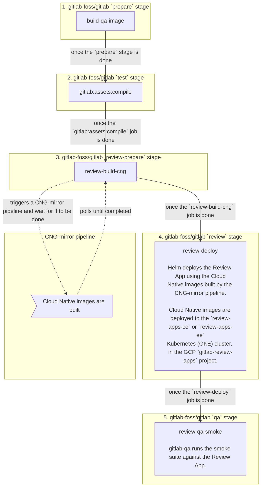
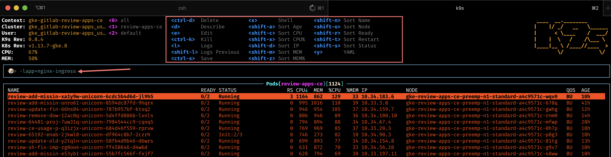

# Review Apps

Review Apps are automatically deployed by [the
pipeline](https://gitlab.com/gitlab-org/gitlab/merge_requests/6665).

## How does it work?

### CI/CD architecture diagram



### Detailed explanation

1. On every [pipeline][gitlab-pipeline] during the `test` stage, the
   [`gitlab:assets:compile`][gitlab:assets:compile] job is automatically started.
   - Once it's done, it starts the [`review-build-cng`][review-build-cng]
     manual job since the [`CNG-mirror`][cng-mirror] pipeline triggered in the
     following step depends on it.
1. The [`review-build-cng`][review-build-cng] job [triggers a pipeline][cng-mirror-pipeline]
   in the [`CNG-mirror`][cng-mirror] project.
   - The [`CNG-mirror`][cng-mirror-pipeline] pipeline creates the Docker images of
     each component (e.g. `gitlab-rails-ee`, `gitlab-shell`, `gitaly` etc.)
     based on the commit from the [GitLab pipeline][gitlab-pipeline] and stores
     them in its [registry][cng-mirror-registry].
   - We use the [`CNG-mirror`][cng-mirror] project so that the `CNG`, (**C**loud
     **N**ative **G**itLab), project's registry is not overloaded with a
     lot of transient Docker images.
   - Note that the official CNG images are built by the `cloud-native-image`
     job, which runs only for tags, and triggers itself a [`CNG`][cng] pipeline.
1. Once the `test` stage is done, the [`review-deploy`][review-deploy] job
   deploys the Review App using [the official GitLab Helm chart][helm-chart] to
   the [`review-apps-ce`][review-apps-ce] / [`review-apps-ee`][review-apps-ee]
   Kubernetes cluster on GCP.
   - The actual scripts used to deploy the Review App can be found at
     [`scripts/review_apps/review-apps.sh`][review-apps.sh].
   - These scripts are basically
     [our official Auto DevOps scripts][Auto-DevOps.gitlab-ci.yml] where the
     default CNG images are overridden with the images built and stored in the
     [`CNG-mirror` project's registry][cng-mirror-registry].
   - Since we're using [the official GitLab Helm chart][helm-chart], this means
     you get a dedicated environment for your branch that's very close to what
     it would look in production.
1. Once the [`review-deploy`][review-deploy] job succeeds, you should be able to
   use your Review App thanks to the direct link to it from the MR widget. To log
   into the Review App, see "Log into my Review App?" below.

**Additional notes:**

- If the `review-deploy` job keep failing (note that we already retry it twice),
  please post a message in the `#quality` channel and/or create a ~Quality ~bug
  issue with a link to your merge request. Note that the deployment failure can
  reveal an actual problem introduced in your merge request (i.e. this isn't
  necessarily a transient failure)!
- If the `review-qa-smoke` job keep failing (note that we already retry it twice),
  please check the job's logs: you could discover an actual problem introduced in
  your merge request. You can also download the artifacts to see screenshots of
  the page at the time the failures occurred. If you don't find the cause of the
  failure or if it seems unrelated to your change, please post a message in the
  `#quality` channel and/or create a ~Quality ~bug issue with a link to your
  merge request.
- The manual [`review-stop`][gitlab-ci-yml] in the `test` stage can be used to
  stop a Review App manually, and is also started by GitLab once a merge
  request's branch is deleted after being merged.
- Review Apps are cleaned up regularly via a pipeline schedule that runs
  the [`schedule:review-cleanup`][gitlab-ci-yml] job.
- The Kubernetes cluster is connected to the `gitlab-{ce,ee}` projects using
  [GitLab's Kubernetes integration][gitlab-k8s-integration]. This basically
  allows to have a link to the Review App directly from the merge request
  widget.

## QA runs

On every [pipeline][gitlab-pipeline] in the `qa` stage (which comes after the
`review` stage), the `review-qa-smoke` job is automatically started and it runs
the QA smoke suite.

You can also manually start the `review-qa-all`: it runs the full QA suite.

## Performance Metrics

On every [pipeline][gitlab-pipeline] in the `qa` stage, the
`review-performance` job is automatically started: this job does basic
browser performance testing using a
[Sitespeed.io Container](../../user/project/merge_requests/browser_performance_testing.md).

## Cluster configuration

### Node pools

Both `review-apps-ce` and `review-apps-ee` clusters are currently set up with
two node pools:

- a node pool of non-preemptible `n1-standard-2` (2 vCPU, 7.5 GB memory) nodes
  dedicated to the `tiller` deployment (see below) with a single node.
- a node pool of preemptible `n1-standard-2` (2 vCPU, 7.5 GB memory) nodes,
  with a minimum of 1 node and a maximum of 250 nodes.

### Helm/Tiller

The Helm/Tiller version used is defined in the
[`registry.gitlab.com/gitlab-org/gitlab-build-images:gitlab-charts-build-base` image](https://gitlab.com/gitlab-org/gitlab-build-images/blob/master/Dockerfile.gitlab-charts-build-base#L4)
used by the `review-deploy` and `review-stop` jobs.

The `tiller` deployment (the Helm server) is deployed to a dedicated node pool
that has the `app=helm` label and a specific
[taint](https://kubernetes.io/docs/concepts/configuration/taint-and-toleration/)
to prevent other pods from being scheduled on this node pool.

This is to ensure Tiller isn't affected by "noisy" neighbors that could put
their node under pressure.

## How to

### Log into my Review App

The default username is `root` and its password can be found in the 1Password
secure note named `gitlab-{ce,ee} Review App's root password`.

### Enable a feature flag for my Review App

1. Open your Review App and log in as documented above.
1. Create a personal access token.
1. Enable the feature flag using the [Feature flag API](../../api/features.md).

### Find my Review App slug

1. Open the `review-deploy` job.
1. Look for `Checking for previous deployment of review-*`.
1. For instance for `Checking for previous deployment of review-qa-raise-e-12chm0`,
   your Review App slug would be `review-qa-raise-e-12chm0` in this case.

### Run a Rails console

1. [Filter Workloads by your Review App slug](https://console.cloud.google.com/kubernetes/workload?project=gitlab-review-apps),
   e.g. `review-qa-raise-e-12chm0`.
1. Find and open the `task-runner` Deployment, e.g. `review-qa-raise-e-12chm0-task-runner`.
1. Click on the Pod in the "Managed pods" section, e.g. `review-qa-raise-e-12chm0-task-runner-d5455cc8-2lsvz`.
1. Click on the `KUBECTL` dropdown, then `Exec` -> `task-runner`.
1. Replace `-c task-runner -- ls` with `-it -- gitlab-rails console` from the
   default command or
   - Run `kubectl exec --namespace review-apps-ce review-qa-raise-e-12chm0-task-runner-d5455cc8-2lsvz -it -- gitlab-rails console` and
     - Replace `review-apps-ce` with `review-apps-ee` if the Review App
       is running EE, and
     - Replace `review-qa-raise-e-12chm0-task-runner-d5455cc8-2lsvz`
       with your Pod's name.

### Dig into a Pod's logs

1. [Filter Workloads by your Review App slug](https://console.cloud.google.com/kubernetes/workload?project=gitlab-review-apps),
   e.g. `review-qa-raise-e-12chm0`.
1. Find and open the `migrations` Deployment, e.g.
   `review-qa-raise-e-12chm0-migrations.1`.
1. Click on the Pod in the "Managed pods" section, e.g.
   `review-qa-raise-e-12chm0-migrations.1-nqwtx`.
1. Click on the `Container logs` link.

## Diagnosing unhealthy Review App releases

If [Review App Stability](https://app.periscopedata.com/app/gitlab/496118/Engineering-Productivity-Sandbox?widget=6690556&udv=785399)
dips this may be a signal that the `review-apps-ce/ee` cluster is unhealthy.
Leading indicators may be healthcheck failures leading to restarts or majority failure for Review App deployments.

The [Review Apps Overview dashboard](https://app.google.stackdriver.com/dashboards/6798952013815386466?project=gitlab-review-apps&timeDomain=1d)
aids in identifying load spikes on the cluster, and if nodes are problematic or the entire cluster is trending towards unhealthy.

### Node count is always increasing (i.e. never stabilizing or decreasing)

**Potential cause:**

That could be a sign that the [`schedule:review-cleanup`][gitlab-ci-yml] job is
failing to cleanup stale Review Apps and Kubernetes resources.

**Where to look for further debugging:**

Look at the latest `schedule:review-cleanup` job log, and identify look for any
unexpected failure.

### p99 CPU utilization is at 100% for most of the nodes and/or many components

**Potential cause:**

This could be a sign that Helm is failing to deploy Review Apps. When Helm has a
lot of `FAILED` releases, it seems that the CPU utilization is increasing, probably
due to Helm or Kubernetes trying to recreate the components.

**Where to look for further debugging:**

Look at a recent `review-deploy` job log, and at the Tiller logs.

**Useful commands:**

```shell
# Identify if node spikes are common or load on specific nodes which may get rebalanced by the Kubernetes scheduler
› kubectl top nodes | sort --key 3 --numeric

# Identify pods under heavy CPU load
› kubectl top pods | sort --key 2 --numeric
```

### The `logging/user/events/FailedMount` chart is going up

**Potential cause:**

This could be a sign that there are too many stale secrets and/or config maps.

**Where to look for further debugging:**

Look at [the list of Configurations](https://console.cloud.google.com/kubernetes/config?project=gitlab-review-apps)
or `kubectl get secret,cm --sort-by='{.metadata.creationTimestamp}' | grep 'review-'`.

Any secrets or config maps older than 5 days are suspect and should be deleted.

**Useful commands:**

```
# List secrets and config maps ordered by created date
› kubectl get secret,cm --sort-by='{.metadata.creationTimestamp}' | grep 'review-'

# Delete all secrets that are 5 to 9 days old
› kubectl get secret --sort-by='{.metadata.creationTimestamp}' | grep '^review-' | grep '[5-9]d$' | cut -d' ' -f1 | xargs kubectl delete secret

# Delete all secrets that are 10 to 99 days old
› kubectl get secret --sort-by='{.metadata.creationTimestamp}' | grep '^review-' | grep '[1-9][0-9]d$' | cut -d' ' -f1 | xargs kubectl delete secret

# Delete all config maps that are 5 to 9 days old
› kubectl get cm --sort-by='{.metadata.creationTimestamp}' | grep 'review-' | grep -v 'dns-gitlab-review-app' | grep '[5-9]d$' | cut -d' ' -f1 | xargs kubectl delete cm

# Delete all config maps that are 10 to 99 days old
› kubectl get cm --sort-by='{.metadata.creationTimestamp}' | grep 'review-' | grep -v 'dns-gitlab-review-app' | grep '[1-9][0-9]d$' | cut -d' ' -f1 | xargs kubectl delete cm
```

### Using K9s

[K9s] is a powerful command line dashboard which allows you to filter by labels. This can help identify trends with apps exceeding the [review-app resource requests](https://gitlab.com/gitlab-org/gitlab/blob/master/scripts/review_apps/base-config.yaml). Kubernetes will schedule pods to nodes based on resource requests and allow for CPU usage up to the limits.

- In K9s you can sort or add filters by typing the `/` character
  - `-lrelease=<review-app-slug>` - filters down to all pods for a release. This aids in determining what is having issues in a single deployment
  - `-lapp=<app>` - filters down to all pods for a specific app. This aids in determining resource usage by app.
- You can scroll to a Kubernetes resource and hit `d`(describe), `s`(shell), `l`(logs) for a deeper inspection



### Troubleshoot a pending `dns-gitlab-review-app-external-dns` Deployment

#### Finding the problem

[In the past](https://gitlab.com/gitlab-org/gitlab-foss/issues/62834), it happened
that the `dns-gitlab-review-app-external-dns` Deployment was in a pending state,
effectively preventing all the Review Apps from getting a DNS record assigned,
making them unreachable via domain name.

This in turn prevented other components of the Review App to properly start
(e.g. `gitlab-runner`).

After some digging, we found that new mounts were failing, when being performed
with transient scopes (e.g. pods) of `systemd-mount`:

```
MountVolume.SetUp failed for volume "dns-gitlab-review-app-external-dns-token-sj5jm" : mount failed: exit status 1
Mounting command: systemd-run
Mounting arguments: --description=Kubernetes transient mount for /var/lib/kubelet/pods/06add1c3-87b4-11e9-80a9-42010a800107/volumes/kubernetes.io~secret/dns-gitlab-review-app-external-dns-token-sj5jm --scope -- mount -t tmpfs tmpfs /var/lib/kubelet/pods/06add1c3-87b4-11e9-80a9-42010a800107/volumes/kubernetes.io~secret/dns-gitlab-review-app-external-dns-token-sj5jm
Output: Failed to start transient scope unit: Connection timed out
```

This probably happened because the GitLab chart creates 67 resources, leading to
a lot of mount points being created on the underlying GCP node.

The [underlying issue seems to be a `systemd` bug](https://github.com/kubernetes/kubernetes/issues/57345#issuecomment-359068048)
that was fixed in `systemd` `v237`. Unfortunately, our GCP nodes are currently
using `v232`.

For the record, the debugging steps to find out this issue were:

1. Switch kubectl context to review-apps-ce (we recommend using [kubectx](https://github.com/ahmetb/kubectx/))
1. `kubectl get pods | grep dns`
1. `kubectl describe pod <pod name>` & confirm exact error message
1. Web search for exact error message, following rabbit hole to [a relevant Kubernetes bug report](https://github.com/kubernetes/kubernetes/issues/57345)
1. Access the node over SSH via the GCP console (**Computer Engine > VM
   instances** then click the "SSH" button for the node where the `dns-gitlab-review-app-external-dns` pod runs)
1. In the node: `systemctl --version` => systemd 232
1. Gather some more information:
   - `mount | grep kube | wc -l` => e.g. 290
   - `systemctl list-units --all | grep -i var-lib-kube | wc -l` => e.g. 142
1. Check how many pods are in a bad state:
   - Get all pods running a given node: `kubectl get pods --field-selector=spec.nodeName=NODE_NAME`
   - Get all the `Running` pods on a given node: `kubectl get pods --field-selector=spec.nodeName=NODE_NAME | grep Running`
   - Get all the pods in a bad state on a given node: `kubectl get pods --field-selector=spec.nodeName=NODE_NAME | grep -v 'Running' | grep -v 'Completed'`

#### Solving the problem

To resolve the problem, we needed to (forcibly) drain some nodes:

1. Try a normal drain on the node where the `dns-gitlab-review-app-external-dns`
   pod runs so that Kubernetes automatically move it to another node: `kubectl drain NODE_NAME`
1. If that doesn't work, you can also perform a forcible "drain" the node by removing all pods: `kubectl delete pods --field-selector=spec.nodeName=NODE_NAME`
1. In the node:
   - Perform `systemctl daemon-reload` to remove the dead/inactive units
   - If that doesn't solve the problem, perform a hard reboot: `sudo systemctl reboot`
1. Uncordon any cordoned nodes: `kubectl uncordon NODE_NAME`

In parallel, since most Review Apps were in a broken state, we deleted them to
clean up the list of non-`Running` pods.
Following is a command to delete Review Apps based on their last deployment date
(current date was June 6th at the time) with

```
helm ls -d | grep "Jun  4" | cut -f1 | xargs helm delete --purge
```

#### Mitigation steps taken to avoid this problem in the future

We've created a new node pool with smaller machines so that it's less likely
that a machine will hit the "too many mount points" problem in the future.

## Frequently Asked Questions

**Isn't it too much to trigger CNG image builds on every test run? This creates
thousands of unused Docker images.**

  > We have to start somewhere and improve later. Also, we're using the
  > CNG-mirror project to store these Docker images so that we can just wipe out
  > the registry at some point, and use a new fresh, empty one.

**How do we secure this from abuse? Apps are open to the world so we need to
find a way to limit it to only us.**

  > This isn't enabled for forks.

## Other resources

- [Review Apps integration for CE/EE (presentation)](https://docs.google.com/presentation/d/1QPLr6FO4LduROU8pQIPkX1yfGvD13GEJIBOenqoKxR8/edit?usp=sharing)
- [Stability issues](https://gitlab.com/gitlab-org/quality/team-tasks/issues/212)

### Helpful command line tools

- [K9s] - enables CLI dashboard across pods and enabling filtering by labels
- [Stern](https://github.com/wercker/stern) - enables cross pod log tailing based on label/field selectors

[charts-1068]: https://gitlab.com/gitlab-org/charts/gitlab/issues/1068
[gitlab-pipeline]: https://gitlab.com/gitlab-org/gitlab-foss/pipelines/44362587
[gitlab:assets:compile]: https://gitlab.com/gitlab-org/gitlab-foss/-/jobs/149511610
[review-build-cng]: https://gitlab.com/gitlab-org/gitlab-foss/-/jobs/149511623
[review-deploy]: https://gitlab.com/gitlab-org/gitlab-foss/-/jobs/149511624
[cng-mirror]: https://gitlab.com/gitlab-org/build/CNG-mirror
[cng]: https://gitlab.com/gitlab-org/build/CNG
[cng-mirror-pipeline]: https://gitlab.com/gitlab-org/build/CNG-mirror/pipelines/44364657
[cng-mirror-registry]: https://gitlab.com/gitlab-org/build/CNG-mirror/container_registry
[helm-chart]: https://gitlab.com/gitlab-org/charts/gitlab/
[review-apps-ce]: https://console.cloud.google.com/kubernetes/clusters/details/us-central1-a/review-apps-ce?project=gitlab-review-apps
[review-apps-ee]: https://console.cloud.google.com/kubernetes/clusters/details/us-central1-b/review-apps-ee?project=gitlab-review-apps
[review-apps.sh]: https://gitlab.com/gitlab-org/gitlab/blob/master/scripts/review_apps/review-apps.sh
[automated_cleanup.rb]: https://gitlab.com/gitlab-org/gitlab/blob/master/scripts/review_apps/automated_cleanup.rb
[Auto-DevOps.gitlab-ci.yml]: https://gitlab.com/gitlab-org/gitlab/blob/master/lib/gitlab/ci/templates/Auto-DevOps.gitlab-ci.yml
[gitlab-ci-yml]: https://gitlab.com/gitlab-org/gitlab/blob/master/.gitlab-ci.yml
[gitlab-k8s-integration]: ../../user/project/clusters/index.md
[K9s]: https://github.com/derailed/k9s
[password-bug]: https://gitlab.com/gitlab-org/gitlab-foss/issues/53621

---

[Return to Testing documentation](index.md)
