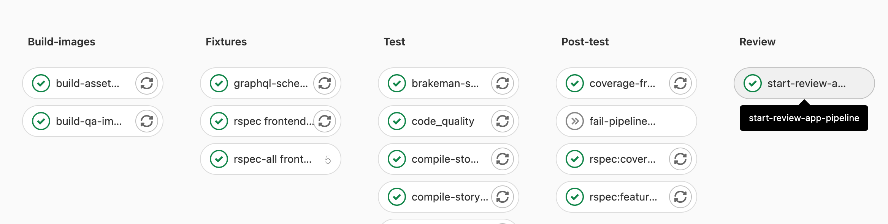
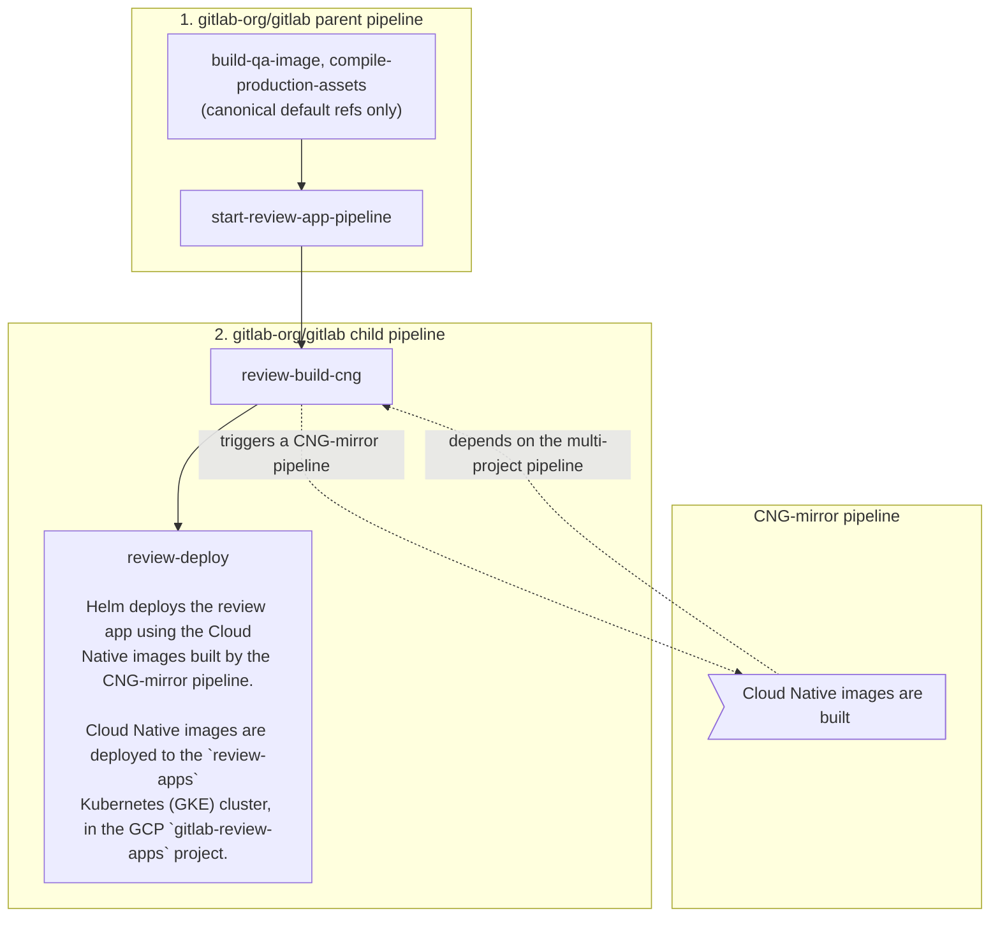

Review apps are deployed using the `start-review-app-pipeline` job which triggers a child pipeline containing a series of jobs to perform the various tasks needed to deploy a review app.



For any of the following scenarios, the `start-review-app-pipeline` job would be automatically started (only when the merge request is approved):

- for merge requests with CI configuration changes
- for merge requests with frontend changes
- for merge requests with changes to `{,ee/,jh/}{app/controllers}/**/*`
- for merge requests with changes to `{,ee/,jh/}{app/models}/**/*`
- for merge requests with changes to `{,ee/,jh/}lib/{,ee/,jh/}gitlab/**/*`
- for merge requests with QA changes
- for scheduled pipelines
- the MR has the `pipeline:run-review-app` label set

## Bypass failed review app deployment to merge a broken `master` fix

Maintainers can elect to use the [process for merging during broken `master`](https://handbook.gitlab.com/handbook/engineering/workflow/#instructions-for-the-maintainer) if a customer-critical merge request is blocked by pipelines failing due to review app deployment failures.

## Performance Metrics

On every Review App child pipeline in the `qa` stage, the
`browser_performance` job is automatically started: this job does basic
browser performance testing using a
[Sitespeed.io Container](../../ci/testing/browser_performance_testing.md).

## Sample Data for review apps

Upon deployment of a review app, project data is created from the [`sample-gitlab-project`](https://gitlab.com/gitlab-org/sample-data-templates/sample-gitlab-project) template project. This aims to provide projects with prepopulated resources to facilitate manual and exploratory testing.

The sample projects will be created in the `root` user namespace and can be accessed from the personal projects list for that user.

## How to

### Redeploy review app from a clean slate

To reset review app and redeploy from a clean slate, do the following:

1. Run `review-stop` job.
1. Re-deploy by running or retrying `review-deploy` job.

Doing this will remove all existing data from a previously deployed review app.

### Get access to the GCP review apps cluster

You need to [open an access request (internal link)](https://gitlab.com/gitlab-com/access-requests/-/issues/new)
for the `gcp-review-apps-dev` GCP group and role.

This grants you the following permissions for:

- [Retrieving pod logs](#dig-into-a-pods-logs). Granted by [Viewer (`roles/viewer`)](https://cloud.google.com/iam/docs/understanding-roles#kubernetes-engine-roles).
- [Running a Rails console](#run-a-rails-console). Granted by [Kubernetes Engine Developer (`roles/container.pods.exec`)](https://cloud.google.com/iam/docs/understanding-roles#kubernetes-engine-roles).

### Sign in to my review app

For GitLab Team Members only. If you want to sign in to the review app, review
the GitLab handbook information for the [shared 1Password account](https://handbook.gitlab.com/handbook/security/password-guidelines/#1password-for-teams).

- The default username is `root`.
- The password can be found in the 1Password login item named `GitLab EE Review App`.

### Enable a feature flag for my review app

1. Open your review app and sign in as documented above.
1. Create a personal access token.
1. Enable the feature flag using the [Feature flag API](../../api/features.md).

### Find my review app slug

1. Open the `review-deploy` job.
1. Look for `** Deploying review-*`.
1. For instance for `** Deploying review-1234-abc-defg... **`,
   your review app slug would be `review-1234-abc-defg` in this case.

### Run a Rails console

1. Make sure you [have access to the cluster](#get-access-to-the-gcp-review-apps-cluster) and the `container.pods.exec` permission first.
1. [Filter Workloads by your review app slug](https://console.cloud.google.com/kubernetes/workload?project=gitlab-review-apps). For example, `review-qa-raise-e-12chm0`.
1. Find and open the `toolbox` Deployment. For example, `review-qa-raise-e-12chm0-toolbox`.
1. Select the Pod in the "Managed pods" section. For example, `review-qa-raise-e-12chm0-toolbox-d5455cc8-2lsvz`.
1. Select the `KUBECTL` dropdown list, then `Exec` -> `toolbox`.
1. Replace `-c toolbox -- ls` with `-it -- gitlab-rails console` from the
   default command or
   - Run `kubectl exec --namespace review-qa-raise-e-12chm0 review-qa-raise-e-12chm0-toolbox-d5455cc8-2lsvz -it -- gitlab-rails console` and
     - Replace `review-qa-raise-e-12chm0-toolbox-d5455cc8-2lsvz`
       with your Pod's name.

### Dig into a Pod's logs

1. Make sure you [have access to the cluster](#get-access-to-the-gcp-review-apps-cluster) and the `container.pods.getLogs` permission first.
1. [Filter Workloads by your review app slug](https://console.cloud.google.com/kubernetes/workload?project=gitlab-review-apps). For example, `review-qa-raise-e-12chm0`.
1. Find and open the `migrations` Deployment. For example, `review-qa-raise-e-12chm0-migrations.1`.
1. Select the Pod in the "Managed pods" section. For example, `review-qa-raise-e-12chm0-migrations.1-nqwtx`.
1. Select `Container logs`.

Alternatively, you could use the [Logs Explorer](https://console.cloud.google.com/logs/query;query=?project=gitlab-review-apps) which provides more utility to search logs. An example query for a pod name is as follows:

```shell
resource.labels.pod_name:"review-qa-raise-e-12chm0-migrations"
```

## How does it work?

### CI/CD architecture diagram



### Detailed explanation

1. On every [pipeline](https://gitlab.com/gitlab-org/gitlab/pipelines/125315730) during the `prepare` stage, the
   [`compile-production-assets`](https://gitlab.com/gitlab-org/gitlab/-/jobs/641770154) job is automatically started.
   - Once it's done, the [`review-build-cng`](https://gitlab.com/gitlab-org/gitlab/-/jobs/467724808)
     job starts since the [`CNG-mirror`](https://gitlab.com/gitlab-org/build/CNG-mirror) pipeline triggered in the
     following step depends on it.
1. Once `compile-production-assets` is done, the [`review-build-cng`](https://gitlab.com/gitlab-org/gitlab/-/jobs/467724808)
   job [triggers a pipeline](https://gitlab.com/gitlab-org/build/CNG-mirror/pipelines/44364657)
   in the [`CNG-mirror`](https://gitlab.com/gitlab-org/build/CNG-mirror) project.
   - The `review-build-cng` job automatically starts only if your MR includes
     [CI or frontend changes](../pipelines/internals.md#changes-patterns). In other cases, the job is manual.
   - The [`CNG-mirror`](https://gitlab.com/gitlab-org/build/CNG-mirror/pipelines/44364657) pipeline creates the Docker images of
     each component (for example, `gitlab-rails-ee`, `gitlab-shell`, `gitaly` etc.)
     based on the commit from the [GitLab pipeline](https://gitlab.com/gitlab-org/gitlab/pipelines/125315730) and stores
     them in its [registry](https://gitlab.com/gitlab-org/build/CNG-mirror/container_registry).
   - We use the [`CNG-mirror`](https://gitlab.com/gitlab-org/build/CNG-mirror) project so that the `CNG`, (Cloud
     Native GitLab), project's registry is not overloaded with a lot of transient Docker images.
1. Once `review-build-cng` is done, the [`review-deploy`](https://gitlab.com/gitlab-org/gitlab/-/jobs/467724810) job
   deploys the review app using [the official GitLab Helm chart](https://gitlab.com/gitlab-org/charts/gitlab/) to
   the [`review-apps`](https://console.cloud.google.com/kubernetes/clusters/details/us-central1-b/review-apps?project=gitlab-review-apps)
   Kubernetes cluster on GCP.
   - The actual scripts used to deploy the review app can be found at
     [`scripts/review_apps/review-apps.sh`](https://gitlab.com/gitlab-org/gitlab/-/blob/master/scripts/review_apps/review-apps.sh).
   - These scripts are basically
     [our official Auto DevOps scripts](https://gitlab.com/gitlab-org/gitlab/-/blob/master/lib/gitlab/ci/templates/Auto-DevOps.gitlab-ci.yml) where the
     default CNG images are overridden with the images built and stored in the
     [`CNG-mirror` project's registry](https://gitlab.com/gitlab-org/build/CNG-mirror/container_registry).
   - Since we're using [the official GitLab Helm chart](https://gitlab.com/gitlab-org/charts/gitlab/), this means
     you get a dedicated environment for your branch that's very close to what
     it would look in production.
   - Each review app is deployed to its own Kubernetes namespace. The namespace is based on the review app slug that is
     unique to each branch.
1. Once the [`review-deploy`](https://gitlab.com/gitlab-org/gitlab/-/jobs/467724810) job succeeds, you should be able to
   use your review app thanks to the direct link to it from the MR widget. To log
   into the review app, see "Sign in to my review app?" below.

**Additional notes:**

- If the `review-deploy` job keeps failing (and a manual retry didn't help),
  post a message in the `#g_qe_engineering_productivity` channel and/or create a `~"Engineering Productivity"` `~"dx::review apps"` `~"type::bug"`
  issue with a link to your merge request. The deployment failure can
  reveal an actual problem introduced in your merge request (that is, this isn't
  necessarily a transient failure)!
- The manual `review-stop` can be used to
  stop a review app manually, and is also started by GitLab once a merge
  request's branch is deleted after being merged.
- The Kubernetes cluster is connected to the `gitlab` projects using the
  [GitLab Kubernetes integration](../../user/infrastructure/clusters/_index.md). This basically
  allows to have a link to the review app directly from the merge request widget.

### Auto-stopping of review apps

Review apps are automatically stopped 2 days after the last deployment thanks to
the [Environment auto-stop](../../ci/environments/_index.md#stop-an-environment-after-a-certain-time-period) feature.

If you need your review app to stay up for a longer time, you can
[pin its environment](../../ci/environments/_index.md#override-an-environments-scheduled-stop-date-and-time) or retry the
`review-deploy` job to update the "latest deployed at" time.

The `review-cleanup` job that automatically runs in scheduled
pipelines stops stale review apps after 5 days,
deletes their environment after 6 days, and cleans up any dangling Helm releases
and Kubernetes resources after 7 days.

## Cluster configuration

The cluster is configured via Terraform in the [`engineering-productivity-infrastructure`](https://gitlab.com/gitlab-org/quality/engineering-productivity-infrastructure) project.

Node pool image type must be `Container-Optimized OS (cos)`, not `Container-Optimized OS with Containerd (cos_containerd)`,
due to this [known issue on the Kubernetes executor for GitLab Runner](https://gitlab.com/gitlab-org/gitlab-runner/-/issues/4755)

### Helm

The Helm version used is defined in the
[`registry.gitlab.com/gitlab-org/gitlab-build-images:gitlab-helm3.5-kubectl1.17` image](https://gitlab.com/gitlab-org/gitlab-build-images/-/blob/master/Dockerfile.gitlab-helm3.5-kubectl1.17#L6)
used by the `review-deploy` and `review-stop` jobs.

## Diagnosing unhealthy review app releases

If [review app stability](https://app.periscopedata.com/app/gitlab/496118/Engineering-Productivity-Sandbox?widget=6690556&udv=785399)
dips this may be a signal that the `review-apps` cluster is unhealthy.
Leading indicators may be health check failures leading to restarts or majority failure for review app deployments.

The [review apps Overview dashboard](https://console.cloud.google.com/monitoring/classic/dashboards/6798952013815386466?project=gitlab-review-apps&timeDomain=1d)
aids in identifying load spikes on the cluster, and if nodes are problematic or the entire cluster is trending towards unhealthy.

See the [review apps page of the Engineering Productivity Runbook](https://gitlab.com/gitlab-org/quality/engineering-productivity/team/-/blob/main/runbook/review-apps.md) for troubleshooting review app releases.

## Frequently Asked Questions

**Isn't it too much to trigger CNG image builds on every test run? This creates
thousands of unused Docker images.**

  > We have to start somewhere and improve later. Also, we're using the
  > CNG-mirror project to store these Docker images so that we can just wipe out
  > the registry at some point, and use a new fresh, empty one.

**How do we secure this from abuse? Apps are open to the world so we need to
find a way to limit it to only us.**

  > This isn't enabled for forks.

## Other resources

- [Review apps integration for CE/EE (presentation)](https://docs.google.com/presentation/d/1QPLr6FO4LduROU8pQIPkX1yfGvD13GEJIBOenqoKxR8/edit?usp=sharing)
- [Stability issues](https://gitlab.com/gitlab-org/quality/quality-engineering/team-tasks/-/issues/212)

### Helpful command-line tools

- [K9s](https://github.com/derailed/k9s) - enables CLI dashboard across pods and enabling filtering by labels
- [Stern](https://github.com/wercker/stern) - enables cross pod log tailing based on label/field selectors

---

[Return to Testing documentation](_index.md)
