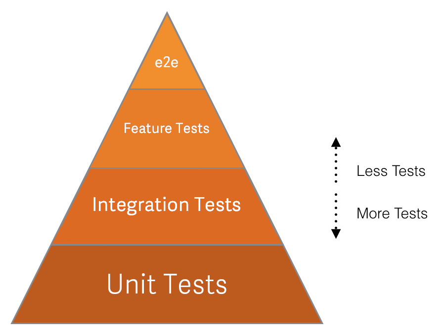

# Testing levels



_This diagram demonstrates the relative priority of each test type we use. `e2e` stands for end-to-end._

## Unit tests

Formal definition: https://en.wikipedia.org/wiki/Unit_testing

These kind of tests ensure that a single unit of code (a method) works as
expected (given an input, it has a predictable output). These tests should be
isolated as much as possible. For example, model methods that don't do anything
with the database shouldn't need a DB record. Classes that don't need database
records should use stubs/doubles as much as possible.

| Code path | Tests path | Testing engine | Notes |
| --------- | ---------- | -------------- | ----- |
| `app/finders/` | `spec/finders/` | RSpec | |
| `app/helpers/` | `spec/helpers/` | RSpec | |
| `app/db/{post_,}migrate/` | `spec/migrations/` | RSpec | More details at [`spec/migrations/README.md`](https://gitlab.com/gitlab-org/gitlab-ce/blob/master/spec/migrations/README.md). |
| `app/policies/` | `spec/policies/` | RSpec | |
| `app/presenters/` | `spec/presenters/` | RSpec | |
| `app/routing/` | `spec/routing/` | RSpec | |
| `app/serializers/` | `spec/serializers/` | RSpec | |
| `app/services/` | `spec/services/` | RSpec | |
| `app/tasks/` | `spec/tasks/` | RSpec | |
| `app/uploaders/` | `spec/uploaders/` | RSpec | |
| `app/views/` | `spec/views/` | RSpec | |
| `app/workers/` | `spec/workers/` | RSpec | |
| `app/assets/javascripts/` | `spec/javascripts/` | Karma | More details in the [Frontent Testing guide](frontend_testing.md) section. |

## Integration tests

Formal definition: https://en.wikipedia.org/wiki/Integration_testing

These kind of tests ensure that individual parts of the application work well together, without the overhead of the actual app environment (i.e. the browser). These tests should assert at the request/response level: status code, headers, body. They're useful to test permissions, redirections, what view is rendered etc.

| Code path | Tests path | Testing engine | Notes |
| --------- | ---------- | -------------- | ----- |
| `app/controllers/` | `spec/controllers/` | RSpec | |
| `app/mailers/` | `spec/mailers/` | RSpec | |
| `lib/api/` | `spec/requests/api/` | RSpec | |
| `lib/ci/api/` | `spec/requests/ci/api/` | RSpec | |
| `app/assets/javascripts/` | `spec/javascripts/` | Karma | More details in the [JavaScript](#javascript) section. |

### About controller tests

In an ideal world, controllers should be thin. However, when this is not the
case, it's acceptable to write a system/feature test without JavaScript instead
of a controller test. The reason is that testing a fat controller usually
involves a lot of stubbing, things like:

```ruby
controller.instance_variable_set(:@user, user)
```

and use methods which are deprecated in Rails 5 ([#23768]).

[#23768]: https://gitlab.com/gitlab-org/gitlab-ce/issues/23768

### About Karma

As you may have noticed, Karma is both in the Unit tests and the Integration
tests category. That's because Karma is a tool that provides an environment to
run JavaScript tests, so you can either run unit tests (e.g. test a single
JavaScript method), or integration tests (e.g. test a component that is composed
of multiple components).

## System tests or feature tests

Formal definition: https://en.wikipedia.org/wiki/System_testing.

These kind of tests ensure the application works as expected from a user point
of view (aka black-box testing). These tests should test a happy path for a
given page or set of pages, and a test case should be added for any regression
that couldn't have been caught at lower levels with better tests (i.e. if a
regression is found, regression tests should be added at the lowest-level
possible).

| Tests path | Testing engine | Notes |
| ---------- | -------------- | ----- |
| `spec/features/` | [Capybara] + [RSpec] | If your spec has the `:js` metadata, the browser driver will be [Poltergeist], otherwise it's using [RackTest]. |
| `features/` | Spinach | Spinach tests are deprecated, [you shouldn't add new Spinach tests](#spinach-feature-tests). |

### Consider **not** writing a system test!

If we're confident that the low-level components work well (and we should be if
we have enough Unit & Integration tests), we shouldn't need to duplicate their
thorough testing at the System test level.

It's very easy to add tests, but a lot harder to remove or improve tests, so one
should take care of not introducing too many (slow and duplicated) specs.

The reasons why we should follow these best practices are as follows:

- System tests are slow to run since they spin up the entire application stack
  in a headless browser, and even slower when they integrate a JS driver
- When system tests run with a JavaScript driver, the tests are run in a
  different thread than the application. This means it does not share a
  database connection and your test will have to commit the transactions in
  order for the running application to see the data (and vice-versa). In that
  case we need to truncate the database after each spec instead of simply
  rolling back a transaction (the faster strategy that's in use for other kind
  of tests). This is slower than transactions, however, so we want to use
  truncation only when necessary.

[Poltergeist]: https://github.com/teamcapybara/capybara#poltergeist
[RackTest]: https://github.com/teamcapybara/capybara#racktest

## Black-box tests or end-to-end tests

GitLab consists of [multiple pieces] such as [GitLab Shell], [GitLab Workhorse],
[Gitaly], [GitLab Pages], [GitLab Runner], and GitLab Rails. All theses pieces
are configured and packaged by [GitLab Omnibus].

[GitLab QA] is a tool that allows to test that all these pieces integrate well
together by building a Docker image for a given version of GitLab Rails and
running feature tests (i.e. using Capybara) against it.

The actual test scenarios and steps are [part of GitLab Rails] so that they're
always in-sync with the codebase.

Read a separate document about [end-to-end tests](end_to_end_tests.md) to
learn more.

[multiple pieces]: ../architecture.md#components
[GitLab Shell]: https://gitlab.com/gitlab-org/gitlab-shell
[GitLab Workhorse]: https://gitlab.com/gitlab-org/gitlab-workhorse
[Gitaly]: https://gitlab.com/gitlab-org/gitaly
[GitLab Pages]: https://gitlab.com/gitlab-org/gitlab-pages
[GitLab Runner]: https://gitlab.com/gitlab-org/gitlab-runner
[GitLab Omnibus]: https://gitlab.com/gitlab-org/omnibus-gitlab
[GitLab QA]: https://gitlab.com/gitlab-org/gitlab-qa
[part of GitLab Rails]: https://gitlab.com/gitlab-org/gitlab-ce/tree/master/qa

## EE-specific tests

EE-specific tests follows the same organization, but under the `ee/spec` folder.

## How to test at the correct level?

As many things in life, deciding what to test at each level of testing is a
trade-off:

- Unit tests are usually cheap, and you should consider them like the basement
  of your house: you need them to be confident that your code is behaving
  correctly. However if you run only unit tests without integration / system
  tests, you might [miss] the [big] [picture]!
- Integration tests are a bit more expensive, but don't abuse them. A system test
  is often better than an integration test that is stubbing a lot of internals.
- System tests are expensive (compared to unit tests), even more if they require
  a JavaScript driver. Make sure to follow the guidelines in the [Speed](#test-speed)
  section.

Another way to see it is to think about the "cost of tests", this is well
explained [in this article][tests-cost] and the basic idea is that the cost of a
test includes:

- The time it takes to write the test
- The time it takes to run the test every time the suite runs
- The time it takes to understand the test
- The time it takes to fix the test if it breaks and the underlying code is OK
- Maybe, the time it takes to change the code to make the code testable.

### Frontend-related tests

There are cases where the behaviour you are testing is not worth the time spent
running the full application, for example, if you are testing styling, animation,
edge cases or small actions that don't involve the backend,
you should write an integration test using Jasmine.

[miss]: https://twitter.com/ThePracticalDev/status/850748070698651649
[big]: https://twitter.com/timbray/status/822470746773409794
[picture]: https://twitter.com/withzombies/status/829716565834752000
[tests-cost]: https://medium.com/table-xi/high-cost-tests-and-high-value-tests-a86e27a54df#.2ulyh3a4e

---

[Return to Testing documentation](index.md)
