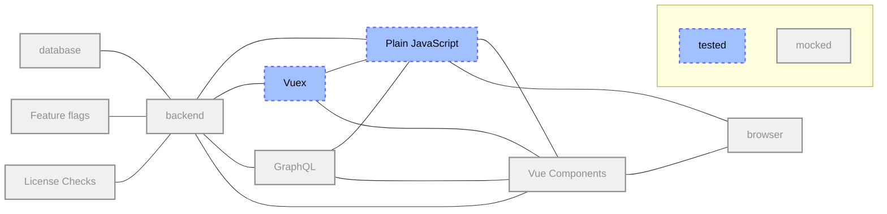
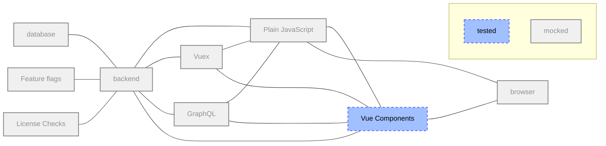
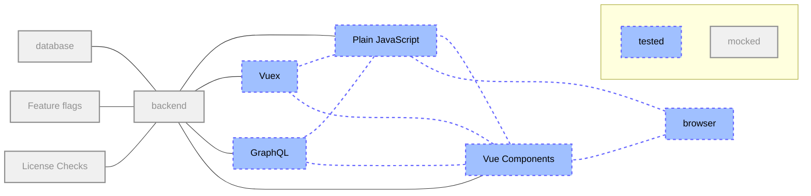
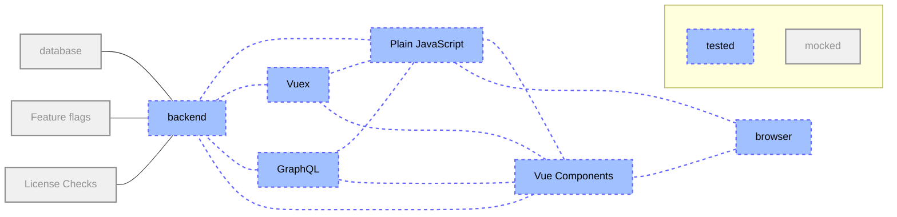

_This diagram demonstrates the relative priority of each test type we use. `e2e` stands for end-to-end._

As of 2025-02-03, we have the following estimated distribution of tests per level:

| Test level                                                        | Community Edition | Enterprise Edition | Community + Enterprise Edition |
|-------------------------------------------------------------------|-------------------|--------------------|--------------------------------|
| Black-box tests at the system level (aka end-to-end or QA tests)  | 401 (0.14%)       | 303 (0.10%)        | 704 (0.24%)                    |
| White-box tests at the system level (aka system or feature tests) | 8,362 (2.90%)     | 4,082 (1.41%)      | 12,444 (4.31%)                 |
| Integration tests                                                 | 39,716 (13.76%)   | 17,411 (6.03%)     | 57,127 (19.79%)                |
| Unit tests                                                        | 139,504 (48.32%)  | 78,955 (27.35%)    | 218,459 (75.66%)               |

## Unit tests

Formal definition: <https://en.wikipedia.org/wiki/Unit_testing>

These kind of tests ensure that a single unit of code (a method) works as
expected (given an input, it has a predictable output). These tests should be
isolated as much as possible. For example, model methods that don't do anything
with the database shouldn't need a DB record. Classes that don't need database
records should use stubs/doubles as much as possible.

| Code path | Tests path | Testing engine | Notes |
| --------- | ---------- | -------------- | ----- |
| `app/assets/javascripts/` | `spec/frontend/` | Jest | More details in the [Frontend Testing guide](frontend_testing.md) section. |
| `app/finders/` | `spec/finders/` | RSpec | |
| `app/graphql/` | `spec/graphql/` | RSpec | |
| `app/helpers/` | `spec/helpers/` | RSpec | |
| `app/models/` | `spec/models/` | RSpec | |
| `app/policies/` | `spec/policies/` | RSpec | |
| `app/presenters/` | `spec/presenters/` | RSpec | |
| `app/serializers/` | `spec/serializers/` | RSpec | |
| `app/services/` | `spec/services/` | RSpec | |
| `app/uploaders/` | `spec/uploaders/` | RSpec | |
| `app/validators/` | `spec/validators/` | RSpec | |
| `app/views/` | `spec/views/` | RSpec | |
| `app/workers/` | `spec/workers/` | RSpec | |
| `bin/` | `spec/bin/` | RSpec | |
| `config/` | `spec/config/` | RSpec | |
| `config/initializers/` | `spec/initializers/` | RSpec | |
| `config/routes.rb`, `config/routes/` | `spec/routing/` | RSpec | |
| `config/puma.example.development.rb` | `spec/rack_servers/` | RSpec | |
| `db/` | `spec/db/` | RSpec | |
| `db/{post_,}migrate/` | `spec/migrations/` | RSpec | More details in the [Testing Rails migrations guide](testing_migrations_guide.md). |
| `Gemfile` | `spec/dependencies/`, `spec/sidekiq/` | RSpec | |
| `lib/` | `spec/lib/` | RSpec | |
| `lib/tasks/` | `spec/tasks/` | RSpec | |
| `rubocop/` | `spec/rubocop/` | RSpec | |
| `spec/support/` | `spec/support_specs/` | RSpec | |

### Frontend unit tests

Unit tests are on the lowest abstraction level and typically test functionality
that is not directly perceivable by a user.



#### When to use unit tests

- **Exported functions and classes**:
  Anything exported can be reused at various places in ways you have no control over.
  You should document the expected behavior of the public interface with tests.
- **Vuex actions**:
  Any Vuex action must work in a consistent way, independent of the component it is triggered from.
- **Vuex mutations**:
  For complex Vuex mutations, you should separate the tests from other parts of the Vuex store to simplify problem-solving.

#### When *not* to use unit tests

- **Non-exported functions or classes**:
  Anything not exported from a module can be considered private or an implementation detail, and doesn't need to be tested.
- **Constants**:
  Testing the value of a constant means copying it, resulting in extra effort without additional confidence that the value is correct.
- **Vue components**:
  Computed properties, methods, and lifecycle hooks can be considered an implementation detail of components, are implicitly covered by component tests, and don't need to be tested.
  For more information, see the [official Vue guidelines](https://v1.test-utils.vuejs.org/guides/#getting-started).

#### What to mock in unit tests

- **State of the class under test**:
  Modifying the state of the class under test directly rather than using methods of the class avoids side effects in test setup.
- **Other exported classes**:
  Every class must be tested in isolation to prevent test scenarios from growing exponentially.
- **Single DOM elements if passed as parameters**:
  For tests only operating on single DOM elements, rather than a whole page, creating these elements is cheaper than loading an entire HTML fixture.
- **All server requests**:
  When running frontend unit tests, the backend may not be reachable, so all outgoing requests need to be mocked.
- **Asynchronous background operations**:
  Background operations cannot be stopped or waited on, so they continue running in the following tests and cause side effects.

#### What *not* to mock in unit tests

- **Non-exported functions or classes**:
  Everything that is not exported can be considered private to the module, and is implicitly tested through the exported classes and functions.
- **Methods of the class under test**:
  By mocking methods of the class under test, the mocks are tested and not the real methods.
- **Utility functions (pure functions, or those that only modify parameters)**:
  If a function has no side effects because it has no state, it is safe to not mock it in tests.
- **Full HTML pages**:
  Avoid loading the HTML of a full page in unit tests, as it slows down tests.

### Frontend component tests

Component tests cover the state of a single component that is perceivable by a user depending on external signals such as user input, events fired from other components, or application state.



#### When to use component tests

- **Vue components**

#### When *not* to use component tests

- **Vue applications**:
  Vue applications may contain many components.
  Testing them on a component level requires too much effort.
  Therefore they are tested on frontend integration level.
- **HAML templates**:
  HAML templates contain only Markup and no frontend-side logic.
  Therefore they are not complete components.

#### What to mock in component tests

- **Side effects**:
  Anything that can change external state (for example, a network request) should be mocked.
- **Child components**:
  Every component is tested individually, so child components are mocked.
  See also [`shallowMount()`](https://v1.test-utils.vuejs.org/api/#shallowmount)

#### What *not* to mock in component tests

- **Methods or computed properties of the component under test**:
  By mocking part of the component under test, the mocks are tested and not the real component.
- **Vuex**:
  Keep Vuex unmocked to avoid fragile and false-positive tests.
  Set the Vuex to a proper state using mutations.
  Mock the side-effects, not the Vuex actions.

## Integration tests

Formal definition: <https://en.wikipedia.org/wiki/Integration_testing>

These kind of tests ensure that individual parts of the application work well
together, without the overhead of the actual app environment (such as the browser).
These tests should assert at the request/response level: status code, headers,
body.
They're useful, for example, to test permissions, redirections, API endpoints, what view is rendered, and so forth.

| Code path | Tests path | Testing engine | Notes |
| --------- | ---------- | -------------- | ----- |
| `app/controllers/` | `spec/requests/`, `spec/controllers` | RSpec | Request specs are preferred over legacy controller specs. Request specs are encouraged for API endpoints. |
| `app/mailers/` | `spec/mailers/` | RSpec | |
| `lib/api/` | `spec/requests/api/` | RSpec | |
| `app/assets/javascripts/` | `spec/frontend/` | Jest | [More details below](#frontend-integration-tests) |

### Frontend integration tests

Integration tests cover the interaction between all components on a single page.
Their abstraction level is comparable to how a user would interact with the UI.



#### When to use integration tests

- **Page bundles (`index.js` files in `app/assets/javascripts/pages/`)**:
  Testing the page bundles ensures the corresponding frontend components integrate well.
- **Vue applications outside of page bundles**:
  Testing Vue applications as a whole ensures the corresponding frontend components integrate well.

#### What to mock in integration tests

- **HAML views (use fixtures instead)**:
  Rendering HAML views requires a Rails environment including a running database, which you cannot rely on in frontend tests.
- **All server requests**:
  Similar to unit and component tests, when running component tests, the backend may not be reachable, so all outgoing requests must be mocked.
- **Asynchronous background operations that are not perceivable on the page**:
  Background operations that affect the page must be tested on this level.
  All other background operations cannot be stopped or waited on, so they continue running in the following tests and cause side effects.

#### What *not* to mock in integration tests

- **DOM**:
  Testing on the real DOM ensures your components work in the intended environment.
  Part of DOM testing is delegated to [cross-browser testing](https://gitlab.com/gitlab-org/quality/quality-engineering/team-tasks/-/issues/45).
- **Properties or state of components**:
  On this level, all tests can only perform actions a user would do.
  For example: to change the state of a component, a click event would be fired.
- **Vuex stores**:
  When testing the frontend code of a page as a whole, the interaction between Vue components and Vuex stores is covered as well.

### About controller tests

GitLab is [transitioning from controller specs to request specs](https://gitlab.com/groups/gitlab-org/-/epics/5076).

In an ideal world, controllers should be thin. However, when this is not the
case, it's acceptable to write a system or feature test without JavaScript instead
of a controller test. Testing a fat controller usually involves a lot of stubbing, such as:

```ruby
controller.instance_variable_set(:@user, user)
```

and use methods [deprecated in Rails 5](https://gitlab.com/gitlab-org/gitlab/-/issues/16260).

## White-box tests at the system level (formerly known as System / Feature tests)

Formal definitions:

- <https://en.wikipedia.org/wiki/System_testing>
- <https://en.wikipedia.org/wiki/White-box_testing>

These kind of tests ensure the GitLab *Rails* application (for example,
`gitlab-foss`/`gitlab`) works as expected from a *browser* point of view.

Note that:

- knowledge of the internals of the application are still required
- data needed for the tests are usually created directly using RSpec factories
- expectations are often set on the database or objects state

These tests should only be used when:

- the functionality/component being tested is small
- the internal state of the objects/database *needs* to be tested
- it cannot be tested at a lower level

For instance, to test the breadcrumbs on a given page, writing a system test
makes sense since it's a small component, which cannot be tested at the unit or
controller level.

Only test the happy path, but make sure to add a test case for any regression
that couldn't have been caught at lower levels with better tests (for example, if a
regression is found, regression tests should be added at the lowest level
possible).

| Tests path | Testing engine | Notes |
| ---------- | -------------- | ----- |
| `spec/features/` | [Capybara](https://github.com/teamcapybara/capybara) + [RSpec](https://github.com/rspec/rspec-rails#feature-specs) | If your test has the `:js` metadata, the browser driver is [Selenium](https://github.com/teamcapybara/capybara#selenium), otherwise it's using [RackTest](https://github.com/teamcapybara/capybara#racktest). |

### Frontend feature tests

In contrast to [frontend integration tests](#frontend-integration-tests), feature
tests make requests against the real backend instead of using fixtures.
This also implies that database queries are executed which makes this category significantly slower.

See also:

- The [RSpec testing guidelines](../testing_guide/best_practices.md#rspec).
- System / Feature tests in the [Testing Best Practices](best_practices.md#system--feature-tests).



#### When to use feature tests

- Use cases that require a backend, and cannot be tested using fixtures.
- Behavior that is not part of a page bundle, but defined globally.

#### Relevant notes

A `:js` flag is added to the test to make sure the full environment is loaded:

```ruby
scenario 'successfully', :js do
  sign_in(create(:admin))
end
```

The steps of each test are written using ([capybara methods](https://www.rubydoc.info/gems/capybara)).

XHR (XMLHttpRequest) calls might require you to use `wait_for_requests` in between steps, such as:

```ruby
find('.form-control').native.send_keys(:enter)

wait_for_requests

expect(page).not_to have_selector('.card')
```

### Consider **not** writing a system test

If we're confident that the low-level components work well (and we should be if
we have enough Unit & Integration tests), we shouldn't need to duplicate their
thorough testing at the System test level.

It's very easy to add tests, but a lot harder to remove or improve tests, so one
should take care of not introducing too many (slow and duplicated) tests.

The reasons why we should follow these best practices are as follows:

- System tests are slow to run because they spin up the entire application stack
  in a headless browser, and even slower when they integrate a JS driver
- When system tests run with a JavaScript driver, the tests are run in a
  different thread than the application. This means it does not share a
  database connection and your test must commit the transactions in
  order for the running application to see the data (and vice-versa). In that
  case we need to truncate the database after each spec instead of
  rolling back a transaction (the faster strategy that's in use for other kind
  of tests). This is slower than transactions, however, so we want to use
  truncation only when necessary.

## Black-box tests at the system level, aka end-to-end tests

Formal definitions:

- <https://en.wikipedia.org/wiki/System_testing>
- <https://en.wikipedia.org/wiki/Black-box_testing>

GitLab consists of [multiple pieces](../architecture.md#components) such as [GitLab Shell](https://gitlab.com/gitlab-org/gitlab-shell), [GitLab Workhorse](https://gitlab.com/gitlab-org/gitlab-workhorse),
[Gitaly](https://gitlab.com/gitlab-org/gitaly), [GitLab Pages](https://gitlab.com/gitlab-org/gitlab-pages), [GitLab Runner](https://gitlab.com/gitlab-org/gitlab-runner), and GitLab Rails. All theses pieces
are configured and packaged by [Omnibus GitLab](https://gitlab.com/gitlab-org/omnibus-gitlab).

The QA framework and instance-level scenarios are [part of GitLab Rails](https://gitlab.com/gitlab-org/gitlab-foss/tree/master/qa) so that
they're always in-sync with the codebase (especially the views).

Note that:

- knowledge of the internals of the application are not required
- data needed for the tests can only be created using the GUI or the API
- expectations can only be made against the browser page and API responses

Every new feature should come with a [test plan](https://gitlab.com/gitlab-org/gitlab/-/tree/master/.gitlab/issue_templates/Test%20plan.md).

| Tests path | Testing engine | Notes |
| ---------- | -------------- | ----- |
| `qa/qa/specs/features/` | [Capybara](https://github.com/teamcapybara/capybara) + [RSpec](https://github.com/rspec/rspec-rails#feature-specs) + Custom QA framework | Tests should be placed under their corresponding [Product category](https://handbook.gitlab.com/handbook/product/categories/) |

> See [end-to-end tests](end_to_end/_index.md) for more information.

Note that `qa/spec` contains unit tests of the QA framework itself, not to be
confused with the application's [unit tests](#unit-tests) or
[end-to-end tests](#black-box-tests-at-the-system-level-aka-end-to-end-tests).

### Smoke tests

Smoke tests are quick tests that may be run at any time (especially after the
pre-deployment migrations).

These tests run against the UI and ensure that basic functionality is working.

> See [Smoke Tests](smoke.md) for more information.

### GitLab QA orchestrator

[GitLab QA orchestrator](https://gitlab.com/gitlab-org/gitlab-qa) is a tool that allows you to test that all these pieces integrate well together by building a Docker image for a given version of GitLab Rails and running end-to-end tests (using Capybara) against it.

Learn more in the [GitLab QA orchestrator README](https://gitlab.com/gitlab-org/gitlab-qa/tree/master/README.md).

## EE-specific tests

EE-specific tests follows the same organization, but under the `ee/spec` folder.

## How to test at the correct level?

As many things in life, deciding what to test at each level of testing is a
trade-off:

- Unit tests are usually cheap, and you should consider them like the basement
  of your house: you need them to be confident that your code is behaving
  correctly. However if you run only unit tests without integration / system
  tests, you might [miss](https://twitter.com/ThePracticalDev/status/850748070698651649) the
  [big](https://twitter.com/timbray/status/822470746773409794) /
  [picture](https://twitter.com/withzombies/status/829716565834752000) !
- Integration tests are a bit more expensive, but don't abuse them. A system test
  is often better than an integration test that is stubbing a lot of internals.
- System tests are expensive (compared to unit tests), even more if they require
  a JavaScript driver. Make sure to follow the guidelines in the [Speed](best_practices.md#test-slowness)
  section.

Another way to see it is to think about the "cost of tests", this is well
explained [in this article](https://medium.com/table-xi/high-cost-tests-and-high-value-tests-a86e27a54df#.2ulyh3a4e)
and the basic idea is that the cost of a test includes:

- The time it takes to write the test
- The time it takes to run the test every time the suite runs
- The time it takes to understand the test
- The time it takes to fix the test if it breaks and the underlying code is OK
- Maybe, the time it takes to change the code to make the code testable.

### Frontend-related tests

There are cases where the behavior you are testing is not worth the time spent
running the full application, for example, if you are testing styling, animation,
edge cases or small actions that don't involve the backend,
you should write an integration test using [Frontend integration tests](https://gitlab.com/gitlab-org/gitlab/-/blob/master/spec/frontend_integration/README.md).

---

[Return to Testing documentation](_index.md)
