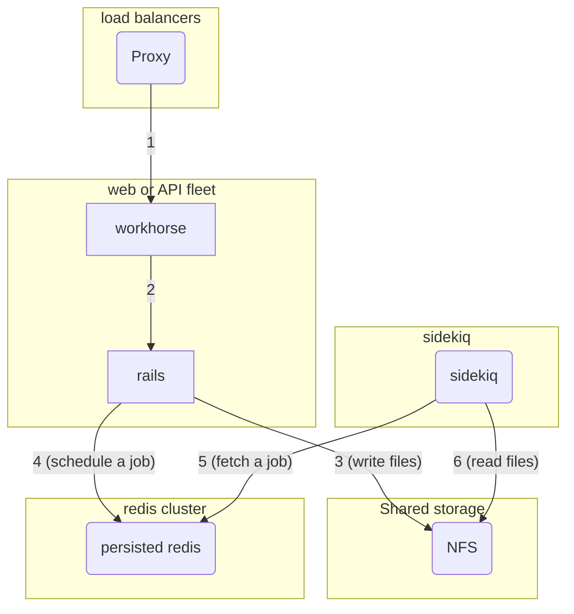
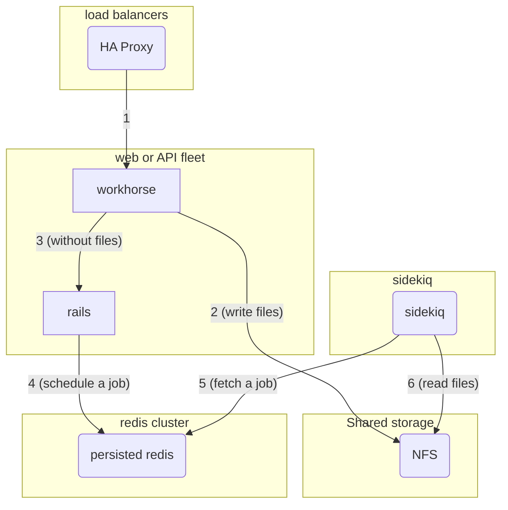
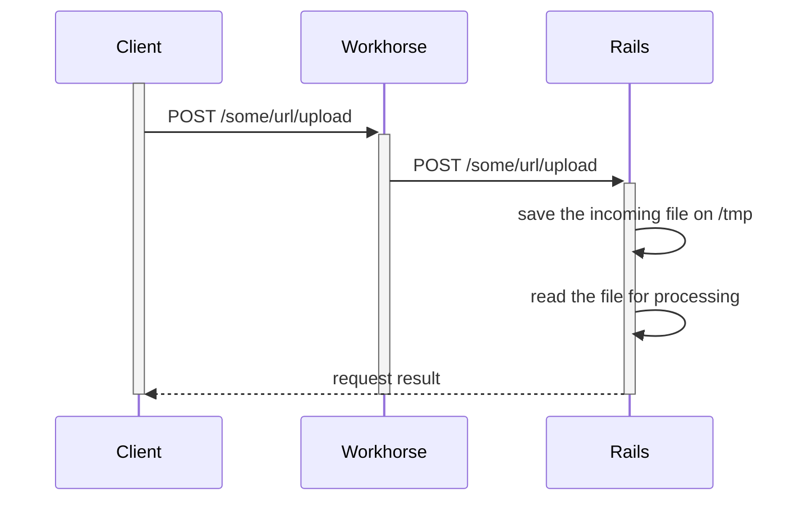
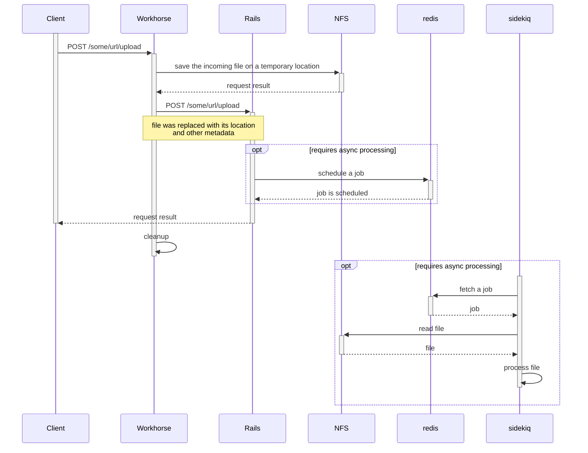
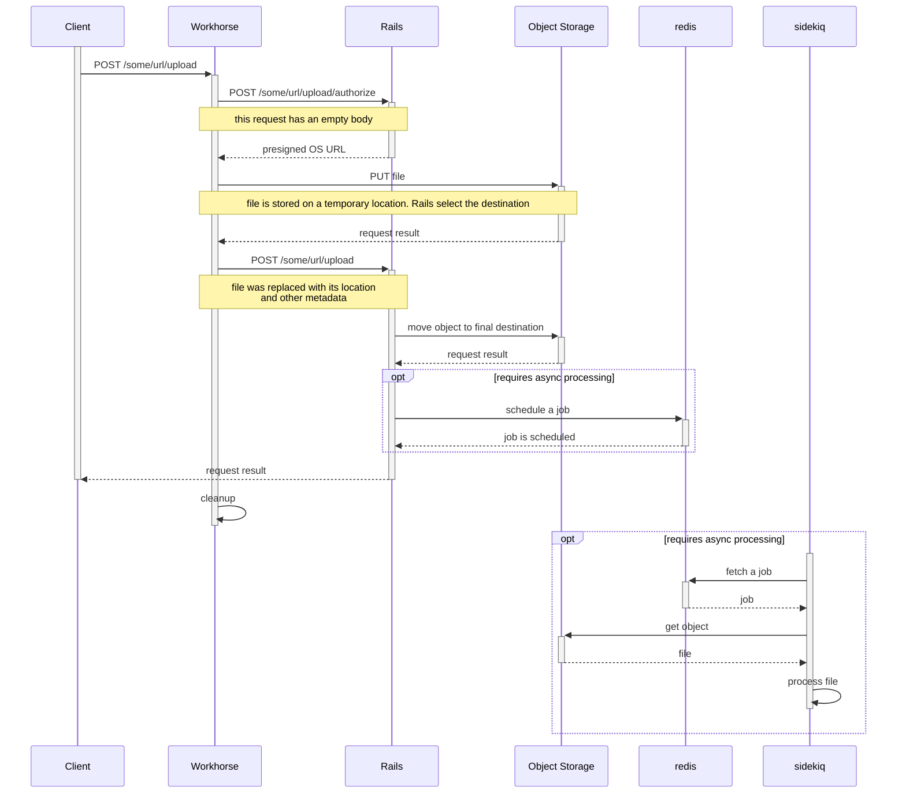

# Uploads development documentation

[GitLab Workhorse](https://gitlab.com/gitlab-org/gitlab-workhorse) has special rules for handling uploads.
To prevent occupying a Ruby process on I/O operations, we process the upload in workhorse, where is cheaper.
This process can also directly upload to object storage.

## The problem description

The following graph explains machine boundaries in a scalable GitLab installation. Without any workhorse optimization in place, we can expect incoming requests to follow the numbers on the arrows.

We have three challenges here: performance, availability, and scalability.

### Performance

Rails process are expensive in terms of both CPU and memory. Ruby [global interpreter lock](https://en.wikipedia.org/wiki/Global_interpreter_lock) adds to cost too because the Ruby process spends time on I/O operations on step 3 causing incoming requests to pile up.

In order to improve this, [disk buffered upload](#disk-buffered-upload) was implemented. With this, Rails no longer deals with writing uploaded files to disk.

### Availability

There's also an availability problem in this setup, NFS is a [single point of failure](https://en.wikipedia.org/wiki/Single_point_of_failure).

To address this problem an HA object storage can be used and it's supported by [direct upload](#direct-upload)

### Scalability

Scaling NFS is outside of our support scope, and NFS is not a part of cloud native installations.

All features that require Sidekiq and do not use direct upload doesn't work without NFS. In Kubernetes, machine boundaries translate to PODs, and in this case the uploaded file is written into the POD private disk. Since Sidekiq POD cannot reach into other pods, the operation fails to read it.

## How to select the proper level of acceleration?

Selecting the proper acceleration is a tradeoff between speed of development and operational costs.

We can identify three major use-cases for an upload:

1. **storage:** if we are uploading for storing a file (like artifacts, packages, or discussion attachments). In this case [direct upload](#direct-upload) is the proper level as it's the less resource-intensive operation. Additional information can be found on [File Storage in GitLab](file_storage.md).
1. **in-controller/synchronous processing:** if we allow processing **small files** synchronously, using [disk buffered upload](#disk-buffered-upload) may speed up development.
1. **Sidekiq/asynchronous processing:** Asynchronous processing must implement [direct upload](#direct-upload), the reason being that it's the only way to support Cloud Native deployments without a shared NFS.

For more details about currently broken feature see [epic &1802](https://gitlab.com/groups/gitlab-org/-/epics/1802).

### Handling repository uploads

Some features involves Git repository uploads without using a regular Git client.
Some examples are uploading a repository file from the web interface and [design management](../user/project/issues/design_management.md).

Those uploads requires the rails controller to act as a Git client in lieu of the user.
Those operation falls into _in-controller/synchronous processing_ category, but we have no warranties on the file size.

In case of a LFS upload, the file pointer is committed synchronously, but file upload to object storage is performed asynchronously with Sidekiq.

## Upload encodings

By upload encoding we mean how the file is included within the incoming request.

We have three kinds of file encoding in our uploads:

1. <i class="fa fa-check-circle"></i> **multipart**: `multipart/form-data` is the most common, a file is encoded as a part of a multipart encoded request.
1. <i class="fa fa-check-circle"></i> **body**: some APIs uploads files as the whole request body.
1. <i class="fa fa-times-circle"></i> **JSON**: some JSON API uploads files as base64 encoded strings. This requires a change to GitLab Workhorse, which [is planned](https://gitlab.com/gitlab-org/gitlab-workhorse/-/issues/226).

## Uploading technologies

By uploading technologies we mean how all the involved services interact with each other.

GitLab supports 3 kinds of uploading technologies, here follows a brief description with a sequence diagram for each one. Diagrams are not meant to be exhaustive.

### Rack Multipart upload

This is the default kind of upload, and it's most expensive in terms of resources.

In this case, workhorse is unaware of files being uploaded and acts as a regular proxy.

When a multipart request reaches the rails application, `Rack::Multipart` leaves behind temporary files in `/tmp` and uses valuable Ruby process time to copy files around.

### Disk buffered upload

This kind of upload avoids wasting resources caused by handling upload writes to `/tmp` in rails.

This optimization is not active by default on REST API requests.

When enabled, Workhorse looks for files in multipart MIME requests, uploading
any it finds to a temporary file on shared storage. The MIME data in the request
is replaced with the path to the corresponding file before it is forwarded to
Rails.

To prevent abuse of this feature, Workhorse signs the modified request with a
special header, stating which entries it modified. Rails ignores any
unsigned path entries.

### Direct upload

This is the more advanced acceleration technique we have in place.

Workhorse asks rails for temporary pre-signed object storage URLs and directly uploads to object storage.

In this setup, an extra Rails route must be implemented in order to handle authorization. Examples of this can be found in:

- [`Projects::LfsStorageController`](https://gitlab.com/gitlab-org/gitlab/-/blob/cc723071ad337573e0360a879cbf99bc4fb7adb9/app/controllers/projects/lfs_storage_controller.rb)
  and [its routes](https://gitlab.com/gitlab-org/gitlab/-/blob/cc723071ad337573e0360a879cbf99bc4fb7adb9/config/routes/git_http.rb#L31-32).
- [API endpoints for uploading packages](packages.md#file-uploads).

This falls back to _disk buffered upload_ when `direct_upload` is disabled inside the [object storage setting](../administration/uploads.md#object-storage-settings).
The answer to the `/authorize` call contains only a file system path.

## How to add a new upload route

In this section, we describe how to add a new upload route [accelerated](#uploading-technologies) by Workhorse for [body and multipart](#upload-encodings) encoded uploads.

Uploads routes belong to one of these categories:

1. Rails controllers: uploads handled by Rails controllers.
1. Grape API: uploads handled by a Grape API endpoint.
1. GraphQL API: uploads handled by a GraphQL resolve function.

WARNING:
GraphQL uploads do not support [direct upload](#direct-upload) yet. Depending on the use case, the feature may not work on installations without NFS (like GitLab.com or Kubernetes installations). Uploading to object storage inside the GraphQL resolve function may result in timeout errors. For more details please follow [issue #280819](https://gitlab.com/gitlab-org/gitlab/-/issues/280819).

### Update Workhorse for the new route

For both the Rails controller and Grape API uploads, Workhorse has to be updated in order to get the
support for the new upload route.

1. Open an new issue in the [Workhorse tracker](https://gitlab.com/gitlab-org/gitlab-workhorse/-/issues/new) describing precisely the new upload route:
   - The route's URL.
   - The [upload encoding](#upload-encodings).
   - If possible, provide a dump of the upload request.
1. Implement and get the MR merged for this issue above.
1. Ask the Maintainers of [Workhorse](https://gitlab.com/gitlab-org/gitlab-workhorse) to create a new release. You can do that in the MR
   directly during the maintainer review or ask for it in the `#workhorse` Slack channel.
1. Bump the [Workhorse version file](https://gitlab.com/gitlab-org/gitlab/-/blob/master/GITLAB_WORKHORSE_VERSION)
   to the version you have from the previous points, or bump it in the same merge request that contains
   the Rails changes (see [Implementing the new route with a Rails controller](#implementing-the-new-route-with-a-rails-controller) or [Implementing the new route with a Grape API endpoint](#implementing-the-new-route-with-a-grape-api-endpoint) below).

### Implementing the new route with a Rails controller

For a Rails controller upload, we usually have a [multipart](#upload-encodings) upload and there are a
few things to do:

1. The upload is available under the parameter name you're using. For example, it could be an `artifact`
   or a nested parameter such as `user[avatar]`. Let's say that we have the upload under the
   `file` parameter, reading `params[:file]` should get you an [`UploadedFile`](https://gitlab.com/gitlab-org/gitlab/-/blob/master/lib/uploaded_file.rb) instance.
1. Generally speaking, it's a good idea to check if the instance is from the [`UploadedFile`](https://gitlab.com/gitlab-org/gitlab/-/blob/master/lib/uploaded_file.rb) class. For example, see how we checked
[that the parameter is indeed an `UploadedFile`](https://gitlab.com/gitlab-org/gitlab/-/commit/ea30fe8a71bf16ba07f1050ab4820607b5658719#51c0cc7a17b7f12c32bc41cfab3649ff2739b0eb_79_77).

WARNING:
**Do not** call `UploadedFile#from_params` directly! Do not build an [`UploadedFile`](https://gitlab.com/gitlab-org/gitlab/-/blob/master/lib/uploaded_file.rb)
instance using `UploadedFile#from_params`! This method can be unsafe to use depending on the `params`
passed. Instead, use the [`UploadedFile`](https://gitlab.com/gitlab-org/gitlab/-/blob/master/lib/uploaded_file.rb)
instance that [`multipart.rb`](https://gitlab.com/gitlab-org/gitlab/-/blob/master/lib/gitlab/middleware/multipart.rb)
builds automatically for you.

### Implementing the new route with a Grape API endpoint

For a Grape API upload, we can have [body or a multipart](#upload-encodings) upload. Things are slightly more complicated: two endpoints are needed. One for the
Workhorse pre-upload authorization and one for accepting the upload metadata from Workhorse:

1. Implement an endpoint with the URL + `/authorize` suffix that will:
   - Check that the request is coming from Workhorse with the `require_gitlab_workhorse!` from the [API helpers](https://gitlab.com/gitlab-org/gitlab/-/blob/master/lib/api/helpers.rb).
   - Check user permissions.
   - Set the status to `200` with `status 200`.
   - Set the content type with `content_type Gitlab::Workhorse::INTERNAL_API_CONTENT_TYPE`.
   - Use your dedicated `Uploader` class (let's say that it's `FileUploader`) to build the response with `FileUploader.workhorse_authorize(params)`.
1. Implement the endpoint for the upload request that will:
   - Require all the `UploadedFile` objects as parameters.
      - For example, if we expect a single parameter `file` to be an [`UploadedFile`](https://gitlab.com/gitlab-org/gitlab/-/blob/master/lib/uploaded_file.rb) instance,
use `requires :file, type: ::API::Validations::Types::WorkhorseFile`.
      - Body upload requests have their upload available under the parameter `file`.
   - Check that the request is coming from Workhorse with the `require_gitlab_workhorse!` from the
[API helpers](https://gitlab.com/gitlab-org/gitlab/-/blob/master/lib/api/helpers.rb).
   - Check the user permissions.
   - The remaining code of the processing. This is where the code must be reading the parameter (for
our example, it would be `params[:file]`).

WARNING:
**Do not** call `UploadedFile#from_params` directly! Do not build an [`UploadedFile`](https://gitlab.com/gitlab-org/gitlab/-/blob/master/lib/uploaded_file.rb)
object using `UploadedFile#from_params`! This method can be unsafe to use depending on the `params`
passed. Instead, use the [`UploadedFile`](https://gitlab.com/gitlab-org/gitlab/-/blob/master/lib/uploaded_file.rb)
object that [`multipart.rb`](https://gitlab.com/gitlab-org/gitlab/-/blob/master/lib/gitlab/middleware/multipart.rb)
builds automatically for you.
