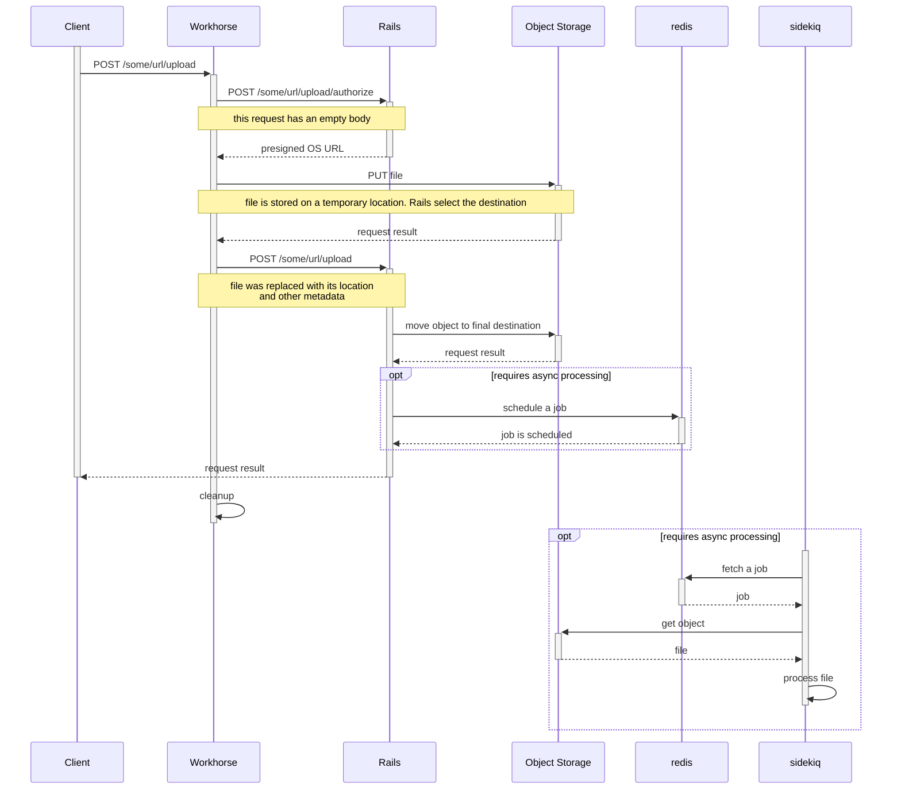

Uploads are an integral part of many GitLab features. To understand how GitLab handles uploads, this page
provides an overview of the key mechanisms for transferring files to a storage destination.

GitLab uploads are configured by feature. All features that involve uploads provide the same configuration options,
but they can be configured independently of one another. For example, Git LFS uploads can be configured
independently of CI/CD build artifact uploads, but they both offer the same set of settings keys. These settings
govern how an upload is processed, which can have a dramatic impact on performance and scalability.

This page summarizes the upload settings that are important in deciding how such files are handled. The sections
that follow then describe each of these mechanisms in more detail.

## How upload settings drive upload flow

Before we examine individual upload strategies in more detail, let's examine a high-level
breakdown of which upload settings map to each of these strategies.

Upload settings themselves are documented in [Uploads administration](../../administration/uploads.md).
Here, we focus on how these settings drive the internals of GitLab upload logic.
At the top level, we distinguish between two **destinations** for uploaded files:

- [**Local storage**](#local-storage) - Files are stored on a volume attached to the web server node.
- [**Object storage**](#object-storage) - Files are stored in a remote object store bucket.

In this table, `x.y.z` specifies the path taken through `gitlab.yml`:

| Setting                                | Value   | Behavior                        |
| -------------------------------------- | ------- | ------------------------------- |
| `<feature>.object_store.enabled`       | `false` | Files are stored locally in `<feature>.storage_path` |
| `<feature>.object_store.enabled`       | `true`  | Files are stored remotely in `<feature>.object_store.remote_directory` |

When using object storage, administrators can control how those files are moved into the respective bucket.
This move can happen in one of these ways:

- [Rails controller upload](#rails-controller-upload).
- [Direct upload](#direct-upload).

Individual Sidekiq workers might also store files in object storage, which is not something we cover here.

Finally, Workhorse assists most user-initiated uploads using an upload buffering mechanism to keep slow work out of Rails controllers.
This mechanism is explained in [Workhorse assisted uploads](#workhorse-assisted-uploads),
as it runs orthogonal to much of what we discuss beforehand.

We now look at each case in more detail.

## Local storage

Local storage is the simplest path an upload can take. It was how GitLab treated uploads in its early days.
It assumes a storage volume (like a disk or network attached storage) is accessible
to the Rails application at `storage_path`. This file path is relative to the Rails root directory and,
like any upload setting, configurable per feature.

When a client sends a file upload, Workhorse first buffers the file to disk, a mechanism explained in more
detail in [Workhorse assisted uploads](#workhorse-assisted-uploads). When the request reaches the Rails
application, the file already exists on local storage, so Rails merely has to move it to the specified
directory to finalize the transaction.

Local storage cannot be used with cloud-native GitLab (CNG) installations. It is therefore not used for
GitLab SaaS either.

## Object storage

To provide horizontally scalable storage, you must use an object store provider such as:

- Amazon AWS.
- Google Cloud Storage (GCS).
- Azure Cloud Storage.

Using object storage provides two main benefits:

- Ease of adding more storage capacity: cloud providers do this for you automatically.
- Enabling horizontal scaling of your GitLab installation: multiple GitLab application servers can access the same data
  when it is stored in object storage.

CNG installations including GitLab SaaS always use object storage (GCS in the case of GitLab SaaS.)

A challenge with uploading to a remote object store is that it includes an outgoing HTTP request from
GitLab to the object store provider. As mentioned above, there are three different strategies available for how
this HTTP request is sent.

- [Rails controller upload](#rails-controller-upload).
- [Direct upload](#direct-upload).
- [Workhorse assisted uploads](#workhorse-assisted-uploads).

### Rails controller upload

When direct upload is not available, Rails uploads the file to object storage
as part of the controller `create` action. Which controller is responsible depends on the kind of file uploaded.

A Rails controller upload is very similar to uploading to local storage. The main difference: Rails must
send an HTTP request to the object store. This happens via the [CarrierWave Fog](https://github.com/carrierwaveuploader/carrierwave#fog)
uploader.

As with local storage, this strategy benefits from [Workhorse assistance](#workhorse-assisted-uploads) to
keep some of the costly I/O work out of Ruby and Rails. Direct upload does a better job at this because it also keeps the HTTP PUT requests to object storage outside Puma.

This strategy is only suitable for small file uploads, as it is subject to Puma's 60 second request timeout.

### Direct upload

Direct upload is the recommended way to move large files into object storage in CNG installations like GitLab SaaS.

With direct upload enabled, Workhorse:

1. Authorizes the request with Rails.
1. Establishes a connection with the object store itself to transfer the file to a temporary location.
1. When the transfer is complete, Workhorse finalizes the request with Rails.
1. Completes the upload by deleting the temporary file in object storage.

This strategy is a different form of [Workhorse assistance](#workhorse-assisted-uploads). It does not rely on shared storage that is accessible by both Workhorse and Puma.

Of all existing upload strategies, direct upload is best able to handle large (gigabyte) uploads.

### Disk buffered uploads

Direct upload falls back to _disk buffered upload_ when `direct_upload` is disabled inside the [object storage setting](../../administration/uploads.md#object-storage-settings). The answer to the `/authorize` call contains only a file system path.

## Workhorse assisted uploads

Most uploads receive assistance from Workhorse in some way.

- Often, Workhorse buffers the upload to a temporary file. Workhorse adds metadata to the request to tell
  Puma the name and location of the temporary file. This requires shared temporary storage between Workhorse and Puma.
  All GitLab installations (including CNG) have this shared temporary storage.
- Workhorse sometimes pre-processes the file. For example, for CI artifact uploads, Workhorse creates a separate index
  of the contents of the ZIP file. By doing this in Workhorse we bypass the Puma request timeout.
  Compared to Sidekiq background processing, this has the advantage that the user does not see an intermediate state
  where GitLab accepts the file but has not yet processed it.
- With direct upload, Workhorse can both pre-process the file and upload it to object storage.
  Uploading a large file to object storage takes time; by doing this in Workhorse we avoid the Puma request timeout.

For additional information about uploads, see [Workhorse handlers](../workhorse/handlers.md).
