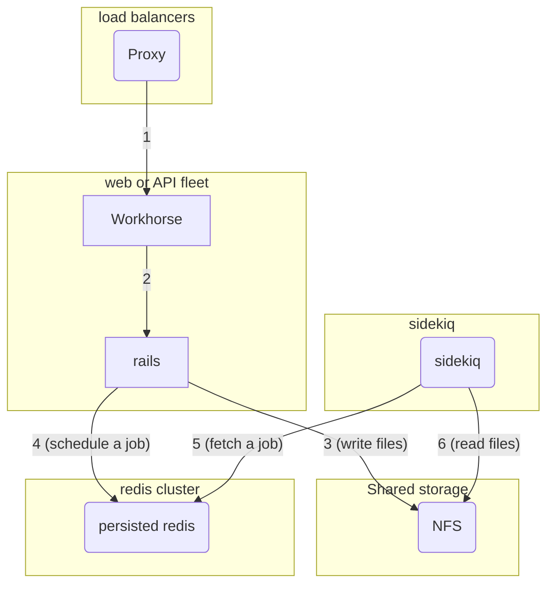
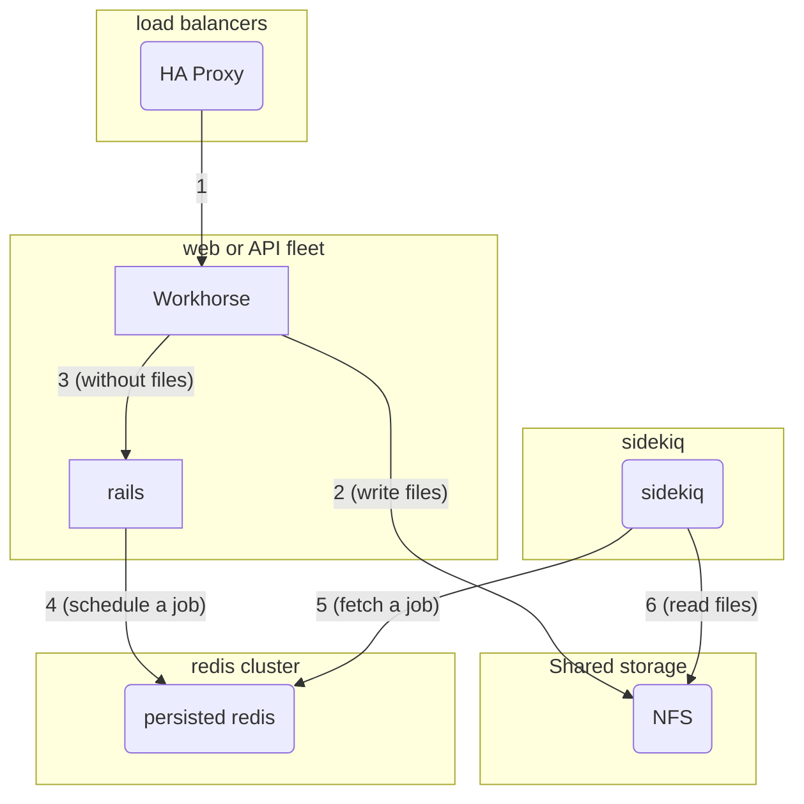

# Uploads guide: Why GitLab uses custom upload logic

This page is for developers trying to better understand the history behind GitLab uploads and the
technical challenges associated with uploads.

## The problem description

[GitLab Workhorse](https://gitlab.com/gitlab-org/gitlab-workhorse) has special rules for handling uploads.
We process the upload in Workhorse to prevent occupying a Ruby process on I/O operations and because it is cheaper.
This process can also directly upload to object storage.

The following graph explains machine boundaries in a scalable GitLab installation. Without any Workhorse optimization in place, we can expect incoming requests to follow the numbers on the arrows.

We have three challenges here: performance, availability, and scalability.

### Performance

Rails process are expensive in terms of both CPU and memory. Ruby [global interpreter lock](https://en.wikipedia.org/wiki/Global_interpreter_lock) adds to cost too because the Ruby process spends time on I/O operations on step 3 causing incoming requests to pile up.

In order to improve this, [disk buffered upload](implementation.md#disk-buffered-upload) was implemented. With this, Rails no longer deals with writing uploaded files to disk.

### Availability

There's also an availability problem in this setup, NFS is a [single point of failure](https://en.wikipedia.org/wiki/Single_point_of_failure).

To address this problem an HA object storage can be used and it's supported by [direct upload](implementation.md#direct-upload)

### Scalability

Scaling NFS is outside of our support scope, and NFS is not a part of cloud native installations.

All features that require Sidekiq and do not use direct upload doesn't work without NFS. In Kubernetes, machine boundaries translate to PODs, and in this case the uploaded file is written into the POD private disk. Since Sidekiq POD cannot reach into other pods, the operation fails to read it.
