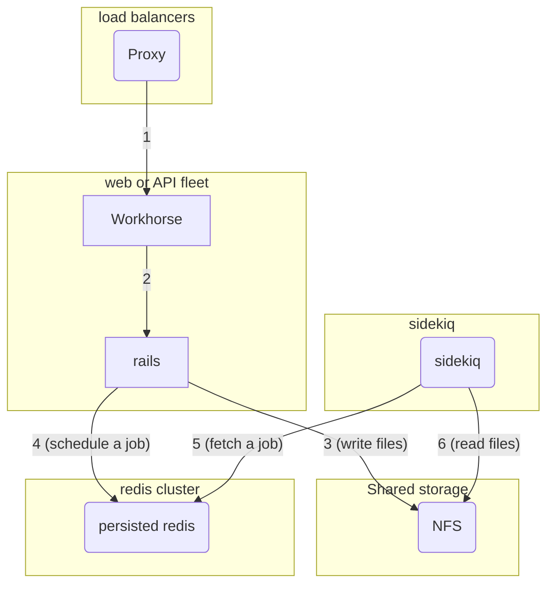
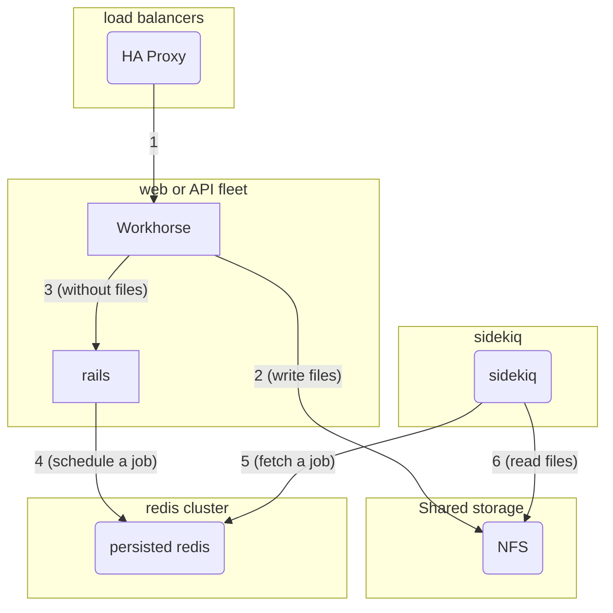

# Uploads guide: Why GitLab uses custom upload logic

This page is for developers trying to better understand the history behind GitLab uploads and the
technical challenges associated with uploads.

## Problem description

GitLab and [GitLab Workhorse](https://gitlab.com/gitlab-org/gitlab-workhorse) use special rules for handling file uploads,
because in an ordinary Rails application file uploads can become expensive as files grow in size.
Rails often sacrifices performance to provide a better developer experience, including how it handles
`multipart/form-post` uploads. In any Rack server, Rails applications included, when such a request arrives at the application server,
several things happen:

1. A [Rack middleware](https://github.com/rack/rack/blob/main/lib/rack/multipart.rb) intercepts the request and parses the request body.
1. The middleware writes each file in the multipart request to a temporary directory on disk.
1. A `params` hash is constructed with entries pointing to the respective files on disk.
1. A Rails controller acts on the file contents.

While this is convenient for developers, it is costly for the Ruby server process to buffer large files on disk.
Because of Ruby's [global interpreter lock](https://en.wikipedia.org/wiki/Global_interpreter_lock),
only a single thread of execution of a given Ruby process can be on CPU. This means the amount of CPU
time spent doing this is not available to other worker threads serving user requests.
Buffering files to disk also means spending more time in I/O routines and mode switches, which are expensive operations.

The following diagram shows how GitLab handled such a request prior to putting optimizations in place.

We went through two major iterations of our uploads architecture to improve on these problems:

1. [Moving disk buffering to Workhorse.](#moving-disk-buffering-to-workhorse)
1. [Uploading to Object Storage from Workhorse.](#moving-to-object-storage-and-direct-uploads)

### Moving disk buffering to Workhorse

To address the performance issues resulting from buffering files in Ruby, we moved this logic to Workhorse instead,
our reverse proxy fronting the GitLab Rails application.
Workhorse is written in Go, and is much better at dealing with stream processing and I/O than Rails.

There are two parts to this implementation:

1. In Workhorse, a request handler detects `multipart/form-data` content in an incoming user request.
   If such a request is detected, Workhorse hijacks the request body before forwarding it to Rails.
   Workhorse writes all files to disk, rewrites the multipart form fields to point to the new locations, signs the
   request, then forwards it to Rails.
1. In Rails, a [custom multipart Rack middleware](https://gitlab.com/gitlab-org/gitlab/-/blob/master/lib/gitlab/middleware/multipart.rb)
   identifies any signed multipart requests coming from Workhorse and prepares the `params` hash Rails
   would expect, now pointing to the files cached by Workhorse. This makes it a drop-in replacement for `Rack::Multipart`.

The diagram below shows how GitLab handles such a request today:

While this "one-size-fits-all" solution greatly improves performance for multipart uploads without compromising
developer ergonomics, it severely limits GitLab [availability](#availability-challenges)
and [scalability](#scalability-challenges).

#### Availability challenges

Moving file buffering to Workhorse addresses the immediate performance problems stemming from Ruby not being good at
handling large file uploads. However, a remaining issue of this solution is its reliance on attached storage,
whether via ordinary hard drives or network attached storage like NFS.
NFS is a [single point of failure](https://en.wikipedia.org/wiki/Single_point_of_failure), and is unsuitable for
deploying GitLab in highly available, cloud native environments.

#### Scalability challenges

NFS is not a part of cloud native installations, such as those running in Kubernetes.
In Kubernetes, machine boundaries translate to pods, and without network-attached storage, disk-buffered uploads
must be written directly to the pod's file system.

Using disk buffering presents us with a scalability challenge here. If Workhorse can only
write files to a pod's private file system, then these files are inaccessible outside of this particular pod.
With disk buffering, a Rails controller will accept a file upload and enqueue it for upload in a Sidekiq
background job. Therefore, Sidekiq requires access to these files.
However, in a cloud native environment all Sidekiq instances run on separate pods, so they are
not able to access files buffered to disk on a web server pod.

Therefore, all features that involve Sidekiq uploading disk-buffered files severely limit the scalability of GitLab.

## Moving to object storage and direct uploads

To address these availability and scalability problems,
instead of buffering files to disk, we have added support for uploading files directly
from Workhorse to a given destination. While it remains possible to upload to local or network-attached storage
this way, you should use a highly available
[object store](https://en.wikipedia.org/wiki/Object_storage),
such as AWS S3, Google GCS, or Azure, for scalability reasons.

With direct uploads, Workhorse does not buffer files to disk. Instead, it first authorizes the request with
the Rails application to find out where to upload it, then streams the file directly to its ultimate destination.

To learn more about how disk buffering and direct uploads are implemented, see:

- [How uploads work technically](implementation.md)
- [Adding new uploads](working_with_uploads.md)
