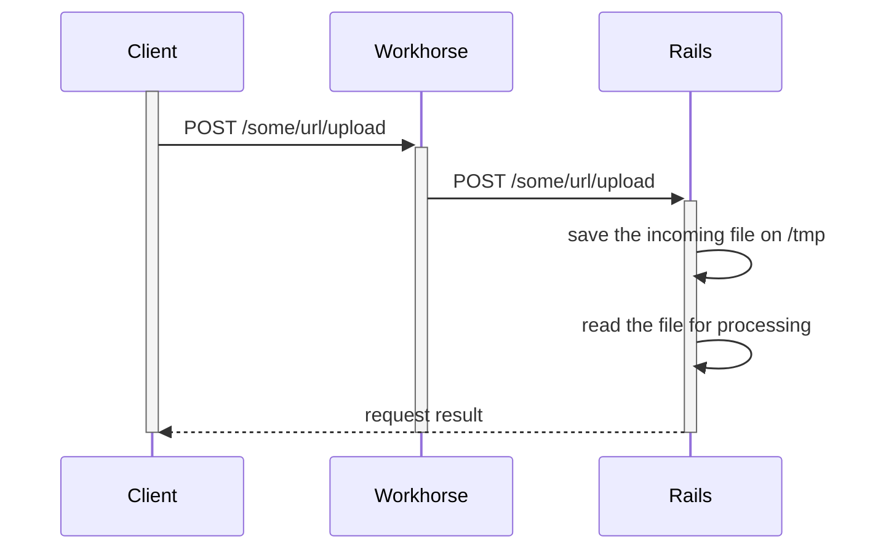
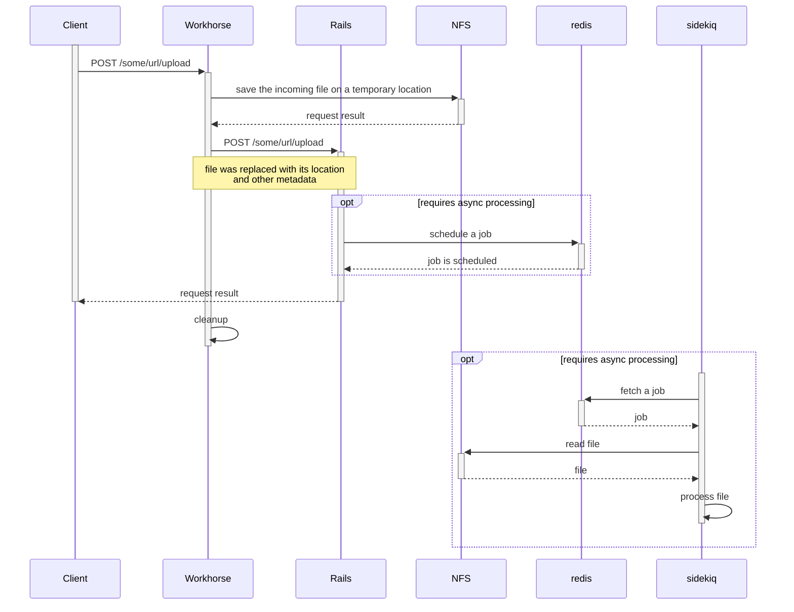
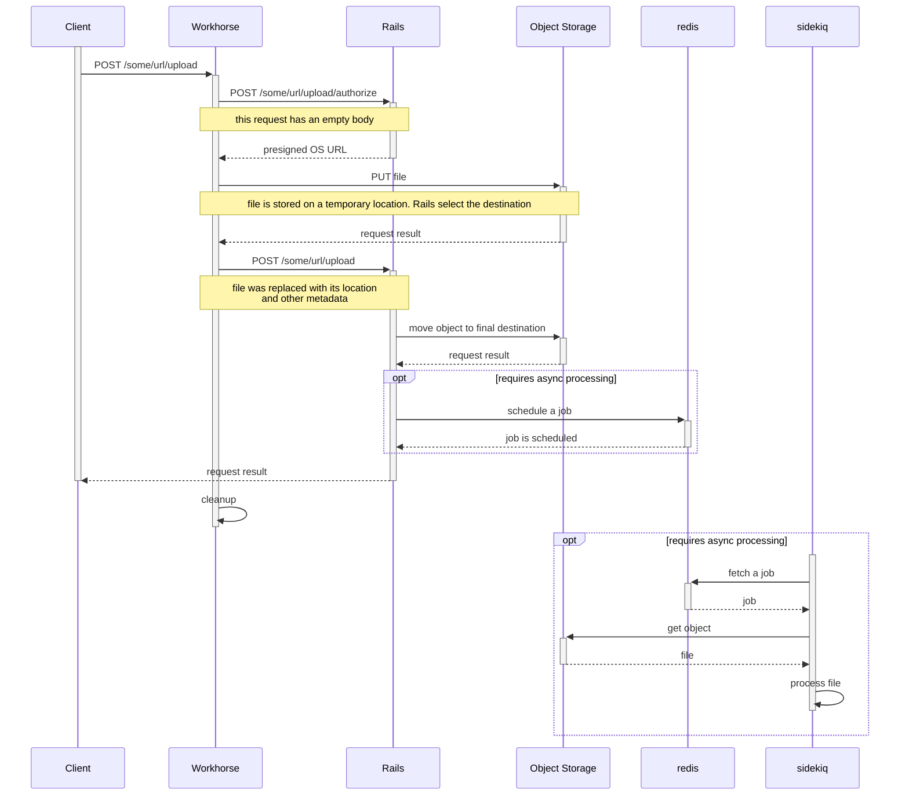

# Uploads guide: How uploads work technically

This page is for developers trying to better understand what kinds of uploads exist in GitLab and how they are implemented.

## Kinds of uploads and how to choose between them

We can identify three major use-cases for an upload:

1. **storage:** if we are uploading for storing a file (like artifacts, packages, or discussion attachments). In this case [direct upload](#direct-upload) is the proper level as it's the less resource-intensive operation. Additional information can be found on [File Storage in GitLab](../file_storage.md).
1. **in-controller/synchronous processing:** if we allow processing **small files** synchronously, using [disk buffered upload](#disk-buffered-upload) may speed up development.
1. **Sidekiq/asynchronous processing:** Asynchronous processing must implement [direct upload](#direct-upload), the reason being that it's the only way to support Cloud Native deployments without a shared NFS.

Selecting the proper acceleration is a tradeoff between speed of development and operational costs.

For more details about currently broken feature see [epic &1802](https://gitlab.com/groups/gitlab-org/-/epics/1802).

### Handling repository uploads

Some features involves Git repository uploads without using a regular Git client.
Some examples are uploading a repository file from the web interface and [design management](../../user/project/issues/design_management.md).

Those uploads requires the rails controller to act as a Git client in lieu of the user.
Those operation falls into _in-controller/synchronous processing_ category, but we have no warranties on the file size.

In case of a LFS upload, the file pointer is committed synchronously, but file upload to object storage is performed asynchronously with Sidekiq.

## Upload encodings

By upload encoding we mean how the file is included within the incoming request.

We have three kinds of file encoding in our uploads:

1. <i class="fa fa-check-circle"></i> **multipart**: `multipart/form-data` is the most common, a file is encoded as a part of a multipart encoded request.
1. <i class="fa fa-check-circle"></i> **body**: some APIs uploads files as the whole request body.
1. <i class="fa fa-times-circle"></i> **JSON**: some JSON APIs upload files as base64-encoded strings. This requires a change to GitLab Workhorse,
   which is tracked [in this issue](https://gitlab.com/gitlab-org/gitlab/-/issues/325068).

## Uploading technologies

By uploading technologies we mean how all the involved services interact with each other.

GitLab supports 3 kinds of uploading technologies, here follows a brief description with a sequence diagram for each one. Diagrams are not meant to be exhaustive.

### Rack Multipart upload

This is the default kind of upload, and it's the most expensive in terms of resources.

In this case, Workhorse is unaware of files being uploaded and acts as a regular proxy.

When a multipart request reaches the rails application, `Rack::Multipart` leaves behind temporary files in `/tmp` and uses valuable Ruby process time to copy files around.

### Disk buffered upload

This kind of upload avoids wasting resources caused by handling upload writes to `/tmp` in rails.

This optimization is not active by default on REST API requests.

When enabled, Workhorse looks for files in multipart MIME requests, uploading
any it finds to a temporary file on shared storage. The MIME data in the request
is replaced with the path to the corresponding file before it is forwarded to
Rails.

To prevent abuse of this feature, Workhorse signs the modified request with a
special header, stating which entries it modified. Rails ignores any
unsigned path entries.

### Direct upload

This is the more advanced acceleration technique we have in place.

Workhorse asks Rails for temporary pre-signed object storage URLs and directly uploads to object storage.

In this setup, an extra Rails route must be implemented in order to handle authorization. Examples of this can be found in:

- [`Projects::LfsStorageController`](https://gitlab.com/gitlab-org/gitlab/-/blob/cc723071ad337573e0360a879cbf99bc4fb7adb9/app/controllers/projects/lfs_storage_controller.rb)
  and [its routes](https://gitlab.com/gitlab-org/gitlab/-/blob/cc723071ad337573e0360a879cbf99bc4fb7adb9/config/routes/git_http.rb#L31-32).
- [API endpoints for uploading packages](../packages.md#file-uploads).

Direct upload falls back to _disk buffered upload_ when `direct_upload` is disabled inside the [object storage setting](../../administration/uploads.md#object-storage-settings).
The answer to the `/authorize` call contains only a file system path.

