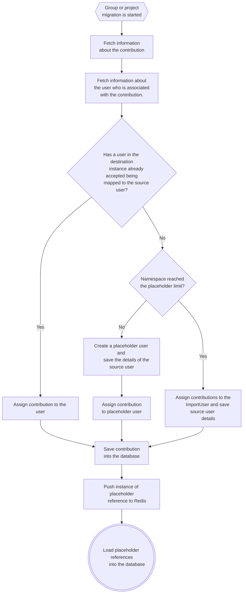
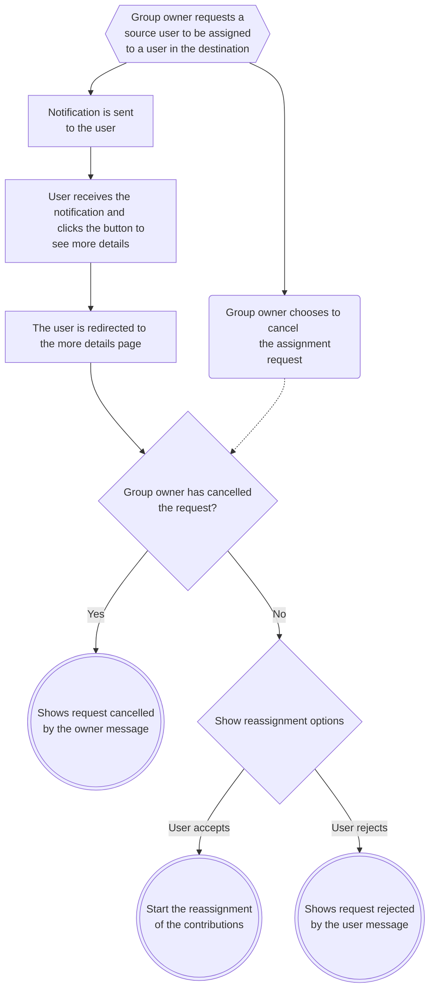
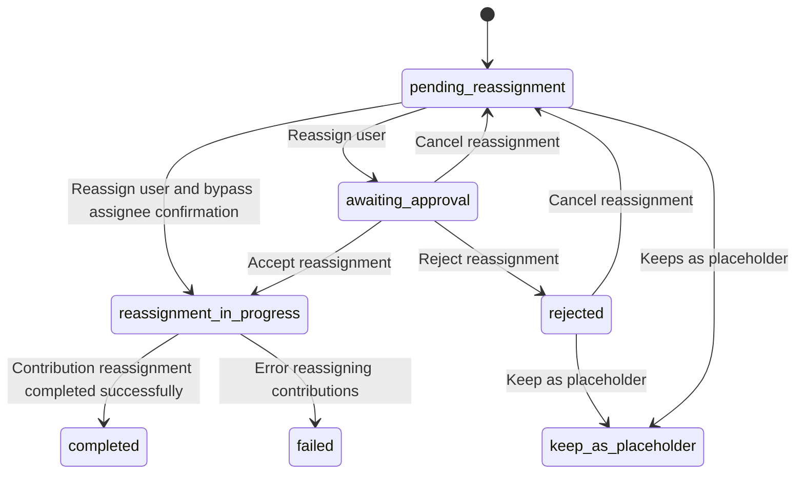
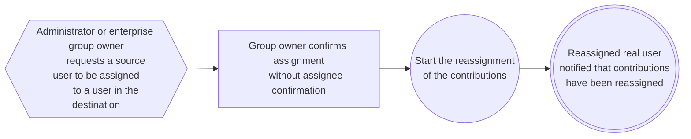

User contribution mapping is a feature that allows imported records to be attributed to a user without needing the user on the source to have been provisioned with a public email in advance. Instead, dummy User records are created to act as a placeholder in imported records until a real user can be assigned to those contributions after the import has completed.

User contribution mapping is implemented within each importer to assign contributions to placeholder users during a migration, but the same process applies across all importers that use this mapping. The process of a group owner reassigning a real user to a placeholder user takes place after the migration has completed and is separate from the migration.

## Glossary of terms and relevant models

| Term                     | Corresponding `ActiveRecord` Model       | Definition                                                                                                                                                                                                  |
| ------------------------ | ---------------------------------------- | ----------------------------------------------------------------------------------------------------------------------------------------------------------------------------------------------------------- |
| Source user              | `Import::SourceUser`                     | Maps placeholder users to real users and tracks reassignment details, import source, and top-level group association.                                                                                        |
| Placeholder user         | `User` with `user_type: 'placeholder'`   | A `User` record that satisfies foreign key constraints during migration intended to be reassigned to a real user after import. Placeholder users cannot log in and have no rights in GitLab.                |
| Assignee user, real user | `User` with `user_type: 'human'`         | The human user assigned to a placeholder user.                                                                                                                                                              |
| User contribution        | Any GitLab ActiveRecord model            | Any ActiveRecord model imported during a migration that belongs to a `User`. E.g. merge request assignees, notes, memberships, etc.                                                                         |
| Placeholder reference    | `Import::SourceUserPlaceholderReference` | A separate model to track all placeholder user contributions across the database **except** memberships.                                                                                                    |
| Placeholder membership   | `Import::Placeholders::Membership`       | A separate model to track imported memberships belonging to placeholder users. `Member` records are not created for placeholder users during a migration to prevent placeholders from appearing as members. |
| Import user              | `Import::NamespaceImportUser`            | A placeholder user used when records can't be assigned to a regular placeholder. E.g. when the [placeholder user limit](../user/project/import/_index.md#placeholder-user-limits) has been reached.                                                                     |
| Placeholder detail       | `Import::PlaceholderUserDetail`          | A record that tracks which namespaces have placeholder users so that placeholder users can be deleted when their top-level group is deleted.                                                                |
| Placeholder users table  | N/A                                      | Table of placeholder users where group owners can pick real users to assign to placeholder users on the UI. Located on the top-level group's members page under the placeholders tab. Only visible to group owners. |

## Placeholder user creation during import

Before a placeholder user can be reassigned to a real user, a placeholder user must be created during an import.

### User mapping assignment flow for imported contributions



### How to implement user mapping in an importer

1. Implement a feature flag for user mapping within the importer.

1. Ensure that the feature flag state is stored at the beginning of the importer so that changing the flag state during an import does not affect the ongoing import.

   - Third-party importers accomplish this by setting `project.import_data[:data][:user_contribution_mapping_enabled]` at the start of the import. See [`Gitlab::GithubImport::Settings`](https://gitlab.com/gitlab-org/gitlab/-/blob/5849575ce96582fb00ee9ad7cc58034c08006a22/lib/gitlab/github_import/settings.rb#L57) or [`Gitlab::BitbucketServerImport::ProjectCreator`](https://gitlab.com/gitlab-org/gitlab/-/blob/5849575ce96582fb00ee9ad7cc58034c08006a22/lib/gitlab/bitbucket_server_import/project_creator.rb#L45) as examples.
   - direct transfer uses `EphemeralData` in [`BulkImports::CreateService`](https://gitlab.com/gitlab-org/gitlab/-/blob/5849575ce96582fb00ee9ad7cc58034c08006a22/app/services/bulk_imports/create_service.rb#L59) to cache the feature flag states.

1. Before saving a user contribution to the database, use `Gitlab::Import::SourceUserMapper#find_or_create_source_user` to find the correct `User` to attribute the contribution to.

1. Save the contribution with the mapped user to the database.

1. Once the record is persisted, initialize `Import::PlaceholderReferences::PushService` and execute it to push an initialized `Import::SourceUserPlaceholderReference` to Redis. Initializing the service using `from_record` is often most convenient.

1. Persist the cached `Import::SourceUserPlaceholderReference`s asynchronously using the `LoadPlaceholderReferencesWorker`. This worker uses `Import::PlaceholderReferences::LoadService` to persist the placeholder references. It's best to periodically call this worker throughout the import, e.g., at the end of a stage, as well as at the end of the import.

   - **Important:** Placeholder user references are cached before loading to avoid too many concurrent writes on the `import_source_user_placeholder_references` table. If a database record references a placeholder user's ID but a placeholder reference is not persisted for some reason, the contribution **cannot be reassigned and the placeholder user may not be deleted**.

1. Delay finishing the import until all cached placeholder references have been loaded.

   - Parallel third-party importers accomplish this by re-enqueueing the `FinishImportWorker` if any placeholder references are remaining in Redis for the project. See [`Gitlab::GithubImport::Stage::FinishImportWorker`](https://gitlab.com/gitlab-org/gitlab/-/blob/2a8ba6c8cb1d41c5334a8be2d0b9b0b98aa01839/app/workers/gitlab/github_import/stage/finish_import_worker.rb#L17) as an example.
   - Synchronous third-party importers must wait for placeholder references to finish loading in some other manner. The Gitea importer, for example, [uses `Kernel.sleep`](https://gitlab.com/gitlab-org/gitlab/-/blob/2a8ba6c8cb1d41c5334a8be2d0b9b0b98aa01839/lib/gitlab/legacy_github_import/importer.rb#L355-378) to delay the import until placeholder user references have been loaded.
   - Direct Transfer functions similar to parallel importers using [`BulkImport::ProcessService` to re-enqueue `BulkImportWorker`](https://gitlab.com/gitlab-org/gitlab/-/blob/master/app/services/bulk_imports/process_service.rb#L18), delaying a migration from finishing if placeholder users have not finished loading.

## Placeholder user reassignment after import

Placeholder user reassignment takes place after an import has completed. The reassignment process is the same for all placeholder users, regardless of the import type that created the placeholder.

### Reassignment flow



Each step of the reassignment flow corresponds to a source user state:



Instead of calling a `state_machines-activerecord` method directly on a source user, services have been implemented for each state transition to consistently handle validations and behavior:

- `Import::SourceUsers::ReassignService`: Initiates reassignment to a real user. It may begin user contribution reassignment if placeholder confirmation bypass is enabled.
- `Import::SourceUsers::AcceptReassignmentService`: Processes user acceptance of reassignment and begins user contribution reassignment.
- `Import::SourceUsers::RejectReassignmentService`: Processes user rejection of reassignment.
- `Import::SourceUsers::CancelReassignmentService`: Cancels pending reassignment requests before a user has accepted it or after they have rejected it.
- `Import::SourceUsers::KeepAsPlaceholderService`: Marks a single user to remain as placeholder

Some additional services exist to handle bulk requests and other related behaviors:

- `Import::SourceUsers::GenerateCsvService`: Generates a CSV file to reassign placeholder users in bulk.
- `Import::SourceUsers::BulkReassignFromCsvService`: Handles bulk reassignments from CSV files, ultimately calling `Import::SourceUsers::ReassignService` for each placeholder user in the CSV.
- `Import::SourceUsers::KeepAllAsPlaceholderService`: Marks all unassigned placeholder users to stay as placeholder users indefinitely.
- `Import::SourceUsers::ResendNotificationService`: Resends reassignment notification email to the reassigned user.

### Reassignment flow with placeholder user bypass enabled

When placeholder confirmation bypass is enabled, user contribution reassignment begins immediately on reassignment without the real user's confirmation.



Bypassing an assignee's confirmation can only be done in the following situations:

- An administrator reassigns a placeholder user on a self-managed instance with the application setting `allow_bypass_placeholder_confirmation` enabled. The `Import::UserMapping::AdminBypassAuthorizer` module determines if all criteria are met.
- An enterprise group owner with GitLab Premium or Ultimate reassigns a placeholder user to a real user within their enterprise on `.com` with the group setting `allow_enterprise_bypass_placeholder_confirmation` enabled. The `Import::UserMappingEnterpriseBypassAuthorizer` module determines if all criteria are met.

### User contribution reassignment

When a real user accepts their reassignment, the process of replacing all foreign key references to the placeholder user's ID with the reassigned user's ID begins:

1. `Import::SourceUsers::AcceptReassignmentService` asynchronously calls `Import::ReassignPlaceholderUserRecordsWorker`.

1. The worker executes `Import::ReassignPlaceholderUserRecordsService` to replace records with foreign key references to the placeholder user ID with the reassignee's user ID by querying for placeholder references and placeholder memberships belonging to the source user.

1. The service deletes placeholder references and placeholder memberships after successful reassignment.

1. The service sets the source user's state to `complete`.

   - **Note:** there are valid scenarios where a placeholder reference may not be able to be reassigned. For example, if a user is added as a reviewer to a merge request with a placeholder user reviewer, then the user accepts reassignments to the placeholder who was already a reviewer. This will raise an `ActiveRecord::RecordNotUnique` error during contribution reassignment, but it's a valid scenario.
   - **Note:** there is a possibility that the reassignment may fail due to unhandled errors. We need to investigate the issue since the reassignment is supposed to always succeed.

1. Once the service finishes, the worker calls `Import::DeletePlaceholderUserWorker` asynchronously to delete the placeholder user. If the placeholder user ID is still referenced in any imported table, it will not be deleted. Check `columns_ignored_on_deletion` in the [AliasResolver](https://gitlab.com/gitlab-org/gitlab/-/blob/master/lib/import/placeholder_references/alias_resolver.rb#L5) for exceptions. 

1. If the placeholder user was reassigned without confirmation from the reassigned user, an email is sent to the reassigned user notifying them that they have been reassigned.

## Placeholder reference aliasing

Saving model names and column names to the `import_source_user_placeholder_references` table is brittle. Actual model and column names can change and there's nothing to update the placeholder records that are currently storing the old names. Instead of treating a placeholder references' `model`, `numeric_key` and `composite_key` as real names, they should be treated as aliases. The `Import::PlaceholderReferences::AliasResolver` is used to map values stored in these attributes to real model and column names.

### When does `Import::PlaceholderReferences::AliasResolver` need to be updated?

If you were directed here because of a `MissingAlias` error, `Import::PlaceholderReferences::AliasResolver` must be updated with the missing alias.

If you're making this change preemptively, `Import::PlaceholderReferences::AliasResolver` only needs to be updated if

- The model you're working with is imported by at least one importer that implements user contribution mapping.
- The column on your model references a `User` ID. I.e. the column is a foreign key constraint that references `users(id)` or the column establishes an association between the model and `User`.

### How to update the `Import::PlaceholderReferences::AliasResolver` on a schema change

There are several scenarios where the `Import::PlaceholderReferences::AliasResolver` must be updated if an imported model changes.

#### A new user reference column was added and is imported

Add the new column key to the latest version of the model's alias. The new column does not need to be added to previous versions unless the new column has been populated with a user ID that could belong to a placeholder user.

**Example**

`last_updated_by_id`, a reference to a `User` ID, is added to the `snippets` table. `author_id` is still present and unchanged.

```diff
"Snippet" => {
  1 => {
    model: Snippet,
-   columns: { "author_id" => "author_id" }
+   columns: { "author_id" => "author_id", "last_updated_by_id" => "last_updated_by_id" }
  }
},
``` 

#### A user reference column was renamed

Add a new version to the model's alias with the updated column name. Update all previous versions' column values with the updated column name as well to ensure placeholder references that have yet to be reassigned will update the correct, most current column name.

**Examples**

`author_id` was renamed to `user_id` on the `snippets` table. Note that keys in `columns` stays the same:

```diff
 "Snippet" => {
   1 => {
     model: Snippet,
-    columns: { "author_id" => "author_id" }
+    columns: { "author_id" => "user_id" }
+  },
+  2 => {
+    model: Snippet,
+    columns: { "user_id" => "user_id" }
   }
 },
```

After some time, `user_id` on the `snippets` table was changed again to `created_by_id`:

```diff
 "Snippet" => {
   1 => {
     model: Snippet,
-    columns: { "author_id" => "user_id" }
+    columns: { "author_id" => "created_by_id" }
   },
   2 => {
     model: Snippet,
-    columns: { "user_id" => "user_id" }
+    columns: { "user_id" => "created_by_id" }
+  },
+  3 => {
+    model: Snippet,
+    columns: { "created_by_id" => "created_by_id" }
   }
 },
```

#### A new model with user contributions is imported

Add an alias to the `ALIASES` hash for the newly imported model. The model doesn't need to be new in GitLab, it just needs to be newly imported by at least one importer that implements user contribution mapping.

**Example**

Direct transfer was updated to import `Todo`s. `Todo` has two user reference columns, `user_id` and `author_id`:

```diff
},
+"Todo" => {
+  1 => {
+    model: Todo,
+    columns: { "user_id" => "user_id", "author_id" => "author_id"}
+  }
+},
"Vulnerability" => {
```

#### A model with user contributions was renamed

Add an alias to the `ALIASES` hash as if the renamed model were a newly imported model. Also update all previous versions' model value to the new model name. Do not remove the old alias, even if the model under its old name no longer exists. Unused placeholder references referencing the old model name may still exist.

**Example**

`Snippet` is renamed to `Sample`:

```diff
+"Sample" => {
+  1 => {
+    model: Sample,
+    columns: { "author_id" => "author_id" }
+  }
+},
 "Snippet" => {
   1 => {
-    model: Snippet,
+    model: Sample,
     columns: { "author_id" => "author_id" }
   }
 },
```

**Edge case example**

Some time after `Snippet` is renamed to `Sample`, the `Snippet` model is reintroduced and imported, but with an entirely different use. The new `Snippet` model belongs to a `User` using `user_id`. In this case, do not update previous versions of the `"Snippet"` alias, as any placeholder reference with `alias_version` 1 is actually a reference to a `Sample`:

```diff
"Sample" => {
  1 => {
    model: Sample,
    columns: { "author_id" => "author_id" }
  }
},
"Snippet" => {
  1 => {
    model: Sample,
    columns: { "author_id" => "author_id" }
  },
+  2 => {
+    model: Snippet,
+    columns: { "user_id" => "user_id" }
  }
},
```

#### Specs

Changes to alias configurations in `Import::PlaceholderReferences::AliasResolver` generally do not need to be individually tested in its spec file. Its specs are set up to verify that each alias version point to an existing column, and that unindexed columns are listed in `columns_ignored_on_deletion` to prevent performance issues.
