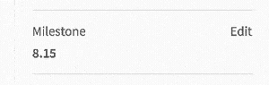
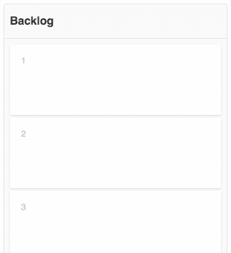
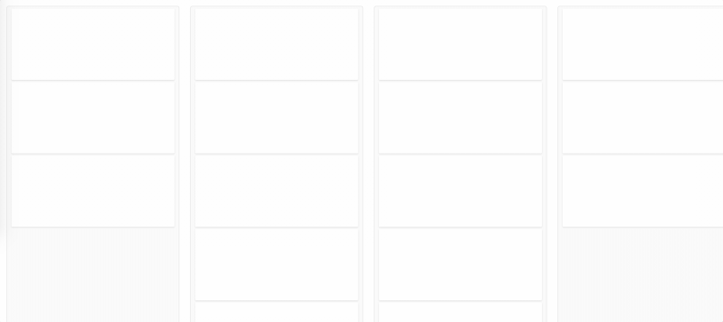

# Animation

Motion is a tool to help convey important relationships, changes or transitions between elements. It should be used sparingly and intentionally, highlighting the right elements at the right moment.

## Timings

The longer distance an object travel, the timing should be longer for the animation. However, when in doubt, we should avoid large, full screen animations.

Subtle animations, or objects leaving the screen should take **100-200 milliseconds**. Objects entering the screen, or motion we want to use to direct user attention can take between **200-400 milliseconds**. We should avoid animations of longer than 400 milliseconds as they will make the experience appear sluggish. If a specific animation feels like it will need more than 400 milliseconds, revisit the animation to see if there is a simpler, easier, shorter animation to implement.

## Easing

Easing specifies the rate of change of a parameter over time (see [easings.net](http://easings.net/)). Adding an easing curve will make the motion feel more natural. Being consistent with the easing curves will make the whole experience feel more cohesive and connected.

* When an object is entering the screen, or transforming the scale, position, or shape, use the **easeOutQuint** curve (`cubic-bezier(0.23, 1, 0.32, 1)`)
* When an object is leaving the screen, or transforming the opacity or color, no easing curve is needed. It shouldn't _slow down_ as it is exiting the screen, as that draws attention on the leaving object, where we don't want it. Adding easing to opacity and color transitions will make the motion appear less smooth. Therefore, for these cases, motion should just be **linear**.

## Types of animations

### Hover

Interactive elements (links, buttons, etc.) should have a hover state. A subtle animation for this transition adds a polished feel. We should target a `100ms - 150ms linear` transition for a color hover effect.

View the [interactive example](http://codepen.io/awhildy/full/GNyEvM/) here.

### Dropdowns

The dropdown menu should feel like it is appearing from the triggering element. Combining a position shift `400ms cubic-bezier(0.23, 1, 0.32, 1)` with an opacity animation `200ms linear` on the second half of the motion achieves this affect.

View the [interactive example](http://codepen.io/awhildy/full/jVLJpb/) here.

### Quick update

When information is updating in place, a quick, subtle animation is needed. The previous content should cut out, and the new content should have a quick, `200ms linear` fade in.

### Skeleton loading

Skeleton loading is explained in the [component section](components.html#skeleton-loading) of the UX guide. It includes a horizontally pulsating animation that shows motion as if it's growing. It's timing is a slower `linear 1s`.

### Moving transitions

When elements move on screen, there should be a quick animation so it is clear to users what moved where. The timing of this animation differs based on the amount of movement and change. Consider animations between `200ms` and `400ms`.

#### Shifting elements on reorder
An example of a moving transition is when elements have to move out of the way when you drag an element.

View the [interactive example](http://codepen.io/awhildy/full/ALyKPE/) here.

#### Autoscroll the page

Another example of a moving transition is when you have to autoscroll the page to keep an active element visible.

View the [interactive example](http://codepen.io/awhildy/full/PbxgVo/) here.

