# Components

## Contents
* [Tooltips](#tooltips)
* [Anchor links](#anchor-links)
* [Buttons](#buttons)
* [Dropdowns](#dropdowns)
* [Counts](#counts)
* [Lists](#lists)
* [Tables](#tables)
* [Blocks](#blocks)
* [Panels](#panels)
* [Modals](#modals)
* [Alerts](#alerts)
* [Forms](#forms)
* [Search box](#search-box)
* [File holders](#file-holders)
* [Data formats](#data-formats)

---

## Tooltips
Tooltips identify elements or provide additional, useful information about the referring elements. Tooltips are different from ALT-attributes, which are intended primarily for static images. Tooltips are summoned by:

* Hovering over an element with a cursor
* Focusing on an element with a keyboard (usually the tab key)
* Upon touch

### Usage
A tooltip should be used:
* When there isn’t enough space to show the information
* When it isn’t critical for the user to see the information
* For icons that don’t have a label

Tooltips shouldn’t repeat information that is shown near the referring element. However, they can show the same data in a different format (e.g. date or timestamps).

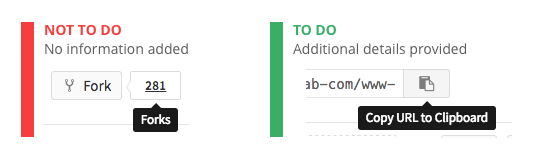

### Placement
By default, tooltips should be placed below the referring element. However, if there isn’t enough space in the viewport, the tooltip should be moved to the side as needed.

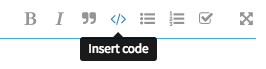

---

## Popovers

Popovers provide additional, useful, unique information about the referring elements and can provide one or multiple actionable elements. They inform the user of additional information within the context of their original view, but without forcing the user to act upon it like a modal. Popovers are different from tooltips, which do not provide rich markup and actionable items. A popover can contain a header section with a different background color.

Popovers are summoned:

* Upon hover or touch on an element

### Usage
A popover should be used:
* When you don't want to let the user lose context, but still want to provide additional useful unique information about referring elements
* When it isn’t critical for the user to act upon the information
* When you want to give a user a summary of extended information and the option to switch context if they want to dive in deeper.

### Styling

A popover can contain a header section with a different background color if that improves readability and separation of content within.

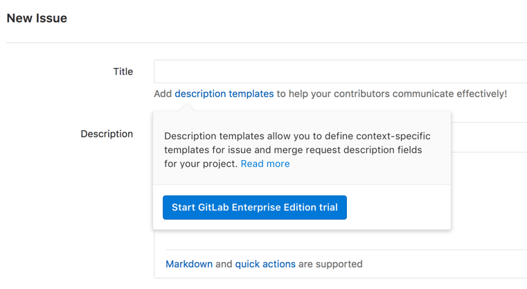

This example shows two sections, where each section includes an actionable element. The first section shows a summary of the content shown when clicking the "read more" link. With this information the user can decide to dive deeper or start their GitLab Enterprise Edition trial immediately.

### Placement
By default, tooltips should be placed below the referring element. However, if there isn’t enough space in the viewport or it blocks related content, the tooltip should be moved to the side or above as needed.

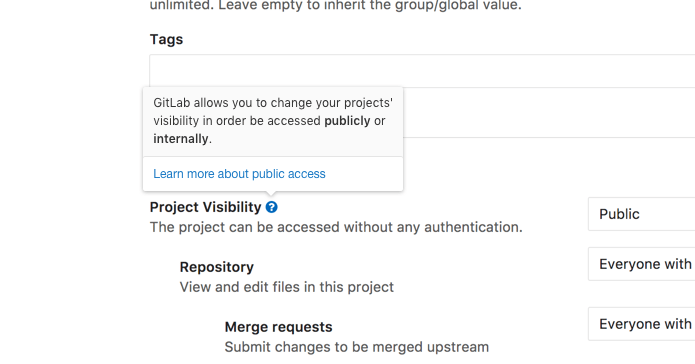

In this example we let the user know more about the setting they are deciding over, without loosing context. If they want to know even more they can do so, but with the expectation of opening that content in a new view.

---

## Anchor links

Anchor links are used for navigational actions and lone, secondary commands (such as 'Reset filters' on the Issues List) when deemed appropriate by the UX team.

### States

#### Rest

Primary links are blue in their rest state. Secondary links (such as the time stamp on comments) are a neutral gray color in rest. Details on the main GitLab navigation links can be found on the [features](features.md#navigation) page.

#### Hover

On hover, an underline should be added and the color should change. Both the primary and secondary link should become the darker blue color on hover.

#### Focus

The focus state should match the hover state.

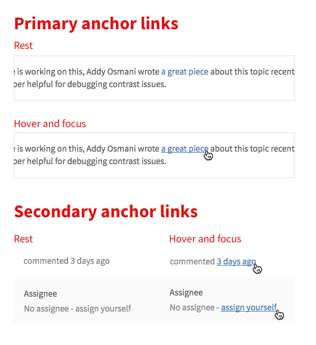

---

## Buttons

Buttons communicate the command that will occur when the user clicks on them.

### Types

#### Primary
Primary buttons communicate the main call to action. There should only be one call to action in any given experience. Visually, primary buttons are conveyed with a full background fill

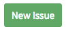

#### Secondary
Secondary buttons are for alternative commands. They should be conveyed by a button with a stroke, and no background fill.

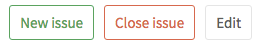

### Icon and text treatment
Text should be in sentence case, where only the first word is capitalized. "Create issue" is correct, not "Create Issue". Buttons should only contain an icon or a text, not both.

> TODO: Rationalize this. Ensure that we still believe this.

### Colors
The default color treatment is the white/grey button. Follow the guidance on the [basics](basics.md#color) page to add meaningful color to a button.

### Secondary states

Primary buttons darken the color of their background and border for hover, focus and active states. An inner shadow is added to the active state to denote the button being pressed.

| Values | Info | Success | Warning | Danger |
| :------ | :------: | :------: | :------: | :------: |
| Background: `$color-light`   Border: `$border-color-light` | 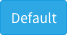 | 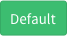 |  | 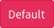 |
| Background: `$color-normal`   Border: `$border-color-normal` | 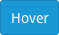 |  |  |  |
| Background: `$color-dark`   Border: `$border-color-dark` | 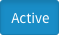 | 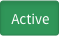 |  | 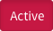 |

Since secondary buttons only have a border on their resting state, their hover and focus states add a background color, which gets darkened on active.

| Values | Success Secondary | Close | Spam |
| :------ | :------: | :------: | :------: |
| Font: `$border-color-light`   Border: `$border-color-light` | 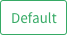 | 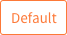 | 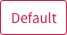 |
| Background: `$color-light`   Border: `$border-color-light` |  |  |  |
| Background: `$color-normal`   Border: `$border-color-normal` | 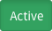 |  | 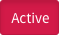 |

### Placement

When there are a group of buttons in a dialog or a form, we need to be consistent with the placement.

#### Dismissive actions on the left
The dismissive action returns the user to the previous state.

> Example: Cancel

#### Affirmative actions on the right
Affirmative actions continue to progress towards the user goal that triggered the dialog or form.

> Example: Submit, Ok, Delete

---

## Dropdowns

Dropdowns are used to allow users to choose one (or many) options from a list of options. If this list of options is more 20, there should generally be a way to search through and filter the options (see the complex filter dropdowns below.)

> TODO: Will update this section when the new filters UI is implemented.

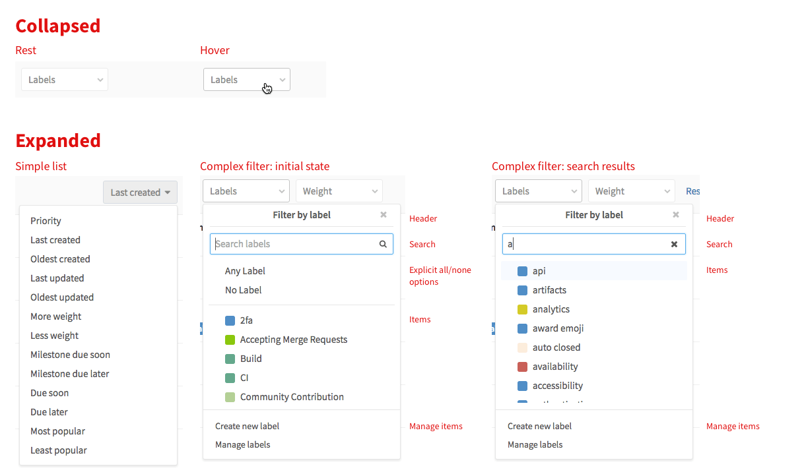

### Max size

The max height for dropdowns should target **10-15** single line items, or **7-10** multi-line items. If the height of the dropdown is too large, the list becomes very hard to parse and it is easy to visually lose track of the item you are looking for. Usability also suffers as more mouse movement is required, and you have a larger area in which you hijack the scroll away from the page level. While it may initially seem counterintuitive to not show as many items as you can, it is actually quicker and easier to process the information when it is cropped at a reasonable height.

---

## Counts

A count element is used in navigation contexts where it is helpful to indicate the count, or number of items, in a list. Always use the [`number_with_delimiter`][number_with_delimiter] helper to display counts in the UI.

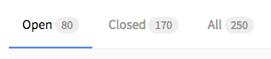

[number_with_delimiter]: http://api.rubyonrails.org/classes/ActionView/Helpers/NumberHelper.html#method-i-number_with_delimiter

---

## Lists

Lists are used where ever there is a single column of information to display. Ths [issues list](https://gitlab.com/gitlab-org/gitlab-ce/issues) is an example of an important list in the GitLab UI.

### Types

Simple list using .content-list

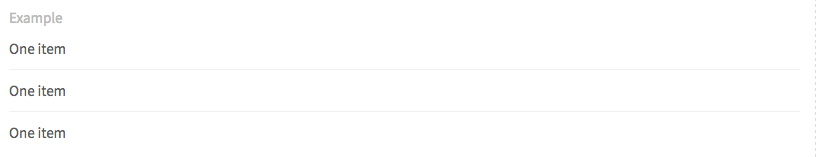

List with avatar, title and description using .content-list

List with hover effect .well-list

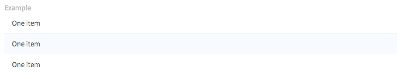

List inside panel

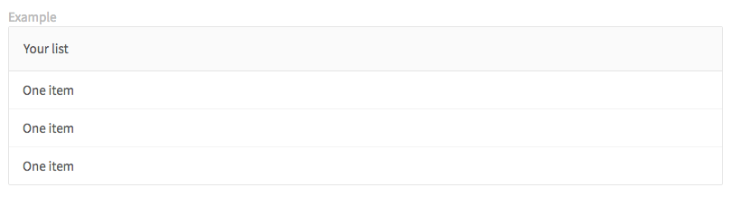

---

## Tables

When the information is too complex for a list, with multiple columns of information, a table can be used. For example, the [pipelines page](https://gitlab.com/gitlab-org/gitlab-ce/pipelines) uses a table.

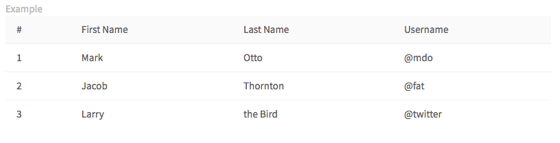

---

## Blocks

Blocks are a way to group related information.

### Types

#### Content blocks

Content blocks (`.content-block`) are the basic grouping of content. They are commonly used in [lists](#lists), and are separated by a button border.

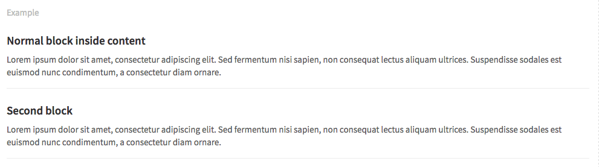

#### Row content blocks

A background color can be added to this blocks. For example, items in the [issue list](https://gitlab.com/gitlab-org/gitlab-ce/issues) have a green background if they were created recently. Below is an example of a gray content block with side padding using `.row-content-block`.

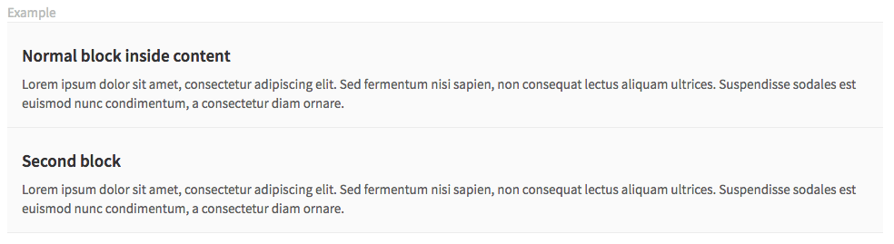

#### Cover blocks
Cover blocks are generally used to create a heading element for a page, such as a new project, or a user profile page. Below is a cover block (`.cover-block`) for the profile page with an avatar, name and description.

---

## Skeleton loading

Skeleton loading is a way to convey to the user what kind of content is currently being loaded. It's a paradigm with which content can independently and asynchronously be loaded, while still adhering to the structure and look of the completely loaded view.

### Requirements

* A skeleton should represent an organism in a recognisable way
* Atom elements within organisms (for reference see this article on [atomic design methodology](http://atomicdesign.bradfrost.com/chapter-2/)) may be represented in a maximum of 3 repetitions, if applicable.
* Skeletons should only be presented in grayscale using the HEX colors: `#fafafa` or `#ffffff` (except for shadows)
* Animate the grey atoms in a pulsating way to show motion, as if "loading". The pulse animation transitions colors horizontally from left to right, starting with `#f2f2f2` to `#fafafa`.

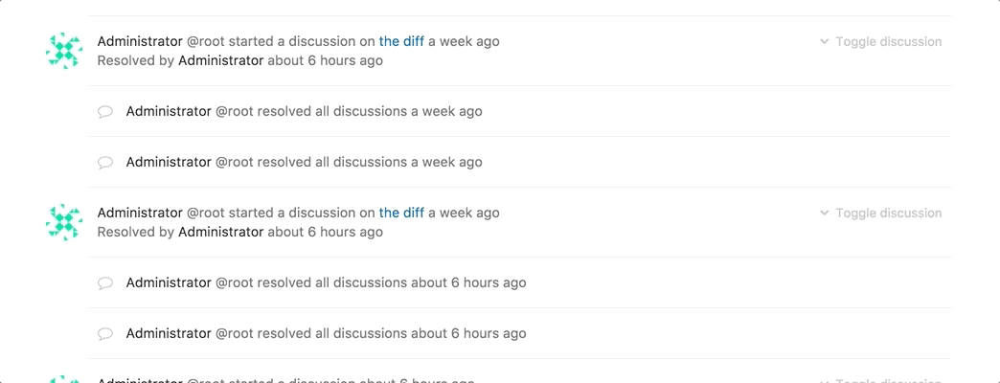

### Usage

Skeleton loading can replace any existing UI elements for the period in which they are loaded and should aim for maintaining a similar structure visually.

---

## Modals

Modals are only used for having a conversation and confirmation with the user. The user is not able to access the features on the main page until closing the modal.

### Usage

* When the action is irreversible, modals provide the details and confirm with the user before they take an advanced action.
* When the action will affect privacy or authorization, modals provide advanced information and confirm with the user.

### Style

* Modals contain the header, body, and actions.
  * **Header(1):** The header title is a question instead of a descriptive phrase.
  * **Body(2):** The content in body should never be ambiguous and unclear. It provides specific information.
  * **Actions(3):** Contains an affirmative action, a dismissive action, and an extra action. The order of actions from left to right: Dismissive action → Extra action → Affirmative action
* Confirmations regarding labels should keep labeling styling.
* References to commits, branches, and tags should be **monospaced**.

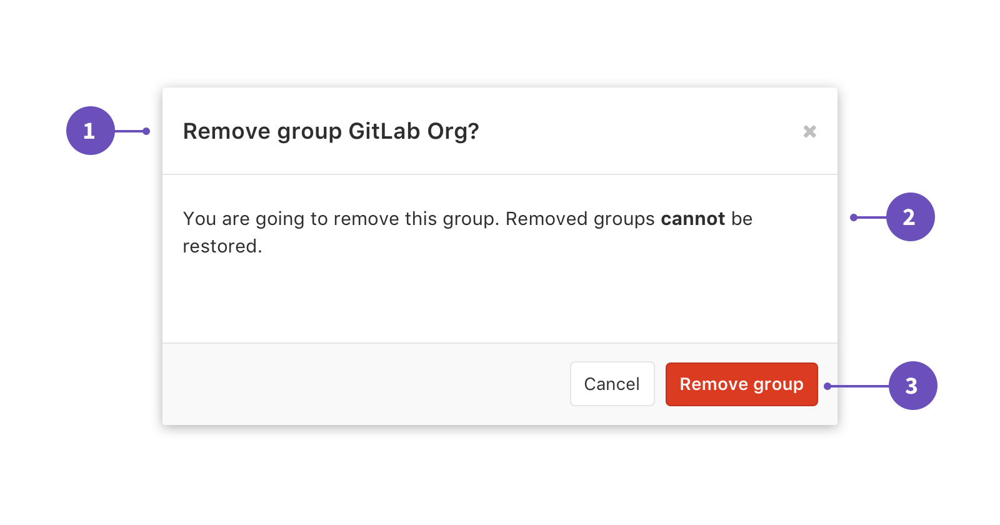

### Placement

* Modals should always be the center of the screen horizontally and be positioned **72px** from the top.

| Modal with 2 actions | Modal with 3 actions | Special confirmation |
| --------------------- | --------------------- | -------------------- |
| 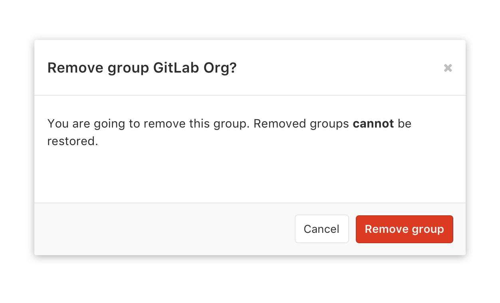 | 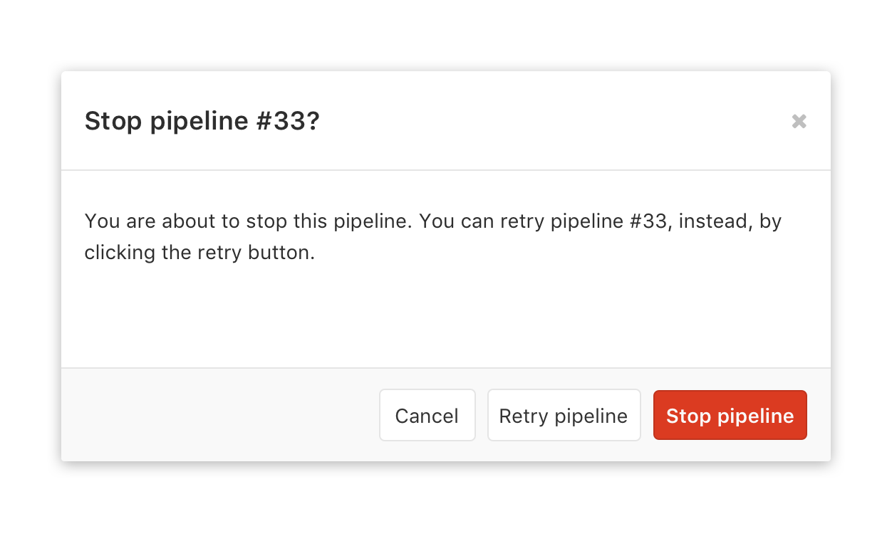 | 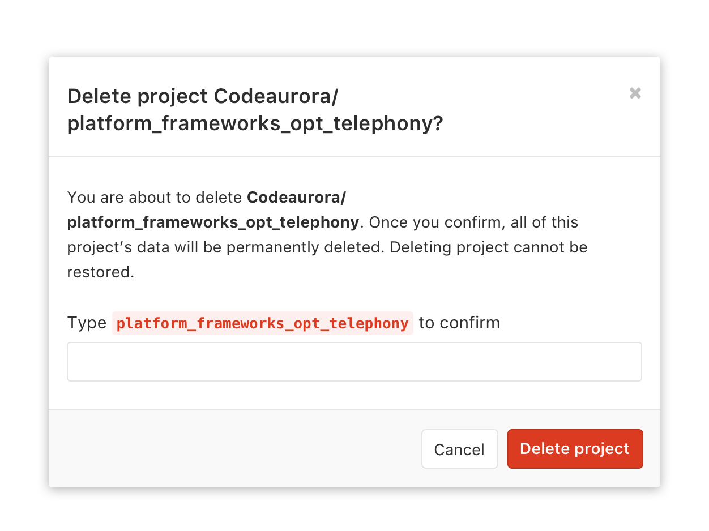 |

> TODO: Special case for modal.

---

## Panels

> TODO: Catalog how we are currently using panels and rationalize how they relate to alerts

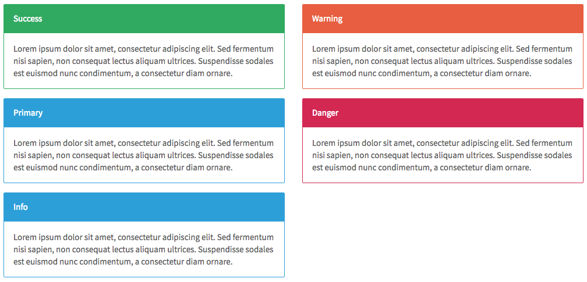

---

## Alerts

> TODO: Catalog how we are currently using alerts

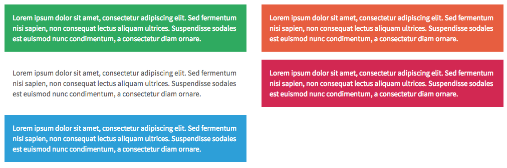

---

## Forms

There are two options shown below regarding the positioning of labels in forms. Both are options to consider based on context and available size. However, it is important to have a consistent treatment of labels in the same form.

### Types

#### Labels stack vertically

Form (`form`) with label rendered above input.

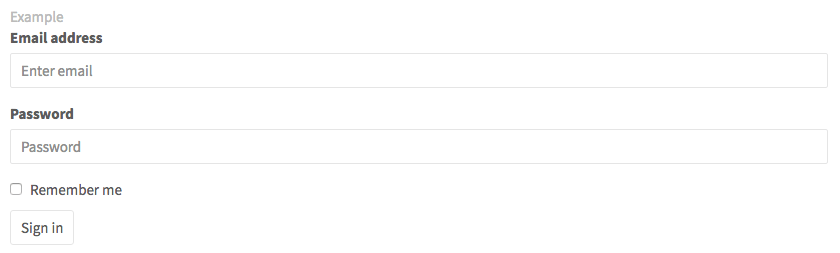

#### Labels side-by-side

Horizontal form (`form.horizontal-form`) with label rendered inline with input.

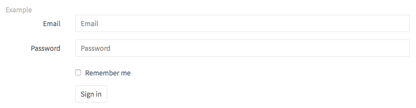

---

## Search box

Search boxes across GitLab have a consistent rest, active and text entered state. When text isn't entered in the box, there should be a magnifying glass right aligned with the input field. When text is entered, the magnifying glass should become a x, allowing users to clear their text.

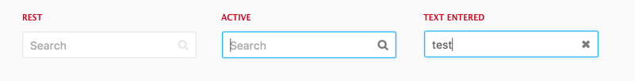

If needed, we indicate the scope of the search in the search box.

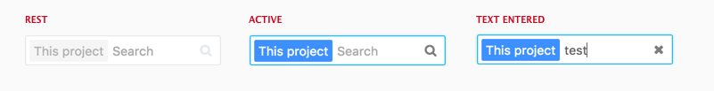

---

## File holders
A file holder (`.file-holder`) is used to show the contents of a file inline on a page of GitLab.

---

## Data formats

### Dates

#### Exact

Format for exacts dates should be ‘Mon DD, YYYY’, such as the examples below.

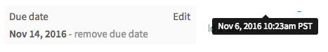

#### Relative

This format relates how long since an action has occurred. The exact date can be shown as a tooltip on hover.

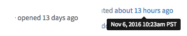

### References

Referencing GitLab items depends on a symbol for each type of item. Typing that symbol will invoke a dropdown that allows you to search for and autocomplete the item you were looking for. References are shown as [links](#links) in context, and hovering on them shows the full title or name of the item.

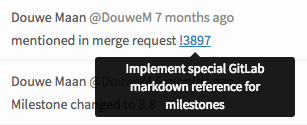

#### `%` Milestones

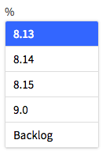

#### `#` Issues

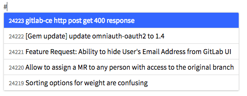

#### `!` Merge Requests

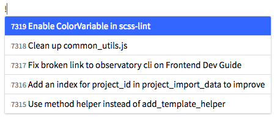

#### `~` Labels

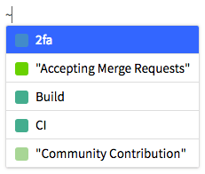

#### `@` People

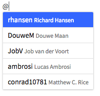

> TODO: Open issue: Some commit references use monospace fonts, but others don't. Need to standardize this.
