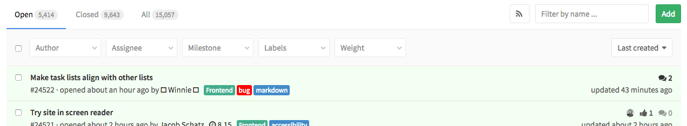
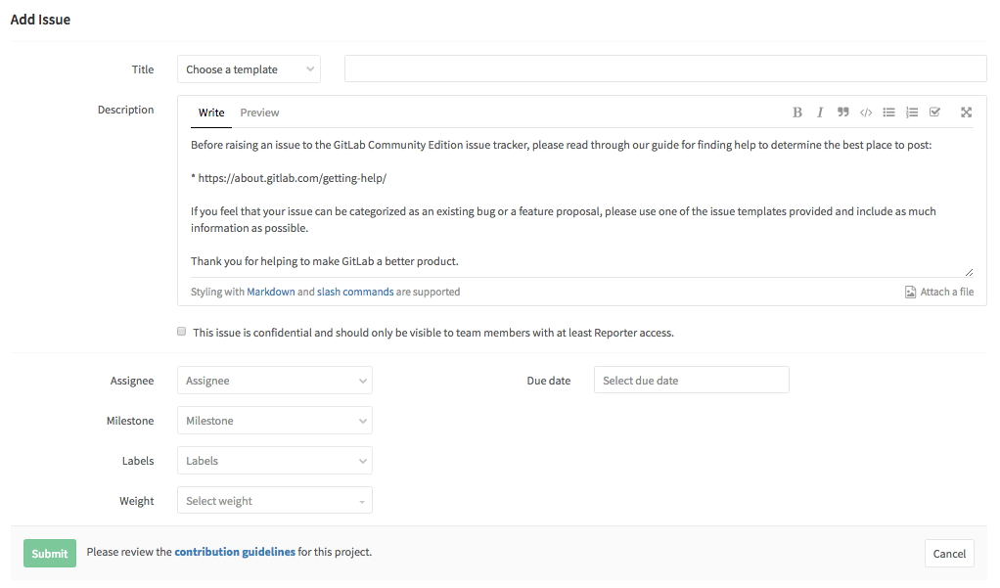
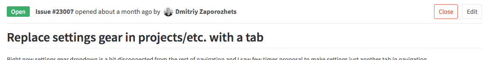
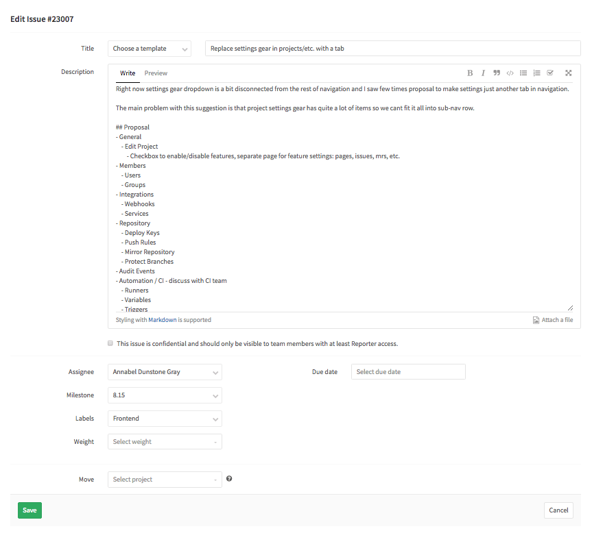

# Copy

The copy and messaging is a core part of the experience of GitLab and the conversation with our users. Follow the below conventions throughout GitLab.

>**Note:**
We are currently inconsistent with this guidance. Images below are created to illustrate the point. As this guidance is refined, we will ensure that our experiences align.

## Contents
* [Brevity](#brevity)
* [Sentence case](#sentence-case)
* [Terminology](#terminology)

---

## Brevity
Users will skim content, rather than read text carefully.
When familiar with a web app, users rely on muscle memory, and may read even less when moving quickly.
A good experience should quickly orient a user, regardless of their experience, to the purpose of the current screen. This should happen without the user having to consciously read long strings of text.
In general, text is burdensome and adds cognitive load. This is especially pronounced in a powerful productivity tool such as GitLab.
We should _not_ rely on words as a crutch to explain the purpose of a screen.
The current navigation and composition of the elements on the screen should get the user 95% there, with the remaining 5% being specific elements such as text.
This means that, as a rule, copy should be very short. A long message or label is a red flag hinting at design that needs improvement.

>**Example:**
Use `Add` instead of `Add issue` as a button label.
Preferrably use context and placement of controls to make it obvious what clicking on them will do.

---

## Sentence case
Use sentence case for all titles, headings, labels, menu items, and buttons.

---

## Terminology
Only use the terms in the tables below.

### Issues

#### Adjectives (states)

| Term |
| ---- |
| Open |
| Closed |
| Deleted |

>**Example:**
Use `5 open issues` and don't use `5 pending issues`.

#### Verbs (actions)

| Term | Use | Don't |
| ---- | --- | --- |
| Add | Add an issue | Don't use `create` or `new` |
| View | View an open or closed issue ||
| Edit | Edit an open or closed issue | Don't use `update` |
| Close | Close an open issue ||
| Re-open | Re-open a closed issue | There should never be a need to use `open` as a verb |
| Delete | Delete an open or closed issue ||

#### Add issue

When viewing a list of issues, there is a button that is labeled `Add`. Given the context in the example, it is clearly referring to issues. If the context were not clear enough, the label could be `Add issue`. Clicking the button will bring you to the `Add issue` form. Other add flows should be similar.

The form should be titled `Add issue`. The submit button should be labeled `Submit`. Don't use `Add`, `Create`, `New`, or `Save changes`. The cancel button should be labeled `Cancel`. Don't use `Back`.

#### Edit issue

When in context of an issue, the affordance to edit it is labeled `Edit`. If the context is not clear enough, `Edit issue` could be considered. Other edit flows should be similar.

The form should be titled `Edit issue`. The submit button should be labeled `Save`. Don't use `Edit`, `Update`, `Submit`, or `Save changes`. The cancel button should be labeled `Cancel`. Don't use `Back`.

### Merge requests

#### Adjectives (states)

| Term |
| ---- |
| Open |
| Merged |

#### Verbs (actions)

| Term | Use | Don't |
| ---- | --- | --- |
| Add | Add a merge request | Do not use `create` or `new` |
| View | View an open or merged merge request ||
| Edit | Edit an open or merged merge request| Do not use `update` |
| Merge | Merge an open merge request ||