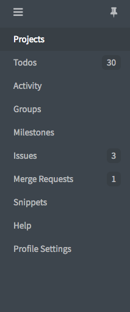
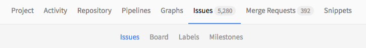
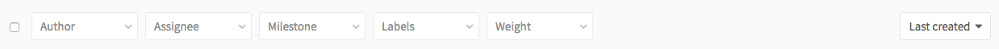
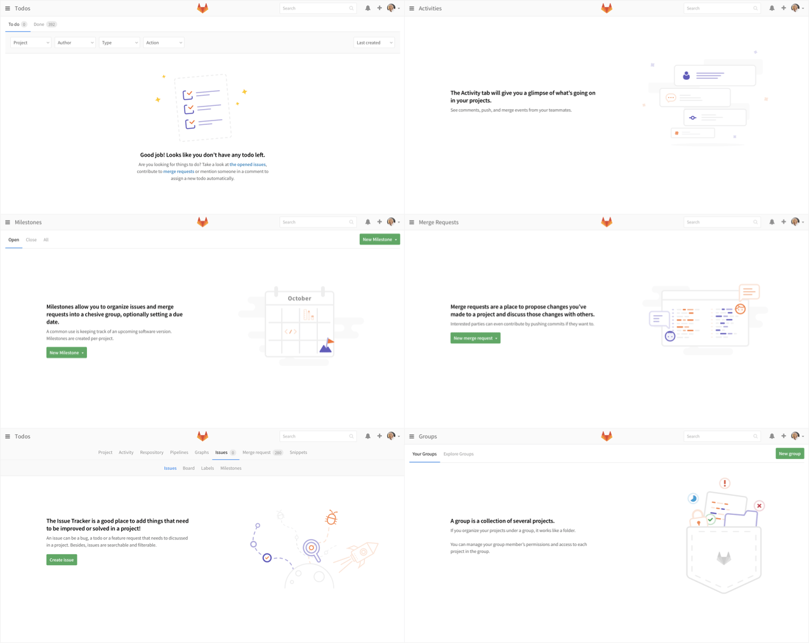

# Features

## Contents
* [Navigation](#navigation)
* [Filtering](#filtering)
* [Search results](#search-results)
* [Conversations](#conversations)
* [Empty states](#empty-states)

---

## Navigation

### Global navigation

The global navigation is accessible via the menu button on the top left of the screen, and can be pinned to keep it open. It contains a consistent list of pages that allow you to view content that is across GitLab. For example, you can view your todos, issues and merge requests across projects and groups.

### Contextual navigation

The navigation in the header is contextual to each page. These options change depending on if you are looking at a project, group, or settings page. There should be no more than 10 items on a level in the contextual navigation, allowing it to comfortably fit on a typical laptop screen. There can be up to too levels of navigation. Each sub nav group should be a self-contained group of functionality. For example, everything related to the issue tracker should be under the 'Issue' tab, while everything relating to the wiki will be grouped under the 'Wiki' tab. The names used for each section should be short and easy to remember, ideally 1-2 words in length.

### Information architecture

The [GitLab Product Map](https://gitlab.com/gitlab-org/gitlab-design/raw/master/production/resources/gitlab-map.png) shows a visual representation of the information architecture for GitLab.

---

 

## Filtering

Today, lists are filtered by a series of dropdowns. Some of these dropdowns allow multiselect (labels), while others allow you to filter to one option (milestones). However, we are currently implementing a [new model](https://gitlab.com/gitlab-org/gitlab-ce/issues/21747) for this, and will update the guide when it is ready.

---

 

## Search results

### Global search

[Global search](https://gitlab.com/search?group_id=&project_id=13083&repository_ref=&scope=issues&search=mobile) allows you to search across items in a project, or even across multiple projects. You can switch tabs to filter on type of object, or filter by group.

### List search

There are several core lists in the GitLab experience, such as the Issue list and the Merge Request list. You are also able to [filter and search these lists](https://gitlab.com/gitlab-org/gitlab-ce/issues?utf8=%E2%9C%93&search=mobile). This UI will be updated with the [new filtering model](https://gitlab.com/gitlab-org/gitlab-ce/issues/21747).

---

 

## Empty states

Empty states need to be considered in the design of features. They are vital to helping onboard new users, making the experience feel more approachable and understandable. Empty states should feel inviting and provide just enough information to get people started. There should be a single call to action and a clear explanation of what to use the feature for.

