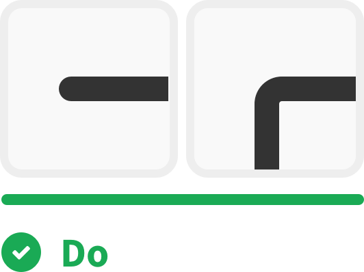
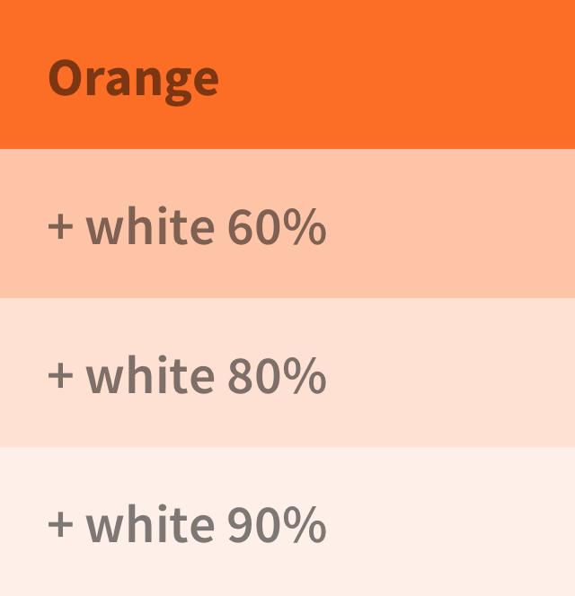
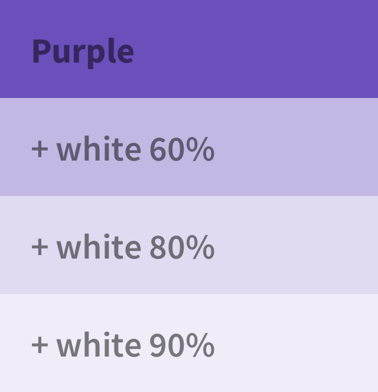

# Illustrations

The illustrations should always align with topics and goals in specific context.

## Principles

#### Be simple.
- For clarity, we use simple and specific elements to create our illustrations.

#### Be optimistic.
- We are an open-minded, optimistic, and friendly team. We should reflect those values in our illustrations to connect with our brand experience.

#### Be gentle.
- Our illustrations assist users in understanding context and guide users in the right direction. Illustrations are supportive, so they should be obvious but not aggressive.

## Style

#### Shapes
- All illustrations are geometric rather than organic.
- The illustrations are made by circles, rectangles, squares, and triangles.

#### Stroke
- Standard border thickness: **4px**
- Depending on the situation, border thickness can be changed to **3px**. For example, when the illustration size is small, an illustration with 4px border thickness would look tight. In this case, the border thickness can be changed to 3px.
- We use **rounded caps** and **rounded corner**.

| Do | Don't |
| -------- | -------- |
|  |  |

#### Radius
- Standard corner radius: **10px**
- Depending on the situation, corner radius can be changed to **5px**. For example, when the illustration size is small, an illustration with 10px corner radius would be over-rounded. In this case, the corner radius can be changed to 5px.

#### Colors palette

For consistency, we recommend choosing colors from our color palette.

| Orange | Purple | Grey |
| -------- | -------- | -------- |
|  |  |  |
| #FC6D26   | #6B4FBB | #EEEEEE |

---

| Orange | Purple |
| -------- | -------- |
|  |  |
