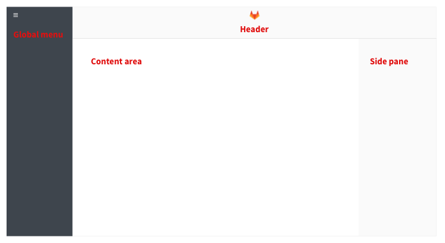

# Surfaces

## Contents
* [Header](#header)
* [Global menu](#global-menu)
* [Side pane](#side-pane)
* [Content area](#content-area)

---

## Global menu

This menu is to navigate to pages that contain content global to GitLab.

---

 

## Header

The header contains 3 main elements: Project switching and searching, user account avatar and settings, and a contextual menu that changes based on the current page.

---

 

## Side pane

The side pane holds supporting information and meta data for the information in the content area.

---

 

## Content area

The main content of the page. The content area can include other surfaces.

### Item title bar

The item title bar contains the top level information to identify the item, such as the name, id and status.

### Item system information

The system information block contains relevant system controlled information.

