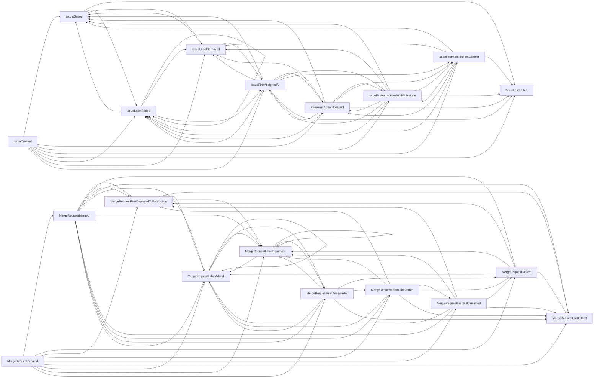

For information on how to configure value stream analytics (VSA) in GitLab, see our [analytics documentation](../user/group/value_stream_analytics/_index.md).

## How does Value Stream Analytics work?

Value Stream Analytics calculates the duration between two timestamp columns or timestamp
expressions and runs various aggregations on the data.

For example:

- Duration between the merge request creation time and merge request merge time.
- Duration between the Issue creation time and Issue close time.

This duration is exposed in various ways:

- Aggregation: median, average
- Listing: list the duration for individual merge request and issue records

Apart from the durations, we expose the record count within a stage.

## Feature availability

- Group level (licensed): Requires Ultimate or Premium subscription. This version is the most
  feature-full.
- Project level (licensed): We are continually adding features to project level VSA to bring it in line with group level VSA.
- Project level (FOSS): Keep it as is.

|Feature|Group level (licensed)|Project level (licensed)|Project level (FOSS)|
|-|-|-|-|
|Create custom value streams|Yes|No, only one value stream (default) is present with the default stages|no, only one value stream (default) is present with the default stages|
|Create custom stages|Yes|No|No|
|Filtering (author, label, milestone, etc.)|Yes|Yes|Yes|
|Stage time chart|Yes|No|No|
|Total time chart|Yes|No|No|
|Task by type chart|Yes|No|No|
|DORA Metrics|Yes|Yes|No|
|Cycle time and lead time summary (Lifecycle metrics)|Yes|Yes|No|
|New issues, commits and deploys (Lifecycle metrics)|Yes, excluding commits|Yes|Yes|
|Uses aggregated backend|Yes|No|No|
|Date filter behavior|Filters items [finished within the date range](https://gitlab.com/groups/gitlab-org/-/epics/6046)|Filters items by creation date.|Filters items by creation date.|
|Authorization|At least reporter|At least reporter|Can be public.|

## VSA core domain objects

### Stages

A stage represents an event pair (start and end events) with additional metadata, such as the name
of the stage. Stages are configurable by the user within the pairing rules defined in the backend.

**Example stage: Code Review**

- Start event identifier: Merge request creation time.
- Start event column: uses the `merge_requests.created_at` timestamp column.
- End event identifier: Merge request merge time.
- End event column: uses the `merge_request_metrics.merged_at` timestamp column.
- Stage event hash ID: a calculated hash for the pair of start and end event identifiers.
  - If two stages have the same configuration of start and end events, then their stage event hash.
    IDs are identical.
  - The stage event hash ID is later used to store the aggregated data in partitioned database tables.

Historically, value stream analytics defined [six stages](https://gitlab.com/gitlab-org/gitlab/-/blob/master/lib/gitlab/analytics/cycle_analytics/default_stages.rb)
which are always available to the end-users regardless of the subscription.

### Value streams

Value streams are container objects for the stages. There can be multiple value streams per group
focusing on different aspects of the DevOps lifecycle.

### Events

Events are the smallest building blocks of the value stream analytics feature. A stage consists of two events:

- Start event
- End event

These events play a key role in the duration calculation.

Formula: `duration = end_event_time - start_event_time`

To make the duration calculation flexible, each `Event` is implemented as a separate class.
They're responsible for defining a timestamp expression that is used in the calculation query.

#### Implementing an `Event` class

You must implement a few methods, as described in the `StageEvent` base class.
The most important methods are:

- `object_type`
- `timestamp_projection`

The `object_type` method defines which domain object is queried for the calculation. Currently two models are allowed:

- `Issue`
- `MergeRequest`

For the duration calculation the `timestamp_projection` method is used.

```ruby
def timestamp_projection
  # your timestamp expression comes here
end

# event will use the issue creation time in the duration calculation
def timestamp_projection
  Issue.arel_table[:created_at]
end
```

More complex expressions are also possible (for example, using `COALESCE`).
Review the existing event classes for examples.

In some cases, defining the `timestamp_projection` method is not enough. The calculation query should know which table contains the timestamp expression. Each `Event` class is responsible for making modifications to the calculation query to make the `timestamp_projection` work. This usually means joining an additional table.

Example for joining the `issue_metrics` table and using the `first_mentioned_in_commit_at` column as the timestamp expression:

```ruby
def object_type
  Issue
end

def timestamp_projection
  IssueMetrics.arel_table[:first_mentioned_in_commit_at]
end

def apply_query_customization(query)
  # in this case the query attribute will be based on the Issue model: `Issue.where(...)`
  query.joins(:metrics)
end
```

#### Validating start and end events

Some start/end event pairs are not "compatible" with each other. For example:

- "Issue created" to "Merge Request created": The event classes are defined on different domain models, the `object_type` method is different.
- "Issue closed" to "Issue created": Issue must be created first before it can be closed.
- "Issue closed" to "Issue closed": Duration is always 0.

The `StageEvents` module describes the allowed `start_event` and `end_event` pairings (`PAIRING_RULES` constant). If a new event is added, it needs to be registered in this module.
To add a new event:

1. Add an entry in `ENUM_MAPPING` with a unique number, which is used in the `Stage` model as `enum`.
1. Define which events are compatible with the event in the `PAIRING_RULES` hash.

Supported start/end event pairings:



## Default stages

The [original implementation](https://gitlab.com/gitlab-org/gitlab/-/issues/847) of value stream analytics defined 7 stages. These stages are always available for each parent, however altering these stages is not possible.

To make things efficient and reduce the number of records created, the default stages are expressed as in-memory objects (not persisted). When the user creates a custom stage for the first time, all the stages are persisted. This behavior is implemented in the value stream analytics service objects.

The reason for this was that we'd like to add the abilities to hide and order stages later on.

## Data Collector

`DataCollector` is the central point where the data is queried from the database. The class always operates on a single stage and consists of the following components:

- `BaseQueryBuilder`:
  - Responsible for composing the initial query.
  - Deals with `Stage` specific configuration: events and their query customizations.
  - Parameters coming from the UI: date ranges.
- `Median`: Calculates the median duration for a stage using the query from `BaseQueryBuilder`.
- `RecordsFetcher`: Loads relevant records for a stage using the query from `BaseQueryBuilder` and specific `Finder` classes to apply visibility rules.
- `DataForDurationChart`: Loads calculated durations with the finish time (end event timestamp) for the scatterplot chart.

For a new calculation or a query, implement it as a new method call in the `DataCollector` class.

To support the aggregated value stream analytics backend, these classes were reimplemented within [`Aggregated`](https://gitlab.com/gitlab-org/gitlab/-/tree/master/lib/gitlab/analytics/cycle_analytics/aggregated) namespace.

### Database query backend

VSA supports two backends: [aggregated](value_stream_analytics/value_stream_analytics_aggregated_backend.md) and "live". The live query backend can be
considered legacy, which will be phased out at some point.

- "live": uses the standard `IssuableFinders`.
- aggregated: queries data from pre-aggregated database tables.

## High-level overview

- Rails Controller (`Analytics::CycleAnalytics` module): Value stream analytics exposes its data via JSON endpoints, implemented within the `analytics` workspace. Configuring the stages are also implements JSON endpoints (CRUD).
- Services (`Analytics::CycleAnalytics` module): All `Stage` related actions are delegated to respective service objects.
- Models (`Analytics::CycleAnalytics` module): Models are used to persist the `Stage` objects.
- Feature classes (`Gitlab::Analytics::CycleAnalytics` module):
  - Responsible for composing queries and define feature specific business logic.
  - `DataCollector`, `Event`, `StageEvents`, etc.

## Frontend

[Project VSA](../user/group/value_stream_analytics/_index.md) is available for all users and:

- Includes a mixture of key and DORA metrics based on the tier.
- Uses the set of [default stages](#default-stages).

[Group VSA](../user/group/value_stream_analytics/_index.md) is only available for licensed users and extends project VSA to include:

- An [overview stage](https://gitlab.com/gitlab-org/gitlab/-/issues/321438).
- The ability to create custom value streams.

The group and project level VSA frontends are both built with Vue and Vuex and follow a similar pattern:

- The `index.js` file extracts any URL query parameters, creates the Vue app and Vuex store, and dispatches an `initialize` Vuex action.
- The `base.vue` file is used to render the main components for each page, metrics, filters, charts, and the stage table.

The group VSA Vuex store makes use of [Vuex modules](https://vuex.vuejs.org/guide/modules.html) to separate some of the state and logic used for rendering the charts.

### Shared components

Parts of the UI are shared between project VSA and group VSA such as the stage table and path. These shared components live in the project VSA directory `app/assets/javascripts/cycle_analytics/components` and are included at the group level VSA where needed.

All the frontend code for group-level features are located in `ee/app/assets/javascripts/analytics/cycle_analytics/components`.

## Testing

Since we have a lots of events and possible pairings, testing each pairing is not possible. The rule is to have at least one test case using an `Event` class.

Writing a test case for a stage using a new `Event` can be challenging since data must be created for both events. To make this a bit simpler, each test case must be implemented in the `data_collector_spec.rb` where the stage is tested through the `DataCollector`. Each test case is turned into multiple tests, covering the following cases:

- Different parents: `Group` or `Project`
- Different calculations: `Median`, `RecordsFetcher` or `DataForDurationChart`

The VSA frontend is tested extensively on two different levels (integration, unit):

- End-to-end integration tests using a real backend via Capybara and RSpec.
- Jest frontend tests with pre-generated data fixtures.

## Development setup and testing

Running Value Stream Analytics can be done via the [GDK](https://gitlab.com/gitlab-org/gitlab-development-kit). By default, you'll be able to view the project-level (FOSS) version of the feature.

If your GDK is up and running, you can run the seed script to generate some data:

```shell
SEED_CYCLE_ANALYTICS=true SEED_VSA=true FILTER=cycle_analytics rake db:seed_fu
```

The data generator script creates a new group and a new project with issue and merge request
data (see the output of the script). To view the group-level version of the feature, you
need to request a license for your GDK instance.

After this step, you can access the group level value stream analytics page where you can create
value streams and stages. The data aggregation might be delayed so you might not see the
data right after the stage creation. To speed up this process, you can run the following command
in your rails console (`rails c`):

```ruby
Analytics::CycleAnalytics::ReaggregationWorker.new.perform
```

### Seed data

#### Value stream analytics

For instructions on how to seed data for value stream analytics, see [development seed files](development_seed_files.md).
