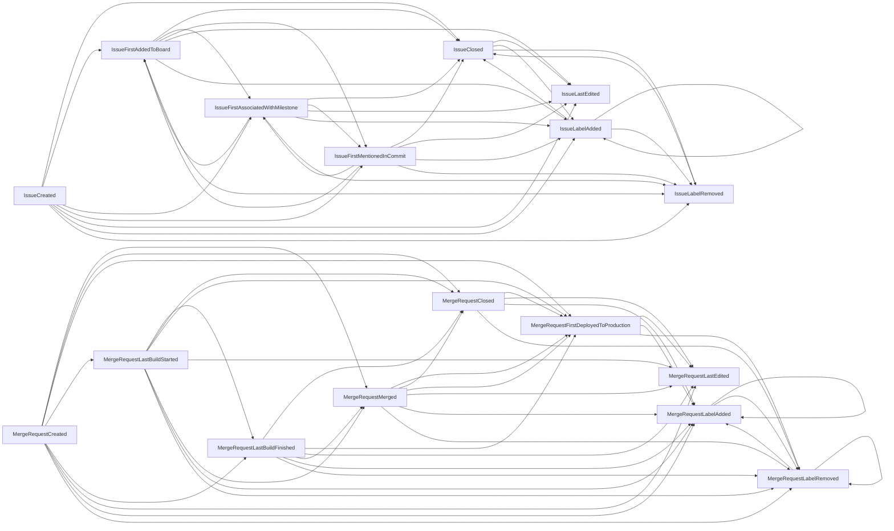

# Value Stream Analytics development guide

Value stream analytics calculates the time between two arbitrary events recorded on domain objects and provides aggregated statistics about the duration.

For information on how to configure Value Stream Analytics in GitLab, see our [analytics documentation](../user/analytics/value_stream_analytics.md).

## Stage

During development, events occur that move issues and merge requests through different stages of progress until they are considered finished. These stages can be expressed with the `Stage` model.

Example stage:

- Name: Development
- Start event: Issue created
- End event: Issue first mentioned in commit
- Parent: `Group: gitlab-org`

### Events

Events are the smallest building blocks of the value stream analytics feature. A stage consists of two events:

- Start
- End

These events play a key role in the duration calculation.

Formula: `duration = end_event_time - start_event_time`

To make the duration calculation flexible, each `Event` is implemented as a separate class. They're responsible for defining a timestamp expression that is used in the calculation query.

#### Implementing an `Event` class

There are a few methods that are required to be implemented, the `StageEvent` base class describes them in great detail. The most important ones are:

- `object_type`
- `timestamp_projection`

The `object_type` method defines which domain object is queried for the calculation. Currently two models are allowed:

- `Issue`
- `MergeRequest`

For the duration calculation the `timestamp_projection` method is used.

```ruby
def timestamp_projection
  # your timestamp expression comes here
end

# event will use the issue creation time in the duration calculation
def timestamp_projection
  Issue.arel_table[:created_at]
end
```

More complex expressions are also possible (for example, using `COALESCE`).
Review the existing event classes for examples.

In some cases, defining the `timestamp_projection` method is not enough. The calculation query should know which table contains the timestamp expression. Each `Event` class is responsible for making modifications to the calculation query to make the `timestamp_projection` work. This usually means joining an additional table.

Example for joining the `issue_metrics` table and using the `first_mentioned_in_commit_at` column as the timestamp expression:

```ruby
def object_type
  Issue
end

def timestamp_projection
  IssueMetrics.arel_table[:first_mentioned_in_commit_at]
end

def apply_query_customization(query)
  # in this case the query attribute will be based on the Issue model: `Issue.where(...)`
  query.joins(:metrics)
end
```

### Validating start and end events

Some start/end event pairs are not "compatible" with each other. For example:

- "Issue created" to "Merge Request created": The event classes are defined on different domain models, the `object_type` method is different.
- "Issue closed" to "Issue created": Issue must be created first before it can be closed.
- "Issue closed" to "Issue closed": Duration is always 0.

The `StageEvents` module describes the allowed `start_event` and `end_event` pairings (`PAIRING_RULES` constant). If a new event is added, it needs to be registered in this module.
To add a new event:

1. Add an entry in `ENUM_MAPPING` with a unique number, which is used in the `Stage` model as `enum`.
1. Define which events are compatible with the event in the `PAIRING_RULES` hash.

Supported start/end event pairings:



### Parent

Teams and organizations might define their own way of building software, thus stages can be completely different. For each stage, a parent object needs to be defined.

Currently supported parents:

- `Project`
- `Group`

#### How parent relationship it work

1. User navigates to the value stream analytics page.
1. User selects a group.
1. Backend loads the defined stages for the selected group.
1. Additions and modifications to the stages are persisted within the selected group only.

### Default stages

The [original implementation](https://gitlab.com/gitlab-org/gitlab/-/issues/847) of value stream analytics defined 7 stages. These stages are always available for each parent, however altering these stages is not possible.

To make things efficient and reduce the number of records created, the default stages are expressed as in-memory objects (not persisted). When the user creates a custom stage for the first time, all the stages are persisted. This behavior is implemented in the value stream analytics service objects.

The reason for this was that we'd like to add the abilities to hide and order stages later on.

## Data Collector

`DataCollector` is the central point where the data is queried from the database. The class always operates on a single stage and consists of the following components:

- `BaseQueryBuilder`:
  - Responsible for composing the initial query.
  - Deals with `Stage` specific configuration: events and their query customizations.
  - Parameters coming from the UI: date ranges.
- `Median`: Calculates the median duration for a stage using the query from  `BaseQueryBuilder`.
- `RecordsFetcher`: Loads relevant records for a stage using the query from  `BaseQueryBuilder` and specific `Finder` classes to apply visibility rules.
- `DataForDurationChart`: Loads calculated durations with the finish time (end event timestamp) for the scatterplot chart.

For a new calculation or a query, implement it as a new method call in the `DataCollector` class.

## Database query

Structure of the database query:

```sql
SELECT (customized by: Median or RecordsFetcher or DataForDurationChart)
FROM OBJECT_TYPE (Issue or MergeRequest)
INNER JOIN (several JOIN statements, depending on the events)
WHERE
  (Filter by the PARENT model, example: filter Issues from Project A)
  (Date range filter based on the OBJECT_TYPE.created_at)
  (Check if the START_EVENT is earlier than END_EVENT, preventing negative duration)
```

Structure of the `SELECT` statement for `Median`:

```sql
SELECT (calculate median from START_EVENT_TIME-END_EVENT_TIME)
```

Structure of the `SELECT` statement for `DataForDurationChart`:

```sql
SELECT (START_EVENT_TIME-END_EVENT_TIME) as duration, END_EVENT.timestamp
```

## High-level overview

- Rails Controller (`Analytics::CycleAnalytics` module): Value stream analytics exposes its data via JSON endpoints, implemented within the `analytics` workspace. Configuring the stages are also implements JSON endpoints (CRUD).
- Services (`Analytics::CycleAnalytics` module): All `Stage` related actions are delegated to respective service objects.
- Models (`Analytics::CycleAnalytics` module): Models are used to persist the `Stage` objects `ProjectStage` and `GroupStage`.
- Feature classes (`Gitlab::Analytics::CycleAnalytics` module):
  - Responsible for composing queries and define feature specific business logic.
  - `DataCollector`, `Event`, `StageEvents`, etc.

## Testing

Since we have a lots of events and possible pairings, testing each pairing is not possible. The rule is to have at least one test case using an `Event` class.

Writing a test case for a stage using a new `Event` can be challenging since data must be created for both events. To make this a bit simpler, each test case must be implemented in the `data_collector_spec.rb` where the stage is tested through the `DataCollector`. Each test case is turned into multiple tests, covering the following cases:

- Different parents: `Group` or `Project`
- Different calculations: `Median`, `RecordsFetcher` or `DataForDurationChart`
