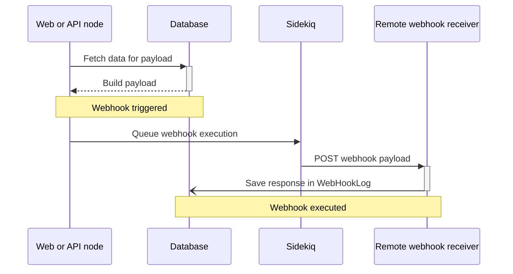

This page is a developer guide for [GitLab webhooks](../user/project/integrations/webhooks.md).

Webhooks POST JSON data about an event or change that happened in GitLab to a webhook receiver.
Using webhooks, customers are notified when certain changes happen instead of needing to poll the API.

## Webhook flow

The following is a high-level description of what happens when a webhook is triggered and executed.



## Adding a new webhook

Webhooks are resource-oriented. For example, "emoji" webhooks are triggered whenever an emoji is awarded or revoked.

To add webhook support for a resource:

1. Add a new column to the `web_hooks` table. The new column must be:
   - A boolean
   - Not null
   - Named in the format `<resource>_events`
   - Default to `false`.

   Example of the `#change` method in a migration:

   ```ruby
   def change
     add_column :web_hooks, :emoji_events, :boolean, null: false, default: false
   end
   ```

1. Add support for the new webhook to `TriggerableHooks.available_triggers`.
1. Add to the list of `triggerable_hooks` in `ProjectHook`, `GroupHook`, or `SystemHook`, depending
   on whether the webhook should be configurable for projects, groups, or the GitLab instance.
   See [project, group and system hooks](#decision-project-group-and-system-webhooks) for guidance.
1. Add frontend support for a new checkbox in the webhook settings form in `app/views/shared/web_hooks/_form.html.haml`.
1. Add support for testing the new webhook in `TestHooks::ProjectService` and/or `TestHooks::SystemService`.
   `TestHooks::GroupService` does not need to be updated because it only
   [executes `ProjectService`](https://gitlab.com/gitlab-org/gitlab/-/blob/1714db7b9cc40438a1f5bf61bef07ce45d33e207/ee/app/services/test_hooks/group_service.rb#L10).
1. Define the [webhook payload](#webhook-payloads).
1. Update GitLab to [trigger the webhook](#triggering-a-webhook).
1. Add [documentation of the webhook](../user/project/integrations/webhook_events.md).
1. Add REST API support:
   1. Update `API::ProjectHooks`, `API::GroupHooks`, and/or `API::SystemHooks` to support the argument.
   1. Update `API::Entities::ProjectHook` and/or `API::Entities::GroupHook` to support the new field.
      (System hook use the generic `API::Entities::Hook`).
   1. Update API documentation for [project webhooks](../api/project_webhooks.md), [group webhooks](../api/group_webhooks.md), and/or [system hooks](../api/system_hooks.md).

### Decision: Project, group, and system webhooks

Use the following to help you decide whether your webhook should be configurable for project, groups,
or a GitLab instance.

- Webhooks that relate to a resource that belongs at that level should be configurable at that level.
  Examples: issue webhooks are configurable for a project, group membership webhooks are configurable
  for a group, and user login failure webhooks are configurable for the GitLab instance.
- Webhooks that can be configured for projects should generally also be made configurable for groups,
  because group webhooks are often configured by group owners to receive events for anything that
  happens to projects in that group, and group webhooks are
  [automatically executed](https://gitlab.com/gitlab-org/gitlab/-/blob/db5b8e427a4a5b704e707f400817781b90738e7b/ee/app/models/ee/project.rb#L846)
  when a project webhook triggers.
- Generally, webhooks configurable for projects or groups (or both) should only be made configurable for the
  instance if there is a clear feature request for instance administrators to receive them.
  Many current project and group webhooks are not configurable at the instance-level.

## EE-only considerations

Group webhooks are a Premium-licensed feature. All code related to triggering group webhooks,
or building payloads for webhooks that are configurable only for groups, [must be in the `ee/` directory](ee_features.md).

## Triggering a webhook

### Triggering project and group webhooks

Project and group webhooks are triggered by calling `#execute_hooks` on a project or group.

The `#execute_hooks` method is passed:

- A [webhook payload](#webhook-payloads) to be POSTed to webhook receivers.
- The name of the webhook type.

For example:

```ruby
project.execute_hooks(payload, :emoji_hooks)
```

When `#execute_hooks` is called on a single project or group, the trigger automatically bubbles up to ancestor groups, which also execute. This allows groups to be configured to receive webhooks for events that happen in any of its
subgroups or projects.

When the method is called on:

- A project, in addition to any webhooks configured of that type for that project executing,
webhooks of that type configured for the project's group and ancestor groups will
[also execute](https://gitlab.com/gitlab-org/gitlab/-/blob/db5b8e427a4a5b704e707f400817781b90738e7b/ee/app/models/ee/project.rb#L846).
Any configured instance (system) webhooks for that type
[also execute](https://gitlab.com/gitlab-org/gitlab/-/blob/95be4945b1fcfe247599d94a60cc6a4a657a3ecf/app/models/project.rb#L1974).
- A group, in addition to any webhooks configured of that type for that group executing, webhooks configured for the
group's ancestor groups will
[also execute](https://gitlab.com/gitlab-org/gitlab/-/blob/6d915390b0b9e1842d7ceba97af2db1ac7f76f65/ee/app/models/ee/group.rb#L826-829).

Building a payload can be expensive because it generally requires that we load more records from the database,
so check `#has_active_hooks?` on the project before triggering the webhook
(support for a similar method for groups is tracked in [issue #517890](https://gitlab.com/gitlab-org/gitlab/-/issues/517890)).

The method returns `true` if either:

- The project or group, or any ancestor groups, have configured webhooks of the given type, and therefore at least one webhook should be executed.
- A [system webhook is configured](https://gitlab.com/gitlab-org/gitlab/-/blob/95be4945b1fcfe247599d94a60cc6a4a657a3ecf/app/models/project.rb#L1974)
  for the given type when called on a project.

Example:

```ruby
def execute_emoji_hooks
  return unless project.has_active_hooks?(:emoji_hooks)

  payload = Gitlab::DataBuilder::Emoji.build(emoji)
  project.execute_hooks(payload, :emoji_hooks)
end
```

### Triggering instance (system) webhooks

When webhooks for projects are triggered, system webhooks configured for the webhook type are
[executed automatically](https://gitlab.com/gitlab-org/gitlab/-/blob/95be4945b1fcfe247599d94a60cc6a4a657a3ecf/app/models/project.rb#L1974).

You can also trigger a system hook through `SystemHooksService` if the webhook is not also configurable for projects.

Example:

```ruby
SystemHooksService.new.execute_hooks_for(user, :create)
```

You need to update `SystemHooksService` to have it build data for the resource.

### Trigger with accurate payloads

Webhook payloads must accurately represent the state of data at the time of the event.
Care should be taken to avoid problems that arise due to race conditions or concurrent processes changing the state of data,
which would lead to inaccurate payloads being sent to webhook receivers.

Some tips to do this:

- Try to avoid reloading the object before building the payload as another process might have changed its state.
- Build the payload immediately after the event has happened so any extra data that is loaded for the payload also
  reflects state at the time of the event.

Both of these points mean the payload must generally be built in-request and not async using Sidekiq.

The exception would be if a payload always contained only immutable data, but this is generally not the case.

## Webhook payloads

A webhook payload is the JSON data POSTed to a webhook receiver.

See existing webhook payloads documented in the [webhook events documentation](../user/project/integrations/webhook_events.md).

### What should not be in a webhook payload?

Sensitive data should never be included in webhook payloads. This includes secrets and non-public
user emails (private user emails are
[redacted automatically](https://gitlab.com/gitlab-org/gitlab/-/blob/e18b7894ba50e4db90826612fdcd4081e1ba279e/app/models/user.rb#L2512-2514)
through `User#hook_attrs`).

Building webhook payloads must be [very performant](#minimizing-database-requests),
so every new property added to a webhook payload must be justified against any overheads of
retrieving it from the database.

Consider, on balance, if it would be better for a minority of customers to need to fetch
some data about an object from the API after receiving a smaller webhook than for all customers
to receive the data in the webhook payload. In this scenario, there is a difference in time
between when the webhook is built to when the customer retrieves the extra data.
The delay can mean the API data and the webhook data can represent different states in time.

### Defining payloads

Objects should define a `#hook_attrs` method to return the object attributes for the webhook payload.

The attributes in `#hook_attrs` must be defined with static keys. The method must return
a specific set of attributes and not just the attributes returned by `#attributes` or `#as_json`.
Otherwise, all future attributes of the model will be included in webhook payloads
(see [issue 440384](https://gitlab.com/gitlab-org/gitlab/-/issues/440384)).

A module or class in `Gitlab::DataBuilder::` should compose the full payload. The full payload usually
includes associated objects.

See [payload schema](#payload-schema) for the structure of the full payload.

For example:

```ruby
# An object defines #hook_attrs:
class Car < ApplicationRecord
  def hook_attrs
    {
      make: make,
      color: color
    }
  end
end

# A Gitlab::DataBuilder module or class composes the full webhook payload:
module Gitlab
  module DataBuilder
    module Car
      extend self

      def build(car, action)
        {
          object_kind: 'car',
          action: action,
          object_attributes: car.hook_attrs,
          driver: car.driver.hook_attrs # Calling #hook_attrs on associated data
        }
      end
    end
  end
end

# Building the payload:
Gitlab::DataBuilder::Car.build(car, 'start')
```

### Payload schema

Historically there has been a lot of inconsistency between the payload schemas of different types of webhooks.

Going forward, unless the payload for a new type of webhook should resemble an existing one for consistency
reasons (for example, a webhook for a new issuable), the schema for new webhooks must follow these rules:

- The schema for new webhooks must have these required properties:
  - `"object_kind"`, the kind of object in snake case. Example: `"merge_request"`.
  - `"action"`, a domain-specific verb of what just happened, using present tense. Examples: `"create"`,
     `"assign"`, `"update"` or `"revoke"`. This helps receivers to identify and handle different
     kind of changes that happen to an object when webhooks are triggered at different points in the
     object's lifecycle.
  - `"object_attributes"`, contains the attributes of the object after the event. These attributes are generated from [`#hook_attrs`](#defining-payloads).
- Associated data must be top-level in the payload and not nested in `"object_attributes"`.
- If the payload includes a record of [changed attribute values](#including-an-object-of-changes), these must be in a top-level `"changes"` object.

A [JSON schema](https://json-schema.org) description of the above:

```json
{
  "$schema": "http://json-schema.org/draft-07/schema#",
  "description": "Recommended GitLab webhook payload schema",
  "type": "object",
  "properties": {
    "object_kind": {
      "type": "string",
      "description": "Kind of object in snake case. Example: merge_request",
      "pattern": "^([a-zA-Z]+(_[a-zA-Z]+)*)$"
    },
    "action": {
      "type": "string",
      "description": "A domain-specific verb of what just happened to the object, using present tense. Examples: create, revoke",
    },
    "object_attributes": {
      "type": "object",
      "description": "Attributes of the object after the event"
    },
    "changes": {
      "type": "object",
      "description": "Optional object attributes that were changed during the event",
      "patternProperties": {
        ".+" : {
          "type" : "object",
          "properties": {
            "previous": {
              "description": "Value of attribute before the event"
            },
            "current": {
              "description": "Value of attribute after the event"
            }
          },
          "required": ["previous", "current"]
        }
      }
    }
  },
  "required": ["object_kind", "action", "object_attributes"]
}
```

Example of a webhook payload for an imaginary `Car` object
that follows the above payload schema:

```json
{
  "object_kind": "car",
  "action": "start",
  "object_attributes": {
    "make": "Toyota",
    "color": "grey"
  },
  "driver": {
    "name": "Kaya",
    "age": 18
  }
}
```

### Including an object of changes

If your payload should include a list of attribute changes of an object,
add the
`ReportableChanges` module to the model.
The module collects all changes to attribute values from the time the object is loaded
through to all subsequent saves. This can be useful where there
are multiple save operations on an object in a given request context and
final hooks need access to the cumulative delta, not just that of the
most recent save.

See [payload schema](#payload-schema) for how to include attribute changes in the payload.

### Minimizing database requests

Some types of webhooks are triggered millions of times a day on GitLab.com.

Loading additional data for the webhook payload must be performant because we need to
[build payloads in-request](#trigger-with-accurate-payloads) and not on Sidekiq.
On GitLab.com, this also means additional data for the payload is loaded from the PostgreSQL
primary because webhooks are triggered following a database write.

To minimize data requests when building a webhook payload:

- [Weigh up the importance](#what-should-not-be-in-a-webhook-payload) of adding additional data
  to a webhook payload.
- Preload additional data to avoid N+1 problems.
- Assert the number of database calls made to build a webhook payload [in a test](#testing) to
  avoid regressions.

You might need to preload data on a record that has already been loaded.
In this case, you can use `ActiveRecord::Associations::Preloader`.

If the associated data is only needed to build the webhook payload, only preload this associated
data after the [`#has_active_hooks?` check](#triggering-project-and-group-webhooks) has passed.

A good working example of this in our codebase is
[`Gitlab::DataBuilder::Pipeline`](https://gitlab.com/gitlab-org/gitlab/-/blob/86708b4b3014122a29ab5eed9e305bd0821d22b1/lib/gitlab/data_builder/pipeline.rb#L46).

For example:

```ruby
# Working with an issue that has been loaded
issue = Issue.first

# Imagine we have performed the #has_active_hooks? check and now are building the webhook payload.
# Doing this will perform N+1 database queries:
# issue.notes.map(&:author).map(&:name)
#
# Instead, first preload the associations to avoid the N+1
ActiveRecord::Associations::Preloader.new(records: [issue], associations: { notes: :author }).call;
issue.notes.map(&:author).map(&:name)
```

### Breaking changes

We cannot make breaking changes to webhook payloads.

If a webhook receiver might encounter errors due to a change to a webhook payload,
the change is a breaking one.

Only additive changes can be made, where new properties are added.

Breaking changes include:

- Removing a property.
- Renaming a property.
- A change to the value of the `"object_kind"` property.
- A change to a value of the `"action"` property.

If the value of a property other than `"object_kind"` or `"action"` must change, for example due
to feature removal, set the value to `null`, `{}`, or `[]` rather than remove the property.

## Testing

When writing a unit test for the [`DataBuilder` class](#defining-payloads), assert that:

- A set number of database requests are made, using [`QueryRecorder`](database/query_recorder.md),
  You can do this by measuring the number of queries using `QueryRecorder` and then
  comparing against that number in the spec, to ensure that the query count does
  not change without our conscious choice. Also see [preloading](#minimizing-database-requests) of associated data.
- The payload has the expected properties.

Also test the scenarios where the webhook should be triggered (or not triggered), to assert that it does correctly trigger.

### QAing changes

You can configure the webhook URL to one provided by <https://webhook.site> to view the full webhook headers and payloads generated when the webhook is triggered.

## Having changes reviewed

In addition to the [usual reviewers for code review](code_review.md#approval-guidelines), changes to webhooks
should be reviewed by a backend team member from
[Import & Integrate](https://handbook.gitlab.com/handbook/product/categories/#import-and-integrate-group).
