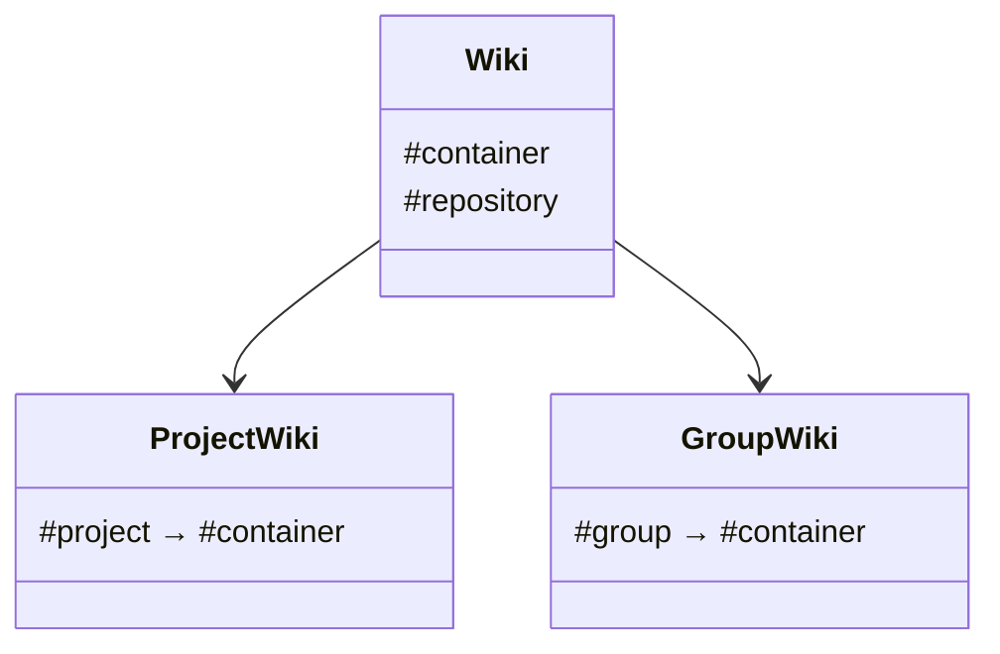

Wiki functionality in GitLab uses Git repositories as the storage backend and is accessed from
the Rails app through Gitaly RPC calls.

You can access wikis through:

- The [Web UI](../user/project/wiki/_index.md)
- The [REST API](../api/wikis.md)
- [Git itself](../user/project/wiki/_index.md#create-or-edit-wiki-pages-locally)

## Involved Gems

Some notable gems that are used for wikis are:

| Component     | Description                                    | Gem name                       | GitLab project                                                                                          | Upstream project                                                    |
|:--------------|:-----------------------------------------------|:-------------------------------|:--------------------------------------------------------------------------------------------------------|:--------------------------------------------------------------------|
| `gitlab`      | Markup renderer, depends on various other gems | `gitlab-markup`                | [`gitlab-org/gitlab-markup`](https://gitlab.com/gitlab-org/gitlab-markup)                               | [`github/markup`](https://github.com/github/markup)                 |

## Wiki rendering

When rendering wiki pages, we use a
[custom Banzai pipeline](https://gitlab.com/gitlab-org/gitlab/-/blob/master/lib/banzai/pipeline/wiki_pipeline.rb).
This pipeline adds [wiki-specific markup](../user/project/wiki/markdown.md),
such as the `[[link]]` syntax.

## Model classes

The `Wiki` class is the main abstraction around a wiki repository.
You must initialize it with a container, which can be either a `Project` or `Group`:

Some models wrap similar classes from Gitaly:

| Rails Model | Gitaly Class                                            |
|:------------|:--------------------------------------------------------|
| `Wiki`      | `Gitlab::Git::Wiki`                                     |
| `WikiPage`  | `Gitlab::Git::WikiPage`, `Gitlab::Git::WikiPageVersion` |
|             | `Gitlab::Git::WikiFile`                                 |

Only some data is persisted in the database:

| Model                 | Description                              |
|:----------------------|:-----------------------------------------|
| `WikiPage::Meta`      | Metadata for wiki pages                  |
| `WikiPage::Slug`      | Current and previous slugs of wiki pages |
| `ProjectRepository`   | Gitaly storage data for project wikis    |
| `GroupWikiRepository` | Gitaly storage data for group wikis      |

## Attachments

The web UI uploads attachments through the REST API, which stores the files as commits in the wiki repository.
