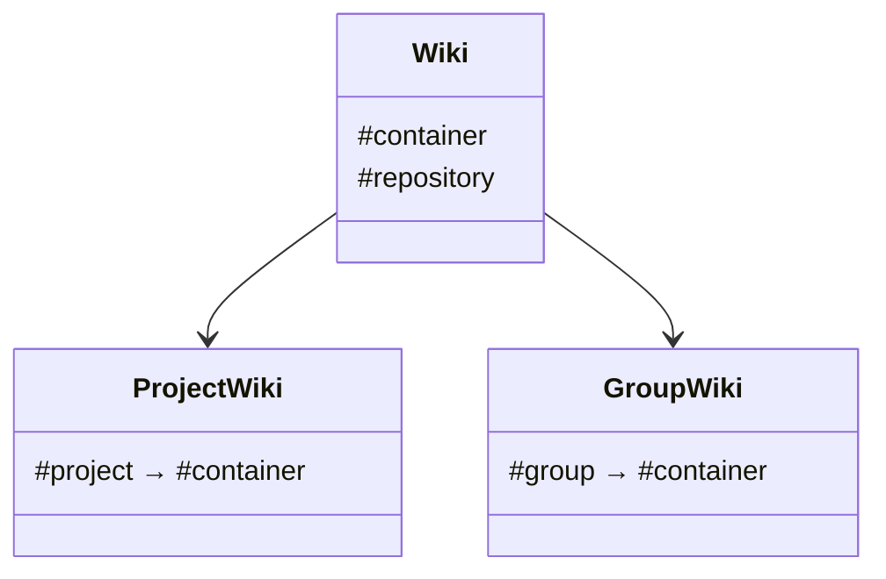

The wiki functionality in GitLab is based on [Gollum 4.x](https://github.com/gollum/gollum/).
It's used in the [Gitaly](gitaly.md) Ruby service, and accessed from the Rails app through Gitaly RPC calls.

Wikis use Git repositories as storage backend, and can be accessed through:

- The [Web UI](../user/project/wiki/_index.md)
- The [REST API](../api/wikis.md)
- [Git itself](../user/project/wiki/_index.md#create-or-edit-wiki-pages-locally)

## Involved Gems

Some notable gems that are used for wikis are:

| Component     | Description                                    | Gem name                       | GitLab project                                                                                          | Upstream project                                                    |
|:--------------|:-----------------------------------------------|:-------------------------------|:--------------------------------------------------------------------------------------------------------|:--------------------------------------------------------------------|
| `gitlab`      | Markup renderer, depends on various other gems | `gitlab-markup`                | [`gitlab-org/gitlab-markup`](https://gitlab.com/gitlab-org/gitlab-markup)                               | [`github/markup`](https://github.com/github/markup)                 |

### Notes on Gollum

We only use Gollum as a storage abstraction layer, to handle the mapping between wiki page slugs and files in the repository.

When rendering wiki pages, we don't use Gollum at all and instead go through a
[custom Banzai pipeline](https://gitlab.com/gitlab-org/gitlab/-/blob/master/lib/banzai/pipeline/wiki_pipeline.rb).
This adds some [wiki-specific markup](../user/markdown.md#wiki-specific-markdown), such as the Gollum `[[link]]` syntax.

Because we do not make use of most of the Gollum features, we plan to move away from it entirely at some point.
[See this epic](https://gitlab.com/groups/gitlab-org/-/epics/2381) for reference.

## Model classes

The `Wiki` class is the main abstraction around a wiki repository, it needs to be initialized
with a container which can be either a `Project` or `Group`:

Some models wrap similar classes from Gitaly and Gollum:

| Rails Model | Gitaly Class                                            | Gollum         |
|:------------|:--------------------------------------------------------|:---------------|
| `Wiki`      | `Gitlab::Git::Wiki`                                     | `Gollum::Wiki` |
| `WikiPage`  | `Gitlab::Git::WikiPage`, `Gitlab::Git::WikiPageVersion` | `Gollum::Page` |
|             | `Gitlab::Git::WikiFile`                                 | `Gollum::File` |

Only some data is persisted in the database:

| Model                 | Description                              |
|:----------------------|:-----------------------------------------|
| `WikiPage::Meta`      | Metadata for wiki pages                  |
| `WikiPage::Slug`      | Current and previous slugs of wiki pages |
| `ProjectRepository`   | Gitaly storage data for project wikis    |
| `GroupWikiRepository` | Gitaly storage data for group wikis      |

## Attachments

The web UI uploads attachments through the REST API, which stores the files as commits in the wiki repository.

## Related topics

- [Gollum installation instructions](https://github.com/gollum/gollum/wiki/Installation)
