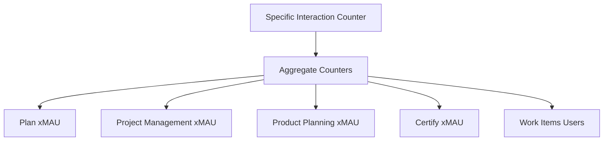

Work items introduce a flexible model that standardizes and extends issue tracking capabilities in GitLab.
With work items, you can define different types that can be customized with various widgets to meet
specific needs - whether you're tracking bugs, incidents, test cases, or other units of work.
This architectural documentation covers the development details and implementation strategies for
work items and work item types.

## Challenges

Issues have the potential to be a centralized hub for collaboration.
We need to accept the
fact that different issue types require different fields and different context, depending
on what job they are being used to accomplish. For example:

- A bug needs to list steps to reproduce.
- An incident needs references to stack traces and other contextual information relevant only
  to that incident.

Instead of each object type diverging into a separate model, we can standardize on an underlying
common model that we can customize with the widgets (one or more attributes) it contains.

Here are some problems with current issues usage and why we are looking into work items:

- Using labels to show issue types is cumbersome and makes reporting views more complex.
- Issue types are one of the top two use cases of labels, so it makes sense to provide first class
  support for them.
- Issues are starting to become cluttered as we add more capabilities to them, and they are not
  perfect:

  - There is no consistent pattern for how to surface relationships to other objects.
  - There is not a coherent interaction model across different types of issues because we use
    labels for this.
  - The various implementations of issue types lack flexibility and extensibility.

- Epics, issues, requirements, and others all have similar but just subtle enough
  differences in common interactions that the user needs to hold a complicated mental
  model of how they each behave.
- Issues are not extensible enough to support all of the emerging jobs they need to facilitate.
- Codebase maintainability and feature development becomes a bigger challenge as we grow the Issue type
  beyond its core role of issue tracking into supporting the different work item types and handling
  logic and structure differences.
- New functionality is typically implemented with first class objects that import behavior from issues via
  shared concerns. This leads to duplicated effort and ultimately small differences between common interactions. This
  leads to inconsistent UX.

## Work item terminology

To avoid confusion and ensure [communication is efficient](https://handbook.gitlab.com/handbook/communication/#mecefu-terms), we will use the following terms exclusively when discussing work items. This list is the [single source of truth (SSoT)](https://handbook.gitlab.com/handbook/values/#single-source-of-truth) for Work Item terminology.

| Term              | Description | Example of misuse | Should be |
| ---               | ---         | ---               | ---       |
| work item type    | Classes of work item; for example: issue, requirement, test case, incident, or task | _Epics will eventually become issues_ | _Epics will eventually become a **work item type**_ |
| work item         | An instance of a work item type | | |
| work item view    | The new frontend view that renders work items of any type | _This should be rendered in the new view_ | _This should be rendered in the work item view_ |
| legacy object     | An object that has been or will be converted to a Work Item Type | _Epics will be migrated from a standalone/old/former object to a work item type_ | _Epics will be converted from a legacy object to a work item type_ |
| legacy issue view | The existing view used to render issues and incidents | _Issues continue to be rendered in the old view_ | _Issues continue to be rendered in the legacy issue view_ |
| issue             | The existing issue model | | |
| issuable          | Any model currently using the issuable module (issues, epics and MRs) | _Incidents are an **issuable**_ | _Incidents are a **work item type**_ |
| widget            | A UI element to present or allow interaction with specific work item data | | |

Some terms have been used in the past but have since become confusing and are now discouraged.

| Term              | Description | Example of misuse | Should be |
| ---               | ---         | ---               | ---       |
| issue type        | A former way to refer to classes of work item | _Tasks are an **issue type**_ | _Tasks are a **work item type**_ |

## Work items development

During development, work items progress through three stages, managed by using feature flags:

1. `work_items_alpha` for internal team testing ([`gitlab-org/plan-stage`](https://gitlab.com/gitlab-org/plan-stage)).
1. `work_items_beta` for broader internal GitLab testing ([`gitlab-org`](https://gitlab.com/gitlab-org) and [`gitlab-com`](https://gitlab.com/gitlab-com)).
1. `work_items`, enabled by default for SaaS and self-managed environments.

_Other groups may be included. For the latest information, query the feature flags within [chatops](feature_flags/controls.md)._

For more information about these feature flags, see
[Work Items Architecture Blueprint](https://handbook.gitlab.com/handbook/engineering/architecture/design-documents/work_items/#feature-flags).

## Migration strategy

WI model will be built on top of the existing `Issue` model and we'll gradually migrate `Issue`
model code to the WI model.

One way to approach it is:

```ruby
class WorkItems::WorkItem < ApplicationRecord
  self.table_name = 'issues'

  # ... all the current issue.rb code
end

class Issue < WorkItems::WorkItem
  # Do not add code to this class add to WorkItems:WorkItem
end
```

We already use the concept of WITs within `issues` table through `issue_type`
column. There are `issue`, `incident`, and `test_case` issue types. To extend this
so that in future we can allow users to define custom WITs, we will
move the `issue_type` to a separate table: `work_item_types`. The migration process of `issue_type`
to `work_item_types` will involve creating the set of WITs for all root-level groups as described in
[this epic](https://gitlab.com/groups/gitlab-org/-/epics/6536).

NOTE:
At first, defining a WIT will only be possible at the root-level group, which would then be inherited by subgroups.
We will investigate the possibility of defining new WITs at subgroup levels at a later iteration.

## Introducing `work_item_types` table

For example, suppose there are three root-level groups with IDs: `11`, `12`, and `13`. Also,
assume the following base types: `issue: 0`, `incident: 1`, `test_case: 2`.

The respective `work_item_types` records:

| `namespace_id` | `base_type` | `title`   |
| -------------- | ----------- | --------- |
| 11             | 0           | Issue     |
| 11             | 1           | Incident  |
| 11             | 2           | Test Case |
| 12             | 0           | Issue     |
| 12             | 1           | Incident  |
| 12             | 2           | Test Case |
| 13             | 0           | Issue     |
| 13             | 1           | Incident  |
| 13             | 2           | Test Case |

What we will do to achieve this:

1. Add a `work_item_type_id` column to the `issues` table.
1. Ensure we write to both `issues#issue_type` and `issues#work_item_type_id` columns for
   new or updated issues.
1. Backfill the `work_item_type_id` column to point to the `work_item_types#id` corresponding
   to issue's project top-level groups. For example:

   ```ruby
   issue.project.root_group.work_item_types.where(base_type: issue.issue_type).first.id.
   ```

1. After `issues#work_item_type_id` is populated, we can switch our queries from
   using `issue_type` to using `work_item_type_id`.

To introduce a new WIT there are two options:

- Follow the first step of the above process. We will still need to run a migration
  that adds a new WIT for all root-level groups to make the WIT available to
  all users. Besides a long-running migration, we'll need to
  insert several million records to `work_item_types`. This might be unwanted for users
  that do not want or need additional WITs in their workflow.
- Create an opt-in flow, so that the record in `work_item_types` for specific root-level group
  is created only when a customer opts in. However, this implies a lower discoverability
  of the newly introduced work item type.

## Work item type widgets

A widget is a single component that can exist on a work item. This component can be used on one or
many work item types and can be lightly customized at the point of implementation.

A widget contains both the frontend UI (if present) and the associated logic for presenting and
managing any data used by the widget. There can be a one-to-many connection between the data model
and widgets. It means there can be multiple widgets that use or manage the same data, and they could
be present at the same time (for example, a read-only summary widget and an editable detail widget,
or two widgets showing two different filtered views of the same model).

Widgets should be differentiated by their **purpose**. When possible, this purpose should be
abstracted to the highest reasonable level to maximize reusability. For example, the widget for
managing "tasks" was built as "child items". Rather than managing one type of child, it's abstracted
up to managing any children.

All WITs will share the same pool of predefined widgets and will be customized by
which widgets are active on a specific WIT. Every attribute (column or association)
will become a widget with self-encapsulated functionality regardless of the WIT it belongs to.
Because any WIT can have any widget, we only need to define which widget is active for a
specific WIT. So, after switching the type of a specific work item, we display a different set
of widgets.

Read more about [work item widgets](work_items_widgets.md) and how to create a new one.

## Widgets metadata

In order to customize each WIT with corresponding active widgets we will need a data
structure to map each WIT to specific widgets.

The intent is for work item types to be highly configurable, both by GitLab for
implementing various work item schemes for customers (an opinionated GitLab
workflow, or SAFe 5, etc), and eventually for customers to customize their own
workflows.

In this case, a work item scheme would be defined as a set of types with
certain characteristics (some widgets enabled, others not), such as an Epic,
Story, Bug, and Task, etc.

As we're building a new work item architecture, we want to build the ability to
define these various types in a very flexible manner. Having GitLab use
this system first (without introducing customer customization) allows us to
better build out the initial system.

Work item's `base_type` is used to define static mapping of what
widgets are available for each type (current status), this definition should be
rather stored in a database table. The exact structure of the WIT widgets metadata
is [still to be defined](https://gitlab.com/gitlab-org/gitlab/-/issues/370599).
`base_type` was added to help convert other types of resources (requirements
and incidents) into work items. Eventually (when these resources become regular
work items), `base_type` will be removed.

Until the architecture of WIT widgets is finalized, we are holding off on the creation of new work item
types. If a new work item type is absolutely necessary, reach out to a
member of the [Project Management Engineering Team](https://gitlab.com/gitlab-org/gitlab/-/issues/370599).

## Creating a new work item type in the database

We have completed the removal of the `issue_type` column from the issues table, in favor of using the new
`work_item_types` table as described in [this epic](https://gitlab.com/groups/gitlab-org/-/epics/6536)).

After the introduction of the `work_item_types` table, we added more `work_item_types`, and we want to make it
easier for other teams to do so. To introduce a new `work_item_type`, you must:

1. Write a database migration to create a new record in the `work_item_types` table.
1. Update `Gitlab::DatabaseImporters::WorkItems::BaseTypeImporter`.

The following MRs demonstrate how to introduce new `work_item_types`:

- [MR example 1](https://gitlab.com/gitlab-org/gitlab/-/merge_requests/127482)
- [MR example 2](https://gitlab.com/gitlab-org/gitlab/-/merge_requests/127917)

### Write a database migration

First, write a database migration that creates the new record in the `work_item_types` table.

Keep the following in mind when you write your migration:

- **Important:** Exclude new type from existing APIs.
  - We probably want to exclude newly created work items of this type from showing
    up in existing features (like issue lists) until we fully release a feature. For this reason,
    we have to add a new type to
    [this exclude list](https://gitlab.com/gitlab-org/gitlab/-/blob/a0a52dd05b5d3c6ca820b672f9c0626840d2429b/app/models/work_items/type.rb#L84),
    unless it is expected that users can create new issues and work items with the new type as soon as the migration
    is executed.
- Use a regular migration, not a post-deploy.
  - We believe it would be beneficial to use
    [regular migrations](migration_style_guide.md#choose-an-appropriate-migration-type)
    to add new work item types instead of a
    [post deploy migration](database/post_deployment_migrations.md).
    This way, follow-up MRs that depend on the type being created can assume it exists right away,
    instead of having to wait for the next release.

    **Important:** Because we use a regular migration, we need to make sure it does two things:

    1. Don't exceed the [time guidelines](migration_style_guide.md#how-long-a-migration-should-take) of regular migrations.
    1. Make sure the migration is [backwards-compatible](multi_version_compatibility.md).
       This means that deployed code should continue to work even if the MR that introduced this migration is
       rolled back and the migration is not.
- Migrations should avoid failures.
  - We expect data related to `work_item_types` to be in a certain state when running the migration that will create a new
    type. At the moment, we write migrations that check the data and don't fail in the event we find
    it in an inconsistent state. There's a discussion about how much we can rely on the state of data based on seeds and
    migrations in [this issue](https://gitlab.com/gitlab-org/gitlab/-/issues/423483). We can only
    have a successful pipeline if we write the migration so it doesn't fail if data exists in an inconsistent
    state. We probably need to update some of the database jobs in order to change this.
- Add widget definitions for the new type.
  - The migration adds the new work item type as well as the widget definitions that are required for each work item.
    The widgets you choose depend on the feature the new work item supports, but there are some that probably
    all new work items need, like `Description`.
- Optional. Create hierarchy restrictions.
  - In one of the example MRs we also insert records in the `work_item_hierarchy_restrictions` table. This is only
    necessary if the new work item type is going to use the `Hierarchy` widget. In this table, you must add what
    work item type can have children and of what type. Also, you should specify the hierarchy depth for work items of the same
    type. By default a cross-hierarchy (cross group or project) relationship is disabled when creating new restrictions but
    it can be enabled by specifying a value for `cross_hierarchy_enabled`. Due to the restrictions being cached for the work item type, it's also
    required to call `clear_reactive_cache!` on the associated work item types.
- Optional. Create linked item restrictions.
  - Similarly to the `Hierarchy` widget, the `Linked items` widget also supports rules defining which work item types can be
    linked to other types. A restriction can specify if the source type can be related to or blocking a target type. Current restrictions:

    | Type       | Can be related to                        | Can block                                | Can be blocked by                        |
    |------------|------------------------------------------|------------------------------------------|------------------------------------------|
    | Epic       | Epic, issue, task, objective, key result | Epic, issue, task, objective, key result | Epic, issue, task                        |
    | Issue      | Epic, issue, task, objective, key result | Epic, issue, task, objective, key result | Epic, issue, task                        |
    | Task       | Epic, issue, task, objective, key result | Epic, issue, task, objective, key result | Epic, issue, task                        |
    | Objective  | Epic, issue, task, objective, key result | Objective, key result                    | Epic, issue, task, objective, key result |
    | Key result | Epic, issue, task, objective, key result | Objective, key result                    | Epic, issue, task, objective, key result |

- Use shared examples for migrations specs.

  There are different shared examples you should use for the different migration types (new work item type, new widget definition, etc) in
  [`add_work_item_widget_shared_examples.rb`](https://gitlab.com/gitlab-org/gitlab/-/blob/14c0a4df57a562a7c2dd4baed98f26d208a2e6ce/spec/support/shared_examples/migrations/add_work_item_widget_shared_examples.rb).

#### Example of adding a ticket work item

The `Ticket` work item type already exists in the database, but we'll use it as an example migration.
Note that for a new type you need to use a new name and ENUM value.

```ruby
class AddTicketWorkItemType < Gitlab::Database::Migration[2.1]
  disable_ddl_transaction!
  restrict_gitlab_migration gitlab_schema: :gitlab_main

  ISSUE_ENUM_VALUE = 0
  # Enum value comes from the model where the enum is defined in
  # https://gitlab.com/gitlab-org/gitlab/-/blob/1253f12abddb69cd1418c9e13e289d828b489f36/app/models/work_items/type.rb#L30.
  # A new work item type should simply pick the next integer value.
  TICKET_ENUM_VALUE = 8
  TICKET_NAME = 'Ticket'
  # Widget definitions also have an enum defined in
  # https://gitlab.com/gitlab-org/gitlab/-/blob/1253f12abddb69cd1418c9e13e289d828b489f36/app/models/work_items/widget_definition.rb#L17.
  # We need to provide both the enum and name as we plan to support custom widget names in the future.
  TICKET_WIDGETS = {
    'Assignees' => 0,
    'Description' => 1,
    'Hierarchy' => 2,
    'Labels' => 3,
    'Milestone' => 4,
    'Notes' => 5,
    'Start and due date' => 6,
    'Health status' => 7,
    'Weight' => 8,
    'Iteration' => 9,
    'Notifications' => 14,
    'Current user todos' => 15,
    'Award emoji' => 16
  }.freeze

  class MigrationWorkItemType < MigrationRecord
    self.table_name = 'work_item_types'
  end

  class MigrationWidgetDefinition < MigrationRecord
    self.table_name = 'work_item_widget_definitions'
  end

  class MigrationHierarchyRestriction < MigrationRecord
    self.table_name = 'work_item_hierarchy_restrictions'
  end

  def up
    existing_ticket_work_item_type = MigrationWorkItemType.find_by(base_type: TICKET_ENUM_VALUE, namespace_id: nil)

    return say('Ticket work item type record exists, skipping creation') if existing_ticket_work_item_type

    new_ticket_work_item_type = MigrationWorkItemType.create(
      name: TICKET_NAME,
      namespace_id: nil,
      base_type: TICKET_ENUM_VALUE,
      icon_name: 'issue-type-issue'
    )

    return say('Ticket work item type create record failed, skipping creation') if new_ticket_work_item_type.new_record?

    widgets = TICKET_WIDGETS.map do |widget_name, widget_enum_value|
      {
        work_item_type_id: new_ticket_work_item_type.id,
        name: widget_name,
        widget_type: widget_enum_value
      }
    end

    MigrationWidgetDefinition.upsert_all(
      widgets,
      unique_by: :index_work_item_widget_definitions_on_default_witype_and_name
    )

    issue_type = MigrationWorkItemType.find_by(base_type: ISSUE_ENUM_VALUE, namespace_id: nil)
    return say('Issue work item type not found, skipping hierarchy restrictions creation') unless issue_type

    # This part of the migration is only necessary if the new type uses the `Hierarchy` widget.
    restrictions = [
      { parent_type_id: new_ticket_work_item_type.id, child_type_id: new_ticket_work_item_type.id, maximum_depth: 1 },
      { parent_type_id: new_ticket_work_item_type.id, child_type_id: issue_type.id, maximum_depth: 1 }
    ]

    MigrationHierarchyRestriction.upsert_all(
      restrictions,
      unique_by: :index_work_item_hierarchy_restrictions_on_parent_and_child
    )
  end

  def down
    # There's the remote possibility that issues could already be
    # using this issue type, with a tight foreign constraint.
    # Therefore we will not attempt to remove any data.
  end
end
```

<!-- markdownlint-disable-next-line MD044 -->
### Update Gitlab::DatabaseImporters::WorkItems::BaseTypeImporter

The [BaseTypeImporter](https://gitlab.com/gitlab-org/gitlab/-/blob/f816a369d7d6bbd1d8d53d6c0bca4ca3389fdba7/lib/gitlab/database_importers/work_items/base_type_importer.rb)
is where we can clearly visualize the structure of the types we have and what widgets are associated with each of them.
`BaseTypeImporter` is the single source of truth for fresh GitLab installs and also our test suite. This should always
reflect what we change with migrations.

## Custom work item types

With the WIT widget metadata and the workflow around mapping WIT to specific
widgets, we will be able to expose custom WITs to the users. Users will be able
to create their own WITs and customize them with widgets from the predefined pool.

## Custom widgets

The end goal is to allow users to define custom widgets and use these custom
widgets on any WIT. But this is a much further iteration and requires additional
investigation to determine both data and application architecture to be used.

## Migrate requirements and epics to work item types

We'll migrate requirements and epics into work item types, with their own set
of widgets. To achieve that, we'll migrate data to the `issues` table,
and we'll keep current `requirements` and `epics` tables to be used as proxies for old references to ensure
backward compatibility with already existing references.

### Migrate requirements to work item types

Currently `Requirement` attributes are a subset of `Issue` attributes, so the migration
consists mainly of:

- Data migration.
- Keeping backwards compatibility at API levels.
- Ensuring that old references continue to work.

The migration to a different underlying data structure should be seamless to the end user.

### Migrate epics to work item types

`Epic` has some extra functionality that the `Issue` WIT does not currently have.
So, migrating epics to a work item type requires providing feature parity between the current `Epic` object and WITs.

The main missing features are:

- Get work items to the group level. This is dependent on [Consolidate Groups and Projects](https://gitlab.com/gitlab-org/architecture/tasks/-/issues/7)
  initiative.
- A hierarchy widget: the ability to structure work items into hierarchies.
- Inherited date widget.

To avoid disrupting workflows for users who are already using epics, we will introduce a new WIT
called `Feature` that will provide feature parity with epics at the project-level. Having that combined with progress
on [Consolidate Groups and Projects](https://gitlab.com/gitlab-org/architecture/tasks/-/issues/7) front will help us
provide a smooth migration path of epics to WIT with minimal disruption to user workflow.

## Work item, work item type, and widgets roadmap

We will move towards work items, work item types, and custom widgets (CW) in an iterative process.
For a rough outline of the work ahead of us, see [epic 6033](https://gitlab.com/groups/gitlab-org/-/epics/6033).

## Redis HLL Counter Schema

We need a more scalable Redis counter schema for work items that is inclusive of Plan xMAU, Project Management xMAU, Certify xMAU, and
Product Planning xMAU. We cannot aggregate and dedupe events across features within a group or at the stage level with
our current Redis slot schema.

All three Plan product groups will be using the same base object (`work item`). Each product group still needs to
track MAU.

### Proposed aggregate counter schema



### Implementation

The new aggregate schema is already implemented and we are already tracking work item unique actions
in [GitLab.com](https://gitlab.com).

For implementation details, this [MR](https://gitlab.com/gitlab-org/gitlab/-/merge_requests/93231) can be used
as a reference. The MR covers the definition of new unique actions, event tracking in the code and also
adding the new unique actions to the required aggregate counters.

## Related topics

- [Design management](../user/project/issues/design_management.md)
