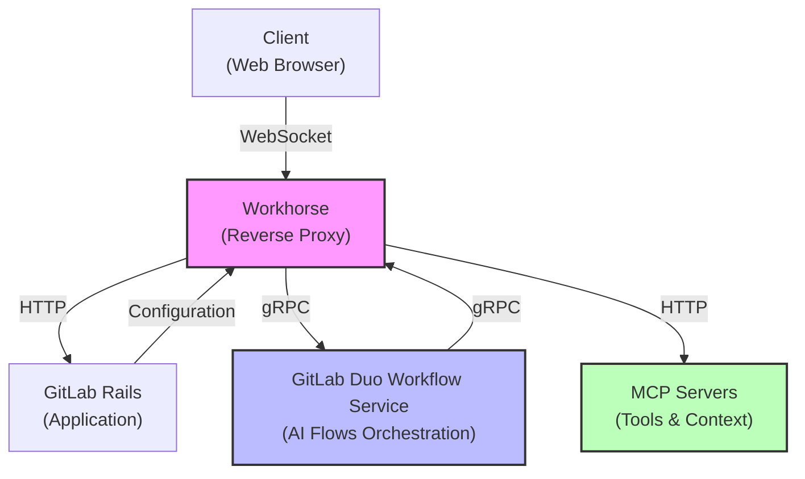
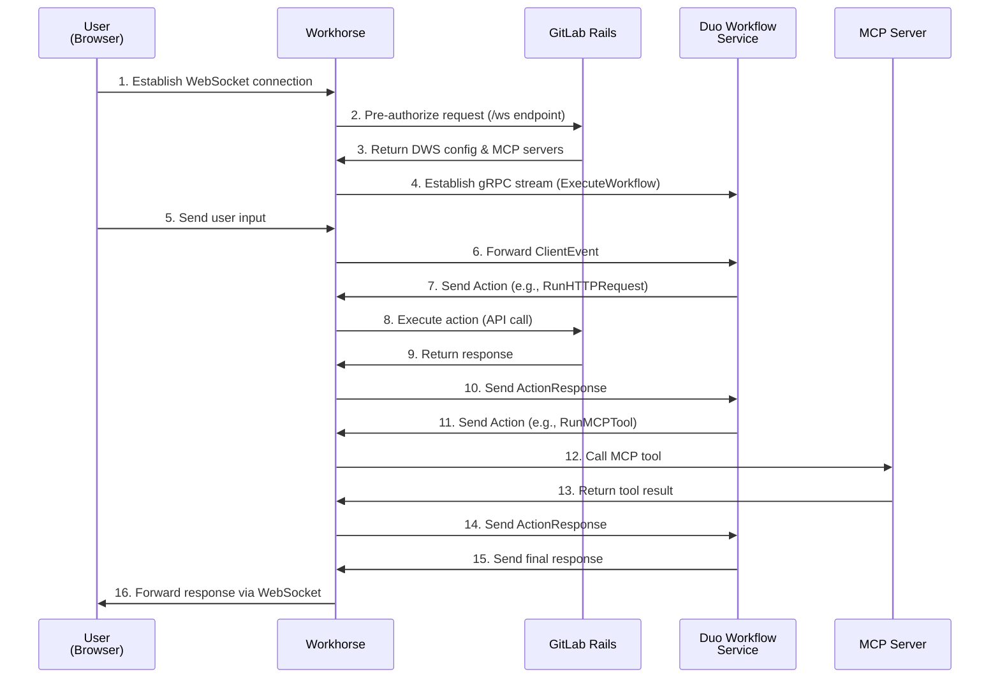

AI-assisted features in GitLab are powered by the GitLab Duo Workflow Service, an external service that runs and performs requests to large language models (LLMs) and orchestrates AI workflows. Workhorse acts as a bridge between the GitLab Rails application and the GitLab Duo Workflow Service, enabling secure and efficient communication while supporting various deployment scenarios (GitLab.com and GitLab Self-Managed).

## Key components

- **GitLab Rails**: The main GitLab application that handles authentication, authorization, and API requests.
- **Workhorse**: A smart reverse proxy that manages WebSocket connections and proxies requests between clients and the GitLab Duo Workflow Service.
- **GitLab Duo Workflow Service**: An external service that performs requests to LLMs and orchestrates AI workflows.
- **MCP Servers**: Model Context Protocol servers that provide tools and information to the AI agent (for example, the GitLab MCP server and external MCP servers).

## Architecture diagrams

### High-level architecture

### Request flow for AI interactions

For GitLab Self-Managed instances, the GitLab Duo Workflow Service cannot make direct HTTP requests to the GitLab instance due to network restrictions or security policies. Instead, Workhorse intercepts `RunHTTPRequest` actions and executes them on behalf of the GitLab Duo Workflow Service. The same approach is used for GitLab.com for consistency and to serve customers that have IP restrictions in place that would not accept direct requests from the GitLab Duo Workflow Service.

### Restricted network environments

In environments with IP restrictions or closed networks, Workhorse acts as a proxy for all external requests:

1. **Outbound connections**: Workhorse establishes the gRPC connection to the GitLab Duo Workflow Service.
1. **Inbound requests**: The GitLab Duo Workflow Service sends requests back through the established gRPC stream.
1. **API calls**: Workhorse executes API calls to the GitLab instance on behalf of the GitLab Duo Workflow Service.

## Error handling and resilience

### Graceful shutdown

During server shutdown, Workhorse:

1. Initiates graceful shutdown of all active workflow runners.
1. Sends `StopWorkflow` requests to the GitLab Duo Workflow Service.
1. Waits for workflows to complete within a timeout period.
1. Forcefully terminates connections if they don't close in time.

## Security considerations

### Authentication and authorization

- **Pre-authorization**: All requests are pre-authorized with GitLab Rails before establishing WebSocket connections.
- **OAuth tokens**: Uses OAuth tokens from the original request to authenticate API calls.
- **Token propagation**: Tokens are passed securely through Workhorse to the GitLab Duo Workflow Service.

## Related resources

- [GitLab Duo Workflow Service documentation](https://gitlab.com/gitlab-org/modelops/applied-ml/code-suggestions/ai-assist)
- [Model Context Protocol specification](https://modelcontextprotocol.io/)

## References

- [MR !193149: Workhorse as a proxy to GitLab Duo Workflow](https://gitlab.com/gitlab-org/gitlab/-/merge_requests/193149)
- [MR !196891: Handle runHttpRequest action from GitLab Duo Workflow](https://gitlab.com/gitlab-org/gitlab/-/merge_requests/196891)
- [MR !206445: Implement MCP client that uses GitLab MCP server](https://gitlab.com/gitlab-org/gitlab/-/merge_requests/206445)
- [MR !212684: Workhorse shutdown DWS conns during blackout](https://gitlab.com/gitlab-org/gitlab/-/merge_requests/212684)
