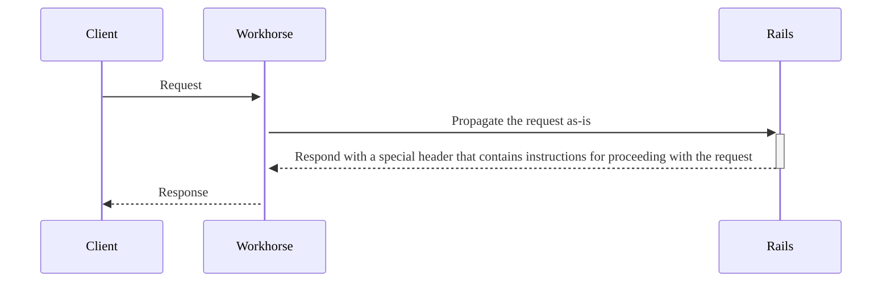
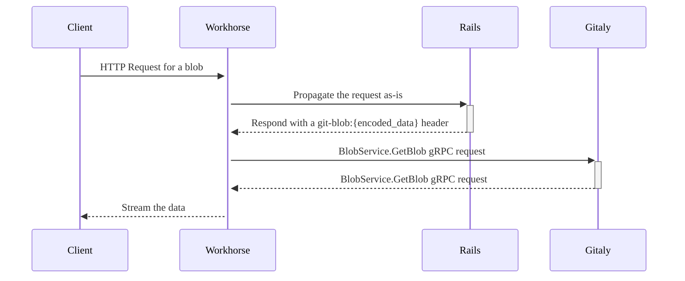
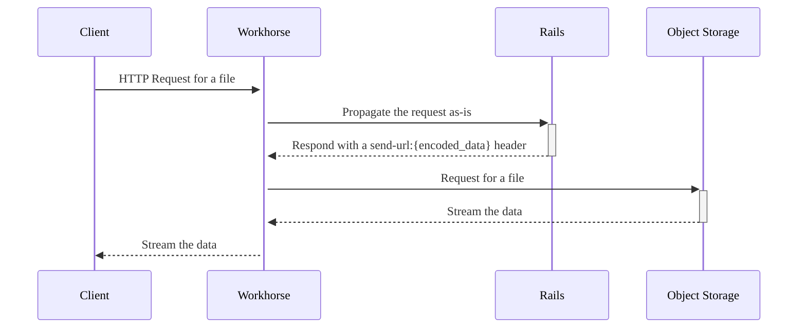
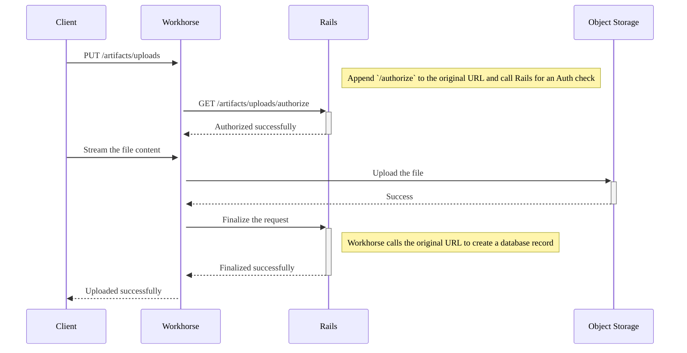
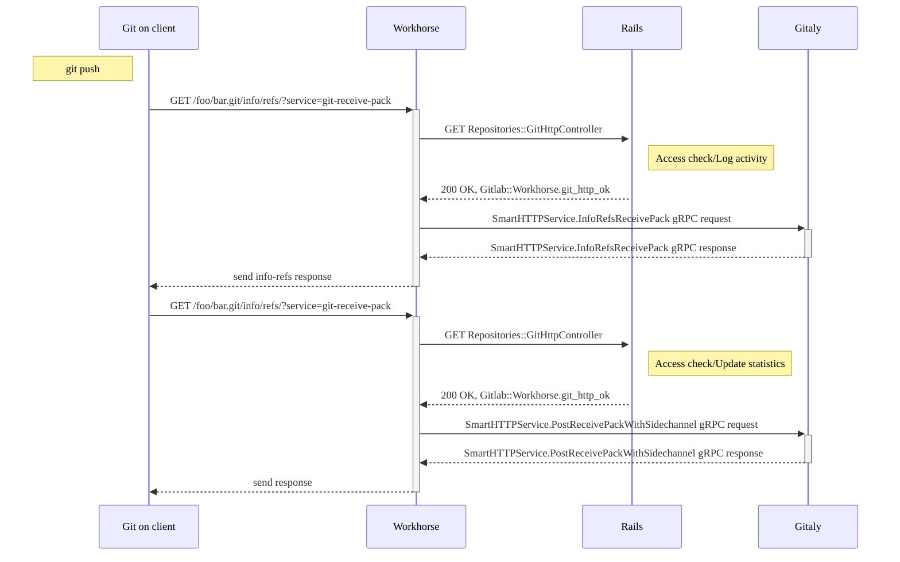

Long HTTP requests are hard to handle efficiently in Rails.
The requests are either memory-inefficient (file uploads) or impossible at all due to shorter timeouts
(for example, Puma server has 60-second timeout).
Workhorse can efficiently handle a large number of long HTTP requests.
Workhorse acts as a proxy that intercepts all HTTP requests and either propagates them without
changing or handles them itself by performing additional logic.

## Injectors

### Example: Send a Git blob

### How GitLab Rails processes the request

- [`send_git_blob`](https://gitlab.com/gitlab-org/gitlab/blob/8ba71b1f2feec64aeec52ccac4a1e585ba8052d9/lib/api/files.rb#L161)
- [Send a header with a particular information](https://gitlab.com/gitlab-org/gitlab/blob/8ba71b1f2feec64aeec52ccac4a1e585ba8052d9/lib/gitlab/workhorse.rb#L49-63)

### How Workhorse processes the header

- [Specify a list of injectors](https://gitlab.com/gitlab-org/gitlab/blob/8ba71b1f2feec64aeec52ccac4a1e585ba8052d9/workhorse/internal/upstream/routes.go#L179)
- [Iterate over injectors to find a match](https://gitlab.com/gitlab-org/gitlab/blob/8ba71b1f2feec64aeec52ccac4a1e585ba8052d9/workhorse/internal/senddata/senddata.go#L88)
- [Process a particular request](https://gitlab.com/gitlab-org/gitlab/blob/8ba71b1f2feec64aeec52ccac4a1e585ba8052d9/workhorse/internal/git/blob.go#L23)

#### Example: Send a file

## Pre-authorized requests

## Git over HTTP(S)

Workhorse accelerates Git over HTTP(S) by handling [Git HTTP protocol](https://www.git-scm.com/docs/http-protocol) requests. For example, Git push/pull may require serving large amounts of data. To avoid transferring it through GitLab Rails, Workhorse only performs authorization checks against GitLab Rails, then performs a Gitaly gRPC request directly, and streams the data from Gitaly to the Git client.

### Git pull

### Git push

