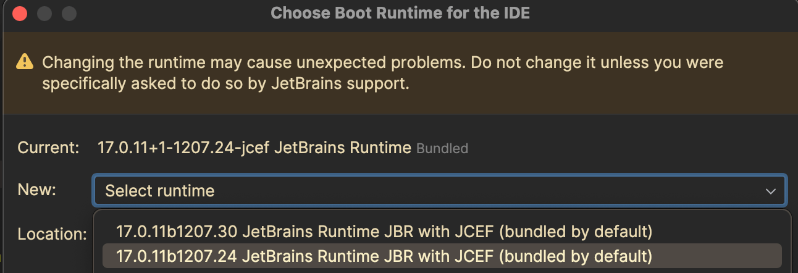

If the steps on this page don't solve your problem, check the
[list of open issues](https://gitlab.com/gitlab-org/editor-extensions/gitlab-jetbrains-plugin/-/issues/?sort=created_date&state=opened&first_page_size=100)
in the JetBrains plugin's project. If an issue matches your problem, update the issue.
If no issues match your problem, [create a new issue](https://gitlab.com/gitlab-org/editor-extensions/gitlab-jetbrains-plugin/-/issues/new)
and provide the [required information for Support](#required-information-for-support).

For troubleshooting JetBrains IDEs for GitLab Duo Code Suggestions,
see [Troubleshooting Code Suggestions](../../user/project/repository/code_suggestions/troubleshooting.md#jetbrains-ides-troubleshooting).

## Enable debug mode

To enable debug logs in JetBrains:

1. On the top bar, go to **Help** > **Diagnostic Tools > Debug Log Settings**, or
   search for the action by going to **Help** > **Find Action** > **Debug log settings**.
1. Add this line: `com.gitlab.plugin`
1. Select **OK** or **Save**.

If you experience [certificate errors](#certificate-errors) or other connection errors, and
use an HTTP proxy to connect to your GitLab instance, you must
[configure the Language Server to use a proxy](../language_server/_index.md#configure-the-language-server-to-use-a-proxy)
for the GitLab Language Server.

You can also [enable proxy authentication](../language_server/_index.md#enable-proxy-authentication).

## Enable GitLab Language Server debug logs

To enable GitLab Language Server debug logs:

1. In your IDE, on the top bar, select your IDE name, then select **Settings**.
1. On the left sidebar, select **Tools** > **GitLab Duo**.
1. Select **GitLab Language Server** to expand the section.
1. In **Logging** > **Log Level**, enter `debug`.
1. Select **Apply**.
1. Below **Enable GitLab Language Server**, select **Restart Language Server**.

## Get debug logs

The debug logs are available in the `idea.log` log file. To view this file, either:

<!-- vale gitlab_base.SubstitutionWarning = NO -->

- In your IDE, go to **Help** > **Show Log in Finder**.
- Go to the directory `/Users/<user>/Library/Logs/JetBrains/IntelliJIdea<build_version>`, replacing
  `<user>` and `<build_version>` with the appropriate values.

<!-- vale gitlab_base.SubstitutionWarning = YES -->

## Certificate errors

If your machine connects to your GitLab instance through a proxy, you might encounter
SSL certificate errors in JetBrains. GitLab Duo attempts to detect certificates in your system store;
however, Language Server cannot do this. If you see errors from the Language Server
about certificates, try enabling the option to pass a Certificate Authority (CA) certificate:

To do this:

1. On the bottom right corner of your IDE, select the GitLab icon.
1. On the dialog, select **Show Settings**. This opens the **Settings** dialog to **Tools** > **GitLab Duo**.
1. Select **GitLab Language Server** to expand the section.
1. Select **HTTP Agent Options** to expand it.
1. Either:
   - Select an option **Pass CA certificate from Duo to the Language Server**.
   - In **Certificate authority (CA)**, specify the path to your `.pem` file with CA certificates.
1. Restart your IDE.

### Ignore certificate errors

If GitLab Duo still fails to connect, you might need to
ignore certificate errors. You might see errors in the GitLab Language Server logs after enabling
[debug mode](jetbrains_troubleshooting.md#enable-debug-mode):

```plaintext
2024-10-31T10:32:54:165 [error]: fetch: request to https://gitlab.com/api/v4/personal_access_tokens/self failed with:
request to https://gitlab.com/api/v4/personal_access_tokens/self failed, reason: unable to get local issuer certificate
FetchError: request to https://gitlab.com/api/v4/personal_access_tokens/self failed, reason: unable to get local issuer certificate
```

By design, this setting represents a security risk:
these errors alert you to potential security breaches. You should enable this
setting only if you are absolutely certain the proxy causes the problem.

Prerequisites:

- You have verified the certificate chain is valid, using your system browser,
  or you have confirmed with your machine's administrator that this error is safe to ignore.

To do this:

1. Refer to JetBrains documentation on [SSL certificates](https://www.jetbrains.com/help/idea/ssl-certificates.html).
1. Go to your IDE's top menu bar and select **Settings**.
1. On the left sidebar, select **Tools** > **GitLab Duo**.
1. Confirm your default browser trusts the **URL to GitLab instance** you're using.
1. Enable the **Ignore certificate errors** option.
1. Select **Verify setup**.
1. Select **OK** or **Save**.

### Authentication fails in PyCharm

If you encounter problems during the **Verify setup** phase of GitLab authentication, confirm you
are running a supported version of PyCharm:

1. Go to the [plugin compatibility](https://plugins.jetbrains.com/plugin/22325-gitlab-duo/versions) page.
1. For **Compatibility**, select `PyCharm Community` or `PyCharm Professional`.
1. For **Channels**, select your desired stability level for the GitLab plugin.
1. For your version of PyCharm, select **Download** to download the correct GitLab plugin version, and install it.

## JCEF Errors

If you experience issues with GitLab Duo Chat related to JCEF (Java Chromium Embedded Framework), you can try these steps:

1. On the top bar, go to **Help** > **Find Action** and search for `Registry`.
1. Find or search for `ide.browser.jcef.sandbox.enable`.
1. Clear the checkbox to disable this setting.
1. Close the Registry dialog.
1. Restart your IDE.
1. On the top bar, go to **Help** > **Find Action** and search for `Choose Boot Java Runtime for the IDE`.
1. Select the boot java runtime version that's the same as your current IDE version, but with JCEF bundled:
   
1. Restart your IDE.

## Required information for support

Before contacting Support, make sure the latest GitLab Workflow extension is installed. All releases
are available in the [JetBrains Marketplace](https://plugins.jetbrains.com/plugin/22325-gitlab-duo/versions),
on the **Versions** tab.

Gather this information from affected users, and provide it in your bug report:

1. The error message shown to the user.
1. Workflow and Language Server logs:
   - [Debug logs](#enable-debug-mode).
   - [Language Server debug logs](#enable-gitlab-language-server-debug-logs).
   - [Logs output](#get-debug-logs)
1. Diagnostics output. In your IntelliJ product, go to **Help** > **Diagnostics Tools** > **Collect Troubleshooting Information**.
   - In the **About** section, copy the **Build Version**.
   - For plugin-specific versions: in the **Plugins** section, copy the output.
1. System details. In your IntelliJ product, go to **Help** > **Diagnostics Tools** > **Collect Troubleshooting Information**.
   - For the operating system type and version: in the dialog, copy **Operating System**.
   - For the machine specifications, copy the `System` section.
1. Describe the scope of impact. How many users are affected?
1. Describe how to reproduce the error. Include a screen recording, if possible.
1. Describe how other GitLab Duo features are affected:
   - Is GitLab Quick Chat functional?
   - Is Code Suggestions working?
   - Does Web IDE Duo Chat return responses?
1. Perform extension isolation testing. Try disabling (or uninstalling) all other extensions to determine
   if another extension is causing the issue. This helps determine if the problem is with our extension,
   or from an external source.
