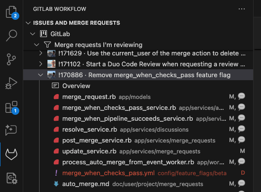

The [GitLab Workflow extension](https://marketplace.visualstudio.com/items?itemName=GitLab.gitlab-workflow)
for Visual Studio Code integrates GitLab Duo and other GitLab features directly into your IDE. It adds a
GitLab Workflow panel to the VS Code sidebar. You can view your issues, merge requests, and pipelines,
and extend your view with [custom queries](custom_queries.md).

[Install and configure the extension](setup.md).

## Features

This extension brings the GitLab features you use every day directly into your VS Code environment:

- [View issues and merge requests](#view-issues-and-merge-requests).
- [Run common commands](settings.md#command-palette-commands) from the Visual Studio Code Command Palette.
- Create and [review](#review-a-merge-request) merge requests.
- [Test your GitLab CI/CD configuration](cicd.md#test-gitlab-cicd-configuration).
- [View pipeline status](cicd.md) and [job outputs](cicd.md#view-cicd-job-output).
- [Create](#create-a-snippet) and manage snippets.
- [Browse repositories](remote_urls.md#browse-a-repository-in-read-only-mode) without cloning them.
- [View security findings](#view-security-findings).
- [Perform SAST scanning](#perform-sast-scanning).

The GitLab Workflow extension also streamlines your VS Code workflow with AI-assisted features:

- [GitLab Duo Chat](../../user/gitlab_duo_chat/_index.md#use-gitlab-duo-chat-in-vs-code):
  Interact with an AI assistant directly in VS Code.
- [GitLab Duo Code Suggestions](../../user/project/repository/code_suggestions/_index.md#use-code-suggestions):
  Suggest completions to your current line of code, or write natural-language code comments to get
  more substantive suggestions.

When you view a GitLab project in VS Code, the extension shows you information about your current branch:

- The status of the branch's most recent CI/CD pipeline.
- A link to the merge request for this branch.
- If the merge request includes an [issue closing pattern](../../user/project/issues/managing_issues.md#closing-issues-automatically),
  a link to the issue.

### Customize keyboard shortcuts

You can assign different keyboard shortcuts for **Accept Inline Suggestion**, **Accept Next Word Of Inline Suggestion**,
or **Accept Next Line Of Inline Suggestion**:

1. In VS Code, run the `Preferences: Open Keyboard Shortcuts` command.
1. Find the shortcut you want to edit, and select **Change keybinding** (**{pencil}**).
1. Assign your preferred shortcuts to **Accept Inline Suggestion**, **Accept Next Word Of Inline Suggestion**,
   or **Accept Next Line Of Inline Suggestion**.
1. Press <kbd>Enter</kbd> to save your changes.

## Switch GitLab accounts in VS Code

The GitLab Workflow extension uses one account for each [VS Code Workspace](https://code.visualstudio.com/docs/editor/workspaces) (window). The extension automatically selects the account when:

- You have added only one GitLab account to the extension.
- All workspaces in your VS Code window use the same GitLab account, based on the `git remote` configuration.

In other cases, you must select a GitLab account for the active VS Code window.

To change the account selection:

1. Open the Command Palette:
   - For macOS, press <kbd>Command</kbd>+<kbd>Shift</kbd>+<kbd>P</kbd>.
   - For Windows or Linux, press <kbd>Ctrl</kbd>+<kbd>Shift</kbd>+<kbd>P</kbd>.
1. Run the command `GitLab: Select Account for this Workspace`.
1. Select your desired account from the list.

You can also change accounts by selecting the GitLab account status bar item.

## Select your GitLab project

When your Git repository can be associated with multiple GitLab projects, the extension cannot determine which account to use. This can happen when you have multiple remotes, for example:

- `origin`: `git@gitlab.com:gitlab-org/gitlab-vscode-extension.git`
- `personal-fork`: `git@gitlab.com:myusername/gitlab-vscode-extension.git`

In these cases, the extension adds a **(multiple projects)** label to show you must choose an account.

To select an account:

1. On the vertical menu bar, select **GitLab Workflow** (**{tanuki}**) to display the extension sidebar.
1. Expand **Issues and Merge Requests**.
1. Select the line containing **(multiple projects)** to expand the list of accounts.
1. Select your desired project:
   

The **Issues and Merge requests** list updates with your selected project's information.

### Change your selection

To change your project selection:

1. On the vertical menu bar, select **GitLab Workflow** (**{tanuki}**) to display the extension sidebar.
1. Expand **Issues and Merge Requests** to show the project list.
1. Right-click the project's name.
1. Select **Clear selected project**.

## Use slash commands

Issues and merge requests support [GitLab slash commands](../../user/project/integrations/gitlab_slack_application.md#slash-commands) to perform actions directly in VS Code.

## Create a snippet

Create a [snippet](../../user/snippets.md) to store and share bits of code and text with other users.
Snippets can be a selection or an entire file.

To create a snippet in VS Code:

1. Choose the content for your snippet:
   - For a **Snippet from file**, open the file.
   - For a **Snippet from selection**, open the file and select the lines you want to include.
1. Open the Command Palette:
   - For macOS, press <kbd>Command</kbd>+<kbd>Shift</kbd>+<kbd>P</kbd>.
   - For Windows or Linux, press <kbd>Ctrl</kbd>+<kbd>Shift</kbd>+<kbd>P</kbd>.
1. In the Command Palette, run the command `GitLab: Create Snippet`.
1. Select the snippet's privacy level:
   - **Private** snippets are visible only to project members.
   - **Public** snippets are visible to everyone.
1. Select the snippet's scope:
   - **Snippet from file** uses the entire contents of the active file.
   - **Snippet from selection** uses the lines you selected in the active file.

GitLab opens the new snippet's page in a new browser tab.

### Create a patch file

When you review a merge request, create a snippet patch when you want to suggest multi-file changes.

1. On your local machine, check out the branch you want to propose changes to.
1. In VS Code, edit all files you want to change. Do not commit your changes.
1. Open the Command Palette:
   - For macOS, press <kbd>Command</kbd>+<kbd>Shift</kbd>+<kbd>P</kbd>.
   - For Windows or Linux, press <kbd>Ctrl</kbd>+<kbd>Shift</kbd>+<kbd>P</kbd>.
1. In the Command Palette, enter `GitLab: Create snippet patch`, and select it. This command runs a
   `git diff` command and creates a GitLab snippet in your project.
1. Enter a **Patch name** and press <kbd>Enter</kbd>. GitLab uses this name as the
   snippet title, and converts it into a filename appended with `.patch`.
1. Select the snippet's privacy level:
   - **Private** snippets are visible only to project members.
   - **Public** snippets are visible to everyone.

VS Code opens the snippet patch in a new browser tab. The snippet patch's
description contains instructions on how to apply the patch.

### Insert a snippet

To insert an existing single-file or [multi-file](../../user/snippets.md#add-or-remove-multiple-files) snippet from a project you are a member of:

1. Place your cursor where you want to insert the snippet.
1. Open the Command Palette:
   - For macOS, press <kbd>Command</kbd>+<kbd>Shift</kbd>+<kbd>P</kbd>.
   - For Windows or Linux, press <kbd>Ctrl</kbd>+<kbd>Shift</kbd>+<kbd>P</kbd>.
1. Type `GitLab: Insert Snippet` and select it.
1. Select the project containing your snippet.
1. Select the snippet to apply.
1. For a multi-file snippet, select the file to apply.

## View issues and merge requests

To view issues and merge requests for a specific project:

1. On the menu bar, select **GitLab Workflow** (**{tanuki}**) to display the extension sidebar.
1. On the sidebar, expand **Issues and merge requests**.
1. Select your desired project to expand it.
1. Choose one of the following result types:
   - Issues assigned to me
   - Issues created by me
   - Merge requests assigned to me
   - Merge requests I'm reviewing
   - Merge requests created by me
   - All project merge requests
   - Your [custom queries](custom_queries.md)

Select an issue or merge request to open it in a new VS Code tab.

## Review a merge request

Use this extension to review, comment on, and approve merge requests without leaving VS Code:

1. While viewing [issues and merge requests](#view-issues-and-merge-requests) in VS Code, select the
   merge request you want to review. Its sidebar entry expands with more information.
1. Under the merge request's number and title, select **Description** to read more about the merge request.
1. To review the proposed changes to a file, select the file from the list to show it in a VS Code tab.
   GitLab shows diff comments inline in the tab. In the list, deleted files are marked in red:

   

Use the diff to:

- Review and create discussions.
- Resolve and unresolve these discussions.
- Delete and edit individual comments.

### Compare with default branch

<!-- vale gitlab_base.InclusiveLanguage = NO -->

To compare your branch with your project's default branch, without creating a merge request:

1. Open the Command Palette:
   - For macOS, press <kbd>Command</kbd>+<kbd>Shift</kbd>+<kbd>P</kbd>.
   - For Windows or Linux, press <kbd>Ctrl</kbd>+<kbd>Shift</kbd>+<kbd>P</kbd>.
1. In the Command Palette, search for **GitLab: Compare current branch with master** and press <kbd>Enter</kbd>.

The extension opens a new browser tab. It shows a diff between the most recent commit on your branch, and
the most recent commit on your project's default branch.

<!-- vale gitlab_base.InclusiveLanguage = YES -->

### Open current file in GitLab UI

To open a file from your current GitLab project in the GitLab UI, with specific lines highlighted:

1. Open your desired file in VS Code.
1. Select the lines you want to highlight.
1. Open the Command Palette:
   - For macOS, press <kbd>Command</kbd>+<kbd>Shift</kbd>+<kbd>P</kbd>.
   - For Windows or Linux, press <kbd>Ctrl</kbd>+<kbd>Shift</kbd>+<kbd>P</kbd>.
1. In the Command Palette, search for **GitLab: Open active file on GitLab** and press <kbd>Enter</kbd>.

## View security findings

DETAILS:
**Tier:** Ultimate
**Offering:** GitLab.com, GitLab Self-Managed, GitLab Dedicated

Prerequisites:

- You're using GitLab Workflow version 3.74.0 or later.
- Your project includes [Security Risk Management](https://about.gitlab.com/features/?stage=secure) features, such as
  Static Application Security Testing (SAST), Dynamic Application Security Testing (DAST),
  Container Scanning, or Dependency Scanning.
- You configured the [Security Risk Management](../../user/application_security/secure_your_application.md) features.

To view security findings:

1. On the vertical menu bar, select **GitLab Workflow** (**{tanuki}**) to display the extension sidebar.
1. On the sidebar, expand **Security scanning**.
1. Select either **New findings** or **Fixed findings**.
1. Select a desired severity level.
1. Select a finding to open it in a VS Code tab.

## Perform SAST scanning

DETAILS:
**Tier:** Ultimate
**Offering:** GitLab.com
**Status:** Experiment

> - [Introduced](https://gitlab.com/gitlab-org/gitlab-vscode-extension/-/issues/1675) in VS Code extension version 5.31.

Static application security testing (SAST) in VS Code detects vulnerabilities in the active file.
With early detection, you can remediate vulnerabilities before you merge your changes into the
default branch.

When you trigger a SAST scan, the content of the active file is passed to GitLab and checked against
SAST vulnerability rules. GitLab shows scan results in the primary side bar.

Prerequisites:

- You're using GitLab Workflow version 5.31.0 or later.
- You've [authenticated with GitLab](setup.md#authenticate-with-gitlab).
- You've selected the [**Enable Real-time SAST scan checkbox**](setup.md#code-security).

To perform SAST scanning of a file in VS Code:

<!-- markdownlint-disable MD044 -->

1. Open the file.
1. Trigger the SAST scan by either:
   - Saving the file (if you have [selected the **Enable scanning on file save** option](setup.md#code-security)).
   - Using the Command Palette:
     1. Open the Command Palette:
        - For macOS, press <kbd>Command</kbd>+<kbd>Shift</kbd>+<kbd>P</kbd>.
        - For Windows or Linux, press <kbd>Ctrl</kbd>+<kbd>Shift</kbd>+<kbd>P</kbd>.
     1. Search for **GitLab: Run Remote Scan (SAST)** and press
        <kbd>Enter</kbd>.
1. View the results of the SAST scan.
   1. View the **Primary Side Bar**.
   1. Select GitLab Workflow ({tanuki}) to display the extension sidebar.
   1. Expand the **GITLAB REMOTE SCAN (SAST)** section.

   The results of the SAST scan are listed in descending order by severity. To see details of a
   finding, select it in the **GITLAB REMOTE SCAN (SAST)** section of the extension sidebar.

<!-- markdownlint-enable MD044 -->

## Search issues and merge requests

To search your project's issues and merge requests directly from VS Code, use filtered search or
[Advanced Search](../../integration/advanced_search/elasticsearch.md). With filtered search,
you use predefined tokens to refine your search results.
Advanced Search provides faster, more efficient search across the entire GitLab instance.

Prerequisites:

- You're a member of a GitLab project.
- You've installed the [GitLab Workflow extension](https://marketplace.visualstudio.com/items?itemName=GitLab.gitlab-workflow).
- You've signed in to your GitLab instance, as described in [Authenticate with GitLab](setup.md#authenticate-with-gitlab).

To search the titles and description fields in your project:

1. In VS Code, open the Command Palette:
   - For macOS, press <kbd>Command</kbd>+<kbd>Shift</kbd>+<kbd>P</kbd>.
   - For Windows or Linux, press <kbd>Ctrl</kbd>+<kbd>Shift</kbd>+<kbd>P</kbd>.
1. Select your desired search type: `GitLab: Search project merge requests` or `GitLab: Search project issues`.
1. Enter your text, using [filter tokens](#filter-searches-with-tokens) as needed.
1. To confirm your search text, press <kbd>Enter</kbd>. To cancel, press <kbd>Escape</kbd>.

GitLab opens the results in a browser tab.

### Filter searches with tokens

Searches in large projects return better results when you add filters. The extension supports these tokens
for filtering merge requests and issues:

| Token     | Example                                                            | Description |
|-----------|--------------------------------------------------------------------|-------------|
| assignee  | `assignee: timzallmann`                                            | Username of the assignee, without `@`. |
| author    | `author: fatihacet`                                                | Username of the author, without `@`. |
| label     | `label: frontend` or `label:frontend label: Discussion`            | A single label. Usable more than once, and can be used in the same query as `labels`. |
| labels    | `labels: frontend, Discussion, performance`                        | Multiple labels in a comma-separated list. Can be used in the same query as `label`. |
| milestone | `milestone: 18.1`                                                  | Milestone title without `%`. |
| scope     | `scope: created-by-me` or `scope: assigned-to-me` or `scope: all`. | Issues and merge requests matching the given scope. Values: `created-by-me` (default), `assigned-to-me` or `all`. |
| title     | `title: discussions refactor`                                             | Issues and merge requests with title or description matching these words. Don't add quotation marks around phrases. |

Token syntax and guidelines:

- Each token name requires a colon (`:`) after it, like `label:`.
  - A leading space for the colon (`label :`) is invalid and returns a parse error.
  - A space after the token name is optional. Both `label: frontend` and `label:frontend` are valid.
- You can use the `label` and `labels` tokens multiple times and together. These queries return the same results:
  - `labels: frontend discussion label: performance`
  - `label: frontend label: discussion label: performance`
  - `labels: frontend discussion performance` (the resulting, combined query)

You can combine multiple tokens in a single search query. For example:

```plaintext
title: new merge request widget author: fatihacet assignee: jschatz1 labels: frontend, performance milestone: 17.5
```

This search query looks for:

- Title: `new merge request widget`
- Author: `fatihacet`
- Assignee: `jschatz1`
- Labels: `frontend` and `performance`
- Milestone: `17.5`

## Related topics

- [Troubleshooting the GitLab Workflow extension for VS Code](troubleshooting.md)
- [Download the GitLab Workflow extension](https://marketplace.visualstudio.com/items?itemName=GitLab.gitlab-workflow)
- Extension [source code](https://gitlab.com/gitlab-org/gitlab-vscode-extension/)
- [GitLab Duo documentation](../../user/project/repository/code_suggestions/_index.md)
- [GitLab Language Server documentation](../language_server/_index.md)
