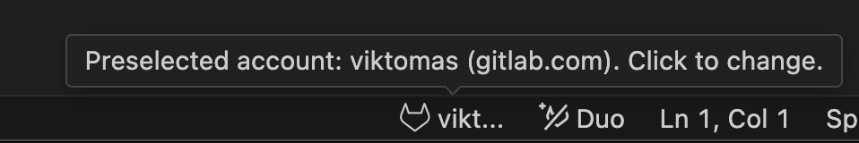
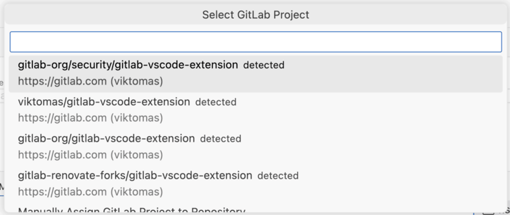

The [GitLab for VS Code extension](https://marketplace.visualstudio.com/items?itemName=GitLab.gitlab-workflow)
integrates GitLab Duo and other GitLab features directly into your IDE.

To get started, [install and configure the extension](setup.md). For added security, you can set up
the extension in a Visual Studio Code Dev Container.

When configured, this extension brings the GitLab features you use every day directly into your
VS Code environment:

- [Work with projects](projects.md): Plan and track work with issues, review and discuss changes
  with merge requests, and share code snippets. Use GitLab Duo for AI-native planning and coding.
- [Monitor and test CI/CD pipelines](cicd.md): Test your pipeline configuration. View pipeline
  status and job outputs.
- [Secure your application](security_scanning.md): Review security findings and perform SAST
  scanning for your project.
- [Browse repositories](remote_urls.md#browse-a-repository-in-read-only-mode): Access a GitLab
  repository in read-only mode without cloning it.

When you view a GitLab project in VS Code, the extension shows you information about your current branch:

- The status of the branch's most recent CI/CD pipeline.
- A link to the merge request for this branch.
- If the merge request includes an [issue closing pattern](../../user/project/issues/managing_issues.md#closing-issues-automatically),
  a link to the issue.

## GitLab extension panels

After you install and set up the extension, you can access the following features:

- On the left sidebar, **GitLab** (): Manage issues and merge
  requests, run CI/CD commands, view pipeline status, and perform security scanning.
  You can also extend your view with [custom queries](custom_queries.md).
- On the left sidebar, **GitLab Duo Agent Platform** ():
  - The chat tab: Interact with GitLab Duo Chat (agentic), or use the **New chat** ()
    dropdown list to select a foundational or custom agent to work with.
  - The flows tab: Use the Software Development Flow. Learn more about the
  [difference between Chat and the flow](../../user/duo_agent_platform/flows/foundational_flows/software_development.md#flow-and-chat-comparison).
- In the status bar, **Duo** (): Check the feature status of
  GitLab Duo Code Suggestions and review suggestions in
  your file as you author code.
- On the left sidebar, **GitLab Duo Chat** (): Interact with
  GitLab Duo Chat (non-agentic).

If these features do not appear, see [troubleshooting](troubleshooting.md#gitlab-duo-features-are-unavailable) for guidance.

## Switch GitLab accounts in VS Code

The GitLab for VS Code extension uses one account for each
[VS Code Workspace](https://code.visualstudio.com/docs/editor/workspaces) (window). The extension
automatically selects the account when:

- You have added only one GitLab account to the extension.
- All workspaces in your VS Code window use the same GitLab account, based on the `git remote` configuration.

What the extension shows in the status bar depends on your account setup:

- If only one GitLab account exists, the status bar shows no information.
- If multiple GitLab accounts exist, and the extension can determine which account to use,
  the status bar shows the account name next to the tanuki () icon.
- If multiple GitLab accounts exist, and the extension can't determine which account to use,
  the status bar shows **Multiple GitLab Accounts** ().

To select a GitLab account for the active VS Code window, select the status bar item, or:

1. Open the Command Palette:
   - For macOS, press <kbd>Command</kbd>+<kbd>Shift</kbd>+<kbd>P</kbd>.
   - For Windows or Linux, press <kbd>Control</kbd>+<kbd>Shift</kbd>+<kbd>P</kbd>.
1. Run the command `GitLab: Select Account for this Workspace`.
1. Select your desired account from the list.

## Select your GitLab project

When your Git repository can be associated with multiple GitLab projects, the extension cannot
determine which account to use. This can happen when you have multiple remotes, for example:

- `origin`: `git@gitlab.com:gitlab-org/gitlab-vscode-extension.git`
- `personal-fork`: `git@gitlab.com:myusername/gitlab-vscode-extension.git`

In these cases, the extension adds a **(multiple projects)** label to show you must choose an account.

To select an account:

1. On the vertical menu bar, select **GitLab** () to display the extension sidebar.
1. Expand **Issues and Merge Requests**.
1. Select the line containing **(multiple projects, click to select)**.
1. Select your desired project:

   

The **Issues and Merge requests** list updates with your selected project's information.

### Change your selection

To change your project selection:

1. On the vertical menu bar, select **GitLab** () to display the extension sidebar.
1. Expand **Issues and Merge Requests** to show the project list.
1. Select the project.
1. Next to the project name, select **Clear Selected Project** ().

## Customize keyboard shortcuts

You can assign different keyboard shortcuts for **Accept Inline Suggestion**, **Accept Next Word Of Inline Suggestion**,
or **Accept Next Line Of Inline Suggestion**:

1. In VS Code, run the `Preferences: Open Keyboard Shortcuts` command.
1. Find the shortcut you want to edit, and select **Change keybinding** ().
1. Assign your preferred shortcuts to **Accept Inline Suggestion**, **Accept Next Word Of Inline Suggestion**,
   or **Accept Next Line Of Inline Suggestion**.
1. Press <kbd>Enter</kbd> to save your changes.

## Update the extension

To update your extension to the latest version:

1. In Visual Studio Code, go to **Settings** > **Extensions**.
1. Search for **GitLab** published by **GitLab (`gitlab.com`)**.
1. From **Extension: GitLab**, select **Update to {later version}**.
1. Optional. To enable automatic updates in the future, select **Auto-Update**.

## Check status

1. In Visual Studio Code, on the bottom status bar, select the GitLab icon ().
1. A menu opens under the VS Code search box, and the GitLab for VS Code extension shows the status.
   Any errors are displayed next to **Status:**.

For GitLab Duo Chat (non-agentic), you can also check the [status of Chat](../../user/gitlab_duo_chat/_index.md#check-the-status-of-chat).

## Enable telemetry

GitLab for VS Code uses the telemetry settings in Visual Studio Code to send usage and error
information to GitLab. To enable or customize telemetry in Visual Studio Code:

1. In Visual Studio Code, go to **File** > **Preferences** > **Settings** (on Windows/Linux) or **Code** > **Settings** > **Settings** (on macOS).
1. In the search bar, search for `Telemetry`.
1. On the left sidebar, select **Telemetry**.
1. For **Telemetry Level**, select the data you want to share:
   - `all`: Sends usage data, general error telemetry, and crash reports.
   - `error`: Sends general error telemetry, and crash reports.
   - `crash`: Sends OS-level crash reports.
   - `off`: Disables all telemetry data in Visual Studio Code.
1. Save your changes.

## Related topics

- [Security considerations for editor extensions](../security_considerations.md)
- [Command Palette commands](settings.md#command-palette-commands)
- [Troubleshooting the GitLab for VS Code extension](troubleshooting.md)
- [Download the GitLab for VS Code extension](https://marketplace.visualstudio.com/items?itemName=GitLab.gitlab-workflow)
- Extension [source code](https://gitlab.com/gitlab-org/gitlab-vscode-extension/)
- [GitLab Language Server documentation](../language_server/_index.md)
