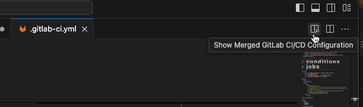
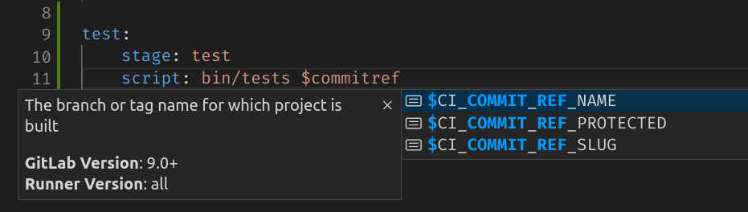

If your GitLab project uses CI/CD pipelines, you can start, watch, and debug CI/CD pipelines from the
GitLab Workflow extension for VS Code. When you work locally on a Git branch, the bottom status bar
shows either:

- The status of its most recent pipeline.
- **No pipeline** if a pipeline hasn't run yet.

Possible statuses include:

- Pipeline canceled
- Pipeline failed
- Pipeline passed
- Pipeline pending
- Pipeline running
- Pipeline skipped

## View pipeline information

Use this extension to start, monitor, and debug CI/CD pipelines in GitLab.

Prerequisites:

- Your project uses CI/CD pipelines.
- A merge request exists for your current Git branch.
- The most recent commit on your current Git branch has a CI/CD pipeline.

To view pipeline information:

1. In VS Code, on the bottom status bar, select the pipeline status to display actions in the Command Palette.
1. In the Command Palette, select your desired action:

   - **Create New Pipeline From Current Branch**: Start a new pipeline.
   - **Cancel Last Pipeline**
   - **Download Artifacts from Latest Pipeline**: Download the pipeline artifact in ZIP or JSON format.
   - **Retry Last Pipeline**
   - **View Latest Pipeline on GitLab**: Open the pipeline's page in a browser tab.

## Show pipeline alerts

This extension can display an alert in VS Code when a pipeline for your current branch completes:

To show alerts for your current Git branch:

1. In VS Code, on the top menu, select **Code > Settings > Settings**.
1. Depending on your configuration, select either **User** or **Workplace** settings.
1. In the main tab, select **Extensions > GitLab Workflow** to view this extension's settings.
1. Under **Show Pipeline Update Notifications**, select the **Show notification in VS Code when the pipeline status changes** checkbox.

## View CI/CD job output

To view the output for a CI/CD job for your current branch:

1. On the left vertical menu bar, select **GitLab Workflow** (**{tanuki}**) to display the extension sidebar.
1. On the sidebar, expand **For current branch** to show its most recent pipeline.
1. Select your desired job to open it in a new VS Code tab:

   

### Test GitLab CI/CD configuration

Use the `GitLab: Validate GitLab CI Config` command to test your project's GitLab CI/CD configuration locally.

1. In VS Code, open your `.gitlab-ci.yml` file, and ensure the file's tab is in focus.
1. Open the Command Palette:
   - For macOS, press <kbd>Command</kbd>+<kbd>Shift</kbd>+<kbd>P</kbd>.
   - For Windows or Linux, press <kbd>Ctrl</kbd>+<kbd>Shift</kbd>+<kbd>P</kbd>.
1. In the Command Palette, search for `GitLab: Validate GitLab CI Config` and press <kbd>Enter</kbd>.

The extension shows an alert if it detects a problem with your configuration.

### Show merged GitLab CI/CD configuration

Use this command to see a preview of your merged CI/CD configuration file, with all includes and references resolved.

1. In VS Code, open your `.gitlab-ci.yml` file, and ensure the file's tab is in focus.
1. On the top right, select **Show Merged GitLab CI/CD Configuration**:

   

VS Code opens a new tab (`.gitlab-ci (Merged).yml`) with full information.

### CI/CD variable autocompletion

Quickly find the CI/CD variable you are looking for with the CI/CD variable autocompletion.

Prerequisites:

- Your file is named either:
  - `.gitlab-ci.yml`.
  - Beginning with `.gitlab-ci` and ending with `.yml` or `.yaml`, like `.gitlab-ci.production.yml`.

To autocomplete a variable:

1. In VS Code, open your `.gitlab-ci.yml` file, and ensure the file's tab is in focus.
1. Begin entering the name of a variable to display auto-complete options.
1. Select an option to use it:

   
