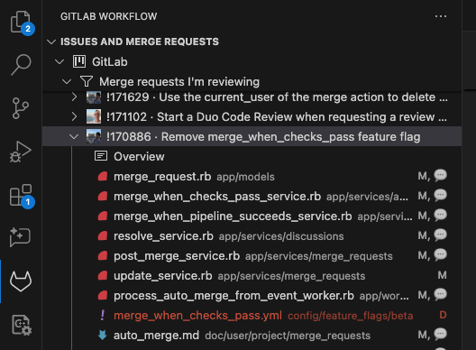

Use the GitLab for VS Code extension to work with GitLab projects:

- Plan and track work in issues.
- Use GitLab Duo for AI-native planning and coding.
- Review and discuss changes in merge requests.
- Compare branches and view files in GitLab.
- Store and share code with snippets.

With the extension, you can complete many of these tasks directly in VS Code. For others, the
extension opens GitLab in your browser.

## Prerequisites

- [Authenticate the extension](setup.md#connect-to-gitlab) and connect to a repository on GitLab.
- For GitLab Duo, review the [configuration requirements](setup.md#configure-gitlab-duo).

## Use GitLab Duo as you work

The GitLab for VS Code extension gives you access to use the GitLab Duo Agent Platform and
GitLab Duo (Classic) as you work on your projects.

### GitLab Duo Agent Platform



- Tier: Premium, Ultimate
- Offering: GitLab.com, GitLab Self-Managed



To use GitLab Duo Chat (Agentic), agents, and flows:

1. In the left sidebar, select **GitLab Duo Agent Platform** ().
1. To interact with GitLab Duo Chat, select the chat tab and enter your prompt.
1. To work with agents, select the chat tab, and then use the **New chat** ()
   dropdown list to select a foundational or custom agent to work with.
1. To use the Software Development Flow, select the flows tab and then enter your prompt.

To use GitLab Duo Code Suggestions:

1. In the bottom status bar, select **Duo** () to check the feature status.
1. Review and accept inline code suggestions as you author code.

### GitLab Duo (Classic)



- Tier: Premium, Ultimate
- Add-on: GitLab Duo Core, Pro, or Enterprise, GitLab Duo with Amazon Q
- Offering: GitLab.com, GitLab Self-Managed, GitLab Dedicated



To use GitLab Duo Chat (Classic):

1. In the left sidebar, select **GitLab Duo Chat** ().
1. In the message box, enter your question and press <kbd>Enter</kbd> or select **Send**.

To use GitLab Duo Code Suggestions (Classic):

1. In the bottom status bar, select **Duo** () to check the feature status.
1. Review and accept inline code suggestions as you author code.

## Create an issue

To create an issue in the current project:

1. Open the Command Palette:
   - For macOS, press <kbd>Command</kbd>+<kbd>Shift</kbd>+<kbd>P</kbd>.
   - For Windows or Linux, press <kbd>Control</kbd>+<kbd>Shift</kbd>+<kbd>P</kbd>.
1. In the Command Palette, search for **GitLab: Create New Issue on Current Project**
   and press <kbd>Enter</kbd>.

GitLab opens the **New issue** page in your default browser.

## Create a merge request

To create a merge request in the current project, in the bottom status bar, select
**Create MR** ().

Alternatively, you can use the Command Palette:

1. Open the Command Palette:
   - For macOS, press <kbd>Command</kbd>+<kbd>Shift</kbd>+<kbd>P</kbd>.
   - For Windows or Linux, press <kbd>Control</kbd>+<kbd>Shift</kbd>+<kbd>P</kbd>.
1. In the Command Palette, search for **GitLab: Create New Merge Request on Current Project**
   and press <kbd>Enter</kbd>.

GitLab opens the **New merge request** page in your default browser.

## View issues and merge requests

To view issues and merge requests for a specific project:

1. In VS Code, in the left sidebar, select **GitLab** ().
1. Expand the issues and merge requests section.
1. Select a project to expand it.
1. Select one of the following options to review the list of items:
   - **Issues assigned to me**
   - **Issues created by me**
   - **Merge requests assigned to me**
   - **Merge requests I'm reviewing**
   - **Merge requests created by me**
   - **All project merge requests**
   - Your [custom queries](custom_queries.md)
1. Select an issue or merge request to open it in a new VS Code tab.

## Search issues and merge requests

Use filtered search or [advanced search](../../integration/advanced_search/elasticsearch.md) to
search your project's issues and merge requests directly from VS Code.
With filtered search, you use predefined tokens to refine your search results.
Advanced search provides faster, more efficient search across the entire GitLab instance.

Prerequisites:

- You're a member of a GitLab project.

To search your project:

1. In VS Code, open the Command Palette:
   - For macOS, press <kbd>Command</kbd>+<kbd>Shift</kbd>+<kbd>P</kbd>.
   - For Windows or Linux, press <kbd>Control</kbd>+<kbd>Shift</kbd>+<kbd>P</kbd>.
1. Select your desired search type:
   - **GitLab: Search Project Issues (Supports Filters)**
   - **GitLab: Search Project Merge Requests (Supports Filters)**
   - **GitLab: Advanced Search (Issues, Merge Requests, Commits, Comments...)**
1. Follow the prompts to enter your search values and refine your search.

GitLab opens the results in a browser tab.

### Tokens to filter search results

Searches in large projects return better results when you add filters. The extension supports these tokens
for filtering merge requests and issues:

| Token     | Example                                                 | Description |
|-----------|---------------------------------------------------------|-------------|
| assignee  | `assignee: sjones`                                      | Username of the assignee, without `@`. |
| author    | `author: zwei`                                          | Username of the author, without `@`. |
| label     | `label: frontend` or `label:frontend label: Discussion` | A single label. Usable more than once, and can be used in the same query as `labels`. |
| labels    | `labels: frontend, Discussion, performance`             | Multiple labels in a comma-separated list. Can be used in the same query as `label`. |
| milestone | `milestone: 18.1`                                       | Milestone title without `%`. |
| scope     | `scope: created-by-me`                                  | Scope of the issue or merge request. Values: `created-by-me` (default), `assigned-to-me` or `all`. |
| title     | `title: discussions refactor`                           | Words to match in the title or description. Do not add quotation marks around phrases. |

Token syntax and guidelines:

- Each token name requires a colon (`:`) after it, like `label:`.
  - A leading space for the colon (`label :`) is invalid and returns a parse error.
  - A space after the token name is optional. Both `label: frontend` and `label:frontend` are valid.
- You can use the `label` and `labels` tokens multiple times and together. These queries return the same results:
  - `labels: frontend discussion label: performance`
  - `label: frontend label: discussion label: performance`
  - `labels: frontend discussion performance` (the resulting, combined query)

You can combine multiple tokens in a single search query. For example:

```plaintext
title: new merge request widget author: zwei assignee: sjones labels: frontend, performance milestone: 17.5
```

This search query looks for:

- Title: `new merge request widget`
- Author: `zwei`
- Assignee: `sjones`
- Labels: `frontend` and `performance`
- Milestone: `17.5`

## Review a merge request

To review, comment on, and approve merge requests in VS Code:

1. In the left sidebar, select **GitLab** ().
1. Expand the issues and merge requests section, and then select your project.
1. Select the merge request you want to review.
1. Under the merge request's number and title, select **Overview** to read more about the merge request.
1. To review the proposed changes to a file, select the file from the list to show it in a VS Code tab.
   GitLab shows diff comments inline in the tab. In the list, deleted files are marked in red:

   

Use the diff to:

- Review and create discussions.
- Resolve and reopen these discussions.
- Delete and edit individual comments.

## Use quick actions

To use [GitLab quick actions](../../user/project/quick_actions.md) in issues and merge requests:

1. Follow the instructions to view an issue or merge request in VS Code.
1. Scroll down to find the comment section.
1. Type a quick action in a new comment and then press <kbd>Enter</kbd>. For example, to add the
   `bug` label to an issue, type `/label bug`.

## Compare with default branch

To compare your branch with your project's default branch, without creating a merge request:

1. Open the Command Palette:
   - For macOS, press <kbd>Command</kbd>+<kbd>Shift</kbd>+<kbd>P</kbd>.
   - For Windows or Linux, press <kbd>Control</kbd>+<kbd>Shift</kbd>+<kbd>P</kbd>.
1. In the Command Palette, search for **GitLab: Compare Current Branch with Default Branch** and
   press <kbd>Enter</kbd>.

The extension opens a new browser tab. It shows a diff between the most recent commit on your branch, and
the most recent commit on your project's default branch.

## Open current file in GitLab UI

To open a file from your current GitLab project in the GitLab UI, with specific lines highlighted:

1. Open your desired file in VS Code.
1. Select the lines you want to highlight.
1. Open the Command Palette:
   - For macOS, press <kbd>Command</kbd>+<kbd>Shift</kbd>+<kbd>P</kbd>.
   - For Windows or Linux, press <kbd>Control</kbd>+<kbd>Shift</kbd>+<kbd>P</kbd>.
1. In the Command Palette, search for **GitLab: Open Active File on GitLab** and press <kbd>Enter</kbd>.

## Create a snippet

Create a [snippet](../../user/snippets.md) to store and share bits of code and text with other users.
Snippets can be a selection or an entire file.

To create a snippet in VS Code:

1. Choose the content for your snippet:
   - To create a snippet using an entire file, open the file.
   - To create a snippet using a selection of a file, open the file and select the lines you want to
     include.
1. Open the Command Palette:
   - For macOS, press <kbd>Command</kbd>+<kbd>Shift</kbd>+<kbd>P</kbd>.
   - For Windows or Linux, press <kbd>Control</kbd>+<kbd>Shift</kbd>+<kbd>P</kbd>.
1. In the Command Palette, search for **GitLab: Create Snippet** and press <kbd>Enter</kbd>.
1. Select the snippet's privacy level:
   - **Private** snippets are visible only to project members.
   - **Public** snippets are visible to everyone.
1. Select the snippet's scope:
   - **Snippet from file** uses the entire contents of the active file.
   - **Snippet from selection** uses the lines you selected in the active file.

GitLab opens the new snippet's page in a new browser tab.

### Create a patch file

When you review a merge request, create a snippet patch when you want to suggest multi-file changes.

1. On your local machine, check out the branch you want to propose changes to.
1. In VS Code, edit all files you want to change. Do not commit your changes.
1. Open the Command Palette:
   - For macOS, press <kbd>Command</kbd>+<kbd>Shift</kbd>+<kbd>P</kbd>.
   - For Windows or Linux, press <kbd>Control</kbd>+<kbd>Shift</kbd>+<kbd>P</kbd>.
1. In the Command Palette, search for **GitLab: Create Snippet Patch** and press <kbd>Enter</kbd>.
   This command runs a `git diff` command and creates a GitLab snippet in your project.
1. Enter a **Patch name** and press <kbd>Enter</kbd>. GitLab uses this name as the
   snippet title, and converts it into a filename appended with `.patch`.
1. Select the snippet's privacy level:
   - **Private** snippets are visible only to project members.
   - **Public** snippets are visible to everyone.

VS Code opens the snippet patch in a new browser tab. The snippet patch's
description contains instructions on how to apply the patch.

### Insert a snippet

To insert an existing single-file or [multi-file](../../user/snippets.md#add-or-remove-multiple-files) snippet from a project you are a member of:

1. Place your cursor where you want to insert the snippet.
1. Open the Command Palette:
   - For macOS, press <kbd>Command</kbd>+<kbd>Shift</kbd>+<kbd>P</kbd>.
   - For Windows or Linux, press <kbd>Control</kbd>+<kbd>Shift</kbd>+<kbd>P</kbd>.
1. Search for **GitLab: Insert Snippet** and press <kbd>Enter</kbd>.
1. Select the project containing your snippet.
1. Select the snippet to apply.
1. For a multi-file snippet, select the file to apply.

## Related topics

- [CI/CD pipelines in the VS Code extension](cicd.md)
- [Secure your application in GitLab for VS Code](security_scanning.md)
- [GitLab Duo Agent Platform](../../user/duo_agent_platform/_index.md)
- [GitLab Duo (Classic)](../../user/gitlab_duo/feature_summary.md)
