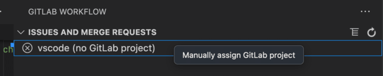

If you encounter any issues with the GitLab Workflow extension for VS Code, or have feature requests for it:

1. Check the [extension documentation](_index.md)
   for known issues and solutions.
1. Report bugs or request features in the
   [`gitlab-vscode-extension` issue tracker](https://gitlab.com/gitlab-org/gitlab-vscode-extension/-/issues).
   Provide the [required information for Support](#required-information-for-support).

For troubleshooting VS Code for GitLab Duo Code Suggestions,
see [Troubleshooting Code Suggestions for VS Code](../../user/project/repository/code_suggestions/troubleshooting.md#vs-code-troubleshooting).

## Enable debug logs

Both the VS Code Extension and the GitLab Language Server provide logs that can help you troubleshoot. To enable debug logging:

1. In VS Code, on the top bar, go to **Code** > **Settings** > **Settings**.
1. In the upper-right corner, select **Open Settings (JSON)** to edit your `settings.json` file.
1. Add this line, or edit it if it already exists:

   ```json
   "gitlab.debug": true,
   ```

1. Save your changes.

### View log files

To view debug logs from either the VS Code Extension or the GitLab Language Server:

1. Use the command `GitLab: Show Extension Logs` to view the output panel.
1. In the upper-right corner of the output panel, select either **GitLab Workflow** or
   **GitLab Language Server** from the dropdown list.

## Error: `407 Access Denied` failure with a proxy

If you use an authenticated proxy, you might encounter an error like `407 Access Denied (authentication_failed)`:

```plaintext
Request failed: Can't add GitLab account for https://gitlab.com. Check your instance URL and network connection.
Fetching resource from https://gitlab.com/api/v4/personal_access_tokens/self failed
```

You must [enable proxy authentication](../language_server/_index.md#enable-proxy-authentication)
for the GitLab Language Server.

## Configure self-signed certificates

To use self-signed certificates to connect to your GitLab instance, configure them using these settings.
These settings are community contributions, because the GitLab team uses a public CA. None of the fields are required.

Prerequisites:

- You're not using the [`http.proxy` setting](https://code.visualstudio.com/docs/setup/network#_legacy-proxy-server-support)
  in VS Code. For more information, see [issue 314](https://gitlab.com/gitlab-org/gitlab-vscode-extension/-/issues/314).

| Setting name | Default | Information |
| ------------ | :-----: | ----------- |
| `gitlab.ca`  | null    | Deprecated. See [the SSL setup guide](ssl.md) for more information on how to set up your self-signed CA.<br><br>For specific rules and formatting, see [the NodeJS `ca` documentation](https://nodejs.org/docs/latest-v22.x/api/tls.html#:~:text=list%20as%20trusted.-,ca,-%3Cstring%3E%20%7C). |
| `gitlab.cert`| null    | Unsupported. See [epic 6244](https://gitlab.com/groups/gitlab-org/-/epics/6244). If GitLab Self-Managed requires a custom certificate or key pair, set this option to point to your certificate file. See `gitlab.certKey`.<br><br>For specific rules and formatting, see [the NodeJS `cert` documentation](https://nodejs.org/docs/latest-v22.x/api/tls.html#:~:text=CERTIFICATE%22%2C%20and%20%22CERTIFICATE%22.-,cert,-%3Cstring%3E%20%7C). |
| `gitlab.certKey`| null    | Unsupported. See [epic 6244](https://gitlab.com/groups/gitlab-org/-/epics/6244). If GitLab Self-Managed requires a custom certificate or key pair, set this option to point to your certificate key file. See `gitlab.cert`.<br><br>For specific rules and formatting, see [the NodeJS `key` documentation](https://nodejs.org/docs/latest-v22.x/api/tls.html#:~:text=for%20more%20information.-,key,-%3Cstring%3E%20%7C). |
| `gitlab.ignoreCertificateErrors` | false   | Unsupported. See [epic 6244](https://gitlab.com/groups/gitlab-org/-/epics/6244). If you use GitLab Self-Managed with no SSL certificate, or have certificate issues that prevent you from using the extension, set this option to `true` to ignore certificate errors. |

## Expired SSL certificate

In some cases, certificates can be falsely classified as expired. This can result in the
error `API request failed - Error: certificate has expired`. If you encounter this issue, you can disable
VS Code support for system certificates.

To disable system certificates:

1. In VS Code, on the top bar, go to **Code** > **Settings** > **Settings**.
1. Under the **User** settings tab, select **Application** > **Proxy**.
1. Disable the settings for **Proxy Strict SSL** and **System Certificates**.

## HTTPS project cloning works but SSH cloning fails

This problem happens in VS Code when your SSH URL host or path is different from your HTTPS path. The GitLab Workflow extension uses:

- The host to match the account that you set up.
- The path to get the namespace and project name.

For example, the VS Code extension's URLs are:

- SSH: `git@gitlab.com:gitlab-org/gitlab-vscode-extension.git`
- HTTPS: `https://gitlab.com/gitlab-org/gitlab-vscode-extension.git`

Both have the `gitlab.com` and `gitlab-org/gitlab-vscode-extension` path.

To fix this problem, check if your SSH URL is on a different host, or if it has extra segments in a path.
If either is true, you can manually assign a Git repository to a GitLab project:

1. In VS Code, on the left sidebar, select **GitLab Workflow** ().
1. Select the project marked `(no GitLab project)`, then select **Manually assign GitLab project**:
   
1. Select the correct project from the list.

For more information about simplifying this process, see
[issue 577](https://gitlab.com/gitlab-org/gitlab-vscode-extension/-/issues/577)
in the `gitlab-vscode-extension` project.

## Known issue: GitLab Duo Chat fails to initialize in remote environments

When using GitLab Duo Chat in remote development environments (such as browser-based VS Code or remote
SSH connections), you might encounter initialization failures like:

- Blank or non-loading Chat panel.
- Errors in logs: `The webview didn't initialize in 10000ms`.
- Extension attempting to connect to inaccessible local URLs.

To resolve these issues:

1. In VS Code, on the top bar, go to **Code** > **Settings** > **Settings**.
1. In the upper-right corner, select **Open Settings (JSON)** to edit your `settings.json` file.
   - Alternatively, press <kbd>F1</kbd>, enter **Preferences: Open Settings (JSON)**, and select it.
1. Add or modify this setting:

   ```json
   "gitlab.featureFlags.languageServerWebviews": false
   ```

1. Save your changes and reload VS Code.

For updates on a permanent solution, see
[issue #1944](https://gitlab.com/gitlab-org/gitlab-vscode-extension/-/issues/1944) and
[Issue #1943](https://gitlab.com/gitlab-org/gitlab-vscode-extension/-/issues/1943)

## Error: `can't access the OS Keychain`

Error messages like these can occur on both macOS and Ubuntu:

```plaintext
GitLab Workflow can't access the OS Keychain.
If you use Ubuntu, see this existing issue.
```

```plaintext
Error: Cannot get password
at I.$getPassword (vscode-file://vscode-app/snap/code/97/usr/share/code/resources/app/out/vs/workbench/workbench.desktop.main.js:1712:49592)
```

For more information about these errors, see:

- [Extension issue 580](https://gitlab.com/gitlab-org/gitlab-vscode-extension/-/issues/580)
- [Upstream `microsoft/vscode` issue 147515](https://github.com/microsoft/vscode/issues/147515)

### macOS workaround

A workaround exists for macOS:

1. On your machine, open **Keychain Access** and search for `vscodegitlab.gitlab-workflow`.
1. Delete `vscodegitlab.gitlab-workflow` from your keychain.
1. Remove the corrupted account from VS Code using the `GitLab: Remove Account from VS Code` command.
1. To add the account again, run either `Gitlab: Add Account to VS Code` or `GitLab: Authenticate to GitLab.com`.

### Ubuntu workaround

When you install VS Code with `snap` in Ubuntu 20.04 and 22.04, VS Code can't read passwords from the
OS keychain. Extension versions 3.44.0 and later use the OS keychain for secure token storage.
A workaround exists for Ubuntu users who use versions of VS Code earlier than 1.68.0:

- You can downgrade the GitLab Workflow extension to version 3.43.1.
- You can install VS Code from the `.deb` package, rather than `snap`:
  1. Uninstall the `snap` VS Code.
  1. Install VS Code from the [`.deb` package](https://code.visualstudio.com/Download).
  1. Go to Ubuntu's **Password & Keys**, find the `vscodegitlab.workflow/gitlab-tokens` entry, and remove it.
  1. In VS Code, run `Gitlab: Remove Your Account` to remove the account with missing credentials.
  1. To add the account again, run `GitLab: Authenticate`.

If you use VS Code version 1.68.0 or later, re-installation might not be possible. However, you can still run
the last three steps to re-authenticate.

## Set token with environment variables

If you often delete your VS Code storage, such as in Gitpod containers, set environment variables
before starting VS Code. If you set the token in a
[VS Code environment variable](https://code.visualstudio.com/docs/editor/variables-reference#_environment-variables),
you don't have to set a personal access token each time you delete your VS Code storage. Set these variables:

- `GITLAB_WORKFLOW_INSTANCE_URL`: Your GitLab instance URL, like `https://gitlab.com`.
- `GITLAB_WORKFLOW_TOKEN`: Your personal access token, which you created [when authenticating with GitLab](setup.md#authenticate-with-gitlab).

The token configured in an environment variable is overridden if you configure a token for the same GitLab instance in the extension.

### Connection and authorization error when using GDK

When using VS Code with GDK, you might get an error that states that your system
is unable to establish a secure TLS connection to a GitLab instance running on
localhost.

For example, if you are using `127.0.0.1:3000` as your GitLab server:

```plaintext
Request to https://127.0.0.1:3000/api/v4/version failed, reason: Client network
socket disconnected before secure TLS connection was established
```

This issue occurs if you are running GDK on `http` and your GitLab instance is
hosted on `https`.

To resolve this, manually enter an `http` URL for your instance when you run the
`GitLab: Authenticate` command.

## Required information for support

Before contacting Support, make sure the latest GitLab Workflow extension is installed. All releases
are available on the [VS Code Marketplace](https://marketplace.visualstudio.com/items?itemName=GitLab.gitlab-workflow)
under the **Version History** tab.

Gather this information from affected users, and provide it in your bug report:

1. The error message shown to the user.
1. Workflow and Language Server logs:
   1. [Enable debug logs](#enable-debug-logs).
   1. [Retrieve log files](#view-log-files) for the extension, and the Language Server.
1. Diagnostics output.
   1. Open the Command Palette with <kbd>Command</kbd>+<kbd>Shift</kbd>+<kbd>P</kbd> or
      <kbd>Control</kbd>+<kbd>Shift</kbd>+<kbd>P</kbd>
   1. Run the command `GitLab: Diagnostics`, and note the extension version.
1. System details:
   - In VS Code, go to **Code** > **About Visual Studio Code** and find **OS**.
   - Machine specifications (CPU, RAM): Provide these from your machine. They are not accessible in the IDE.
1. Describe the scope of impact. How many users are affected?
1. Describe how to reproduce the error. Include a screen recording, if possible.
1. Describe how other GitLab Duo features are affected:
   - Is GitLab Quick Chat functional?
   - Is Code Suggestions working?
   - Does Web IDE Duo Chat return responses?
1. Perform extension isolation testing as described in the
   [GitLab Workflow Extension Isolation Guide](https://gitlab.com/gitlab-org/editor-extensions/gitlab-lsp/-/issues/814#step-2-extension-isolation-testing).
   Try disabling (or uninstalling) all other extensions to determine if another extension is causing
   the issue. This helps determine if the problem is with our extension, or from an external source.
