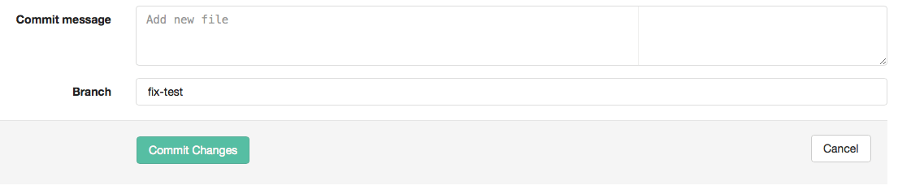

# How to add a file

You can create a file in your [shell](command-line-commands.md) or in GitLab.

To create a file in GitLab, sign in to GitLab.

Select a project on the right side of your screen:

It's a good idea to [create a branch](create-branch.md), but it's not necessary.

Go to the directory where you'd like to add the file and click on the "+" sign next to the name of the project and directory:

Name your file (you can't add spaces, so you can use hyphens or underscores). Don't forget to include the markup language you'd like to use :

Add all the information that you'd like to include in your file:

Add a commit message based on what you just added and then click on "commit changes":

