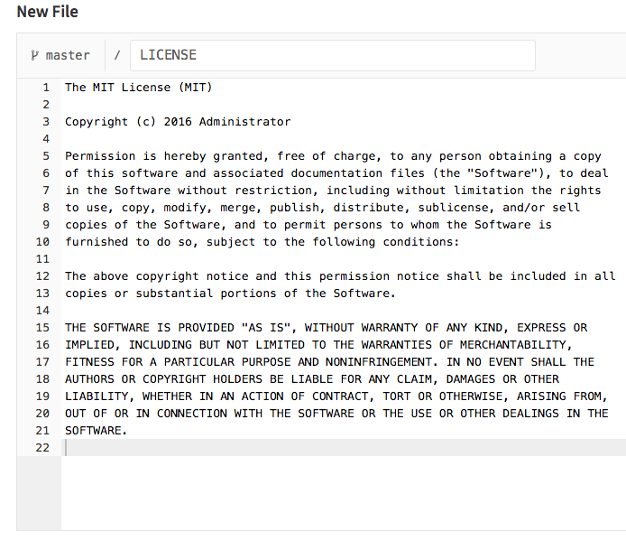

# How to add a file

You can create a file in your [shell](command-line-commands.md) or in GitLab.

To create a file in GitLab, sign in to GitLab.

Select a project on the right side of your screen:

It's a good idea to [create a branch](create-branch.md), but it's not necessary.

Go to the directory where you'd like to add the file and click on the "+" sign next to the name of the project and directory:

Name your file (you can't add spaces, so you can use hyphens or underscores). Don't forget to include the markup language you'd like to use :

Add all the information that you'd like to include in your file:

Add a commit message based on what you just added and then click on "commit changes":

# On a new project

When starting a new project, there are some common files which the new project might need too. Therefor a message will be displayed by GitLab to make this easy for you.

When clicking on either `LICENSE` or `.gitignore`, a dropdown will be displayed to provide you with a template which might be suitable for your project.

The license, changelog, contribution guide, or `.gitlab-ci.yml` file could also be added through a button on the project page. In the example below the license has already been created, which creates a link to the license itself.

