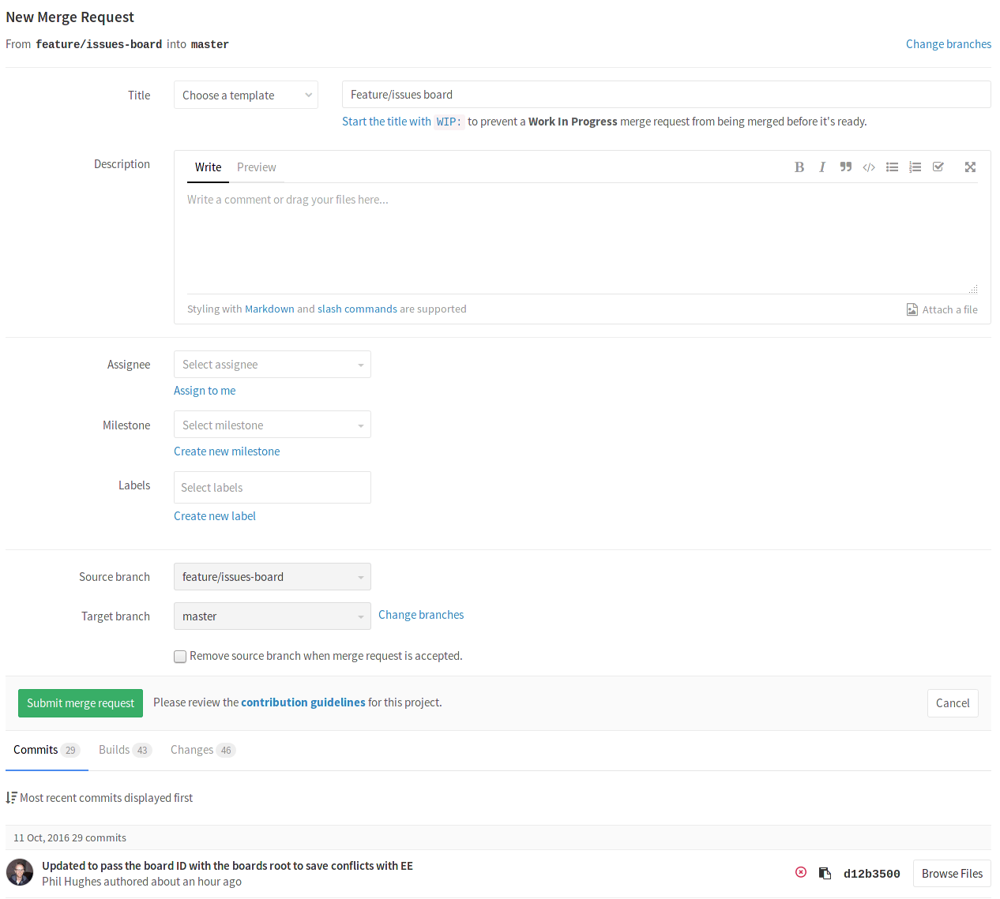

# How to create a merge request

Merge requests are useful to integrate separate changes that you've made to a
project, on different branches. This is a brief guide on how to create a merge
request. For more information, check the
[merge requests documentation](../user/project/merge_requests/index.md).

---

1. Before you start, you should have already [created a branch](create-branch.md)
   and [pushed your changes](basic-git-commands.md) to GitLab.
1. Go to the project where you'd like to merge your changes and click on the
   **Merge requests** tab.
1. Click on **New merge request** on the right side of the screen.
1. From there on, you have the option to select the source branch and the target
   branch you'd like to compare to. The default target project is the upstream
   repository, but you can choose to compare across any of its forks.

    

1. When ready, click on the **Compare branches and continue** button.
1. At a minimum, add a title and a description to your merge request. Optionally,
   select a user to review your merge request and to accept or close it. You may
   also select a milestone and labels.

    

1. When ready, click on the **Submit merge request** button.

Your merge request will be ready to be approved and merged.
