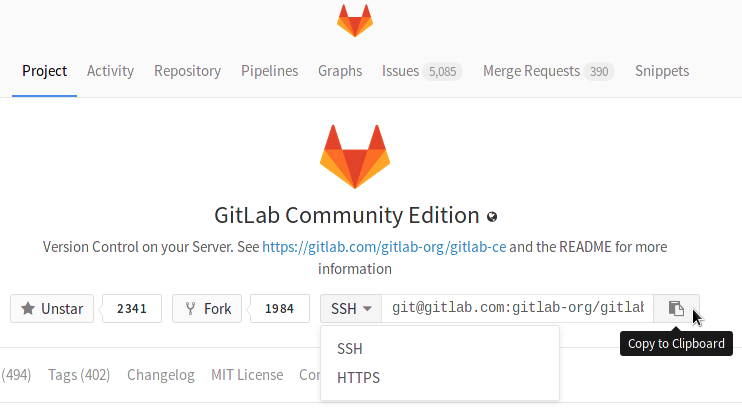

# Command Line basic commands

## Start working on your project

In Git, when you copy a project you say you "clone" it. To work on a git project locally (from your own computer), you will need to clone it. To do this, sign in to GitLab.

When you are on your Dashboard, click on the project that you'd like to clone.
To work in the project, you can copy a link to the Git repository through a SSH
or a HTTPS protocol. SSH is easier to use after it's been
[setup](create-your-ssh-keys.md). While you are at the **Project** tab, select
HTTPS or SSH from the dropdown menu and copy the link using the 'Copy to clipboard'
button (you'll have to paste it on your shell in the next step).



## On the command line

### Clone your project

Go to your computer's shell and type the following command:

```
git clone PASTE HTTPS OR SSH HERE
```

A clone of the project will be created in your computer.

>**Note:** If you clone your project via an URL that contains special characters, make sure that they are URL-encoded.

### Go into a project, directory or file to work in it

```
cd NAME-OF-PROJECT-OR-FILE
```

### Go back one directory or file

```
cd ../
```

### View what’s in the directory that you are in

```
ls
```

### Create a directory

```
mkdir NAME-OF-YOUR-DIRECTORY
```

### Create a README.md or file in directory

```
touch README.md
nano README.md
#### ADD YOUR INFORMATION
#### Press: control + X
#### Type: Y
#### Press: enter
```

### Remove a file

```
rm NAME-OF-FILE
```

### Remove a directory and all of its contents

```
rm -r NAME-OF-DIRECTORY
```

### View history in the command line

```
history
```

### Carry out commands for which the account you are using lacks authority

You will be asked for an administrator’s password.

```
sudo
```

### Tell where you are

```
pwd
```
