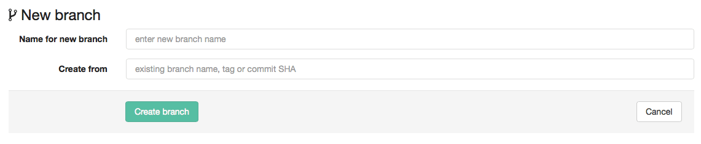

# How to create a branch

To add changes to your project in GitLab, you should create a branch.

To create a new branch, sign in to [gitlab.com](https://gitlab.com).

Select a project on the right side of your screen:

Click on "commits" on the menu on the left side of your screen:

Click on the "branches" tab:

Click on the "new branch" button on the right side of the screen:

Fill out the information required:

1. Add a name for your new branch (you can't add spaces, so you can use hyphens or underscores)

1. On the "create from" space, add the word: master or the name of the master branch

1. Click on the button "create branch"

After you created a new branch, click on the files on which you'll be working.

You will be able to find and select the name of your branch in the white box next to the project's name:

