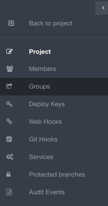
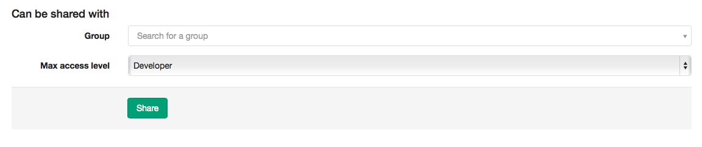

# How to create a group in GitLab

## Create a group

When you create a group in GitLab.com, you can add projects and users

To create a new group, sign in to [GitLab.com](https://gitlab.com)

* Click on "new project" on the right side of your screen

* Click on "create a group" on the bottom left side of your screen

1. Add a group path or group name (you can't add spaces, so you can use hyphens or underscores)

1. Add details or a group description

1. You can choose a group avatar if you'd like

1. Click on "create group"

## Add a group to a project

* Select a project on the right side of your screen

* Click on "settings" on the left side of your screen

* Click on "groups" on the left side of your screen

* Find the group and click on "share"

