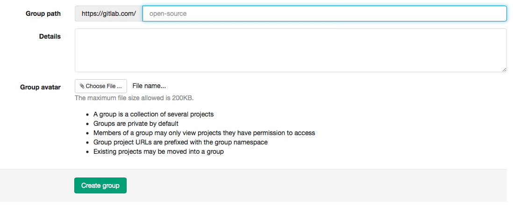

# How to create a group in GitLab

## Create a group

Your projects in GitLab can be organized in 2 different ways:
under your own namespace for single projects, such as ´your-name/project-1'; or under groups.
If you organize your projects under a group, it works like a folder. You can manage your group members' permissions and access to the projects.

To create a group, follow the instructions below:

Sign in to [GitLab.com](https://gitlab.com).

When you are on your Dashboard, click on "Groups" on the left menu of your screen:

Click on "New group" on the top right side of your screen:

Fill out the information required:

1. Add a group path or group name (you can't add spaces, so you can use hyphens or underscores)

1. Add details or a group description

1. You can choose a group avatar if you'd like

1. Click on "create group"

## Add a project to a group

There are 2 different ways to add a new project to a group:

* Select a group and then click on "New project" on the right side of your screen. Then you can [create a project](create-project.md)

* When you are [creating a project](create-project.md), click on "create a group" on the bottom right side of your screen

