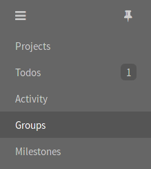
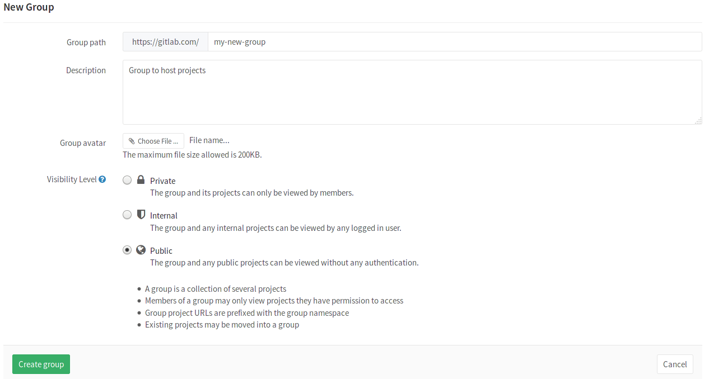
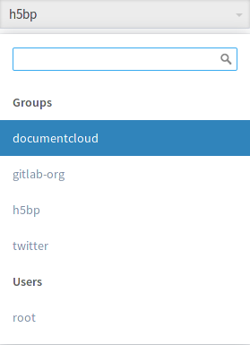

# How to create a group in GitLab

Your projects in GitLab can be organized in 2 different ways:
under your own namespace for single projects, such as `your-name/project-1` or
under groups.

If you organize your projects under a group, it works like a folder. You can
manage your group members' permissions and access to the projects.

---

To create a group:

1. Expand the left sidebar by clicking the three bars at the upper left corner
   and then navigate to **Groups**.

    

1. Once in your groups dashboard, click on **New group**.

    

1. Fill out the needed information:

    1. Set the "Group path" which will be the namespace under which your projects
       will be hosted (path can contain only letters, digits, underscores, dashes
       and dots; it cannot start with dashes or end in dot).
    1. Optionally, you can add a description so that others can briefly understand
       what this group is about.
    1. Optionally, choose and avatar for your project.
    1. Choose the [visibility level](../public_access/public_access.md).

1. Finally, click the **Create group** button.

## Add a new project to a group

There are 2 different ways to add a new project to a group:

- Select a group and then click on the **New project** button.

    

    You can then continue on [creating a project](create-project.md).

- While you are [creating a project](create-project.md), select a group namespace
  you've already created from the dropdown menu.

    
