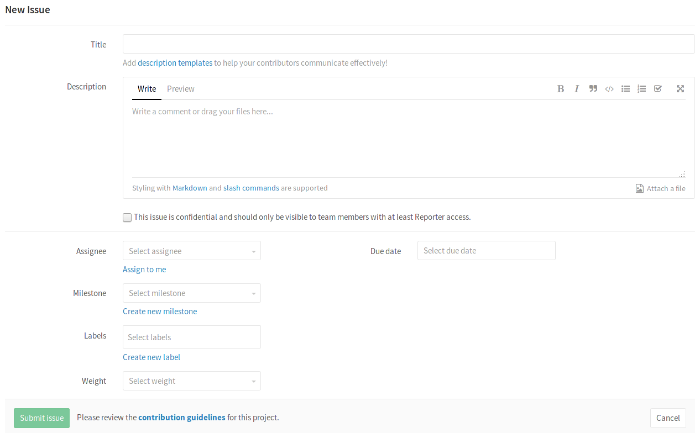

# How to create an Issue in GitLab

The issue tracker is a good place to add things that need to be improved or
solved in a project.

---

1. Go to the project where you'd like to create the issue and navigate to the
   **Issues** tab on top.

    

1. Click on the **New issue** button on the right side of your screen.

    

1. At the very minimum, add a title and a description to your issue.
   You may assign it to a user, add a milestone or add labels (all optional).

    

1. When ready, click on **Submit issue**.

---

Your Issue will now be added to the issue tracker of the project you opened it
at and will be ready to be reviewed. You can comment on it and mention the
people involved. You can also link issues to the merge requests where the issues
are solved. To do this, you can use an
[issue closing pattern](../user/project/issues/automatic_issue_closing.md).
