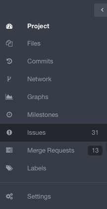
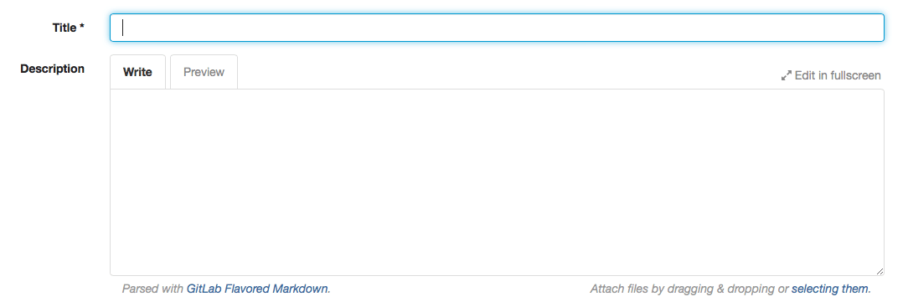

# How to create an Issue in GitLab

The Issue Tracker is a good place to add things that need to be improved or solved in a project.

To create an Issue, sign in to GitLab.

Go to the project where you'd like to create the Issue:

Click on "Issues" on the left side of your screen:

Click on the "+ new issue" button on the right side of your screen:

Add a title and a description to your issue:

You may assign the Issue to a user, add a milestone and add labels (they are all optional). Then click on "submit new issue":

Your Issue will now be added to the Issue Tracker and will be ready to be reviewed. You can comment on it and mention the people involved. You can also link Issues to the Merge Requests where the Issues are solved. To do this, you can use an [Issue closing pattern](../user/project/issues/automatic_issue_closing.md).
