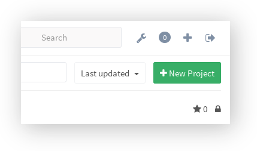
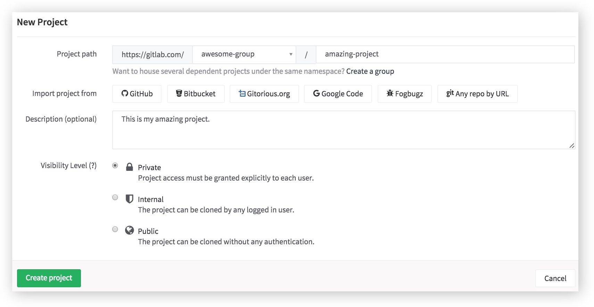

# How to create a project in GitLab

A project includes the Git repository, an issue and merge request tracker,
and a dedicated wiki.

When you create a new project, you can:

- [Import a project][import] from another provider
- Provide an optional description
- Set the [visibility level] for that project such as Private, Internal or Public.

---

There are 2 ways to create a new project. You can go to your Dashboard and
click on **New Project** on the right side of your screen or use the plus (`+`)
button which is always visible in the upper right corner.

>**Note:**
If you intend to import a project from another provider you don't need to
follow the steps below.

From there on you must fill out the required information:

1. Set the project path or the name of your project (you can't add spaces, you
   can use hyphens or underscores instead)
1. Optionally provide a description
1. Set the project's visibility level
1. Click on **Create project**

[import]: ../workflow/importing/README.md
[visibility level]: ../public_access/public_access.md
